# fieldClim: Use-Case-Workflows für Energiebilanz und Wärmeflussmethoden

## Ziel dieser Vignette

Diese Vignette zeigt auf der Grundlage der `fieldClim`-Beispiele, mit
konkreten Use-Case-Workflows die Kern-Funktionalität des Pakets. Sie
zeigt also, wofür das Paket praktisch genutzt werden kann: Messdaten
einer Mikroklima-Station werden als `weather_station`-Objekt
organisiert, Strahlungs- und Bodenwärmegrößen werden geprüft, und
Wärmeflussmethoden werden auf derselben Datenbasis nebeneinander
berechnet.

Die vorhandene Paketdokumentation deckt im Kern folgende Arbeitsbereiche
ab: Wetterstationsobjekte, kurz- und langwellige Strahlung, Solar- und
Geländegeometrie, atmosphärische Transmission, Bodenwärme, Feuchte-,
Druck- und Temperaturhilfsfunktionen sowie latente und sensible
Wärmeflussmethoden. Separate Verzeichnisse `examples/`, `tutorials/`
oder `demo/` wurden in der Repository-Bestandsaufnahme nicht gefunden;
die Beispiele liegen vor allem in `vignettes/`, `man/`,
`tests/testthat/` und teilweise direkt in den R-Quellen.

Diese Vignette macht daraus sieben Use Cases:

| Use Case | Frage | Paketbereich |
|----|----|----|
| 0 | Was ist das Arbeitsmodell von `fieldClim`? | `weather_station`, Vignetten, Hilfeseiten |
| 1 | Wie wird ein Stationsdatensatz geladen und geprüft? | Beispieldaten in `inst/extdata/` |
| 2 | Wie werden kurz- und langwellige Strahlungsgrößen gelesen und kontrolliert? | `rad_*`, Messkomponenten |
| 3 | Wie entsteht aus Strahlung und Bodenwärmestrom verfügbare Energie? | Energie- und Bodenwärmefluss |
| 4 | Warum dient eine manuelle Bulk-Residual-Referenz als Kontrast? | transparente Bilanzrechnung |
| 5 | Wie wird derselbe Datensatz an `fieldClim` übergeben? | [`build_weather_station()`](https://gisma.github.io/migration-fieldclim/reference/build_weather_station.md) |
| 6 | Wie werden Priestley-Taylor, Bowen, Monin-Obukhov und Penman nebeneinander genutzt? | [`turb_flux_calc()`](https://gisma.github.io/migration-fieldclim/reference/turb_flux_calc.md) und Einzelmethoden |

## Notation

Die Vorlesungsfolien verwenden für die bodennahe Energiebilanz die
Größen `Q*`, `B`, `L` und `V`. Diese Vignette behält diese Notation im
Erklärungsteil bei. Erst an der Schnittstelle zum Datensatz und zu
`fieldClim` wird auf die spezifischen Paket- und Spaltennamen des
`fieldClim` Pakets gemappt.

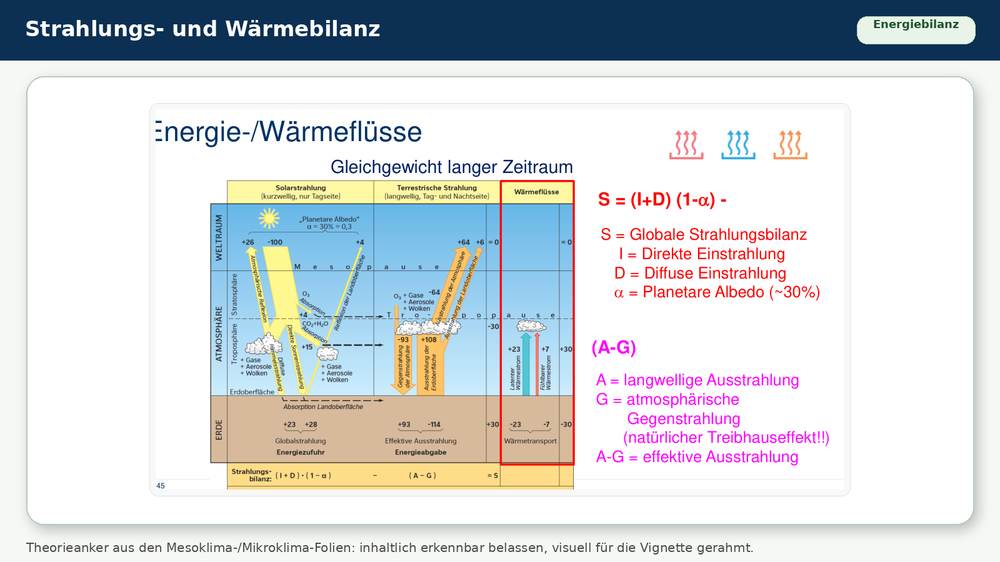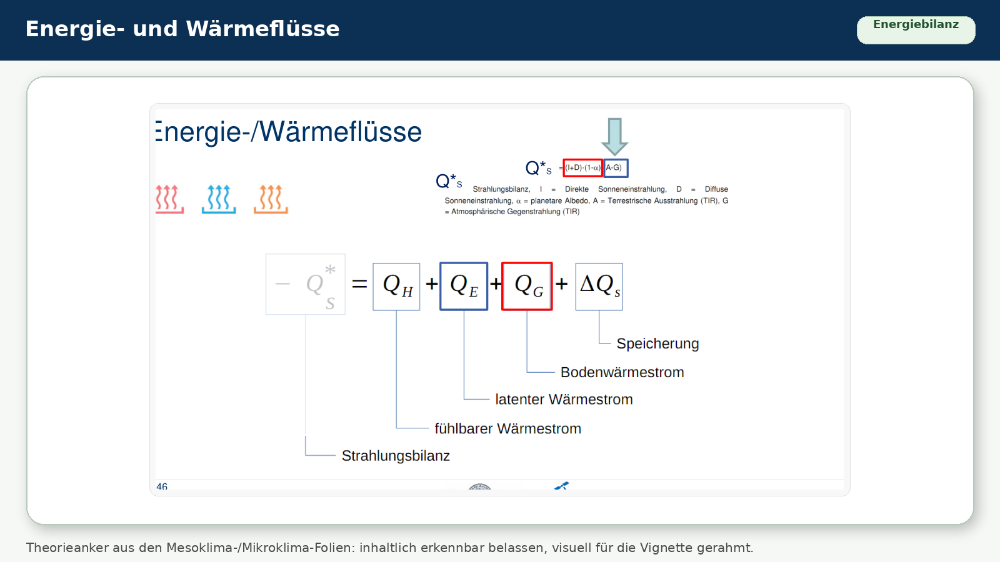

| Theoriegröße | Bedeutung | Code-Variable in dieser Vignette | Feld im Datensatz oder Paket |
|----|----|----|----|
| `Q*` | Strahlungsbilanz / Netto-Strahlung | `Q_star` | `rad_net`, `rad_bal` |
| `B` | Bodenwärmestrom | `B` | `heatflux_soil`, `soil_flux` |
| `L` | fühlbarer Wärmestrom | `L` | `sensible_*` |
| `V` | latenter Wärmestrom | `V` | `latent_*` |
| `S` | Speicherterm | `S` | hier nicht separat gemessen |

Die Arbeitsbilanz lautet in der Theorie-Notation:

``` math
Q^{*} = B + L + V + S
```

Der Speicherterm `S` wird in diesem Lehrdatensatz nicht separat
berechnet. Das bedeutet nicht, dass Speicherung nicht existiert. Es
bedeutet nur, dass die Datengrundlage keine vollständige Auflösung von
Wärmespeicherung in Luftvolumen, Vegetation, Wasserfilmen,
oberflächennahem Boden und Messumgebung erlaubt. Für die transparente
Referenzrechnung wird deshalb gesetzt:

``` math
S \approx 0
```

Damit wird:

``` math
Q^{*} - B = L + V
```

und für die Residualrechnung:

``` math
V = Q^{*} - B - L
```

Der Ausdruck **Kontrolle aus Einzelkomponenten** ersetzt hier das
missverständliche Wort „Rekonstruktion“. Gemeint ist kein neues
Messverfahren, sondern eine arithmetische Prüfung: Aus kurzwelliger und
langwelliger Bilanz wird eine zweite Zeitreihe für `Q*` berechnet und
mit der gemessenen Spalte `rad_net` verglichen.

## Use Case 0: Was soll das Paket leisten?

`fieldClim` ist kein einzelnes Skript, sondern ein R-Paket mit mehreren
Ebenen. Für die Arbeit mit mikroklimatischen Stationsdaten ist die
zentrale Idee das `weather_station`-Objekt. Dieses Objekt bündelt
Zeitachse, Standort, Messgrößen und Modellparameter. Paketfunktionen
können damit dieselbe Datenstruktur weiterreichen, ergänzen und als
Tabelle ausgeben.

| Paketebene | Zweck | Beispiele |
|----|----|----|
| Objektstruktur | Messdaten und Parameter bündeln | [`build_weather_station()`](https://gisma.github.io/migration-fieldclim/reference/build_weather_station.md), [`as.data.frame()`](https://rdrr.io/r/base/as.data.frame.html) |
| Strahlung | kurzwellige, langwellige und Netto-Strahlung berechnen oder prüfen | [`rad_sw_bal()`](https://gisma.github.io/migration-fieldclim/reference/rad_sw_bal.md), [`rad_lw_bal()`](https://gisma.github.io/migration-fieldclim/reference/rad_lw_bal.md), [`rad_bal()`](https://gisma.github.io/migration-fieldclim/reference/rad_bal.md) |
| Solar- und Geländegeometrie | Sonnenstand, Gelände- und Sichtfaktoren vorbereiten | `sol_*`, `terr_*` |
| Transmission | atmosphärische Dämpfung der Strahlung beschreiben | `trans_*` |
| Boden | Wärmeleitfähigkeit, Dämpfung und Bodenwärmestrom behandeln | `soil_*` |
| Feuchte, Druck, Temperatur | Hilfsgrößen für weitere Berechnungen bereitstellen | `hum_*`, `pres_*`, `temp_*` |
| Wärmeflüsse | fühlbare und latente Wärmeflüsse schätzen | `sensible_*`, `latent_*` |
| Sammelworkflow | mehrere Wärmeflussmethoden in einem Schritt berechnen | [`turb_flux_calc()`](https://gisma.github.io/migration-fieldclim/reference/turb_flux_calc.md) |


Die Use Cases unten zeigen nicht jede Einzelfunktion isoliert. Sie
ordnen die vorhandenen Funktionsgruppen in Arbeitsabläufe: vom
Stationsdatensatz über Strahlung und Bodenwärmestrom bis zu mehreren
Wärmeflussmethoden.

## Use Case 1: Stationsdaten laden und prüfen

Der Lehrdatensatz enthält einen vollständigen 5-Minuten-Tag der
Caldern-Wiese. Ein vollständiger Tag mit 5-Minuten-Zeitschritten hat 288
Messzeitpunkte.

``` r

# Das Paket laden.
# Die Vignette setzt voraus, dass fieldClim installiert oder im Paketprojekt verfügbar ist.
library(fieldClim)

# Pfad zur kleinen Paket-Beispieldatei.
# Für eine Paketvignette ist system.file() der passende Weg, weil die Datei
# nach Installation unter inst/extdata/ ausgeliefert wird.
caldern_file <- system.file(
  "extdata",
  "caldern_wiese_2017-06-30.csv",
  package = "fieldClim"
)

# CSV-Datei einlesen.
# Leere Felder, "NULL" und "NA" werden als fehlende Werte behandelt.
caldern <- read.csv(
  caldern_file,
  na.strings = c("NULL", "NA", "")
)

# Zeitstempel explizit als Datum-Zeit-Werte interpretieren.
# Die Zeitzone ist wichtig, weil Strahlungs- und Tagesganginterpretationen
# zeitabhängig sind.
caldern$datetime <- as.POSIXct(
  caldern$datetime,
  format = "%Y-%m-%d %H:%M:%S",
  tz = "Europe/Berlin"
)

# Anzahl der Zeilen prüfen.
nrow(caldern)
#> [1] 288

# Zeitbereich prüfen.
range(caldern$datetime)
#> [1] "2017-06-30 00:00:00 CEST" "2017-06-30 23:55:00 CEST"

# Zeitschritt prüfen.
summary(diff(caldern$datetime))
#> Time differences in mins
#>    Min. 1st Qu.  Median    Mean 3rd Qu.    Max. 
#>       5       5       5       5       5       5

# Spaltennamen anzeigen.
names(caldern)
#>  [1] "record"         "datetime"       "Ta_2m"          "Huma_2m"       
#>  [5] "Ta_10m"         "Huma_10m"       "Windspeed_2m"   "Windspeed_10m" 
#>  [9] "rad_sw_in"      "rad_sw_out"     "RsNet"          "RlNet"         
#> [13] "rad_net"        "LUpCo"          "LDnCo"          "water_vol_soil"
#> [17] "Ts"             "heatflux_soil"  "PCP"
```

**Interpretation.** Dieser Schritt ist nicht nur Technik. Eine
Energiebilanz ist eine Zeitreihenrechnung. Wenn Zeitstempel, Zeitschritt
oder Einheiten nicht stimmen, werden alle späteren Flüsse unklar.

## Use Case 2: Kurzwellige Strahlung und Albedo

Die Folien zur Strahlung zeigen, dass einfallende kurzwellige Strahlung
durch Sonnenstand, optische Weglänge und Transmission bestimmt wird. Die
Albedo-Folie definiert den reflektierten Anteil als Verhältnis von
ausgehender zu einfallender kurzwelliger Strahlung.

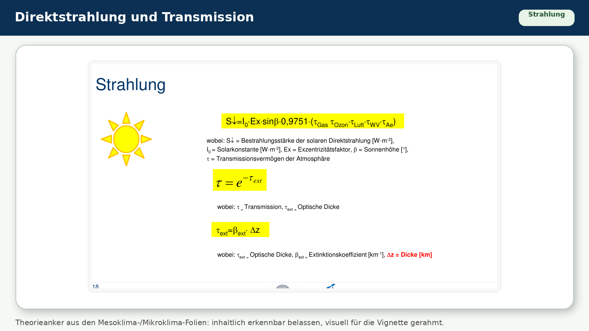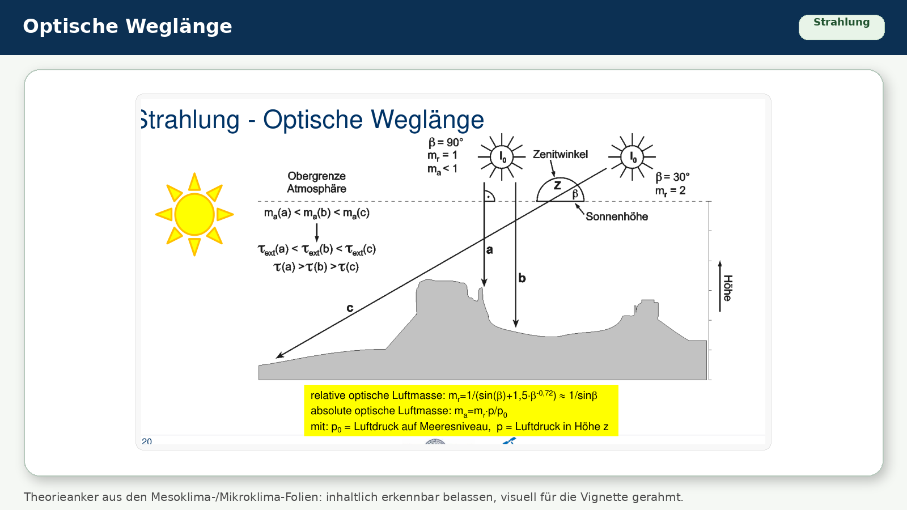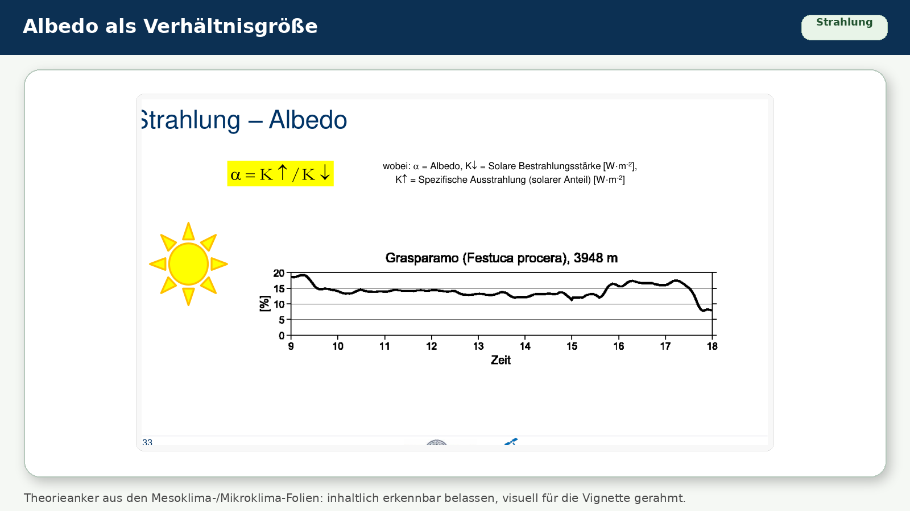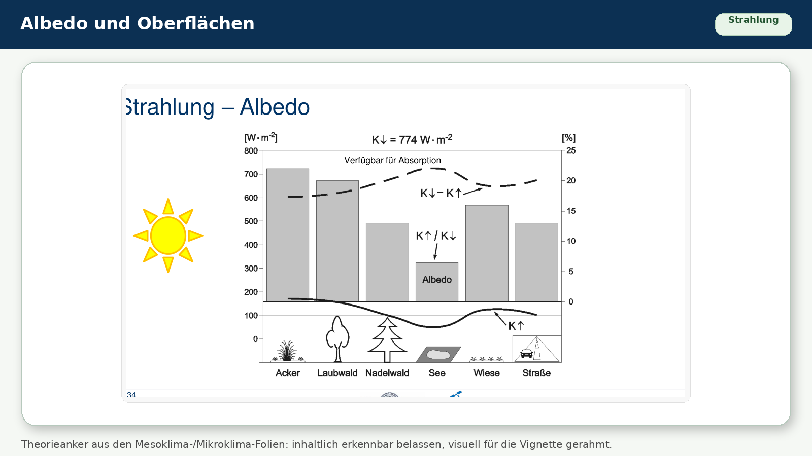

Die kurzwellige Bilanz lautet:

``` math
K^{*} = K_{down} - K_{up}
```

Die Albedo lautet:

``` math
\alpha = \frac{K_{up}}{K_{down}}
```

``` r

# Einfallende kurzwellige Strahlung aus der Messspalte übernehmen.
caldern$K_down <- caldern$rad_sw_in

# Reflektierte kurzwellige Strahlung aus der Messspalte übernehmen.
caldern$K_up <- caldern$rad_sw_out

# Kurzwellige Bilanz berechnen.
# Das ist der kurzwellige Anteil, der nach Reflexion an der Oberfläche bleibt.
caldern$K_star <- caldern$K_down - caldern$K_up

# Albedo berechnen.
# Bei sehr kleiner Einstrahlung ist der Quotient instabil; deshalb wird
# erst ab 50 W/m² gerechnet.
caldern$alpha <- ifelse(
  caldern$K_down > 50,
  caldern$K_up / caldern$K_down,
  NA
)
```

### Einzelplots

``` r

# Drei Einzelplots übereinander: einfallend, reflektiert, kurzwellige Bilanz.
op <- par(mfrow = c(3, 1), mar = c(3.5, 4, 2, 1))

plot(caldern$datetime, caldern$K_down, type = "l", col = "#D55E00", lwd = 2,
     xlab = "Zeit", ylab = "W/m²", main = "K_down: einfallende kurzwellige Strahlung")

plot(caldern$datetime, caldern$K_up, type = "l", col = "#7A7A7A", lwd = 2,
     xlab = "Zeit", ylab = "W/m²", main = "K_up: reflektierte kurzwellige Strahlung")

plot(caldern$datetime, caldern$K_star, type = "l", col = "#000000", lwd = 2,
     xlab = "Zeit", ylab = "W/m²", main = "K*: kurzwellige Bilanz")
```

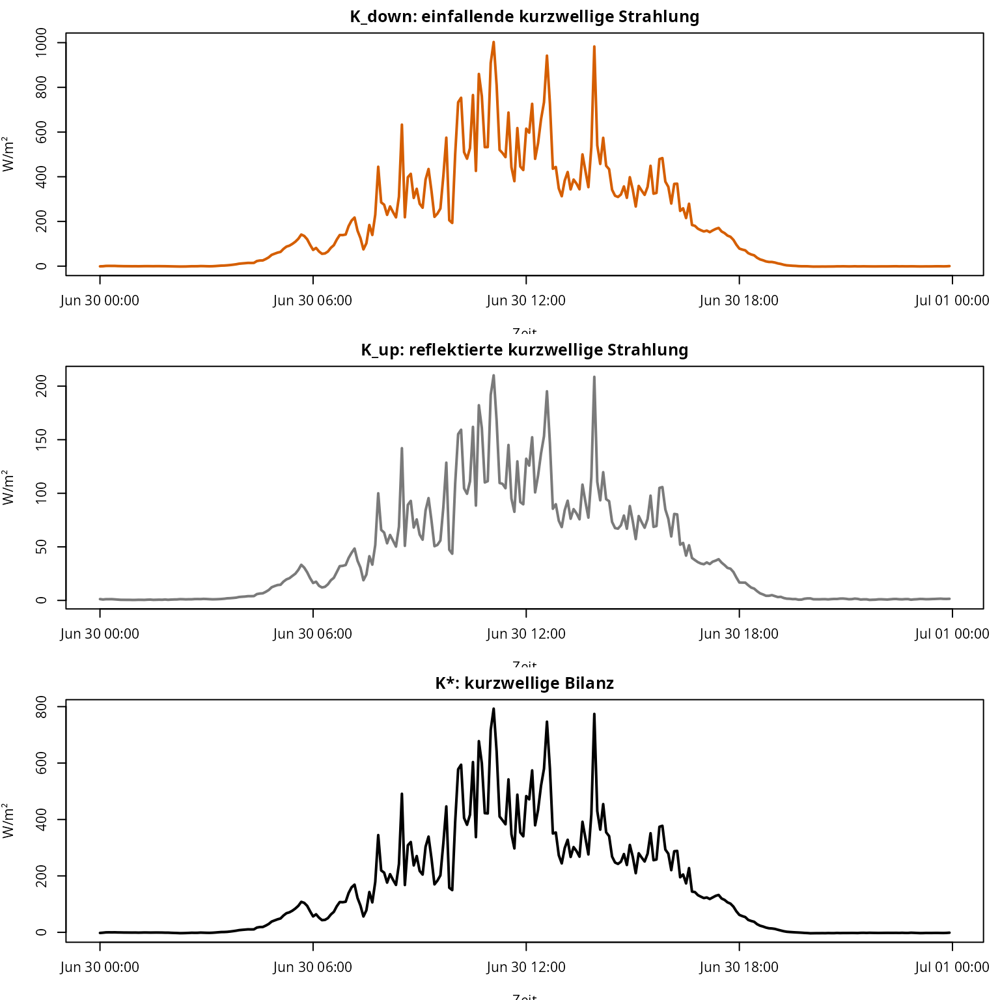

``` r


par(op)
```

**Interpretation.** `K_down` zeigt den solaren Tagesantrieb. `K_up`
folgt grundsätzlich diesem Tagesgang, ist aber deutlich kleiner, weil
nur ein Anteil reflektiert wird. `K*` zeigt, wie viel kurzwellige
Energie nach Reflexion verbleibt.

``` r

plot(caldern$datetime, caldern$alpha, type = "l", col = "#005AB5", lwd = 2,
     xlab = "Zeit", ylab = "Albedo [-]", main = "Effektive Albedo")
abline(h = median(caldern$alpha, na.rm = TRUE), lty = 2, col = "grey50")
```

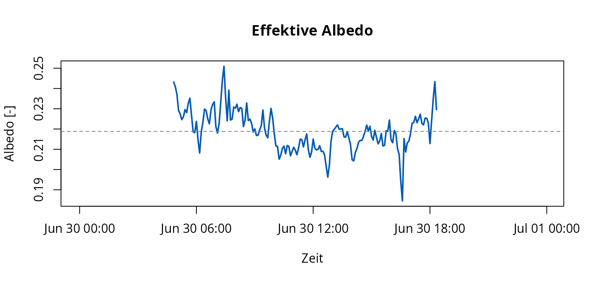

**Interpretation.** Die Albedo ist hier kein fixer Materialwert. Sie ist
ein gemessener Verhältniswert. Sie schwankt mit Sonnenstand, diffuser
Strahlung, Oberflächenstruktur und Feuchte. Bei kleiner Einstrahlung
wird sie numerisch instabil; deshalb wurde der Filter gesetzt.

### Zusammengesetzter Plot

``` r

cols_sw <- c("#D55E00", "#7A7A7A", "#000000")
op <- par(mar = c(6, 4, 3, 1), xpd = NA)

plot(caldern$datetime, caldern$K_down, type = "l", col = cols_sw[1], lwd = 2,
     ylim = range(caldern$K_down, caldern$K_up, caldern$K_star, na.rm = TRUE),
     xlab = "Zeit", ylab = "W/m²", main = "Kurzwellige Strahlung")
lines(caldern$datetime, caldern$K_up, col = cols_sw[2], lwd = 2)
lines(caldern$datetime, caldern$K_star, col = cols_sw[3], lwd = 2)
legend("bottom", inset = c(0, -0.35), horiz = TRUE, bty = "n",
       legend = c("K_down", "K_up", "K*"), col = cols_sw, lty = 1, lwd = 2)
```

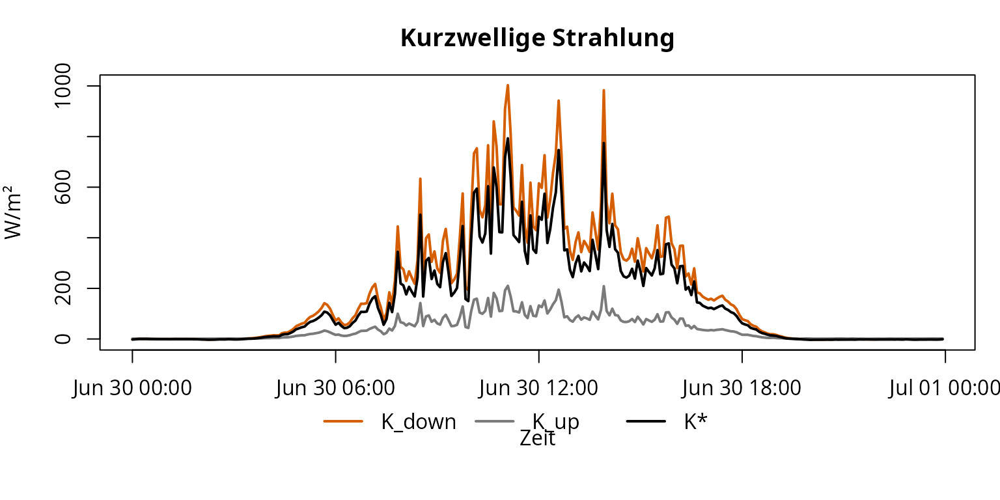

``` r


par(op)
```

**Interpretation.** Der zusammengesetzte Plot zeigt die Bilanzlogik: Die
schwarze Linie ist nicht zusätzlich gemessen, sondern aus den beiden
kurzwelligen Komponenten berechnet.

## Use Case 3: Langwellige Bilanz und Netto-Strahlung Q\*

Die Folien zur langwelligen Aus- und Gegenstrahlung beziehen sich auf
Stefan-Boltzmann-Logik, Emissionsvermögen und atmosphärische
Gegenstrahlung. Für die Stationsdaten wird daraus die langwellige
Bilanz.

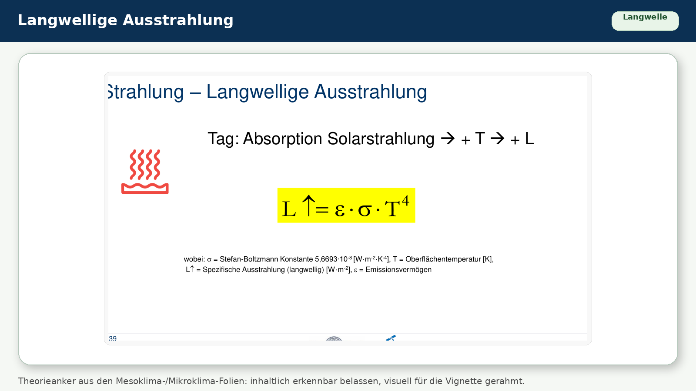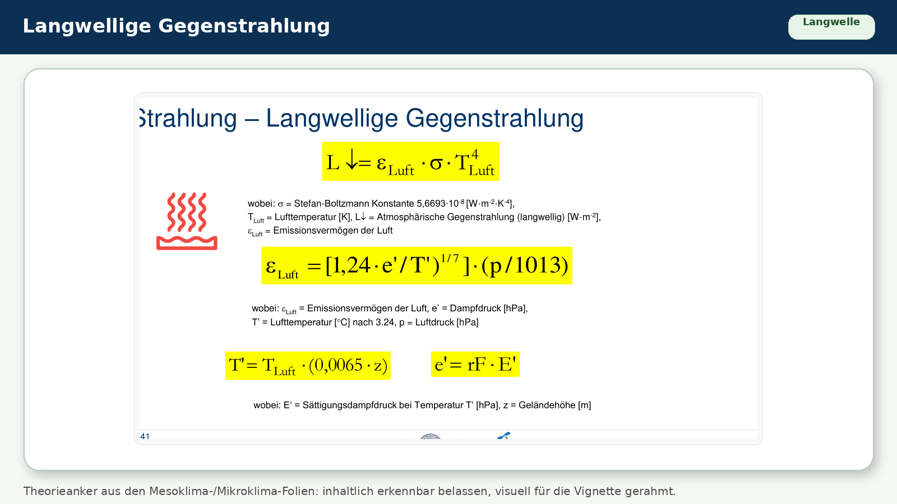

``` math
L^{*} = L_{down} - L_{up}
```

``` math
Q^{*} = K^{*} + L^{*}
```

``` r

# Langwellige Gegenstrahlung aus der Atmosphäre.
caldern$L_down <- caldern$LDnCo

# Langwellige Ausstrahlung der Oberfläche.
caldern$L_up <- caldern$LUpCo

# Langwellige Bilanz.
caldern$L_star <- caldern$L_down - caldern$L_up

# Netto-Strahlung aus Einzelkomponenten.
# Das ist eine Kontrollrechnung, keine neue Messung.
caldern$Q_star_components <- caldern$K_star + caldern$L_star

# Gemessene Netto-Strahlung aus der Datei.
caldern$Q_star_measured <- caldern$rad_net
```

### Einzelplots

``` r

op <- par(mfrow = c(3, 1), mar = c(3.5, 4, 2, 1))

plot(caldern$datetime, caldern$L_down, type = "l", col = "#0072B2", lwd = 2,
     xlab = "Zeit", ylab = "W/m²", main = "L_down: langwellige Gegenstrahlung")

plot(caldern$datetime, caldern$L_up, type = "l", col = "#CC79A7", lwd = 2,
     xlab = "Zeit", ylab = "W/m²", main = "L_up: langwellige Ausstrahlung")

plot(caldern$datetime, caldern$L_star, type = "l", col = "#000000", lwd = 2,
     xlab = "Zeit", ylab = "W/m²", main = "L*: langwellige Bilanz")
```

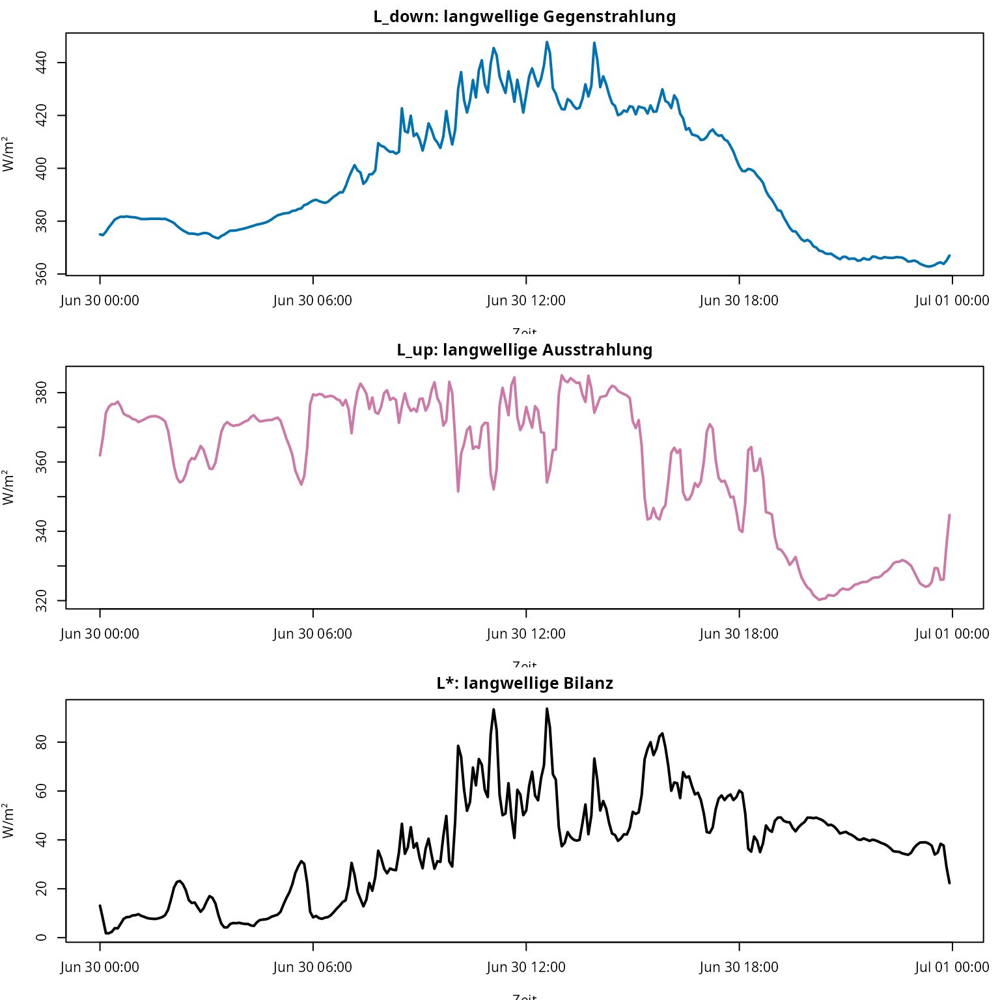

``` r


par(op)
```

**Interpretation.** Die langwelligen Größen variieren weniger sprunghaft
als die kurzwellige Einstrahlung. Sie sind stark an Temperatur und
Emissionsverhältnisse gekoppelt.

### Kontrolle von Q\* aus Einzelkomponenten

Die Netto-Strahlung `Q*` ist der zentrale Eingang in die Energiebilanz.
In der Theorie steht `Q*` als Strahlungsbilanz auf der linken Seite der
bodennahen Energiebilanz:

``` math
0 = Q^{*} - B - L - V
```

In dieser Vignette entspricht:

| Theorie | Datensatz / Paket                | Bedeutung            |
|---------|----------------------------------|----------------------|
| `Q*`    | `rad_net` bzw. `rad_bal`         | Netto-Strahlung      |
| `B`     | `heatflux_soil` bzw. `soil_flux` | Bodenwärmestrom      |
| `L`     | `H`, `sensible_*`                | fühlbarer Wärmestrom |
| `V`     | `LE`, `latent_*`                 | latenter Wärmestrom  |

Theoretisch kann `Q*` aus kurzwelligen und langwelligen
Einzelkomponenten gebildet werden:

``` math
K^{*} = K_\downarrow - K_\uparrow
```

``` math
L^{*} = L_\downarrow - L_\uparrow
```

``` math
Q^{*} = K^{*} + L^{*}
```

Im Datensatz liegt aber zusätzlich bereits eine Spalte `rad_net` vor.
Deshalb wird hier nicht einfach eine neue Netto-Strahlung
“rekonstruiert”, sondern geprüft, ob die vorhandene Spalte `rad_net` und
die Summe aus Einzelkomponenten dieselbe Bilanzebene beschreiben.

``` r

# Kurzwellige Komponenten:
# K_down ist die einfallende kurzwellige Strahlung.
# K_up ist die reflektierte kurzwellige Strahlung.
caldern$K_down <- caldern$rad_sw_in
caldern$K_up <- caldern$rad_sw_out

# Kurzwellige Bilanz.
caldern$K_star <- caldern$K_down - caldern$K_up

# Langwellige Komponenten:
# L_down ist die atmosphärische Gegenstrahlung.
# L_up ist die langwellige Ausstrahlung der Oberfläche.
caldern$L_down <- caldern$LDnCo
caldern$L_up <- caldern$LUpCo

# Langwellige Bilanz.
caldern$L_star <- caldern$L_down - caldern$L_up

# Vorhandene Netto-Strahlung aus dem Datensatz.
caldern$Q_star_measured <- caldern$rad_net

# Kontrollgröße aus Einzelkomponenten.
# Diese Größe wird hier nur diagnostisch verwendet.
caldern$Q_star_components <- caldern$K_star + caldern$L_star

# Differenz zwischen Komponentensumme und vorhandener Netto-Strahlung.
# Positive Werte bedeuten:
# K* + L* ist größer als rad_net.
caldern$Q_star_difference <- caldern$Q_star_components - caldern$Q_star_measured

summary(caldern$Q_star_difference)
#>    Min. 1st Qu.  Median    Mean 3rd Qu.    Max. 
#>   3.595  32.331  78.013  74.078 100.515 187.700
```

``` r

cols_q <- c("#000000", "#0072B2")

op <- par(mar = c(6, 4, 3, 1), xpd = NA)

plot(
  caldern$datetime,
  caldern$Q_star_measured,
  type = "l",
  col = cols_q[1],
  lwd = 2,
  ylim = range(caldern$Q_star_measured, caldern$Q_star_components, na.rm = TRUE),
  xlab = "Zeit",
  ylab = "W/m²",
  main = "Q*: vorhandene Netto-Strahlung und Komponentensumme"
)

lines(
  caldern$datetime,
  caldern$Q_star_components,
  col = cols_q[2],
  lwd = 2
)

legend(
  "bottom",
  inset = c(0, -0.35),
  horiz = TRUE,
  bty = "n",
  legend = c("Q* vorhanden: rad_net", "Kontrolle: K* + L*"),
  col = cols_q,
  lty = 1,
  lwd = 2
)
```

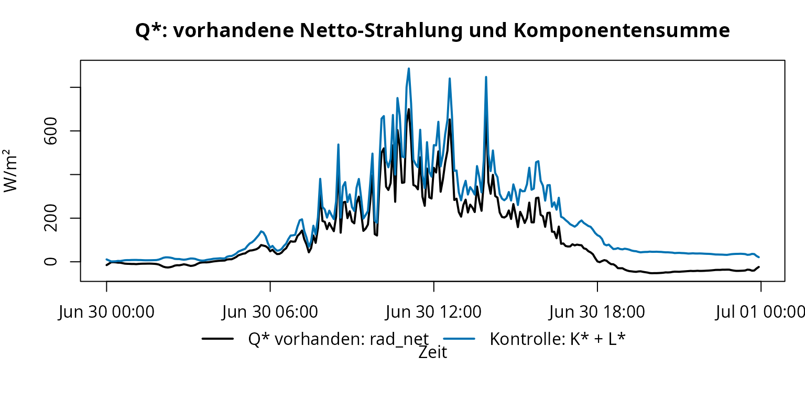

``` r


par(op)
```

**Interpretation.** Die beiden Linien sind nicht deckungsgleich. Die
Komponentensumme `K* + L*` liegt über weite Teile des Tages höher als
die vorhandene Netto-Strahlung `rad_net`. Das ist kein kleiner
Rundungseffekt. Es bedeutet: `rad_net` und
`K_down - K_up + L_down - L_up` sind in diesem Datensatz nicht ohne
Prüfung als identische Größe zu behandeln.

Für die weitere Energiebilanz ist das entscheidend. `Q*` bestimmt die
verfügbare Energie:

``` math
Q^{*} - B
```

Wenn `Q*` unterschiedlich definiert oder unterschiedlich verarbeitet
ist, ändern sich danach alle Ansätze, die direkt mit verfügbarer Energie
arbeiten. Das betrifft insbesondere die manuelle Residualrechnung,
Priestley-Taylor, Bowen und Penman.

``` r

plot(
  caldern$Q_star_measured,
  caldern$Q_star_components,
  pch = 16,
  col = rgb(0, 0, 0, 0.35),
  xlab = "Q* vorhanden: rad_net [W/m²]",
  ylab = "Kontrolle: K* + L* [W/m²]",
  main = "Q*: rad_net gegen Komponentensumme"
)

abline(0, 1, lty = 2, col = "grey40")
```

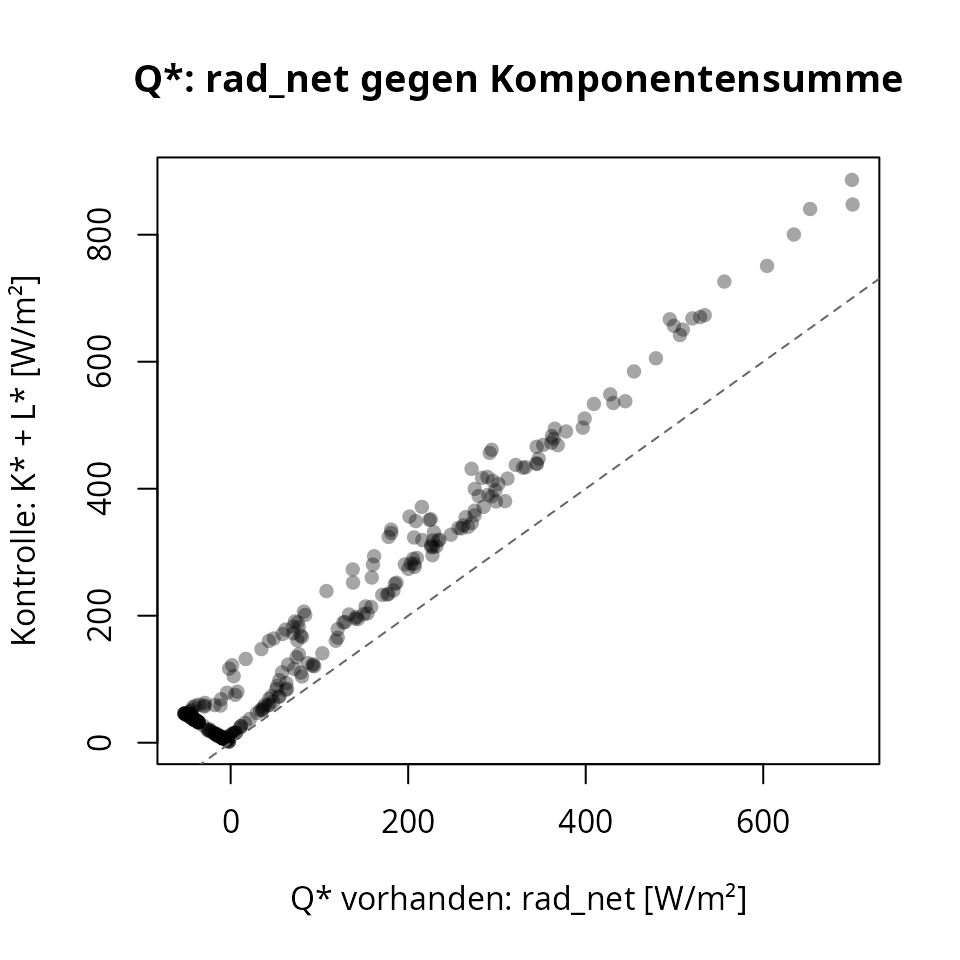

**Interpretation.** Wenn beide Größen dieselbe Strahlungsbilanz auf
derselben Verarbeitungsstufe wären, müssten die Punkte nahe an der
1:1-Linie liegen. Hier liegt die Punktwolke systematisch oberhalb der
1:1-Linie. Das heißt:

``` math
K^{*} + L^{*} > rad\_net
```

Die Abweichung ist also nicht zufällig um null verteilt. Damit ist die
Komponentensumme keine unproblematische Ersatzgröße für `rad_net`.

``` r

plot(
  caldern$datetime,
  caldern$Q_star_difference,
  type = "l",
  col = "#D55E00",
  lwd = 2,
  xlab = "Zeit",
  ylab = "K* + L* - rad_net [W/m²]",
  main = "Differenz zwischen Komponentensumme und rad_net"
)

abline(h = 0, lty = 2, col = "grey40")
```

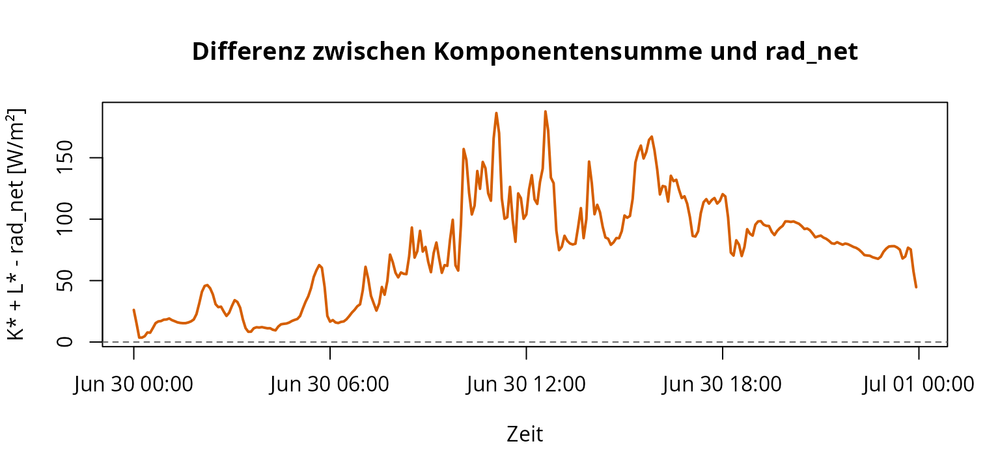

**Interpretation.** Diese Grafik zeigt, wann die Abweichung entsteht.
Wenn die Differenz vor allem tagsüber groß wird, spricht das gegen reine
Rundungsfehler. Dann hängt die Abweichung wahrscheinlich mit der
Strahlungsverarbeitung zusammen: Sensorberechnung, Loggerkorrektur,
unterschiedliche Mittelungsfenster, korrigierte langwellige Größen oder
unterschiedliche Vorzeichenlogik.

``` r

plot(
  caldern$K_down,
  caldern$Q_star_difference,
  pch = 16,
  col = rgb(0, 0, 0, 0.35),
  xlab = "K_down [W/m²]",
  ylab = "K* + L* - rad_net [W/m²]",
  main = "Abweichung in Abhängigkeit vom solaren Antrieb"
)

abline(h = 0, lty = 2, col = "grey40")
```


**Interpretation.** Wenn die Abweichung mit `K_down` zunimmt, ist sie an
den solaren Tagesgang gekoppelt. Dann ist die Komponentensumme nicht nur
durch zufällige Messstreuung anders, sondern wahrscheinlich durch eine
andere Definition oder Verarbeitung der Strahlungskomponenten.

> Diese Prüfung entscheidet, welche Strahlungsgröße als Arbeitsgröße
> verwendet wird. Ohne diese Entscheidung ist der spätere
> Methodenvergleich nicht interpretierbar, weil Unterschiede zwischen
> Wärmeflussmethoden dann teilweise aus einer unklaren Netto-Strahlung
> stammen können.

> Priestley-Taylor, Bowen, Penman und die manuelle Residualrechnung
> hängen direkt an $`Q^{*}`$ beziehungsweise $`Q^{*} - B`$. Wenn
> $`Q^{*}`$ um 100 W/m² verschoben ist, verschiebt sich auch die
> verfügbare Energie. Bei der Residualrechnung landet der Fehler direkt
> in $`LE`$. Bei Priestley-Taylor wird die Aufteilung von $`H`$ und
> $`LE`$ skaliert. Bei Bowen wird eine ohnehin gradientenempfindliche
> Methode zusätzlich mit einer unsicheren Energiemenge gespeist. Bei
> Penman verschiebt sich der Energieanteil. Die Monin-Wärmeflüsse kommen
> primär aus Temperatur-, Feuchte-, Windprofil und Stabilitätsannahmen.
> $`Q^{*}`$ geht dort nicht in gleicher Weise als direkter Energieterm
> ein. Aber wir brauchen $`Q^{*} - B`$, um zu prüfen, ob die Monin-Werte
> energetisch plausibel sind. Wenn $`Q^{*}`$ selbst unklar ist, kannst
> bei großen Monin-Werten nicht sauber entschieden werden: Ist der
> Monin-Ansatz instabil, sind die Gradienten problematisch, oder ist
> schon die Strahlungsbilanz als Vergleichsmaßstab uneindeutig?

## Use Case 4: Bodenwärmestrom und verfügbare Energie

Die Bodenwärme-Folien zeigen den Bodenwärmestrom als
Wärmeleitungsproblem. In den Caldern-Daten wird `B` direkt als
`heatflux_soil` verwendet.

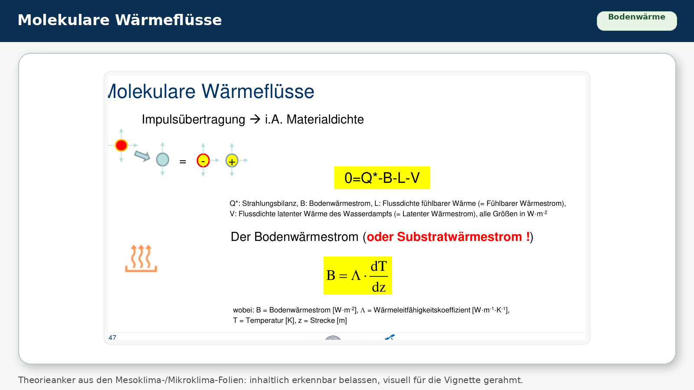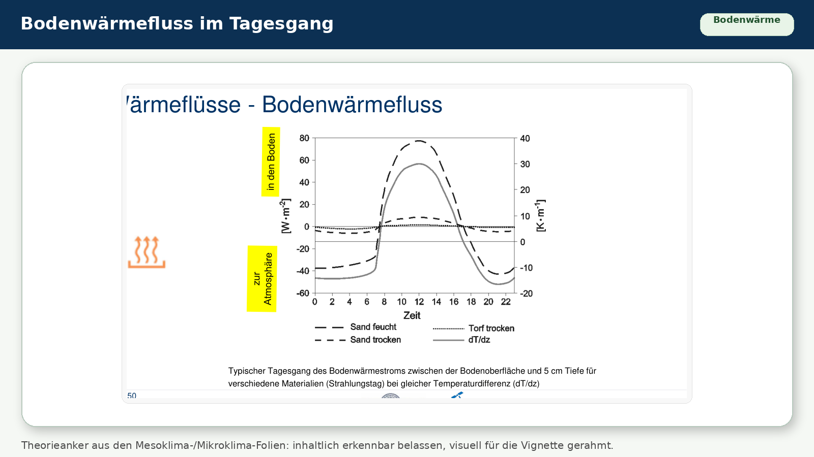

Die verfügbare Energie für fühlbaren und latenten Wärmestrom ist:

``` math
Q^{*} - B
```

``` r

# Theoriegröße Q*: gemessene Netto-Strahlung.
caldern$Q_star <- caldern$Q_star_measured

# Theoriegröße B: gemessener Bodenwärmestrom.
caldern$B <- caldern$heatflux_soil

# Energie, die für L und V verfügbar bleibt.
caldern$Q_minus_B <- caldern$Q_star - caldern$B
```

### Einzelplots

``` r

op <- par(mfrow = c(3, 1), mar = c(3.5, 4, 2, 1))

plot(caldern$datetime, caldern$Q_star, type = "l", col = "#000000", lwd = 2,
     xlab = "Zeit", ylab = "W/m²", main = "Q*: Netto-Strahlung")

plot(caldern$datetime, caldern$B, type = "l", col = "#009E73", lwd = 2,
     xlab = "Zeit", ylab = "W/m²", main = "B: Bodenwärmestrom")

plot(caldern$datetime, caldern$Q_minus_B, type = "l", col = "#D55E00", lwd = 2,
     xlab = "Zeit", ylab = "W/m²", main = "Q* - B: verfügbare Energie")
```

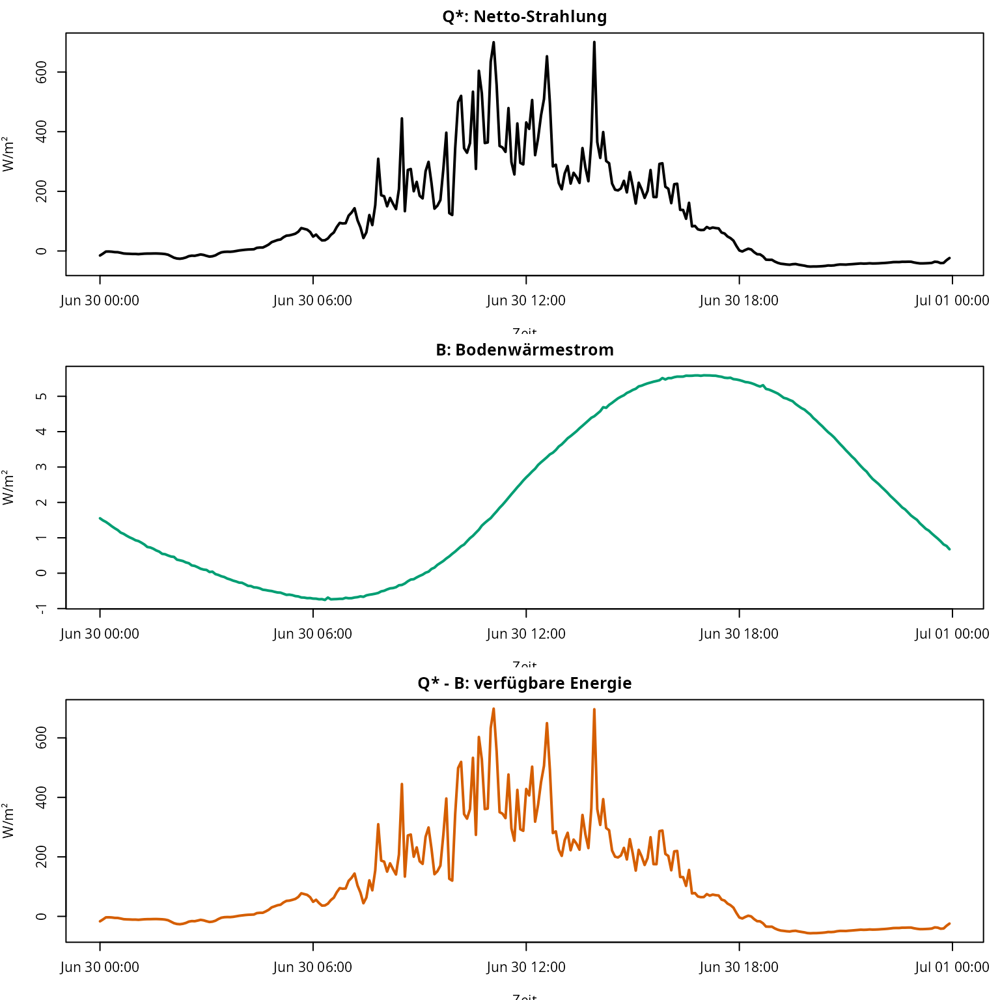

``` r


par(op)
```

**Interpretation.** `Q*` ist der radiative Nettoantrieb. `B` ist der
Anteil, der in den Boden geht oder aus dem Boden kommt. `Q* - B` ist die
Bilanzgröße, die anschließend in fühlbaren und latenten Wärmestrom
aufgeteilt wird.

### Zusammengesetzter Plot

``` r

cols_energy <- c("#000000", "#009E73", "#D55E00")
op <- par(mar = c(6, 4, 3, 1), xpd = NA)

plot(caldern$datetime, caldern$Q_star, type = "l", col = cols_energy[1], lwd = 2,
     ylim = range(caldern$Q_star, caldern$B, caldern$Q_minus_B, na.rm = TRUE),
     xlab = "Zeit", ylab = "W/m²", main = "Q*, B und Q* - B")
lines(caldern$datetime, caldern$B, col = cols_energy[2], lwd = 2)
lines(caldern$datetime, caldern$Q_minus_B, col = cols_energy[3], lwd = 2)
legend("bottom", inset = c(0, -0.35), horiz = TRUE, bty = "n",
       legend = c("Q*", "B", "Q* - B"), col = cols_energy, lty = 1, lwd = 2)
```

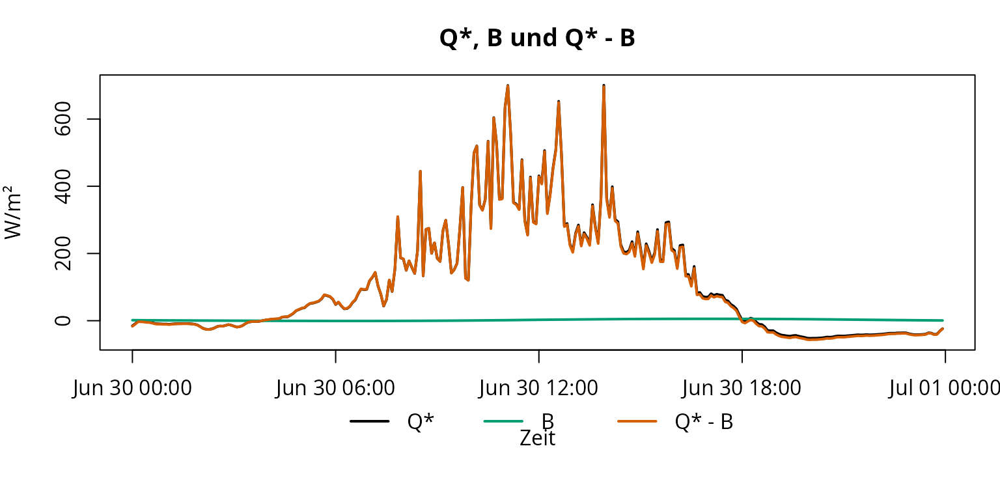

``` r


par(op)
```

## Use Case 5: Manuelle Bulk-Residual-Referenz

Die manuelle Referenz ist bewusst gewählt, weil sie die
Energieflusslogik sichtbar macht, bevor Paketmethoden benutzt werden.
Sie ist kein vollständiges Monin-Obukhov-Verfahren. Sie verwendet nur
eine vereinfachte Bulk-Transfer-Rechnung für `L` und berechnet `V` als
Residuum.

Der Bulk-Teil lautet:

``` math
L_{bulk} = \rho c_p \frac{\Delta T}{r_a}
```

mit:

``` math
\Delta T = T_{2m} - T_{10m}
```

und einem einfachen aerodynamischen Widerstand:

``` math
r_a = \frac{\ln(z_2 / z_1)}{k \bar{u}}
```

Der Residualteil lautet:

``` math
V_{residual} = Q^{*} - B - L_{bulk}
```

``` r

# Konstanten für die vereinfachte Bulk-Rechnung.
rho_air <- 1.225
cp_air <- 1005
z1 <- 2
z2 <- 10
k <- 0.41

# Temperaturdifferenz entsprechend der positiven Flussrichtung.
# Wenn 2 m wärmer ist als 10 m, wird L positiv.
caldern$delta_T_2_10 <- caldern$Ta_2m - caldern$Ta_10m

# Mittlere Windgeschwindigkeit aus den beiden Messhöhen.
caldern$wind_mean <- (caldern$Windspeed_2m + caldern$Windspeed_10m) / 2

# Einfacher aerodynamischer Widerstand.
# Dies ist eine didaktische Vereinfachung und keine vollständige
# Stabilitäts- oder Rauigkeitskorrektur.
caldern$r_a_manual <- log(z2 / z1) / (k * caldern$wind_mean)

# Manuelle Schätzung des fühlbaren Wärmestroms.
caldern$L_bulk <- rho_air * cp_air * caldern$delta_T_2_10 / caldern$r_a_manual

# Latenter Wärmestrom als Residuum der Energiebilanz.
caldern$V_residual <- caldern$Q_star - caldern$B - caldern$L_bulk
```

### Einzelplots

``` r

op <- par(mfrow = c(2, 1), mar = c(3.5, 4, 2, 1))

plot(caldern$datetime, caldern$L_bulk, type = "l", col = "#CC79A7", lwd = 2,
     xlab = "Zeit", ylab = "W/m²", main = "L_bulk: fühlbarer Wärmestrom der manuellen Referenz")
abline(h = 0, lty = 2, col = "grey50")

plot(caldern$datetime, caldern$V_residual, type = "l", col = "#56B4E9", lwd = 2,
     xlab = "Zeit", ylab = "W/m²", main = "V_residual: latenter Wärmestrom als Residuum")
abline(h = 0, lty = 2, col = "grey50")
```

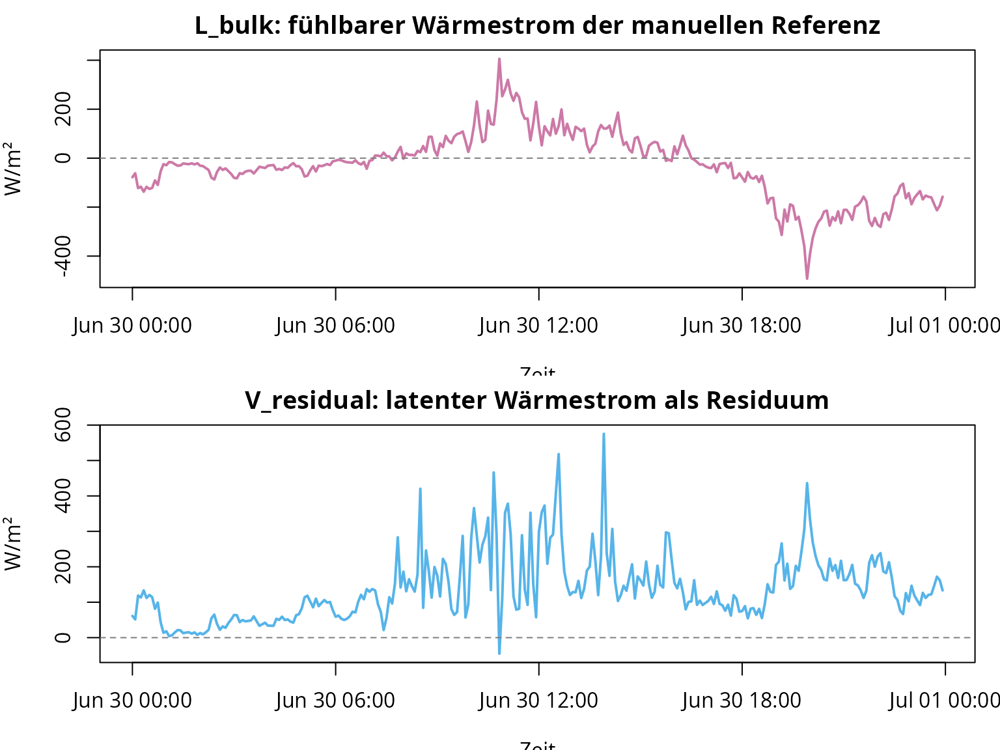

``` r


par(op)
```

**Interpretation.** `L_bulk` reagiert direkt auf Temperaturgradient und
Wind. `V_residual` ist kein unabhängig gemessener Fluss. Es enthält alle
nicht durch `Q*`, `B` und `L_bulk` erklärten Anteile.

### Zusammengesetzter Plot der manuellen Referenz

``` r

cols_manual <- c("#D55E00", "#009E73", "#CC79A7", "#56B4E9")
op <- par(mar = c(6, 4, 3, 1), xpd = NA)

plot(caldern$datetime, caldern$Q_minus_B, type = "l", col = cols_manual[1], lwd = 2,
     ylim = range(caldern$Q_minus_B, caldern$L_bulk, caldern$V_residual, na.rm = TRUE),
     xlab = "Zeit", ylab = "W/m²", main = "Manuelle Bulk-Residual-Referenz")
lines(caldern$datetime, caldern$L_bulk, col = cols_manual[3], lwd = 2)
lines(caldern$datetime, caldern$V_residual, col = cols_manual[4], lwd = 2)
legend("bottom", inset = c(0, -0.35), horiz = TRUE, bty = "n",
       legend = c("Q* - B", "L_bulk", "V_residual"),
       col = cols_manual[c(1, 3, 4)], lty = 1, lwd = 2)
```

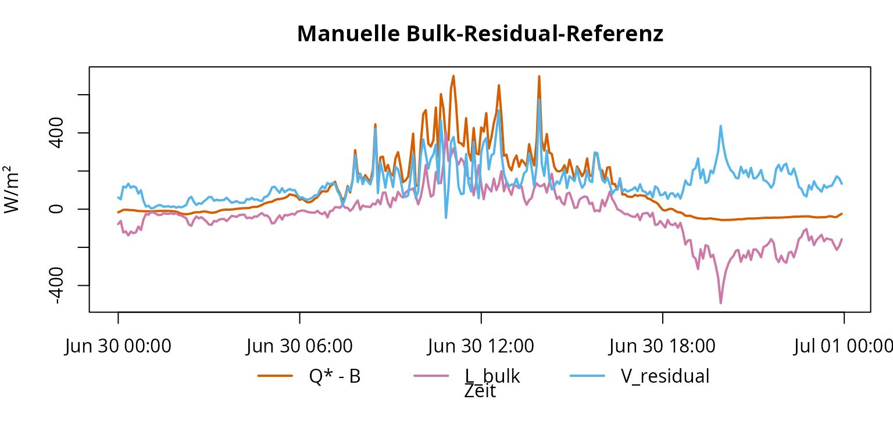

``` r


par(op)
```

## Use Case 6: Übergabe an das fieldClim-Objekt

Das `weather_station`-Objekt ist die zentrale Paketstruktur. Es
speichert nicht nur Messspalten, sondern auch Standort und
Modellparameter. Dadurch können verschiedene Funktionen auf dieselbe
strukturierte Datenbasis zugreifen.

``` r

ws <- build_weather_station(
  # Zeitachse.
  datetime = caldern$datetime,

  # Standort der Station.
  lon = 8.6832,
  lat = 50.8405,
  elev = 261,

  # Standardtemperatur und Standardfeuchte.
  temp = caldern$Ta_2m,
  rh = caldern$Huma_2m,

  # Profilgrößen für gradienten- und stabilitätsbezogene Methoden.
  t1 = caldern$Ta_2m,
  t2 = caldern$Ta_10m,
  hum1 = caldern$Huma_2m,
  hum2 = caldern$Huma_10m,

  # Windprofil und Messhöhen.
  v1 = caldern$Windspeed_2m,
  v2 = caldern$Windspeed_10m,
  z1 = 2,
  z2 = 10,

  # Paketnamen für Theoriegrößen:
  # rad_bal entspricht Q*, soil_flux entspricht B.
  rad_bal = caldern$Q_star,
  soil_flux = caldern$B,

  # Weitere Oberflächen- und Bodeninformationen.
  moisture = caldern$water_vol_soil,
  surface_temp = caldern$Ts,

  # Oberflächentyp als Modellannahme.
  surface_type = "field",

  # Beobachtungshöhe für Verfahren, die eine Referenzhöhe brauchen.
  obs_height = 2
)

# Klasse und enthaltene Felder prüfen.
class(ws)
#> [1] "weather_station"
names(ws)
#>  [1] "datetime"     "lon"          "lat"          "elev"         "temp"        
#>  [6] "rh"           "t1"           "t2"           "hum1"         "hum2"        
#> [11] "v1"           "v2"           "z1"           "z2"           "rad_bal"     
#> [16] "soil_flux"    "moisture"     "surface_temp" "surface_type" "obs_height"

# Als Tabelle ausgeben.
head(as.data.frame(ws))
#>              datetime    lon     lat elev  temp    rh    t1    t2  hum1 hum2
#> 1 2017-06-30 00:00:00 8.6832 50.8405  261 13.09 100.0 13.09 13.60 100.0 97.6
#> 2 2017-06-30 00:05:00 8.6832 50.8405  261 13.01 100.0 13.01 13.51 100.0 97.7
#> 3 2017-06-30 00:10:00 8.6832 50.8405  261 13.02 100.0 13.02 13.66 100.0 96.5
#> 4 2017-06-30 00:15:00 8.6832 50.8405  261 13.16 100.0 13.16 13.76 100.0 96.1
#> 5 2017-06-30 00:20:00 8.6832 50.8405  261 13.27 100.0 13.27 13.80 100.0 96.4
#> 6 2017-06-30 00:25:00 8.6832 50.8405  261 13.69  98.1 13.69 14.25  98.1 92.4
#>      v1    v2 z1 z2 rad_bal soil_flux moisture surface_temp surface_type
#> 1 0.448 0.529  2 10 -15.200  1.551533    0.344        16.31        field
#> 2 0.380 0.409  2 10  -8.920  1.492695    0.344        16.29        field
#> 3 0.548 0.670  2 10  -1.965  1.448708    0.344        16.25        field
#> 4 0.581 0.658  2 10  -1.790  1.390439    0.344        16.25        field
#> 5 0.764 0.887  2 10  -2.469  1.325316    0.344        16.22        field
#> 6 0.589 0.744  2 10  -3.857  1.268762    0.344        16.19        field
#>   obs_height
#> 1          2
#> 2          2
#> 3          2
#> 4          2
#> 5          2
#> 6          2
```

**Interpretation.** Das Objekt ist die Übergabeform für das Paket. Es
ist nicht nur eine Kopie der CSV-Datei, sondern eine strukturierte
Verbindung aus Messdaten und Modellannahmen.

## Use Case 7: Paketmethoden für Wärmeflüsse

### Priestley-Taylor als erster Paketpfad

Priestley-Taylor nutzt die verfügbare Energie `Q* - B` und eine
empirische Verdunstungsparametrisierung. Der Vorteil im Einstieg ist
nicht, dass die Methode „wahrer“ wäre, sondern dass sie keine instabilen
Gradientenquotienten benötigt.

``` r

# Nur den Priestley-Taylor-Pfad berechnen.
# Dieser Pfad ist als erster Paketvergleich stabiler als der volle Methodenworkflow.
flux_pt <- turb_flux_calc(ws, pt_only = TRUE)

# Ergebnisse zurück in den Auswertungsdatensatz schreiben.
caldern$L_pt <- flux_pt$sensible_priestley_taylor
caldern$V_pt <- flux_pt$latent_priestley_taylor
caldern$L_plus_V_pt <- caldern$L_pt + caldern$V_pt
```

``` r

op <- par(mfrow = c(2, 1), mar = c(3.5, 4, 2, 1))

plot(caldern$datetime, caldern$L_pt, type = "l", col = "#CC79A7", lwd = 2,
     xlab = "Zeit", ylab = "W/m²", main = "Priestley-Taylor: L")
abline(h = 0, lty = 2, col = "grey50")

plot(caldern$datetime, caldern$V_pt, type = "l", col = "#56B4E9", lwd = 2,
     xlab = "Zeit", ylab = "W/m²", main = "Priestley-Taylor: V")
abline(h = 0, lty = 2, col = "grey50")
```

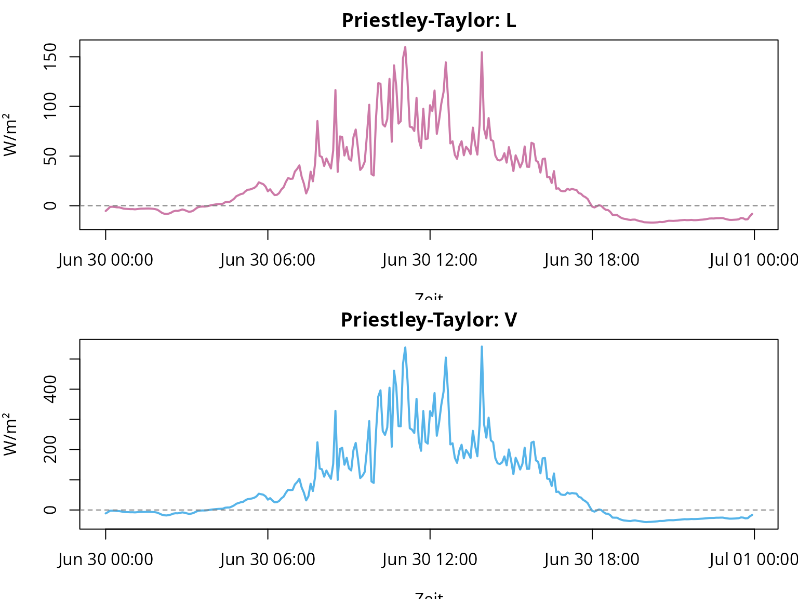

``` r


par(op)
```

``` r

cols_pt <- c("#D55E00", "#000000")
op <- par(mar = c(6, 4, 3, 1), xpd = NA)

plot(caldern$datetime, caldern$Q_minus_B, type = "l", col = cols_pt[1], lwd = 2,
     ylim = range(caldern$Q_minus_B, caldern$L_plus_V_pt, na.rm = TRUE),
     xlab = "Zeit", ylab = "W/m²", main = "Priestley-Taylor: Energieabschluss")
lines(caldern$datetime, caldern$L_plus_V_pt, col = cols_pt[2], lwd = 2)
legend("bottom", inset = c(0, -0.35), horiz = TRUE, bty = "n",
       legend = c("Q* - B", "L + V nach PT"), col = cols_pt, lty = 1, lwd = 2)
```

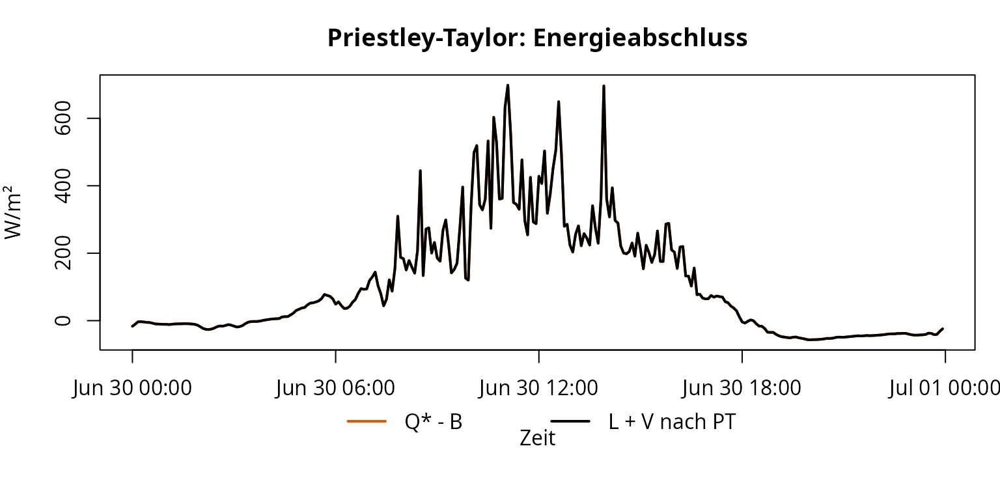

``` r


par(op)
```

**Interpretation.** Der Priestley-Taylor-Pfad schließt in dieser
Paketfassung die verfügbare Energie $`Q^{*} - B`$. Dabei ist $`Q^{*}`$
die Netto-Strahlung und $`B`$ der Bodenwärmestrom. Die Summe aus
fühlbarem Wärmestrom $`L`$ und latentem Wärmestrom $`V`$ liegt deshalb
auf derselben Energiebasis wie die manuelle Bilanzrechnung.

Das ist der wichtigste didaktische Vorteil dieses Pfads: Die Methode
bleibt direkt an die Energiebilanz gekoppelt. Sie erzeugt keine
unabhängige Flussgröße aus einem instabilen Gradientenverhältnis,
sondern partitioniert die verfügbare Energie. Priestley-Taylor ist damit
nicht „wahrer“ als die anderen Methoden, aber als erster Paketpfad
kontrollierbarer.

Für die Interpretation heißt das: Wenn $`Q^{*}`$ oder $`B`$ falsch
definiert sind, wird auch Priestley-Taylor falsch skaliert. Der Fehler
bleibt aber sichtbar, weil $`L + V`$ weiterhin gegen $`Q^{*} - B`$
geprüft werden kann. Genau deshalb steht die Kontrolle von $`Q^{*}`$ und
$`B`$ vor diesem Methodenvergleich.

### Methodenüberblick

Die folgende Übersichtsgrafik zeigt die gemeinsame Messsituation: eine
Wiesenstation mit Strahlungsbilanz, Bodenwärmestrom, Temperatur-,
Feuchte- und Windmessungen in mehreren Höhen. Alle folgenden Verfahren
greifen auf dieselbe Stationslogik zurück, verwenden daraus aber
unterschiedliche Teilinformationen.

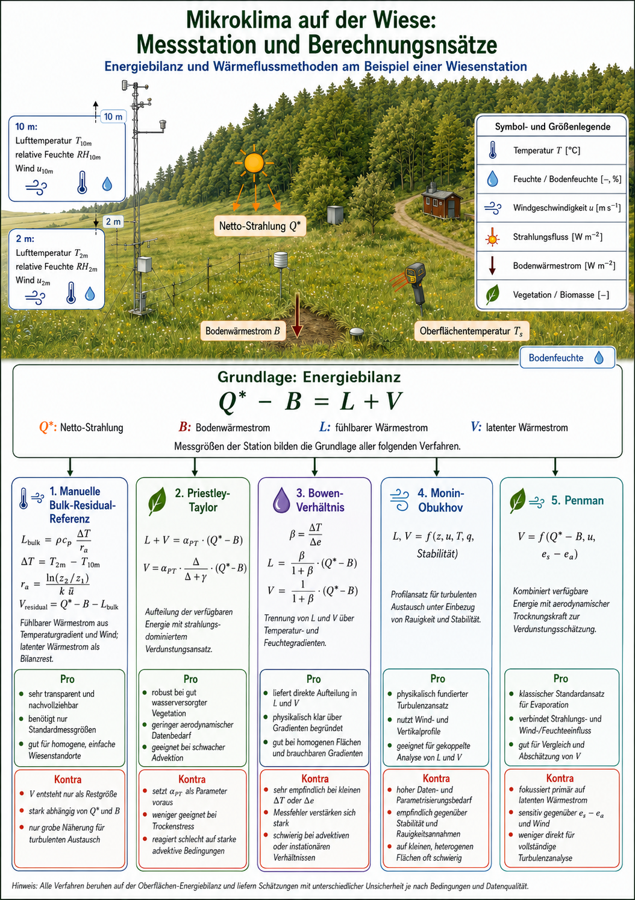

Die Methoden sind deshalb nicht als fünf gleichartige Messverfahren zu
lesen. Sie sind fünf unterschiedliche Rechenansätze mit
unterschiedlicher Nähe zur Energiebilanz, zu Gradienten und zu
Profilannahmen.

| Methode | Hauptfrage | Direkte Eingänge | Ergebnis |
|----|----|----|----|
| Manuelle Bulk-Residual-Referenz | Wie lässt sich die Bilanzlogik transparent nachrechnen? | Temperaturgradient, Wind, `Q_star`, `B` | `L_bulk`, `V_residual` |
| Priestley-Taylor | Wie wird die verfügbare Energie stabil partitioniert? | `Q_star`, `B`, Parameter | `L_pt`, `V_pt` |
| Bowen-Verhältnis | Wie teilt ein Temperatur-/Feuchtegradient die verfügbare Energie auf? | Temperaturgradient, Feuchtegradient, `Q_star`, `B` | `L_bowen`, `V_bowen` |
| Monin-Obukhov | Wie lassen sich turbulente Flüsse aus Profilen und Stabilität ableiten? | Windprofil, Temperaturprofil, Feuchteprofil, Rauigkeit, Stabilität | `L_monin`, `V_monin` |
| Penman | Wie groß ist der latente Wärmestrom aus Energie- und Verdunstungsantrieb? | `Q_star`, `B`, Wind, Temperatur, Feuchte, Oberfläche | `V_penman` |

#### 1. Manuelle Bulk-Residual-Referenz

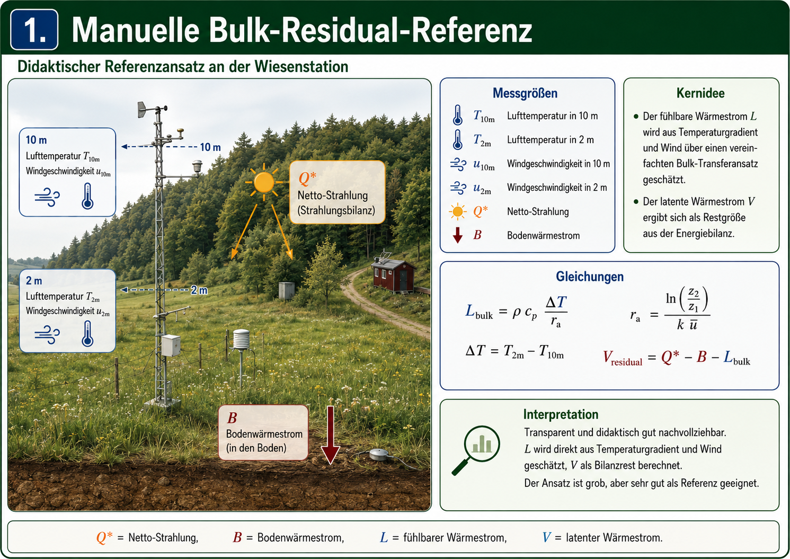

Die manuelle Bulk-Residual-Referenz ist der didaktische Kontrollweg. Der
fühlbare Wärmestrom wird aus einem Temperaturgradienten und einem
vereinfachten aerodynamischen Widerstand geschätzt. Der latente
Wärmestrom wird anschließend als Rest der Energiebilanz berechnet.

``` math
L_{bulk} = \rho c_p \frac{\Delta T}{r_a}
```

Dabei ist `L_bulk` der manuell geschätzte fühlbare Wärmestrom in W/m²,
`rho` die Luftdichte in kg/m³, `c_p` die spezifische Wärmekapazität der
Luft in J kg⁻¹ K⁻¹, `Delta T` die Temperaturdifferenz zwischen zwei
Messhöhen in K und `r_a` der vereinfachte aerodynamische Widerstand in
s/m.

``` math
\Delta T = T_{2m} - T_{10m}
```

Dabei ist `T_2m` die Lufttemperatur in 2 m Höhe und `T_10m` die
Lufttemperatur in 10 m Höhe. Positive Werte bedeuten hier, dass die
untere Luftschicht wärmer ist als die obere.

``` math
r_a = \frac{\ln(z_2 / z_1)}{k \bar{u}}
```

Dabei ist `z_1` die untere Messhöhe, `z_2` die obere Messhöhe, `k` die
von-Kármán-Konstante und `u_bar` eine mittlere Windgeschwindigkeit
zwischen den Messhöhen.

``` math
V_{residual} = Q^{*} - B - L_{bulk}
```

Dabei ist `V_residual` der residual berechnete latente Wärmestrom,
`Q_star` die Netto-Strahlung, `B` der Bodenwärmestrom und `L_bulk` der
zuvor berechnete fühlbare Wärmestrom. Der Ansatz ist transparent, aber
grob. Alle Fehler in `Q_star`, `B` oder `L_bulk` landen direkt im
Residuum.

#### 2. Priestley-Taylor

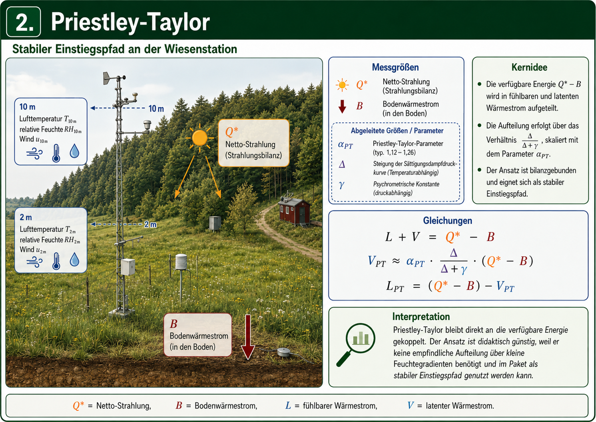

Priestley-Taylor ist in dieser Vignette der stabile erste Paketpfad. Der
Ansatz bleibt direkt an die verfügbare Energie gebunden und benötigt
keine empfindliche Aufteilung über kleine Feuchtegradienten.

``` math
L + V = Q^{*} - B
```

Dabei ist `L` der fühlbare Wärmestrom, `V` der latente Wärmestrom,
`Q_star` die Netto-Strahlung und `B` der Bodenwärmestrom. Die rechte
Seite ist die verfügbare Energie für turbulente Wärmeflüsse.

``` math
V_{PT} \approx \alpha_{PT} \frac{\Delta}{\Delta + \gamma} (Q^{*} - B)
```

Dabei ist `V_PT` der Priestley-Taylor-Wert für den latenten Wärmestrom,
`alpha_PT` der Priestley-Taylor-Parameter, `Delta` die Steigung der
Sättigungsdampfdruckkurve und `gamma` die psychrometrische Konstante.
Der Faktor vor `Q_star - B` beschreibt, welcher Anteil der verfügbaren
Energie in Verdunstung geht.

``` math
L_{PT} = (Q^{*} - B) - V_{PT}
```

Dabei ist `L_PT` der verbleibende fühlbare Wärmestrom. Der Vorteil
dieses Pfads ist die Bilanzbindung: Wenn `Q_star` und `B` korrekt
gesetzt sind, bleibt die Summe aus `L_PT` und `V_PT` auf der verfügbaren
Energie.

#### 3. Bowen-Verhältnis

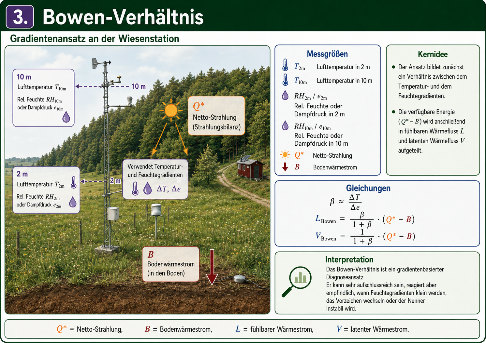

Der Bowen-Ansatz nutzt ein Verhältnis aus Temperatur- und
Feuchtegradient. Er verteilt die verfügbare Energie auf fühlbaren und
latenten Wärmestrom.

``` math
\beta \approx \frac{\Delta T}{\Delta e}
```

Dabei ist `beta` das Bowen-Verhältnis, `Delta T` der Temperaturgradient
zwischen zwei Messhöhen und `Delta e` der Dampfdruck- beziehungsweise
Feuchtegradient zwischen denselben Messhöhen. In der vollständigen Form
gehen weitere Konstanten und Einheitenkorrekturen ein; didaktisch
entscheidend ist hier das Gradientenverhältnis.

``` math
L_{Bowen} = \frac{\beta}{1 + \beta} (Q^{*} - B)
```

Dabei ist `L_Bowen` der fühlbare Wärmestrom nach Bowen. Der Anteil
`beta / (1 + beta)` bestimmt, welcher Teil der verfügbaren Energie in
fühlbare Wärme geht.

``` math
V_{Bowen} = \frac{1}{1 + \beta} (Q^{*} - B)
```

Dabei ist `V_Bowen` der latente Wärmestrom nach Bowen. Der Ansatz ist
formal bilanzgebunden, aber gradientenempfindlich. Wenn `Delta e` sehr
klein wird, das Vorzeichen wechselt oder `1 + beta` nahe null liegt,
können einzelne Zeitschritte stark ausschlagen.

#### 4. Monin-Obukhov

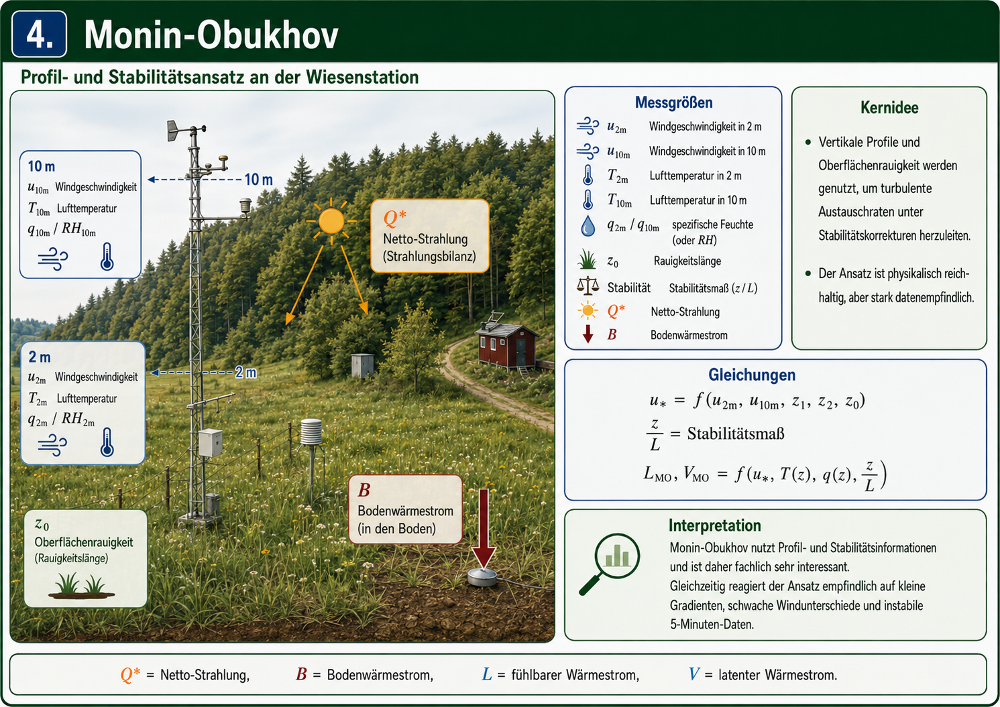

Monin-Obukhov ist ein Profil- und Stabilitätsansatz. Er nutzt vertikale
Profile von Wind, Temperatur und Feuchte sowie Rauigkeits- und
Stabilitätsannahmen. Im Gegensatz zu Priestley-Taylor und Bowen ist
dieser Pfad nicht primär eine direkte Partitionierung von `Q_star - B`.

``` math
u_* = f(u_{2m}, u_{10m}, z_1, z_2, z_0)
```

Dabei ist `u_star` die Schubspannungsgeschwindigkeit, `u_2m` und `u_10m`
sind Windgeschwindigkeiten in 2 m und 10 m Höhe, `z_1` und `z_2` sind
die Messhöhen und `z_0` ist die Rauigkeitslänge der Oberfläche.

``` math
\frac{z}{L_{MO}} = \text{Stabilitätsmaß}
```

Dabei ist `z` eine Bezugshöhe und `L_MO` die Monin-Obukhov-Länge. Das
Verhältnis beschreibt, ob die bodennahe Schicht stabil, neutral oder
instabil geschichtet ist.

``` math
L_{MO}, V_{MO} = f(u_*, T(z), q(z), z / L_{MO})
```

Dabei sind `L_MO` und `V_MO` die Monin-Obukhov-Flüsse für fühlbare und
latente Wärme, `T(z)` das Temperaturprofil, `q(z)` das Feuchteprofil und
`z / L_MO` die Stabilitätskorrektur. Dieser Ansatz ist fachlich
reichhaltig, aber sehr empfindlich gegenüber kleinen Gradienten,
schwachen Windunterschieden und 5-Minuten-Rauschen. Große Werte müssen
deshalb gegen `Q_star - B` geprüft werden.

#### 5. Penman

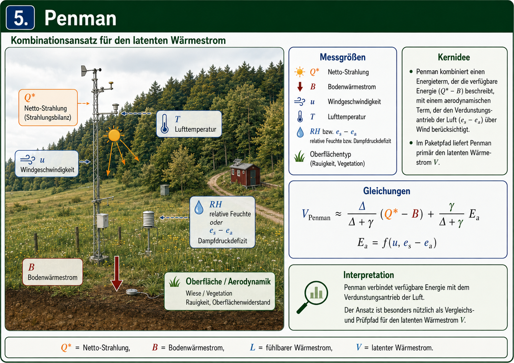

Penman ist ein Kombinationsansatz für den latenten Wärmestrom. Er
verbindet einen Energieterm mit einem aerodynamischen Verdunstungsterm.
Im aktuellen Paketpfad liefert Penman vor allem `V`, aber keinen eigenen
fühlbaren Wärmestrom `L`.

``` math
V_{Penman} \approx \frac{\Delta}{\Delta + \gamma}(Q^{*} - B) + \frac{\gamma}{\Delta + \gamma} E_a
```

Dabei ist `V_Penman` der latente Wärmestrom nach Penman, `Delta` die
Steigung der Sättigungsdampfdruckkurve, `gamma` die psychrometrische
Konstante, `Q_star - B` die verfügbare Energie und `E_a` der
aerodynamische Verdunstungsterm.

``` math
E_a = f(u, e_s - e_a)
```

Dabei ist `u` die Windgeschwindigkeit, `e_s` der Sättigungsdampfdruck
und `e_a` der aktuelle Dampfdruck der Luft. Die Differenz `e_s - e_a`
ist der Verdunstungsantrieb der Luft. Penman ist deshalb besonders
nützlich als Vergleichs- und Prüfpfad für `V`, aber keine vollständige
`L`/`V`-Partitionierung wie Priestley-Taylor oder Bowen.

``` r

# Alle im Sammelworkflow verfügbaren Methoden berechnen.
# Bowen und Monin-Obukhov können Warnungen erzeugen, weil sie auf Gradienten
# und Stabilitätsannahmen empfindlich reagieren.
flux_all <- turb_flux_calc(ws)

# Ergebnisse in den Datensatz übernehmen.
caldern$L_bowen <- flux_all$sensible_bowen
caldern$V_bowen <- flux_all$latent_bowen
caldern$L_monin <- flux_all$sensible_monin
caldern$V_monin <- flux_all$latent_monin
caldern$V_penman <- flux_all$latent_penman
```

``` r

# Tagesmittelwerte für L.
# Penman wird hier nicht aufgeführt, weil latent_penman() nur V liefert.
L_summary <- data.frame(
  Methode = c("manuelle Bulk-Referenz", "Priestley-Taylor", "Bowen", "Monin-Obukhov"),
  L_Mittel_W_m2 = c(
    mean(caldern$L_bulk, na.rm = TRUE),
    mean(caldern$L_pt, na.rm = TRUE),
    mean(caldern$L_bowen, na.rm = TRUE),
    mean(caldern$L_monin, na.rm = TRUE)
  )
)

# Tagesmittelwerte für V.
V_summary <- data.frame(
  Methode = c("manuelles Residuum", "Priestley-Taylor", "Bowen", "Monin-Obukhov", "Penman"),
  V_Mittel_W_m2 = c(
    mean(caldern$V_residual, na.rm = TRUE),
    mean(caldern$V_pt, na.rm = TRUE),
    mean(caldern$V_bowen, na.rm = TRUE),
    mean(caldern$V_monin, na.rm = TRUE),
    mean(caldern$V_penman, na.rm = TRUE)
  )
)

L_summary
#>                  Methode L_Mittel_W_m2
#> 1 manuelle Bulk-Referenz     -30.82530
#> 2       Priestley-Taylor      25.12080
#> 3                  Bowen     -21.12343
#> 4          Monin-Obukhov     400.83673
V_summary
#>              Methode V_Mittel_W_m2
#> 1 manuelles Residuum     139.51979
#> 2   Priestley-Taylor      83.57368
#> 3              Bowen     129.81791
#> 4      Monin-Obukhov      52.67559
#> 5             Penman      62.81968
```

**Interpretation.** Die beiden Tabellen zeigen Tagesmittelwerte der
berechneten Zeitreihen. Sie sind keine Rangliste der Methoden. Sie
zeigen, wie stark sich die Rechenwege bei gleicher Datenbasis
unterscheiden.

Beim fühlbaren Wärmestrom $`L`$ fällt zuerst der Unterschied zwischen
Priestley-Taylor und Monin-Obukhov auf. Die manuelle Bulk-Referenz
liefert im Tagesmittel einen negativen Wert. Das entsteht, weil der
einfache Bulk-Ansatz direkt am Temperaturgradienten zwischen 2 m und 10
m hängt. Wenn dieser Gradient über längere Phasen schwach, negativ oder
nachts invers ist, schlägt das unmittelbar auf $`L`$ durch. Die manuelle
Referenz ist deshalb transparent, aber grob.

Priestley-Taylor liefert dagegen einen moderat positiven Tagesmittelwert
für $`L`$. Das passt zur Rolle dieser Methode im Paket: Sie bleibt an
die verfügbare Energie $`Q^{*} - B`$ gekoppelt und verteilt diese
Energie parametrisiert auf $`L`$ und $`V`$.

Bowen liegt im Tagesmittel ebenfalls nahe an der manuellen Referenz,
aber das ist nicht automatisch ein Qualitätsmerkmal. Bowen kann einzelne
extreme Werte erzeugen, die sich im Mittel teilweise wieder ausgleichen.
Der Tagesmittelwert allein verdeckt also mögliche Instabilitäten.

Monin-Obukhov ist der auffällige Fall. Der Tagesmittelwert von $`L`$ ist
mit etwa 401 W/m² extrem hoch. Das ist für einen Tagesmittelwert aus
5-Minuten-Daten nicht als unkritisch plausibler Wärmefluss zu lesen. Es
zeigt, dass dieser Pfad in diesem Datensatz stark auf Profil-, Wind- und
Stabilitätsannahmen reagiert.

Beim latenten Wärmestrom $`V`$ liegen manuelles Residuum und Bowen im
Tagesmittel relativ hoch, Priestley-Taylor und Penman niedriger,
Monin-Obukhov nochmals niedriger. Auch hier gilt: Die Differenzen sind
keine Messwahrheiten, sondern Folgen unterschiedlicher Rechenlogiken.
Das manuelle Residuum enthält alle Fehler aus $`Q^{*}`$, $`B`$ und
$`L`$. Penman liefert nur $`V`$, keinen eigenen $`L`$-Wert. Deshalb
werden $`L`$ und $`V`$ getrennt tabelliert.

### Einzelplots der Paketmethoden

``` r

op <- par(mfrow = c(4, 1), mar = c(3.2, 4, 2, 1))

plot(caldern$datetime, caldern$L_bulk, type = "l", col = "#000000", lwd = 2,
     xlab = "Zeit", ylab = "W/m²", main = "L: manuelle Bulk-Referenz")
abline(h = 0, lty = 2, col = "grey50")

plot(caldern$datetime, caldern$L_pt, type = "l", col = "#CC79A7", lwd = 2,
     xlab = "Zeit", ylab = "W/m²", main = "L: Priestley-Taylor")
abline(h = 0, lty = 2, col = "grey50")

plot(caldern$datetime, caldern$L_bowen, type = "l", col = "#009E73", lwd = 2,
     xlab = "Zeit", ylab = "W/m²", main = "L: Bowen")
abline(h = 0, lty = 2, col = "grey50")

plot(caldern$datetime, caldern$L_monin, type = "l", col = "#D55E00", lwd = 2,
     xlab = "Zeit", ylab = "W/m²", main = "L: Monin-Obukhov")
abline(h = 0, lty = 2, col = "grey50")
```

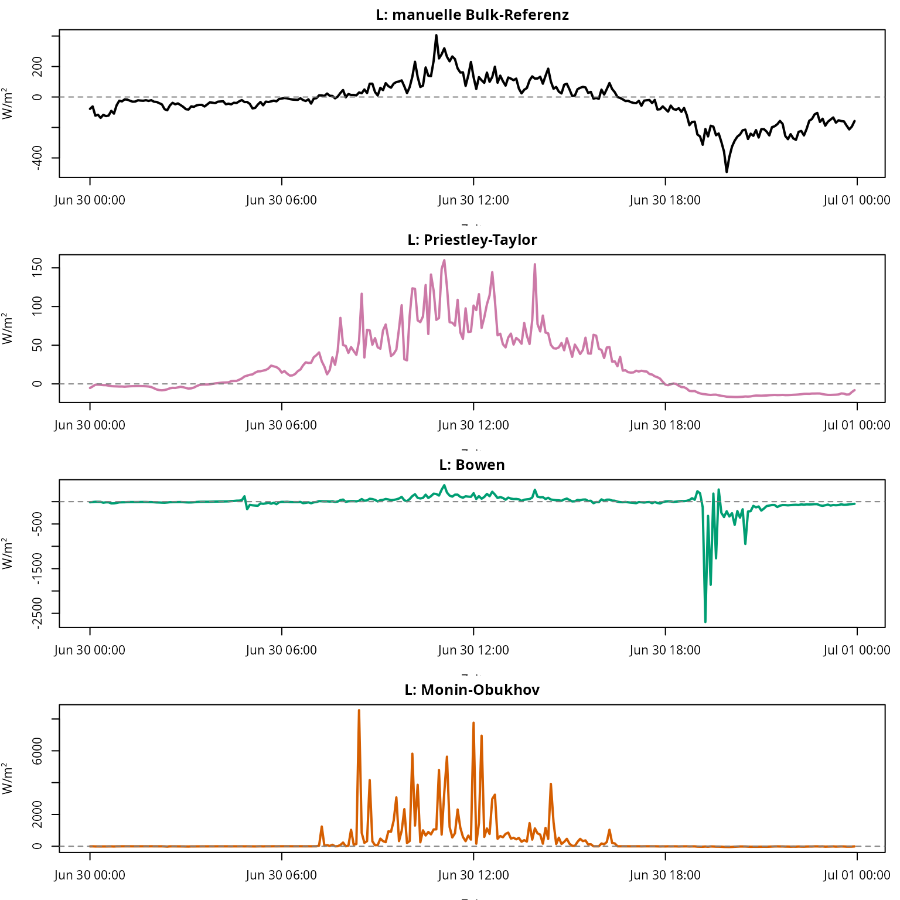

``` r


par(op)
```

``` r

op <- par(mfrow = c(5, 1), mar = c(3.2, 4, 2, 1))

plot(caldern$datetime, caldern$V_residual, type = "l", col = "#000000", lwd = 2,
     xlab = "Zeit", ylab = "W/m²", main = "V: manuelles Residuum")
abline(h = 0, lty = 2, col = "grey50")

plot(caldern$datetime, caldern$V_pt, type = "l", col = "#56B4E9", lwd = 2,
     xlab = "Zeit", ylab = "W/m²", main = "V: Priestley-Taylor")
abline(h = 0, lty = 2, col = "grey50")

plot(caldern$datetime, caldern$V_bowen, type = "l", col = "#009E73", lwd = 2,
     xlab = "Zeit", ylab = "W/m²", main = "V: Bowen")
abline(h = 0, lty = 2, col = "grey50")

plot(caldern$datetime, caldern$V_monin, type = "l", col = "#D55E00", lwd = 2,
     xlab = "Zeit", ylab = "W/m²", main = "V: Monin-Obukhov")
abline(h = 0, lty = 2, col = "grey50")

plot(caldern$datetime, caldern$V_penman, type = "l", col = "#0072B2", lwd = 2,
     xlab = "Zeit", ylab = "W/m²", main = "V: Penman")
abline(h = 0, lty = 2, col = "grey50")
```

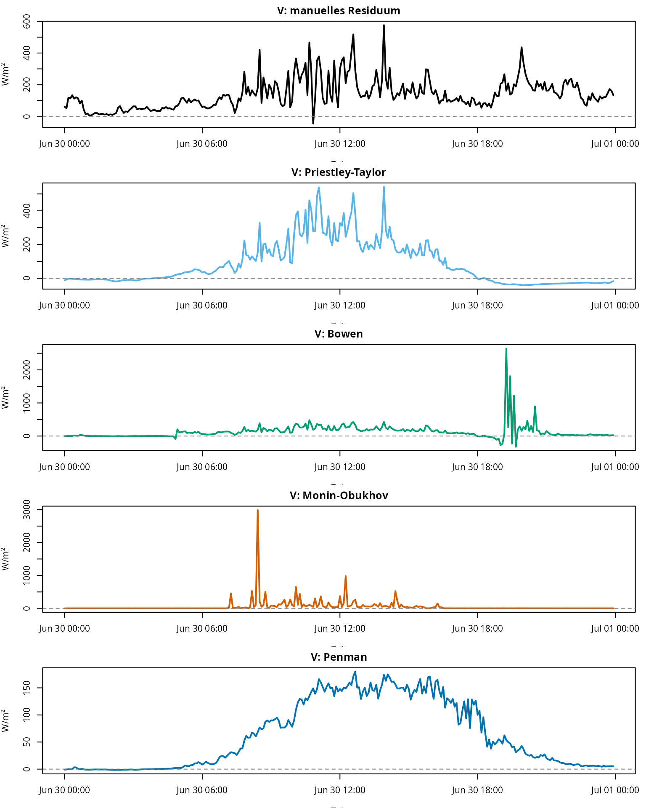

``` r


par(op)
```

**Interpretation.** Die Einzelplots zeigen zuerst jede Methode für sich.
Dadurch werden Extremwerte, Vorzeichenwechsel und zeitliche Muster
sichtbar, ohne dass Linien sich gegenseitig verdecken.

### Konsistenzprüfung der Wärmeflussmethoden

Die folgenden Ergebnisse sind nicht nur ein Methodenvergleich. Sie sind
auch eine Konsistenzprüfung der Energiebilanz.

Die Theorie schreibt die bodennahe Energiebilanz als:

``` math
0 = Q^{*} - B - L - V
```

mit:

- $`Q^{*}`$: Netto-Strahlung bzw. Strahlungsbilanz \[W/m²\]
- $`B`$: Bodenwärmestrom \[W/m²\]
- $`L`$: fühlbarer Wärmestrom \[W/m²\]
- $`V`$: latenter Wärmestrom \[W/m²\]

Für diese Vignette gilt als Plausibilitätsprüfung:

``` math
L + V \approx Q^{*} - B
```

Diese Beziehung ist keine zusätzliche Methode. Sie prüft, ob die
berechneten turbulenten Wärmeflüsse energetisch zur verfügbaren Energie
passen. Gerade bei Bowen und Monin-Obukhov ist dieser Schritt notwendig,
weil beide Verfahren bei ungünstigen Gradienten oder
Stabilitätsbedingungen sehr große Einzelwerte erzeugen können.

``` r

# Falls dieser Block isoliert ausgeführt wird, werden die zentralen Arbeitsgrößen
# noch einmal robust gesetzt. Im normalen Ablauf wurden sie vorher bereits erzeugt.

# Q_star ist die verwendete Netto-Strahlung.
if (!("Q_star" %in% names(caldern))) {
  if ("Q_star_measured" %in% names(caldern)) {
    caldern$Q_star <- caldern$Q_star_measured
  } else {
    caldern$Q_star <- caldern$rad_net
  }
}

# B ist der Bodenwärmestrom.
if (!("B" %in% names(caldern))) {
  caldern$B <- caldern$heatflux_soil
}

# Verfügbare Energie:
# Bei B > 0 in den Boden bleibt Q_star - B für L und V verfügbar.
caldern$available_energy <- caldern$Q_star - caldern$B

# Summen aus fühlbarem und latentem Wärmestrom.
# Diese Summen werden mit der verfügbaren Energie verglichen.
caldern$LV_bulk <- caldern$L_bulk + caldern$V_residual
caldern$LV_pt <- caldern$L_pt + caldern$V_pt
caldern$LV_bowen <- caldern$L_bowen + caldern$V_bowen
caldern$LV_monin <- caldern$L_monin + caldern$V_monin

# Abweichungen von Q_star - B.
caldern$diff_bulk <- caldern$LV_bulk - caldern$available_energy
caldern$diff_pt <- caldern$LV_pt - caldern$available_energy
caldern$diff_bowen <- caldern$LV_bowen - caldern$available_energy
caldern$diff_monin <- caldern$LV_monin - caldern$available_energy

# Kompakte Konsistenztabelle.
energy_consistency <- data.frame(
  Methode = c(
    "Bulk-Residual",
    "Priestley-Taylor",
    "Bowen",
    "Monin-Obukhov"
  ),
  Mittel_L_plus_V = c(
    mean(caldern$LV_bulk, na.rm = TRUE),
    mean(caldern$LV_pt, na.rm = TRUE),
    mean(caldern$LV_bowen, na.rm = TRUE),
    mean(caldern$LV_monin, na.rm = TRUE)
  ),
  Mittel_Q_star_minus_B = mean(caldern$available_energy, na.rm = TRUE),
  Mittlere_Abweichung = c(
    mean(caldern$diff_bulk, na.rm = TRUE),
    mean(caldern$diff_pt, na.rm = TRUE),
    mean(caldern$diff_bowen, na.rm = TRUE),
    mean(caldern$diff_monin, na.rm = TRUE)
  ),
  Max_abs_Abweichung = c(
    max(abs(caldern$diff_bulk), na.rm = TRUE),
    max(abs(caldern$diff_pt), na.rm = TRUE),
    max(abs(caldern$diff_bowen), na.rm = TRUE),
    max(abs(caldern$diff_monin), na.rm = TRUE)
  )
)

# Zahlen runden, damit die Tabelle lesbar bleibt.
energy_consistency[, -1] <- round(energy_consistency[, -1], 1)

energy_consistency
#>            Methode Mittel_L_plus_V Mittel_Q_star_minus_B Mittlere_Abweichung
#> 1    Bulk-Residual           108.7                 108.7                 0.0
#> 2 Priestley-Taylor           108.7                 108.7                 0.0
#> 3            Bowen           108.7                 108.7                 0.0
#> 4    Monin-Obukhov           453.5                 108.7               344.8
#>   Max_abs_Abweichung
#> 1                0.0
#> 2                0.0
#> 3                0.0
#> 4            11334.9
```

**Interpretation.** Diese Tabelle ist die zentrale Konsistenzprüfung.
Sie vergleicht nicht nur Mittelwerte einzelner Flüsse, sondern prüft, ob
die Summe aus fühlbarem und latentem Wärmestrom zur verfügbaren Energie
passt.

Die verfügbare Energie ist:

``` math
Q^{*} - B
```

Dabei ist $`Q^{*}`$ die Netto-Strahlung und $`B`$ der Bodenwärmestrom.
Wenn der Speicherterm $`S`$ nicht separat berechnet wird, muss für eine
bilanzgebundene Methode näherungsweise gelten:

``` math
L + V \approx Q^{*} - B
```

Die manuelle Bulk-Residual-Referenz erfüllt diese Beziehung konstruktiv.
Das ist erwartbar, weil $`V`$ dort als Restgröße berechnet wird:

``` math
V = Q^{*} - B - L
```

Priestley-Taylor schließt die Bilanz ebenfalls. Auch das ist erwartbar,
weil dieser Paketpfad die verfügbare Energie $`Q^{*} - B`$
partitioniert.

Bowen schließt in dieser Tabelle ebenfalls die Energiebilanz. Das
bedeutet aber nicht, dass alle Bowen-Einzelwerte unproblematisch sind.
Bowen kann die verfügbare Energie formal auf $`L`$ und $`V`$ aufteilen
und trotzdem bei einzelnen Zeitpunkten extreme Partitionierungen
erzeugen. Deshalb reicht die Konsistenzprüfung allein für Bowen nicht
aus; die Extremwerte müssen zusätzlich geprüft werden.

Monin-Obukhov ist der klare Bruch. Im Tagesmittel ergibt $`L + V`$ etwa
453.5 W/m², während $`Q^{*} - B`$ nur etwa 108.7 W/m² beträgt. Die
mittlere Abweichung liegt damit bei etwa 344.8 W/m². Die maximale
absolute Abweichung ist mit über 11000 W/m² extrem. Das ist kein kleiner
Rundungs- oder Darstellungsfehler.

Die Konsequenz ist eindeutig: Der Monin-Obukhov-Pfad liefert in diesem
Datensatz einzelne Werte, die energetisch nicht mehr plausibel zur
verfügbaren Energie passen. Das kann an kleinen oder verrauschten
Gradienten, geringen Windunterschieden, Stabilitätsannahmen oder einer
für 5-Minuten-Daten ungeeigneten Anwendung dieses Pfads liegen. Solche
Werte sind Diagnosefälle. Sie dürfen nicht als reale
mikrometeorologische Wärmeflussereignisse interpretiert werden.

### Diagnose auffälliger Bowen- und Monin-Obukhov-Werte

Die Extremwertdiagnose soll nicht alle auffälligen Zeitschritte
ausgeben. Sie fasst zuerst zusammen, wo Extremwerte auftreten, und zeigt
danach nur die stärksten Fälle.

``` r

# Diagnosegrenze für auffällige Einzelwerte.
# Der Wert ist keine harte physikalische Grenze.
# Er dient nur zum Finden sehr großer 5-Minuten-Werte.
threshold_flux <- 600

# Gradienten berechnen.
# Diese Größen helfen zu prüfen, ob Extremwerte mit kleinen oder wechselnden
# Temperatur-, Feuchte- oder Windgradienten zusammenfallen.
caldern$dT_2_10 <- caldern$Ta_2m - caldern$Ta_10m
caldern$dH_2_10 <- caldern$Huma_2m - caldern$Huma_10m
caldern$dU_2_10 <- caldern$Windspeed_2m - caldern$Windspeed_10m

# Lange Diagnosetabelle für Bowen und Monin-Obukhov.
# Diese Tabelle wird nicht vollständig ausgegeben.
extreme_all <- rbind(
  data.frame(
    datetime = caldern$datetime,
    Methode = "Bowen",
    Fluss = "L",
    Wert = caldern$L_bowen,
    dT_2_10 = caldern$dT_2_10,
    dH_2_10 = caldern$dH_2_10,
    dU_2_10 = caldern$dU_2_10,
    Q_star_minus_B = caldern$available_energy
  ),
  data.frame(
    datetime = caldern$datetime,
    Methode = "Bowen",
    Fluss = "V",
    Wert = caldern$V_bowen,
    dT_2_10 = caldern$dT_2_10,
    dH_2_10 = caldern$dH_2_10,
    dU_2_10 = caldern$dU_2_10,
    Q_star_minus_B = caldern$available_energy
  ),
  data.frame(
    datetime = caldern$datetime,
    Methode = "Monin-Obukhov",
    Fluss = "L",
    Wert = caldern$L_monin,
    dT_2_10 = caldern$dT_2_10,
    dH_2_10 = caldern$dH_2_10,
    dU_2_10 = caldern$dU_2_10,
    Q_star_minus_B = caldern$available_energy
  ),
  data.frame(
    datetime = caldern$datetime,
    Methode = "Monin-Obukhov",
    Fluss = "V",
    Wert = caldern$V_monin,
    dT_2_10 = caldern$dT_2_10,
    dH_2_10 = caldern$dH_2_10,
    dU_2_10 = caldern$dU_2_10,
    Q_star_minus_B = caldern$available_energy
  )
)

# Nur auffällige Werte behalten.
extreme_cases <- extreme_all[abs(extreme_all$Wert) > threshold_flux, ]

# Zählen, wo Extremwerte auftreten.
extreme_count <- as.data.frame(
  table(extreme_cases$Methode, extreme_cases$Fluss),
  stringsAsFactors = FALSE
)

names(extreme_count) <- c("Methode", "Fluss", "Anzahl")
extreme_count <- extreme_count[extreme_count$Anzahl > 0, ]

extreme_count
#>         Methode Fluss Anzahl
#> 1         Bowen     L      4
#> 2 Monin-Obukhov     L     47
#> 3         Bowen     V      4
#> 4 Monin-Obukhov     V      3
```

``` r

# Nur die stärksten Fälle anzeigen, nicht die komplette Tabelle.
if (nrow(extreme_cases) > 0) {
  extreme_cases$abs_Wert <- abs(extreme_cases$Wert)
  extreme_cases <- extreme_cases[order(-extreme_cases$abs_Wert), ]
  extreme_top <- head(extreme_cases, 10)

  # Für die Ausgabe runden.
  extreme_top$Wert <- round(extreme_top$Wert, 1)
  extreme_top$abs_Wert <- round(extreme_top$abs_Wert, 1)
  extreme_top$dT_2_10 <- round(extreme_top$dT_2_10, 3)
  extreme_top$dH_2_10 <- round(extreme_top$dH_2_10, 3)
  extreme_top$dU_2_10 <- round(extreme_top$dU_2_10, 3)
  extreme_top$Q_star_minus_B <- round(extreme_top$Q_star_minus_B, 1)

  extreme_top
} else {
  data.frame(Hinweis = "Keine Werte oberhalb der Diagnosegrenze gefunden.")
}
#>                datetime       Methode Fluss   Wert dT_2_10 dH_2_10 dU_2_10
#> 678 2017-06-30 08:25:00 Monin-Obukhov     L 8554.1    0.08    3.28   0.003
#> 721 2017-06-30 12:00:00 Monin-Obukhov     L 7766.6    0.30    0.52  -0.028
#> 724 2017-06-30 12:15:00 Monin-Obukhov     L 6951.4    0.21    2.47  -0.022
#> 698 2017-06-30 10:05:00 Monin-Obukhov     L 5819.1    0.29    2.66   0.037
#> 711 2017-06-30 11:10:00 Monin-Obukhov     L 5633.3    0.42    1.38  -0.094
#> 708 2017-06-30 10:55:00 Monin-Obukhov     L 4796.9    0.46    1.48  -0.112
#> 682 2017-06-30 08:45:00 Monin-Obukhov     L 4160.1    0.23    2.33  -0.031
#> 750 2017-06-30 14:25:00 Monin-Obukhov     L 3921.8    0.23    2.58   0.037
#> 700 2017-06-30 10:15:00 Monin-Obukhov     L 3864.1    0.25    2.27   0.051
#> 710 2017-06-30 11:05:00 Monin-Obukhov     L 3390.9    0.54    0.04  -0.223
#>     Q_star_minus_B abs_Wert
#> 678          207.7   8554.1
#> 721          428.4   7766.6
#> 724          318.2   6951.4
#> 698          498.7   5819.1
#> 711          554.5   5633.3
#> 708          362.4   4796.9
#> 682          275.1   4160.1
#> 750          221.3   3921.8
#> 700          343.9   3864.1
#> 710          698.2   3390.9
```

**Interpretation.** Die Extremwertzählung zeigt, dass die auffälligen
Werte nicht gleichmäßig über alle Methoden verteilt sind. Bowen erzeugt
nur wenige Extremwerte: vier bei $`L`$ und vier bei $`V`$. Monin-Obukhov
erzeugt dagegen 47 Extremwerte bei $`L`$, aber nur drei bei $`V`$. Das
Problem liegt hier also vor allem im fühlbaren Wärmestrom des
Monin-Obukhov-Pfads.

Die Top-10-Tabelle bestätigt das. Alle stärksten Extremwerte stammen aus
Monin-Obukhov und betreffen $`L`$. Die Werte liegen zwischen etwa 3390
und 8550 W/m². Gleichzeitig liegt die verfügbare Energie $`Q^{*} - B`$
an diesen Zeitpunkten nur zwischen etwa 208 und 698 W/m². Diese
Größenordnung passt nicht zusammen. Ein fühlbarer Wärmestrom von
mehreren tausend W/m² ist unter diesen Energierandbedingungen nicht
plausibel.

Auffällig sind außerdem die Gradienten. Die Temperaturdifferenzen
zwischen 2 m und 10 m sind in den stärksten Fällen klein: häufig nur
etwa 0.1 bis 0.5 K. Auch die Winddifferenzen zwischen 2 m und 10 m sind
klein und wechseln teilweise das Vorzeichen. Genau solche Situationen
sind für profil- und stabilitätsbasierte Verfahren problematisch. Kleine
Gradienten oder kleine Windprofilunterschiede können in Formeln, die aus
diesen Größen Stabilität oder Austausch ableiten, stark verstärkt
werden.

Bei Bowen ist die Logik anders. Dort sind Extremwerte besonders dann zu
erwarten, wenn Temperatur- und Feuchtegradienten ein ungünstiges
Verhältnis bilden oder ein Nenner der Energieaufteilung nahe null liegt.
Die geringe Anzahl der Bowen-Extremwerte zeigt: Bowen ist in diesem
Datensatz nicht durchgehend instabil, kann aber einzelne problematische
5-Minuten-Zeitschritte erzeugen.

Für Monin-Obukhov ist der Befund härter. Die hohe Zahl extremer
$`L`$-Werte und die sehr großen Top-Werte sprechen dafür, dass dieser
Pfad mit den vorliegenden 5-Minuten-Profilgrößen nicht robust läuft. Das
kann ein Datenproblem sein, ein Gradientenproblem, ein
Stabilitätsproblem oder eine Kombination daraus. Mit diesem Datensatz
sollte Monin-Obukhov deshalb nicht als belastbarer Ergebnisfluss
verwendet werden, sondern nur als Diagnose dafür, wie empfindlich ein
komplexerer Profilansatz reagieren kann.

``` r

# Zeitreihen der Abweichung von Q_star - B darstellen.
# Werte nahe null bedeuten: L + V passt zur verfügbaren Energie.
# Große Ausschläge zeigen methodische oder datenseitige Inkonsistenzen.

cols_diff <- c(
  "#000000",
  "#CC79A7",
  "#009E73",
  "#D55E00"
)

ylim_diff <- quantile(
  c(
    caldern$diff_bulk,
    caldern$diff_pt,
    caldern$diff_bowen,
    caldern$diff_monin
  ),
  probs = c(0.02, 0.98),
  na.rm = TRUE
)

op <- par(mar = c(6, 4, 3, 1), xpd = NA)

plot(
  caldern$datetime,
  caldern$diff_bulk,
  type = "l",
  col = cols_diff[1],
  lwd = 2,
  ylim = ylim_diff,
  xlab = "Zeit",
  ylab = "(L + V) - (Q* - B) [W/m²]",
  main = "Energetische Konsistenz der Methoden"
)

lines(caldern$datetime, caldern$diff_pt, col = cols_diff[2], lwd = 2)
lines(caldern$datetime, caldern$diff_bowen, col = cols_diff[3], lwd = 2)
lines(caldern$datetime, caldern$diff_monin, col = cols_diff[4], lwd = 2)

abline(h = 0, lty = 2, col = "grey50")

legend(
  "bottom",
  inset = c(0, -0.35),
  horiz = TRUE,
  bty = "n",
  legend = c("Bulk-Residual", "Priestley-Taylor", "Bowen", "Monin-Obukhov"),
  col = cols_diff,
  lty = 1,
  lwd = 2
)
```

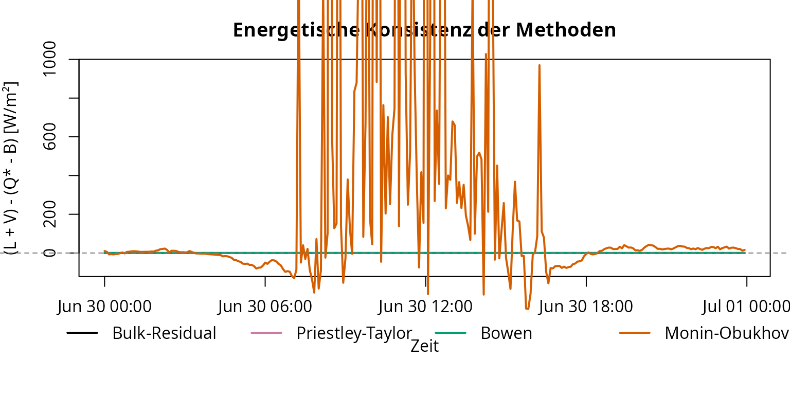

``` r


par(op)
```

**Interpretation.** Die Nulllinie zeigt energetische Konsistenz mit
$`Q^{*} - B`$. Die manuelle Bulk-Residual-Referenz liegt erwartungsgemäß
nahe an dieser Linie, weil $`V`$ als Rest berechnet wurde.
Priestley-Taylor sollte ebenfalls eng an der verfügbaren Energie liegen.
Bowen und Monin-Obukhov können deutlichere Ausschläge zeigen. Diese
Ausschläge sind Hinweise auf Gradienten- oder
Stabilitätsempfindlichkeit, nicht automatisch auf reale
mikrometeorologische Ereignisse.

### Konsequenz für den Methodenvergleich

Die extremen Werte bei Bowen und Monin-Obukhov können an den Daten
liegen, an den Gradienten oder an den Annahmen der Methode. Mit diesem
Datensatz lässt sich das nicht durch einen Plot allein entscheiden.
Deshalb gilt:

- Die manuelle Bulk-Residual-Referenz ist der transparente Kontrollweg.
- Priestley-Taylor ist der stabile erste Paketpfad.
- Penman ist ein zusätzlicher Vergleich für $`V`$, aber liefert hier
  kein eigenes $`L`$.
- Bowen und Monin-Obukhov sind Diagnosemethoden, keine unkommentierte
  Einstiegslösung.
- Große Ausschläge müssen immer gegen Messdaten, Gradienten und
  $`Q^{*} - B`$ geprüft werden.

Komplexere Methoden liefern nicht automatisch robustere Ergebnisse. Sie
machen zusätzliche Annahmen sichtbar. Genau deshalb werden die Methoden
hier nebeneinander dargestellt und nicht als austauschbare Antworten
behandelt.
