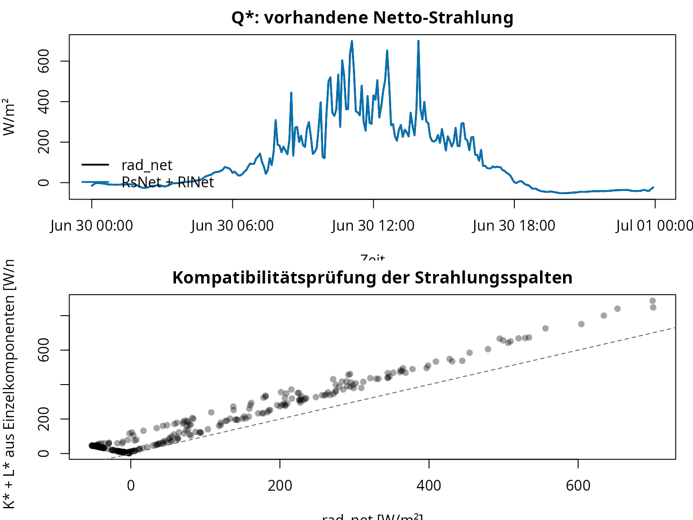
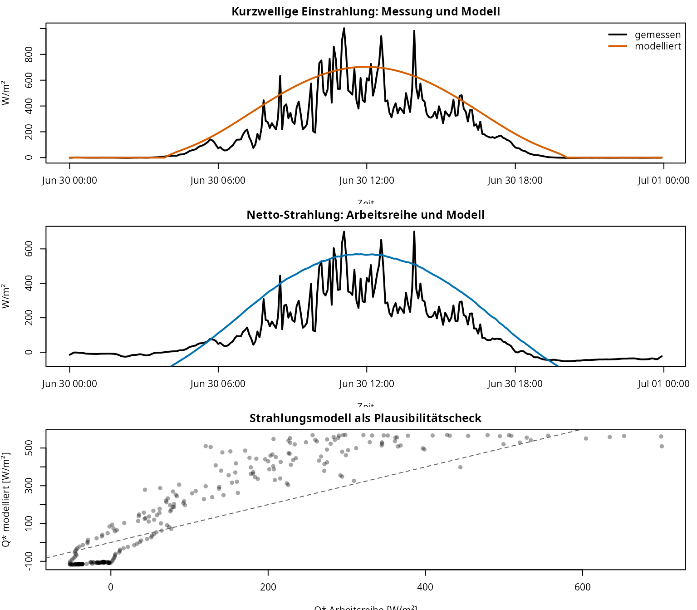
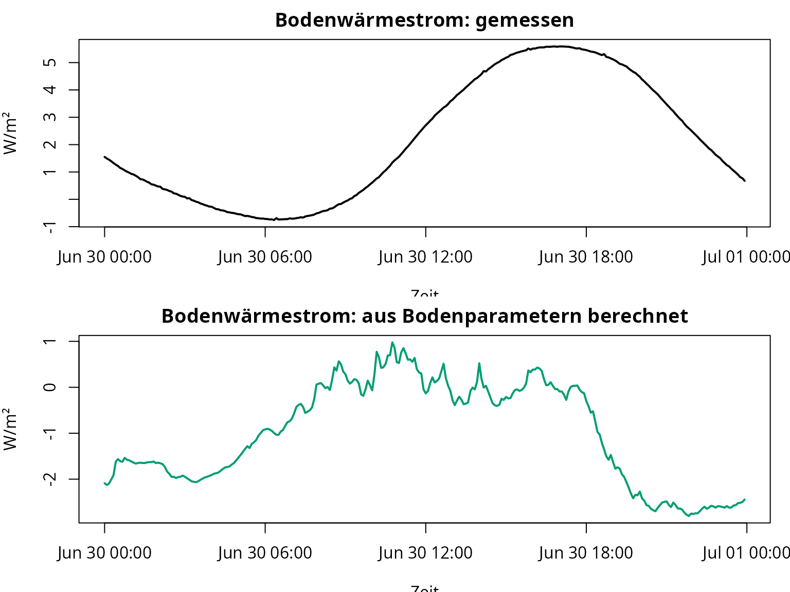
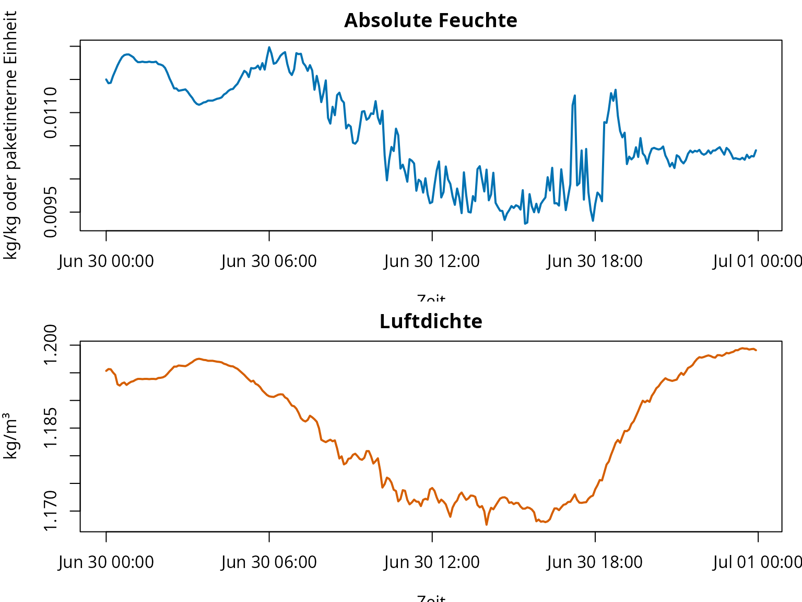
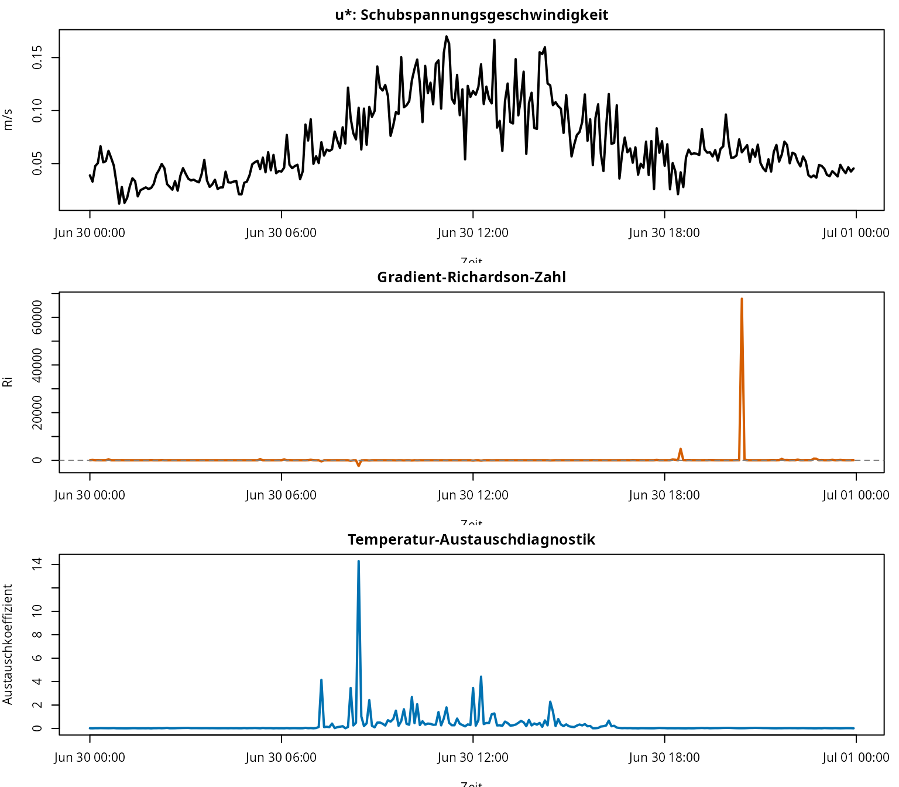
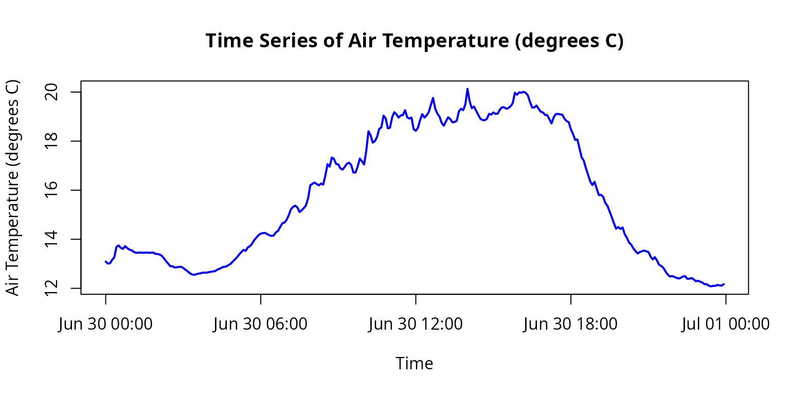

# fieldClim: weitere Use-Case-Workflows

## Ziel dieser Vignette

Diese Vignette ergänzt die Energiebilanz-Vignette. Dort steht der
vollständige Caldern-Workflow mit $`Q^{*}`$, $`B`$, $`L`$ und $`V`$ im
Zentrum. Diese Seite ordnet die weiteren Paketmöglichkeiten als
eigenständige Use Cases.

Im vorhandenen Material liegen die Beispiele nicht in einem separaten
`examples/`-Ordner. Sie stecken vor allem in den bestehenden Vignetten,
Hilfeseiten, Tests und Update-Notizen. Daraus ergeben sich mehrere
Arbeitswege:

| Use Case | Frage | Paketbereich |
|----|----|----|
| 0 | Wie arbeitet das Paket grundsätzlich? | `weather_station`, Default-Methoden, S3-Methoden |
| 1 | Wie werden Strahlungsreihen geprüft und reparaturfähig gemacht? | `rad_*`, Messspalten, Zeitreihenprüfung |
| 2 | Wie kann Strahlung modelliert werden, wenn Messwerte fehlen oder geprüft werden sollen? | `sol_*`, `trans_*`, `terr_*`, `rad_*` |
| 3 | Wie werden Bodenparameter und Bodenwärmestrom geprüft? | `soil_*` |
| 4 | Welche Hilfsgrößen werden für Feuchte, Druck und Temperatur gebraucht? | `hum_*`, `pres_*`, `temp_*` |
| 5 | Wie werden Turbulenz- und Stabilitätsgrößen diagnostisch genutzt? | `turb_*`, `bound_*` |
| 6 | Wie wird ein `weather_station`-Objekt kontrolliert, geplottet und exportiert? | [`build_weather_station()`](https://gisma.github.io/migration-fieldclim/reference/build_weather_station.md), [`plot_weather_station()`](https://gisma.github.io/migration-fieldclim/reference/plot_weather_station.md), [`as.data.frame()`](https://rdrr.io/r/base/as.data.frame.html) |

Diese Vignette ist bewusst eine Paketlandkarte. Sie ersetzt keine
vollständige physikalische Ableitung. Sie zeigt, welche Paketfunktionen
zu welchen Arbeitsproblemen passen.

## Gemeinsamer Daten- und Objektaufbau

Alle Use Cases verwenden denselben kleinen Lehrdatensatz. Der Datensatz
liegt im installierten Paket unter `inst/extdata/`.

``` r

# fieldClim laden.
library(fieldClim)

# Pfad zur mitgelieferten Lehrdatei.
caldern_file <- system.file(
  "extdata",
  "caldern_wiese_2017-06-30.csv",
  package = "fieldClim"
)

# CSV-Datei einlesen.
# "NULL", "NA" und leere Einträge werden als fehlende Werte behandelt.
caldern <- read.csv(
  caldern_file,
  na.strings = c("NULL", "NA", "")
)

# Zeitstempel explizit als lokale Stationszeit interpretieren.
caldern$datetime <- as.POSIXct(
  caldern$datetime,
  format = "%Y-%m-%d %H:%M:%S",
  tz = "Europe/Berlin"
)

# Einige Solar- und Strahlungsfunktionen im Paket greifen intern auf
# POSIXlt-Felder wie hour, min und sec zu. Deshalb wird für diese
# Funktionsfamilie zusätzlich eine POSIXlt-Zeitspalte erzeugt.
# Die normale datetime-Spalte bleibt für Zeitreihenplots erhalten.
caldern$datetime_solar <- as.POSIXlt(
  caldern$datetime,
  tz = "Europe/Berlin"
)

# Grundkontrollen.
nrow(caldern)
#> [1] 288
range(caldern$datetime)
#> [1] "2017-06-30 00:00:00 CEST" "2017-06-30 23:55:00 CEST"
summary(diff(caldern$datetime))
#> Time differences in mins
#>    Min. 1st Qu.  Median    Mean 3rd Qu.    Max. 
#>       5       5       5       5       5       5
names(caldern)
#>  [1] "record"         "datetime"       "Ta_2m"          "Huma_2m"       
#>  [5] "Ta_10m"         "Huma_10m"       "Windspeed_2m"   "Windspeed_10m" 
#>  [9] "rad_sw_in"      "rad_sw_out"     "RsNet"          "RlNet"         
#> [13] "rad_net"        "LUpCo"          "LDnCo"          "water_vol_soil"
#> [17] "Ts"             "heatflux_soil"  "PCP"            "datetime_solar"
```

``` r

# Ein weather_station-Objekt bündelt Messgrößen, Standort und Modellannahmen.
# Dieses Objekt kann an viele Paketfunktionen übergeben werden.
ws <- build_weather_station(
  datetime = caldern$datetime,
  lon = 8.6832,
  lat = 50.8405,
  elev = 261,

  temp = caldern$Ta_2m,
  rh = caldern$Huma_2m,

  t1 = caldern$Ta_2m,
  t2 = caldern$Ta_10m,
  hum1 = caldern$Huma_2m,
  hum2 = caldern$Huma_10m,

  v1 = caldern$Windspeed_2m,
  v2 = caldern$Windspeed_10m,
  z1 = 2,
  z2 = 10,

  slope = 0,
  exposition = 0,
  valley = FALSE,

  surface_type = "field",
  surface_temp = caldern$Ts,

  texture = "peat",
  moisture = caldern$water_vol_soil,

  rad_bal = caldern$rad_net,
  soil_flux = caldern$heatflux_soil,

  soil_temp1 = caldern$Ts,
  soil_temp2 = caldern$Ta_2m,
  soil_depth1 = 0.25,
  soil_depth2 = 0,

  obs_height = 2
)

class(ws)
#> [1] "weather_station"
names(ws)
#>  [1] "datetime"     "lon"          "lat"          "elev"         "temp"        
#>  [6] "rh"           "t1"           "t2"           "hum1"         "hum2"        
#> [11] "v1"           "v2"           "z1"           "z2"           "slope"       
#> [16] "exposition"   "valley"       "surface_type" "surface_temp" "texture"     
#> [21] "moisture"     "rad_bal"      "soil_flux"    "soil_temp1"   "soil_temp2"  
#> [26] "soil_depth1"  "soil_depth2"  "obs_height"
```

**Interpretation.** Das `weather_station`-Objekt ist der zentrale
Arbeitscontainer des Pakets. Viele Funktionen haben zwei Nutzungsformen:
eine Default-Methode mit einzelnen Argumenten und eine Methode für
`weather_station`. Der Objektweg ist sinnvoll, sobald mehrere Funktionen
dieselben Messgrößen, Standortdaten und Oberflächenannahmen brauchen.

## Use Case 0: Default-Methode oder weather_station-Methode?

Fast jede zentrale Funktion kann direkt mit Einzelargumenten oder mit
einem `weather_station`-Objekt genutzt werden.

``` r

# Default-Methode: alle benötigten Argumente werden einzeln angegeben.
pres_p(elev = 261, temp = 20)
#> [1] 982.884

# Objektmethode: die Funktion liest benötigte Größen aus dem weather_station-Objekt.
pres_p(ws)
#>   [1] 982.1623 982.1537 982.1548 982.1697 982.1815 982.2263 982.2327 982.2220
#>   [9] 982.2178 982.2295 982.2210 982.2146 982.2114 982.2050 982.2007 982.2007
#>  [17] 982.2018 982.2007 982.2007 982.2018 982.2007 982.2007 982.2018 982.1964
#>  [25] 982.1954 982.1932 982.1879 982.1772 982.1644 982.1537 982.1419 982.1419
#>  [33] 982.1366 982.1376 982.1387 982.1398 982.1344 982.1269 982.1205 982.1119
#>  [41] 982.1066 982.1044 982.1066 982.1098 982.1109 982.1141 982.1141 982.1141
#>  [49] 982.1162 982.1184 982.1194 982.1216 982.1280 982.1312 982.1366 982.1398
#>  [57] 982.1409 982.1473 982.1526 982.1623 982.1719 982.1815 982.1932 982.2039
#>  [65] 982.2135 982.2092 982.2242 982.2295 982.2401 982.2561 982.2667 982.2773
#>  [73] 982.2837 982.2858 982.2869 982.2816 982.2762 982.2741 982.2752 982.2890
#>  [81] 982.2953 982.3123 982.3282 982.3313 982.3430 982.3630 982.3884 982.3989
#>  [89] 982.4042 982.3968 982.3768 982.3841 982.3936 982.4052 982.4367 982.4913
#>  [97] 982.4976 982.5028 982.4965 982.4913 982.4986 982.4944 982.5331 982.5810
#> [105] 982.5706 982.6091 982.6029 982.5821 982.5800 982.5633 982.5581 982.5696
#> [113] 982.5831 982.5873 982.5779 982.5456 982.5456 982.5706 982.6049 982.5935
#> [121] 982.5800 982.6382 982.7198 982.7033 982.6723 982.6785 982.6961 982.7302
#> [129] 982.7363 982.7857 982.7744 982.7322 982.7353 982.7785 982.8001 982.7908
#> [137] 982.7775 982.7867 982.7878 982.8083 982.7785 982.7734 982.7775 982.7291
#> [145] 982.7219 982.7353 982.7672 982.7919 982.7775 982.7867 982.8001 982.8308
#> [153] 982.8594 982.8154 982.7939 982.7816 982.7549 982.7435 982.7621 982.7785
#> [161] 982.7713 982.7580 982.7590 982.7641 982.8031 982.8144 982.8083 982.8329
#> [169] 982.8972 982.8451 982.8165 982.8236 982.8062 982.7888 982.7723 982.7672
#> [177] 982.7662 982.7723 982.7929 982.7898 982.7990 982.7929 982.7939 982.8103
#> [185] 982.8206 982.8206 982.8144 982.8175 982.8247 982.8380 982.8809 982.8727
#> [193] 982.8829 982.8809 982.8850 982.8809 982.8707 982.8431 982.8195 982.8195
#> [201] 982.8277 982.8144 982.8021 982.7990 982.7888 982.7878 982.7713 982.7528
#> [209] 982.7785 982.7919 982.7929 982.7908 982.7898 982.7734 982.7631 982.7580
#> [217] 982.7281 982.7085 982.6837 982.6858 982.6485 982.6101 982.5956 982.5633
#> [225] 982.5362 982.5070 982.4923 982.5059 982.4766 982.4493 982.4504 982.4420
#> [233] 982.4157 982.4031 982.3789 982.3546 982.3282 982.3049 982.3123 982.3038
#> [241] 982.3102 982.2816 982.2656 982.2454 982.2359 982.2199 982.2082 982.1975
#> [249] 982.2039 982.2071 982.2103 982.2071 982.2039 982.1847 982.1719 982.1815
#> [257] 982.1665 982.1484 982.1430 982.1344 982.1184 982.1055 982.0969 982.0990
#> [265] 982.0958 982.0915 982.0883 982.0915 982.0969 982.0990 982.0872 982.0872
#> [273] 982.0905 982.0851 982.0765 982.0786 982.0743 982.0711 982.0636 982.0636
#> [281] 982.0571 982.0539 982.0560 982.0560 982.0604 982.0582 982.0571 982.0636
```

**Interpretation.** Die Default-Methode ist gut für Einzeltests und
Formelnachvollzug. Die `weather_station`-Methode ist besser für
Workflows, weil sie dieselbe Datenstruktur durch mehrere
Berechnungsschritte trägt.

## Use Case 1: Strahlungsreihen prüfen und reparaturfähig machen

Strahlungsreihen sind oft der wichtigste Eingang für
Energiebilanzrechnungen. Bevor $`Q^{*}`$ als Netto-Strahlung verwendet
wird, müssen die Komponenten geprüft werden.

Die kurzwellige Bilanz lautet:

``` math
K^{*} = K_{\downarrow} - K_{\uparrow}
```

mit:

- $`K^{*}`$: kurzwellige Bilanz \[W/m²\]
- $`K_{\downarrow}`$: einfallende kurzwellige Strahlung \[W/m²\]
- $`K_{\uparrow}`$: reflektierte kurzwellige Strahlung \[W/m²\]

Die langwellige Bilanz wird hier in derselben Richtung geschrieben:

``` math
L^{*} = L_{\downarrow} - L_{\uparrow}
```

mit:

- $`L^{*}`$: langwellige Bilanz \[W/m²\]
- $`L_{\downarrow}`$: langwellige Gegenstrahlung \[W/m²\]
- $`L_{\uparrow}`$: langwellige Ausstrahlung der Oberfläche \[W/m²\]

Die Netto-Strahlung ergibt sich theoretisch als:

``` math
Q^{*} = K^{*} + L^{*}
```

mit:

- $`Q^{*}`$: Netto-Strahlung bzw. Strahlungsbilanz \[W/m²\]

### 1.1 Komponenten berechnen und mit gespeicherten Nettospalten vergleichen

``` r

# Kurzwellige Komponenten aus Messspalten.
caldern$K_down <- caldern$rad_sw_in
caldern$K_up <- caldern$rad_sw_out
caldern$K_star_from_components <- caldern$K_down - caldern$K_up

# Langwellige Komponenten aus Messspalten.
caldern$L_down <- caldern$LDnCo
caldern$L_up <- caldern$LUpCo
caldern$L_star_down_minus_up <- caldern$L_down - caldern$L_up
caldern$L_star_up_minus_down <- caldern$L_up - caldern$L_down

# Kontrolle gegen vorhandene Nettospalten.
shortwave_check <- summary(caldern$K_star_from_components - caldern$RsNet)
longwave_check_down_up <- summary(caldern$L_star_down_minus_up - caldern$RlNet)
longwave_check_up_down <- summary(caldern$L_star_up_minus_down - caldern$RlNet)

shortwave_check
#>      Min.   1st Qu.    Median      Mean   3rd Qu.      Max. 
#> -0.400000  0.000000  0.000000  0.004208  0.001000  0.500000
longwave_check_down_up
#>    Min. 1st Qu.  Median    Mean 3rd Qu.    Max. 
#>   3.595  32.337  78.015  74.076 100.468 187.400
longwave_check_up_down
#>      Min.   1st Qu.    Median      Mean   3rd Qu.      Max. 
#> -0.090000 -0.030000  0.000000 -0.001698  0.030000  0.100000
```

**Interpretation.** Dieser Schritt prüft, welche Spaltendefinition
konsistent ist. Wenn `rad_sw_in - rad_sw_out` gut zu `RsNet` passt, ist
die kurzwellige Bilanz klar. Bei der langwelligen Bilanz muss die
Vorzeichenrichtung geprüft werden. Je nachdem, ob `LDnCo - LUpCo` oder
`LUpCo - LDnCo` besser zu `RlNet` passt, liegt eine andere Konvention
vor.

### 1.2 Netto-Strahlung aus Nettospalten und Einzelkomponenten prüfen

``` r

# Variante A: Netto-Strahlung aus gespeicherten Netto-Spalten.
caldern$Q_star_from_net_columns <- caldern$RsNet + caldern$RlNet

# Variante B: Netto-Strahlung aus Einzelkomponenten.
caldern$Q_star_from_components <- caldern$K_star_from_components +
  caldern$L_star_down_minus_up

# Vorhandene Netto-Strahlung.
caldern$Q_star_measured <- caldern$rad_net

# Differenzen prüfen.
summary(caldern$Q_star_from_net_columns - caldern$Q_star_measured)
#>      Min.   1st Qu.    Median      Mean   3rd Qu.      Max. 
#> -0.100000 -0.010000  0.000000 -0.002542  0.005000  0.100000
summary(caldern$Q_star_from_components - caldern$Q_star_measured)
#>    Min. 1st Qu.  Median    Mean 3rd Qu.    Max. 
#>   3.595  32.331  78.013  74.078 100.515 187.700
```

``` r

op <- par(mfrow = c(2, 1), mar = c(3.5, 4, 2, 1))

plot(
  caldern$datetime,
  caldern$Q_star_measured,
  type = "l",
  col = "#000000",
  lwd = 2,
  xlab = "Zeit",
  ylab = "W/m²",
  main = "Q*: vorhandene Netto-Strahlung"
)

lines(caldern$datetime, caldern$Q_star_from_net_columns, col = "#0072B2", lwd = 2)

legend(
  "bottomleft",
  legend = c("rad_net", "RsNet + RlNet"),
  col = c("#000000", "#0072B2"),
  lty = 1,
  lwd = 2,
  bty = "n"
)

plot(
  caldern$Q_star_measured,
  caldern$Q_star_from_components,
  pch = 16,
  col = rgb(0, 0, 0, 0.35),
  xlab = "rad_net [W/m²]",
  ylab = "K* + L* aus Einzelkomponenten [W/m²]",
  main = "Kompatibilitätsprüfung der Strahlungsspalten"
)

abline(0, 1, lty = 2, col = "grey40")
```



``` r


par(op)
```

**Interpretation.** Dieser Use Case ist ein Datenvalidierungsworkflow.
Die Paketfunktionen können nur dann sinnvoll arbeiten, wenn klar ist,
welche Strahlungsgröße als Arbeitsgröße verwendet wird. Wenn `rad_net`,
`RsNet + RlNet` und `K* + L*` auseinanderlaufen, wird nicht automatisch
eine neue Netto-Strahlung gebaut. Dann wird zuerst dokumentiert, welche
Spalte welche Bilanzebene repräsentiert.

### 1.3 Strahlungsreihe für weitere Rechnungen festlegen

``` r

# Arbeitsentscheidung:
# Für Energiebilanz-Workflows wird die vorhandene Spalte rad_net verwendet.
# Die anderen Varianten bleiben Diagnosegrößen.
caldern$Q_star <- caldern$Q_star_measured

# Kennzahlen der Differenzen dokumentieren.
radiation_decision <- data.frame(
  Vergleich = c(
    "RsNet + RlNet gegen rad_net",
    "K* + L* gegen rad_net"
  ),
  Mittlere_Abweichung = c(
    mean(caldern$Q_star_from_net_columns - caldern$Q_star_measured, na.rm = TRUE),
    mean(caldern$Q_star_from_components - caldern$Q_star_measured, na.rm = TRUE)
  ),
  Max_abs_Abweichung = c(
    max(abs(caldern$Q_star_from_net_columns - caldern$Q_star_measured), na.rm = TRUE),
    max(abs(caldern$Q_star_from_components - caldern$Q_star_measured), na.rm = TRUE)
  )
)

radiation_decision[, -1] <- round(radiation_decision[, -1], 1)
radiation_decision
#>                     Vergleich Mittlere_Abweichung Max_abs_Abweichung
#> 1 RsNet + RlNet gegen rad_net                 0.0                0.1
#> 2       K* + L* gegen rad_net                74.1              187.7
```

**Interpretation.** Das ist der eigentliche „Fix“: nicht Werte still
überschreiben, sondern eine Arbeitsreihe festlegen und die Alternativen
als Diagnosegrößen behalten. Wenn später Wärmeflüsse berechnet werden,
ist transparent, welche Version von $`Q^{*}`$ verwendet wurde.

### 1.4 Zeitversatz prüfen

Ein Zeitversatz von einem 5-Minuten-Schritt kann bei Strahlung große
Abweichungen erzeugen.

``` r

# Mittlere absolute Abweichung ohne Versatz.
diff_0 <- mean(abs(
  caldern$Q_star_from_components - caldern$Q_star_measured
), na.rm = TRUE)

# Komponentensumme einen Schritt später gegen rad_net vergleichen.
diff_plus <- mean(abs(
  caldern$Q_star_from_components[-1] -
    caldern$Q_star_measured[-length(caldern$Q_star_measured)]
), na.rm = TRUE)

# Komponentensumme einen Schritt früher gegen rad_net vergleichen.
diff_minus <- mean(abs(
  caldern$Q_star_from_components[-length(caldern$Q_star_from_components)] -
    caldern$Q_star_measured[-1]
), na.rm = TRUE)

lag_check <- data.frame(
  Vergleich = c(
    "ohne Versatz",
    "Komponenten +1 Schritt",
    "Komponenten -1 Schritt"
  ),
  mittlere_absolute_Abweichung = c(diff_0, diff_plus, diff_minus)
)

lag_check$mittlere_absolute_Abweichung <- round(
  lag_check$mittlere_absolute_Abweichung,
  1
)

lag_check
#>                Vergleich mittlere_absolute_Abweichung
#> 1           ohne Versatz                         74.1
#> 2 Komponenten +1 Schritt                         83.4
#> 3 Komponenten -1 Schritt                         85.8
```

**Interpretation.** Wird ein versetzter Vergleich deutlich besser, liegt
wahrscheinlich ein Zeitstempel- oder Aggregationsproblem vor. Wird er
nicht besser, spricht das eher für unterschiedliche Spaltendefinitionen,
Korrekturstufen oder Vorzeichenkonventionen.

## Use Case 2: Strahlung modellieren statt nur messen

Die Strahlungsfunktionen können Messwerte plausibilisieren oder fehlende
Strahlungskomponenten modellieren. Der Paketworkflow folgt dabei einer
Kette:

| Teilproblem | Funktionsfamilie | Rolle |
|----|----|----|
| Sonnenstand | `sol_*` | Tageswinkel, Sonnenhöhe, Azimut |
| Atmosphärische Dämpfung | `trans_*` | Luftmasse, Gas-, Ozon-, Rayleigh-, Wasserdampf- und Aerosoltransmission |
| Gelände | `terr_*` | Gelände- und Sichtgeometrie |
| Strahlung | `rad_*` | kurzwellige, diffuse, langwellige und Netto-Strahlung |

``` r

# Beispielzeitpunkt für einen Einzeltest.
# Wichtig: Die Solarzeitfunktionen des Pakets erwarten hier eine POSIXlt-Zeit,
# weil sie intern auf Komponenten wie hour, min und sec zugreifen.
example_time <- as.POSIXlt("2017-06-30 12:00:00", tz = "Europe/Berlin")

# Standort und Annahmen.
lon <- 8.6832
lat <- 50.8405
elev <- 261
temp <- 20
rh <- 60
slope <- 0
exposition <- 0
valley <- FALSE
surface_type <- "field"
surface_temp <- 20

# Solare und topographische Teilgrößen.
sol_elevation(example_time, lon, lat)
#> [1] 62.36272
sol_azimuth(example_time, lon, lat)
#> [1] 181.1272
terr_sky_view(slope, valley)
#> [1] 1

# Modellierte kurzwellige und langwellige Strahlung.
rad_sw_in(example_time, lon, lat, elev, temp, slope, exposition)
#> [1] 704.2516
rad_sw_bal(example_time, lon, lat, elev, temp, slope, exposition, valley, surface_type)
#> [1] 673.2495
rad_lw_bal(temp, rh, slope, valley, surface_type, surface_temp)
#> [1] -105.0535

# Modellierte Netto-Strahlung.
rad_bal(
  example_time, lon, lat, elev, temp, rh,
  slope, exposition, valley, surface_type, surface_temp
)
#> [1] 568.196
```

**Interpretation.** Dieser Workflow ist relevant, wenn Strahlung nicht
vollständig gemessen wird oder wenn Gelände- und Atmosphäreneffekte
variiert werden sollen. Für eine Messstation ist er außerdem eine
Plausibilitätskontrolle: modellierte Werte müssen nicht exakt mit
Messwerten übereinstimmen, sollten aber Größenordnung und Tagesgang
plausibel abbilden. Technisch wichtig ist hier die Zeitklasse: Die
Solarzeitfunktionen greifen im aktuellen Paketcode auf lokale
POSIXlt-Zeitfelder zu. Deshalb verwendet dieser Abschnitt
`datetime_solar` und nicht die für Plots genutzte POSIXct-Spalte
`datetime`.

### 2.1 Gemessene und modellierte Strahlung als Tagesgang vergleichen

``` r

# Modellierte kurzwellige Einstrahlung für den ganzen Lehrtag.
# Für die Solar-/Strahlungsfunktionen wird datetime_solar verwendet.
# Diese Spalte ist POSIXlt, weil der aktuelle Paketcode lokale Zeitfelder
# wie hour, min und sec direkt ausliest.
# Die Funktion wird vektorisiert auf die Zeitachse angewendet.
caldern$K_down_model <- rad_sw_in(
  caldern$datetime_solar,
  lon, lat, elev, caldern$Ta_2m,
  slope, exposition
)

# Modellierte kurzwellige Bilanz.
caldern$K_star_model <- rad_sw_bal(
  caldern$datetime_solar,
  lon, lat, elev, caldern$Ta_2m,
  slope, exposition, valley, surface_type
)

# Modellierte langwellige Bilanz.
caldern$L_star_model <- rad_lw_bal(
  caldern$Ta_2m,
  caldern$Huma_2m,
  slope,
  valley,
  surface_type,
  caldern$Ts
)

# Modellierte Netto-Strahlung.
caldern$Q_star_model <- rad_bal(
  caldern$datetime_solar,
  lon, lat, elev, caldern$Ta_2m, caldern$Huma_2m,
  slope, exposition, valley, surface_type, caldern$Ts
)
```

``` r

op <- par(mfrow = c(3, 1), mar = c(3.5, 4, 2, 1))

plot(
  caldern$datetime,
  caldern$K_down,
  type = "l",
  col = "#000000",
  lwd = 2,
  xlab = "Zeit",
  ylab = "W/m²",
  main = "Kurzwellige Einstrahlung: Messung und Modell"
)
lines(caldern$datetime, caldern$K_down_model, col = "#D55E00", lwd = 2)
legend(
  "topright",
  legend = c("gemessen", "modelliert"),
  col = c("#000000", "#D55E00"),
  lty = 1,
  lwd = 2,
  bty = "n"
)

plot(
  caldern$datetime,
  caldern$Q_star,
  type = "l",
  col = "#000000",
  lwd = 2,
  xlab = "Zeit",
  ylab = "W/m²",
  main = "Netto-Strahlung: Arbeitsreihe und Modell"
)
lines(caldern$datetime, caldern$Q_star_model, col = "#0072B2", lwd = 2)

plot(
  caldern$Q_star,
  caldern$Q_star_model,
  pch = 16,
  col = rgb(0, 0, 0, 0.35),
  xlab = "Q* Arbeitsreihe [W/m²]",
  ylab = "Q* modelliert [W/m²]",
  main = "Strahlungsmodell als Plausibilitätscheck"
)
abline(0, 1, lty = 2, col = "grey40")
```



``` r


par(op)
```

**Interpretation.** Modellierte Strahlung ersetzt die Messung nicht
automatisch. Sie hilft zu erkennen, ob Messreihen zeitlich plausibel
sind und ob Gelände-, Oberflächen- oder Transmissionsannahmen
realistische Größenordnungen liefern.

## Use Case 3: Bodenparameter und Bodenwärmestrom

Der Bodenwärmestrom kann gemessen oder aus Temperaturgradient, Tiefe,
Feuchte und Bodenart geschätzt werden. Der Paketworkflow lautet:

``` math
B = -\lambda_s \frac{T_1 - T_2}{z_1 - z_2}
```

mit:

- $`B`$: Bodenwärmestrom \[W/m²\]
- $`\lambda_s`$: Wärmeleitfähigkeit des Bodens \[W/(m K)\]
- $`T_1`$: Bodentemperatur in Tiefe $`z_1`$ \[°C oder K\]
- $`T_2`$: Temperatur an zweiter Tiefe bzw. Oberfläche $`z_2`$ \[°C oder
  K\]
- $`z_1`$: Tiefe des ersten Sensors \[m\]
- $`z_2`$: Tiefe der zweiten Referenz \[m\]

``` r

# Wärmeleitfähigkeit für die gewählte Bodenart und Feuchte.
soil_thermal_cond(texture = "peat", moisture = mean(caldern$water_vol_soil, na.rm = TRUE))
#> [1] 0.1634507

# Bodenwärmestrom aus dem weather_station-Objekt.
caldern$B_model <- soil_heat_flux(ws)

# Gemessene Arbeitsgröße.
caldern$B_measured <- caldern$heatflux_soil

summary(caldern$B_model - caldern$B_measured)
#>    Min. 1st Qu.  Median    Mean 3rd Qu.    Max. 
#> -7.0809 -5.4063 -2.9097 -3.1374 -0.9378  0.7452
```

``` r

op <- par(mfrow = c(2, 1), mar = c(3.5, 4, 2, 1))

plot(
  caldern$datetime,
  caldern$B_measured,
  type = "l",
  col = "#000000",
  lwd = 2,
  xlab = "Zeit",
  ylab = "W/m²",
  main = "Bodenwärmestrom: gemessen"
)

plot(
  caldern$datetime,
  caldern$B_model,
  type = "l",
  col = "#009E73",
  lwd = 2,
  xlab = "Zeit",
  ylab = "W/m²",
  main = "Bodenwärmestrom: aus Bodenparametern berechnet"
)
```



``` r


par(op)
```

**Interpretation.** Dieser Workflow ist relevant, wenn `B` nicht direkt
gemessen wird oder wenn Bodenfeuchte und Bodentextur als Szenarien
variiert werden sollen. Abweichungen zwischen Messwert und Modellwert
sind erwartbar, weil Wärmeflussplatten, Temperaturgradienten und
vereinfachte Wärmeleitfähigkeit nicht dieselbe Informationsbasis haben.

## Use Case 4: Feuchte, Druck und Temperatur als Hilfsgrößen

Feuchte-, Druck- und Temperaturfunktionen sind meist keine Endprodukte.
Sie liefern Zwischengrößen für Strahlung, Stabilität und
Wärmeflussmethoden.

``` r

# Absolute Feuchte aus relativer Feuchte und Temperatur.
caldern$hum_abs <- hum_absolute(caldern$Huma_2m, caldern$Ta_2m)

# Verdampfungswärme als temperaturabhängige Hilfsgröße.
caldern$evap_heat <- hum_evap_heat(caldern$Ta_2m)

# Feuchtegradient zwischen zwei Messhöhen.
caldern$hum_gradient <- hum_moisture_gradient(
  caldern$Huma_2m,
  caldern$Huma_10m,
  caldern$Ta_2m,
  caldern$Ta_10m,
  2,
  10,
  261
)

# Luftdichte aus Höhe und Temperatur.
caldern$air_density <- pres_air_density(261, caldern$Ta_2m)

# Potentielle Temperatur.
caldern$theta <- temp_pot_temp(caldern$Ta_2m, 261)

summary(caldern[, c("hum_abs", "evap_heat", "hum_gradient", "air_density", "theta")])
#>     hum_abs           evap_heat        hum_gradient         air_density   
#>  Min.   :0.009325   Min.   :2453052   Min.   :-1.384e-04   Min.   :1.168  
#>  1st Qu.:0.010098   1st Qu.:2456082   1st Qu.:-5.213e-05   1st Qu.:1.172  
#>  Median :0.010462   Median :2464544   Median :-3.834e-05   Median :1.187  
#>  Mean   :0.010676   Mean   :2463389   Mean   :-3.671e-05   Mean   :1.185  
#>  3rd Qu.:0.011350   3rd Qu.:2469324   3rd Qu.:-2.394e-05   3rd Qu.:1.195  
#>  Max.   :0.011986   Max.   :2472146   Max.   : 1.735e-05   Max.   :1.199  
#>      theta      
#>  Min.   :13.56  
#>  1st Qu.:14.75  
#>  Median :16.75  
#>  Mean   :17.24  
#>  3rd Qu.:20.31  
#>  Max.   :21.58
```

``` r

op <- par(mfrow = c(2, 1), mar = c(3.5, 4, 2, 1))

plot(
  caldern$datetime,
  caldern$hum_abs,
  type = "l",
  col = "#0072B2",
  lwd = 2,
  xlab = "Zeit",
  ylab = "kg/kg oder paketinterne Einheit",
  main = "Absolute Feuchte"
)

plot(
  caldern$datetime,
  caldern$air_density,
  type = "l",
  col = "#D55E00",
  lwd = 2,
  xlab = "Zeit",
  ylab = "kg/m³",
  main = "Luftdichte"
)
```



``` r


par(op)
```

**Interpretation.** Diese Hilfsgrößen sind wichtig, weil kleine
Unterschiede in Luftfeuchte, Dichte oder potentieller Temperatur später
große Auswirkungen auf Bowen-, Penman- oder Monin-Obukhov-Berechnungen
haben können.

## Use Case 5: Turbulenz- und Stabilitätsdiagnostik

Vor komplexeren Wärmeflussmethoden sollten Windprofil, Rauigkeit und
Stabilität geprüft werden. Das Paket stellt dafür mehrere
`turb_*`-Funktionen bereit.

``` r

# Rauigkeitslänge aus dem Oberflächentyp.
z0 <- turb_roughness_length("field")
z0
#> [1] 0.02

# Schubspannungsgeschwindigkeit aus Wind und Messhöhe.
caldern$u_star <- turb_ustar(caldern$Windspeed_2m, 2, surface_type = "field")

# Gradient-Richardson-Zahl.
caldern$richardson <- turb_flux_grad_rich_no(
  caldern$Ta_2m,
  caldern$Ta_10m,
  2,
  10,
  caldern$Windspeed_2m,
  caldern$Windspeed_10m,
  261
)

# Austausch- und Stabilitätsgrößen aus dem Paket.
caldern$exchange_temp <- turb_flux_ex_quotient_temp(
  caldern$Ta_2m,
  caldern$Ta_10m,
  2,
  10,
  caldern$Windspeed_2m,
  caldern$Windspeed_10m,
  261,
  "field"
)

summary(caldern[, c("u_star", "richardson", "exchange_temp")])
#>      u_star          richardson        exchange_temp      
#>  Min.   :0.01216   Min.   :-2389.420   Min.   : 0.007292  
#>  1st Qu.:0.04271   1st Qu.:   -0.398   1st Qu.: 0.020282  
#>  Median :0.05959   Median :    1.346   Median : 0.029678  
#>  Mean   :0.06898   Mean   :  265.130   Mean   : 0.301201  
#>  3rd Qu.:0.09205   3rd Qu.:    7.225   3rd Qu.: 0.259571  
#>  Max.   :0.16998   Max.   :67806.240   Max.   :14.292973
```

``` r

op <- par(mfrow = c(3, 1), mar = c(3.5, 4, 2, 1))

plot(
  caldern$datetime,
  caldern$u_star,
  type = "l",
  col = "#000000",
  lwd = 2,
  xlab = "Zeit",
  ylab = "m/s",
  main = "u*: Schubspannungsgeschwindigkeit"
)

plot(
  caldern$datetime,
  caldern$richardson,
  type = "l",
  col = "#D55E00",
  lwd = 2,
  xlab = "Zeit",
  ylab = "Ri",
  main = "Gradient-Richardson-Zahl"
)
abline(h = 0, lty = 2, col = "grey50")

plot(
  caldern$datetime,
  caldern$exchange_temp,
  type = "l",
  col = "#0072B2",
  lwd = 2,
  xlab = "Zeit",
  ylab = "Austauschkoeffizient",
  main = "Temperatur-Austauschdiagnostik"
)
```



``` r


par(op)
```

**Interpretation.** Dieser Workflow erklärt, warum Bowen und
Monin-Obukhov nicht blind als robuste Standardantworten gelesen werden
dürfen. Kleine Gradienten, schwache Windunterschiede und wechselnde
Stabilität können einzelne Zeitschritte stark beeinflussen.

### 5.1 Caps für instabile Methoden dokumentieren

Einige Methoden besitzen `cap`-Argumente. Diese Caps sind keine
physikalische Lösung, sondern numerische Schutzmechanismen gegen Nenner
nahe null oder extrem große Stabilitätsparameter.

``` r

# Bowen mit und ohne cap.
V_bowen_no_cap <- latent_bowen(ws)
V_bowen_cap <- latent_bowen(ws, cap = 1)

# Monin-Obukhov mit und ohne cap.
L_monin_no_cap <- sensible_monin(ws)
L_monin_cap <- sensible_monin(ws, cap = 20)

summary(V_bowen_no_cap)
#>    Min. 1st Qu.  Median    Mean 3rd Qu.    Max. 
#> -323.45   17.76   95.07  129.82  187.35 2646.18
summary(V_bowen_cap)
#>    Min. 1st Qu.  Median    Mean 3rd Qu.    Max. 
#> -50.662   8.904  55.312  98.534 171.439 479.809
summary(L_monin_no_cap)
#>     Min.  1st Qu.   Median     Mean  3rd Qu.     Max. 
#>  -46.657   -8.328   -2.361  400.837  299.437 8554.126
summary(L_monin_cap)
#>     Min.  1st Qu.   Median     Mean  3rd Qu.     Max. 
#>  -46.657   -8.328   -2.361  236.923  276.368 3390.888
```

**Interpretation.** Caps verändern nicht die Messdaten. Sie begrenzen
numerisch kritische Fälle. In einer Vignette sollten Caps deshalb immer
als Diagnose- und Schutzparameter beschrieben werden, nicht als
automatische Fehlerkorrektur.

### 5.2 Grenzschichtfunktionen als Anschlussworkflow

Die Update-Dokumentation nennt
[`bound_thermal_avg()`](https://gisma.github.io/migration-fieldclim/reference/bound_thermal_avg.md)
im Zusammenhang mit
[`turb_ustar()`](https://gisma.github.io/migration-fieldclim/reference/turb_ustar.md).
Diese Funktionsgruppe ist ein eigener Anschlussworkflow für mechanische
oder thermische Grenzschichtgrößen. Sie wird hier nicht vollständig
ausgebaut, kann aber über die Hilfeseiten erschlossen werden.

``` r

# Formale Schnittstellen prüfen, ohne einen künstlichen Beispielwert zu erzwingen.
if ("bound_thermal_avg" %in% getNamespaceExports("fieldClim")) {
  formals(bound_thermal_avg)
}
#> $v
#> 
#> 
#> $z
#> 
#> 
#> $temp_change_dist
#> 
#> 
#> $t_pot_upwind
#> 
#> 
#> $t_pot
#> 
#> 
#> $lapse_rate
#> 
#> 
#> $surface_type
#> NULL
#> 
#> $obs_height
#> NULL
```

**Interpretation.** Dieser Block ist bewusst nur eine
Schnittstellenprüfung. Für einen belastbaren Grenzschicht-Workflow
braucht man eine eigene fachliche Fragestellung und passende
Eingangsdaten.

## Use Case 6: Objekt ausgeben, plotten und exportieren

Nach Berechnungen enthält das `weather_station`-Objekt zusätzliche
Felder. Diese können als Tabelle ausgegeben, geplottet oder für weitere
Analysen exportiert werden.

``` r

# PT-Pfad als Beispielrechnung.
ws_pt <- turb_flux_calc(ws, pt_only = TRUE)

# Ergebnisobjekt in eine Tabelle überführen.
ws_table <- as.data.frame(ws_pt)

# Verfügbare Felder nach der Berechnung.
names(ws_table)
#>  [1] "datetime"                  "lon"                      
#>  [3] "lat"                       "elev"                     
#>  [5] "temp"                      "rh"                       
#>  [7] "t1"                        "t2"                       
#>  [9] "hum1"                      "hum2"                     
#> [11] "v1"                        "v2"                       
#> [13] "z1"                        "z2"                       
#> [15] "slope"                     "exposition"               
#> [17] "valley"                    "surface_type"             
#> [19] "surface_temp"              "texture"                  
#> [21] "moisture"                  "rad_bal"                  
#> [23] "soil_flux"                 "soil_temp1"               
#> [25] "soil_temp2"                "soil_depth1"              
#> [27] "soil_depth2"               "obs_height"               
#> [29] "sensible_priestley_taylor" "latent_priestley_taylor"

# Ausschnitt der Tabelle.
head(ws_table)
#>              datetime    lon     lat elev  temp    rh    t1    t2  hum1 hum2
#> 1 2017-06-30 00:00:00 8.6832 50.8405  261 13.09 100.0 13.09 13.60 100.0 97.6
#> 2 2017-06-30 00:05:00 8.6832 50.8405  261 13.01 100.0 13.01 13.51 100.0 97.7
#> 3 2017-06-30 00:10:00 8.6832 50.8405  261 13.02 100.0 13.02 13.66 100.0 96.5
#> 4 2017-06-30 00:15:00 8.6832 50.8405  261 13.16 100.0 13.16 13.76 100.0 96.1
#> 5 2017-06-30 00:20:00 8.6832 50.8405  261 13.27 100.0 13.27 13.80 100.0 96.4
#> 6 2017-06-30 00:25:00 8.6832 50.8405  261 13.69  98.1 13.69 14.25  98.1 92.4
#>      v1    v2 z1 z2 slope exposition valley surface_type surface_temp texture
#> 1 0.448 0.529  2 10     0          0  FALSE        field        16.31    peat
#> 2 0.380 0.409  2 10     0          0  FALSE        field        16.29    peat
#> 3 0.548 0.670  2 10     0          0  FALSE        field        16.25    peat
#> 4 0.581 0.658  2 10     0          0  FALSE        field        16.25    peat
#> 5 0.764 0.887  2 10     0          0  FALSE        field        16.22    peat
#> 6 0.589 0.744  2 10     0          0  FALSE        field        16.19    peat
#>   moisture rad_bal soil_flux soil_temp1 soil_temp2 soil_depth1 soil_depth2
#> 1    0.344 -15.200  1.551533      16.31      13.09        0.25           0
#> 2    0.344  -8.920  1.492695      16.29      13.01        0.25           0
#> 3    0.344  -1.965  1.448708      16.25      13.02        0.25           0
#> 4    0.344  -1.790  1.390439      16.25      13.16        0.25           0
#> 5    0.344  -2.469  1.325316      16.22      13.27        0.25           0
#> 6    0.344  -3.857  1.268762      16.19      13.69        0.25           0
#>   obs_height sensible_priestley_taylor latent_priestley_taylor
#> 1          2                 -5.301183              -11.450350
#> 2          2                 -3.308925               -7.103770
#> 3          2                 -1.084238               -2.329470
#> 4          2                 -1.002820               -2.177619
#> 5          2                 -1.189538               -2.604778
#> 6          2                 -1.571959               -3.553803
```

``` r

# Einzelvariable aus dem weather_station-Objekt plotten,
# wenn die Funktion in der Paketversion verfügbar ist.
if ("plot_weather_station" %in% getNamespaceExports("fieldClim")) {
  plot_weather_station(ws_pt, variable_name = "temp")
}
```



``` r

# Vollständiger Zeitreihenüberblick.
# Aus Platzgründen ist dieser Chunk nicht automatisch ausgeführt.
plot_weather_station(ws_pt)
```

**Interpretation.**
[`plot_weather_station()`](https://gisma.github.io/migration-fieldclim/reference/plot_weather_station.md)
ist ein schneller Kontrollweg für Objektinhalte. Für wissenschaftliche
Grafiken bleiben eigene Plots sinnvoll, aber für Debugging, Unterricht
und erste Datenprüfung ist die Funktion praktisch.

## Ergebnis

Diese Vignette ergänzt den Energiebilanz-Workflow um weitere
Paket-Use-Cases. Die zentrale Logik lautet:

1.  `weather_station` ist das Paket-Arbeitsobjekt.
2.  Strahlungsreihen müssen geprüft werden, bevor $`Q^{*}`$ verwendet
    wird.
3.  Strahlung kann gemessen, modelliert oder als Plausibilitätskontrolle
    berechnet werden.
4.  Bodenwärmestrom kann gemessen oder aus Bodenparametern geschätzt
    werden.
5.  Feuchte-, Druck- und Temperaturfunktionen liefern wichtige
    Zwischengrößen.
6.  Turbulenz- und Stabilitätsfunktionen sind Diagnosewerkzeuge.
7.  Caps und Fallbacks sind Schutzmechanismen, keine automatische
    fachliche Validierung.
8.  [`plot_weather_station()`](https://gisma.github.io/migration-fieldclim/reference/plot_weather_station.md)
    und [`as.data.frame()`](https://rdrr.io/r/base/as.data.frame.html)
    machen das Objekt für Kontrolle und Weiterverarbeitung zugänglich.
