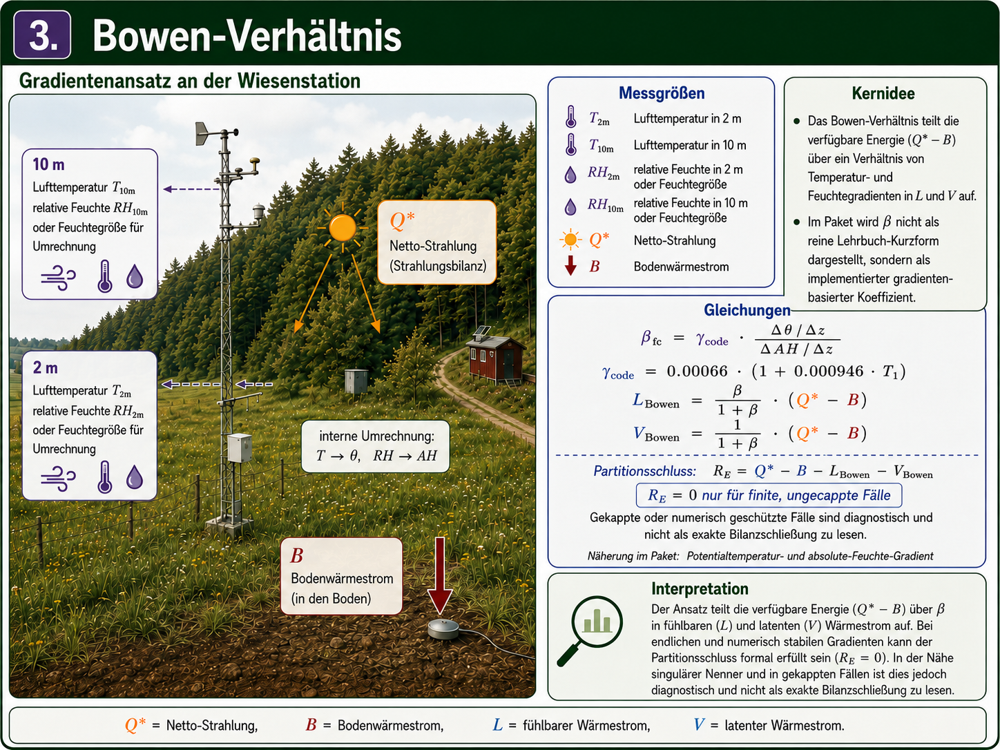
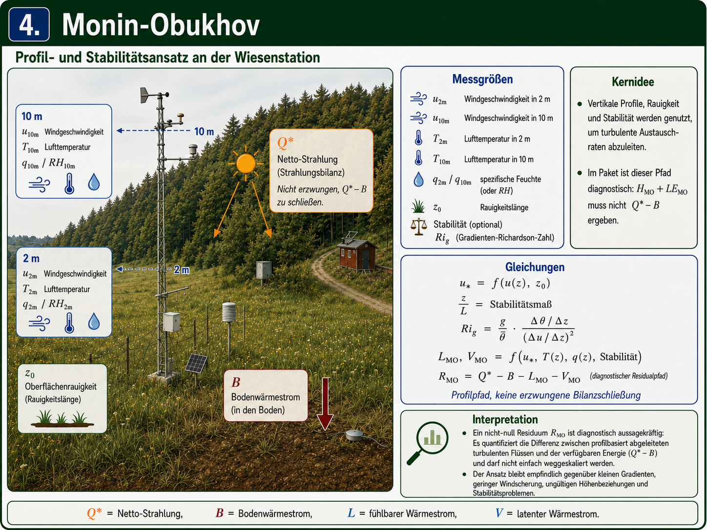
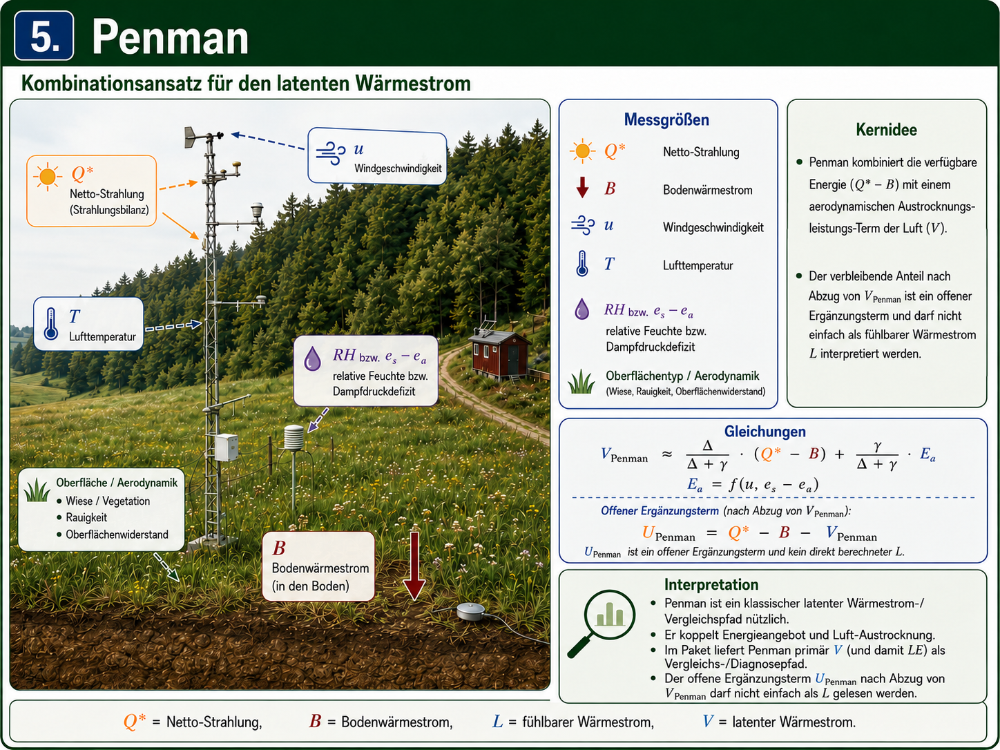
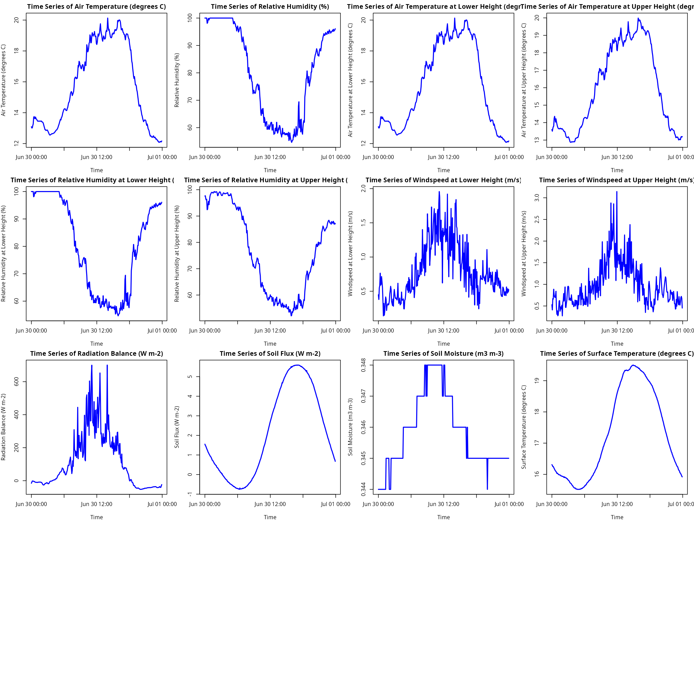
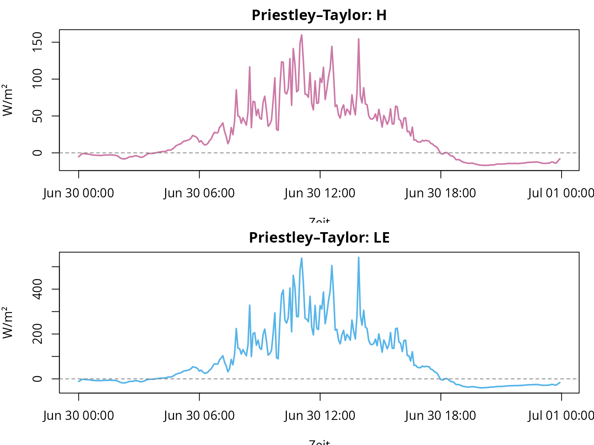
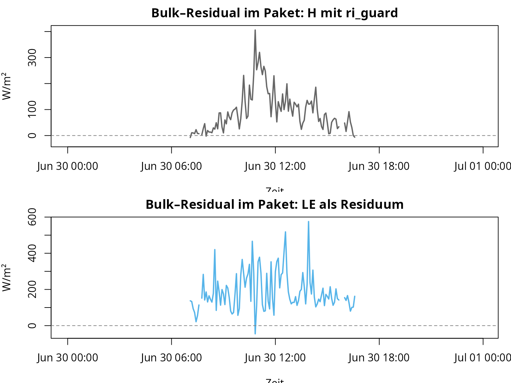
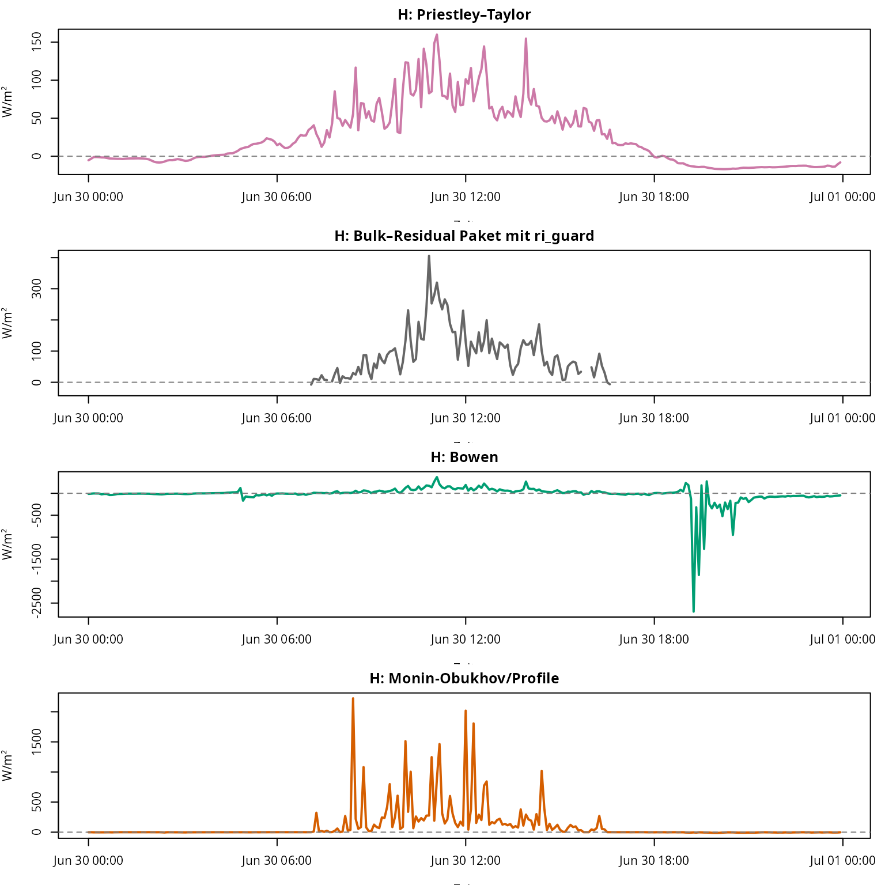
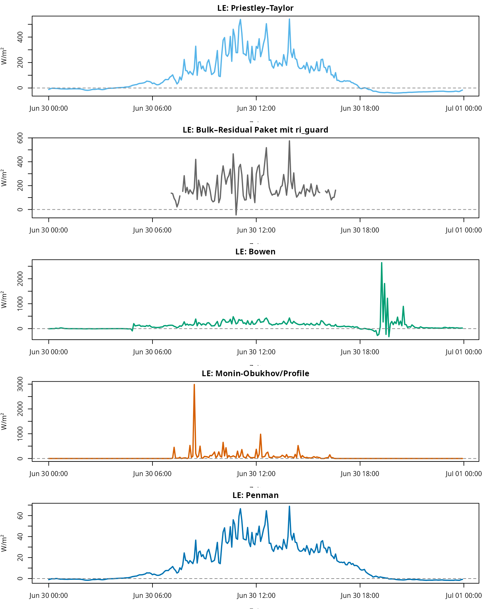
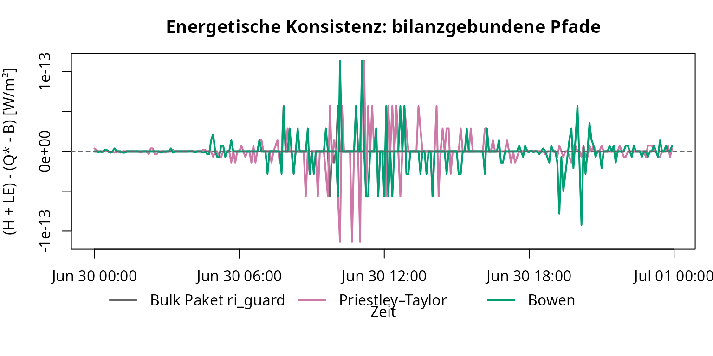
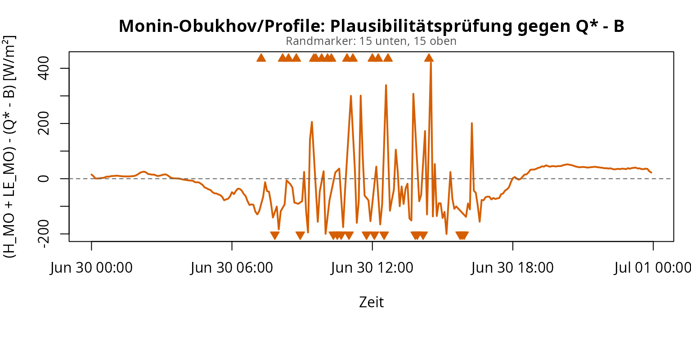

# fieldClim: fieldClim-Workflow für Wärmeflussmethoden

## Ziel dieser Vignette

Diese Vignette ist der zweite Teil des Workflows. Sie setzt auf dem
regulären Caldern-Beispieldatensatz auf und beginnt dort, wo die
manuelle Datenprüfung endet: Die geprüften Spalten werden in ein
`weather_station`-Objekt überführt und anschließend mit den
`fieldClim`-Paketfunktionen ausgewertet.

Der Schwerpunkt liegt nicht mehr auf der manuellen Kontrolle einzelner
Messspalten, sondern auf der Paketlogik:

| Schritt | Leitfrage | Paketbereich |
|----|----|----|
| 1 | Welche Wärmeflussmethoden werden unterschieden? | Methodenkonzept, Bilanzbindung, Diagnostik |
| 2 | Wie wird der Datensatz an `fieldClim` übergeben? | [`build_weather_station()`](https://gisma.github.io/migration-fieldclim/reference/build_weather_station.md) |
| 3 | Welche Eingaben erkennt die Inspektion? | [`inspect_weather_station_inputs()`](https://gisma.github.io/migration-fieldclim/reference/inspect_weather_station_inputs.md) |
| 4 | Wie werden PT, Bulk-Residual, Bowen, Monin-Obukhov/Profile und Penman verglichen? | [`turb_flux_calc()`](https://gisma.github.io/migration-fieldclim/reference/turb_flux_calc.md), [`turb_flux_bulk_residual()`](https://gisma.github.io/migration-fieldclim/reference/turb_flux_bulk_residual.md) und Einzelmethoden |

Die für diese Vignette benötigte Datenbasis wird im Hintergrund aus
derselben Paketdatei geladen. Die manuelle Prüfung von Zeitstruktur,
Strahlung, Bodenwärmestrom und verfügbarer Energie gehört zur ersten
Vignette.

## Notation

Die zweite Vignette verwendet dieselbe Notation wie die manuelle
Datenprüfung. `Q_star` ist die Netto-Strahlung, `B` ist der
Bodenwärmestrom, `L` ist der fühlbare Wärmestrom und `V` ist der latente
Wärmestrom.

Für die Paketfunktionen wird diese Notation auf `fieldClim`-Namen
abgebildet:

| Theoriegröße | Bedeutung | `fieldClim`-Feld oder Ausgabe |
|----|----|----|
| `Q_star` / `Q*` | Netto-Strahlung | `rad_bal` |
| `B` | Bodenwärmestrom | `soil_flux` |
| `L` | fühlbarer Wärmestrom | `sensible_*` |
| `V` | latenter Wärmestrom | `latent_*` |
| `Q_star - B` | verfügbare turbulente Energie | `rad_bal - soil_flux` |

## Schritt 1: Methodenüberblick und Rollen der Verfahren

### Methodenüberblick

Die folgende Übersichtsgrafik zeigt die gemeinsame Messsituation: eine
Wiesenstation mit Strahlungsbilanz, Bodenwärmestrom, Temperatur-,
Feuchte- und Windmessungen in mehreren Höhen. Alle folgenden Verfahren
greifen auf dieselbe Stationslogik zurück, verwenden daraus aber
unterschiedliche Teilinformationen.


Die Verfahren sind nicht als gleichartige Messverfahren zu lesen. Sie
sind unterschiedliche Rechenpfade mit unterschiedlicher Nähe zur
Energiebilanz, zu Gradienten und zu Profilannahmen. Für die eigentliche
Auswertung wird der Paketpfad
[`turb_flux_bulk_residual()`](https://gisma.github.io/migration-fieldclim/reference/turb_flux_bulk_residual.md)
verwendet.

| Methode | Hauptfrage | Direkte Eingänge | Ergebnis | Rolle im Workflow |
|----|----|----|----|----|
| Priestley-Taylor | Wie wird die verfügbare Energie stabil partitioniert? | `Q_star`, `B`, Parameter | `L_pt`, `V_pt` | erster, energiegebundener Paketpfad |
| Bulk-Residual | Wie schätzt das Paket `L` aus Temperaturgradient und Wind und berechnet `V` als Residuum? | `weather_station`, [`sensible_bulk()`](https://gisma.github.io/migration-fieldclim/reference/sensible_bulk.md), [`latent_bulk_residual()`](https://gisma.github.io/migration-fieldclim/reference/latent_bulk_residual.md) | `L_bulk_pkg`, `V_bulk_pkg` | residualer Paketpfad, optional mit Richardson-Guard |
| Bowen-Verhältnis | Wie teilt ein Temperatur-/Feuchtegradient die verfügbare Energie auf? | Temperaturgradient, Feuchtegradient, `Q_star`, `B` | `L_bowen`, `V_bowen` | gradientenempfindliche Partitionierung |
| Monin-Obukhov/Profile | Wie reagieren Profilmethoden auf Gradienten und Stabilität? | Windprofil, Temperaturprofil, Feuchteprofil, Stabilitätsdiagnostik | `L_monin`, `V_monin` | profilbasiert, nicht bilanznormiert/energie-schließend |
| Penman | Wie groß ist der latente Wärmestrom aus Energie- und Verdunstungsantrieb? | `Q_star`, `B`, Wind, Temperatur, Feuchte, Oberfläche | `V_penman` | LE-only Vergleichspfad |

#### 1. Priestley-Taylor


Priestley-Taylor ist in dieser Vignette der stabile erste Paketpfad. Der
Ansatz bleibt direkt an die verfügbare Energie gebunden und benötigt
keine empfindliche Aufteilung über kleine Feuchtegradienten.

\\ L + V = Q^{\*} - B \\

\\ V\_{PT} \approx \alpha\_{PT} \frac{\Delta}{\Delta + \gamma} (Q^{\*} -
B) \\

\\ L\_{PT} = (Q^{\*} - B) - V\_{PT} \\

Der Vorteil dieses Pfads ist die Bilanzbindung: Wenn `Q_star` und `B`
korrekt gesetzt sind, bleibt die Summe aus `L_PT` und `V_PT` auf der
verfügbaren Energie.

#### 2. Bulk-Residual mit optionalem Richardson-Guard


Der Paketpfad
[`turb_flux_bulk_residual()`](https://gisma.github.io/migration-fieldclim/reference/turb_flux_bulk_residual.md)
nutzt eine einfache Bulk-Transfer-Schätzung für den fühlbaren Wärmestrom
und berechnet den latenten Wärmestrom anschließend als Residuum. Die
Grundlogik ist:

\\ L\_{bulk} = \rho c_p \frac{\Delta T}{r_a} \\

\\ r_a = \frac{\ln(z_2 / z_1)}{k \bar{u}} \\

\\ V\_{residual} = Q^{\*} - B - L\_{bulk} \\

Zusätzlich kann
[`sensible_bulk()`](https://gisma.github.io/migration-fieldclim/reference/sensible_bulk.md)
mit `stability_method = "ri_guard"` eine Gradient-Richardson-Zahl
berechnen:

\\ Ri_g = \frac{g}{\bar{\theta}} \frac{\Delta \theta / \Delta z}
{(\Delta u / \Delta z)^2} \\

Der Guard ist nicht der Default. Er wird nur aktiviert, wenn
`stability_method = "ri_guard"` gesetzt wird. Instabile, neutrale und
moderat stabile Fälle behalten den neutralen Bulk-Wert. Sehr stabile,
ungültige oder schwach geschwerte Fälle werden auf `NA` gesetzt. Wenn
`L_bulk` dadurch `NA` wird, wird auch das Residuum `V_bulk` `NA`. Das
verhindert, dass eine algebraische Residualschließung einen nicht
belastbaren fühlbaren Wärmestrom verdeckt.

Die aktuell eingebundene Bulk-Grafik zeigt noch die Grundlogik der
früheren manuellen Referenz. Sie wird im nächsten Abbildungsschritt auf
den Paketpfad mit optionalem Richardson-Guard umgestellt.

#### 3. Bowen-Verhältnis



Der Bowen-Ansatz nutzt ein Verhältnis aus Temperatur- und
Feuchtegradient. Er verteilt die verfügbare Energie auf fühlbaren und
latenten Wärmestrom.

\\ \beta \approx \frac{\Delta T}{\Delta e} \\

Didaktisch entscheidend ist hier das Gradientenverhältnis. Die
Paketimplementierung ist spezifischer: Sie verwendet eine
Potentialtemperaturdifferenz und eine absolute Feuchtedifferenz mit
einem empirischen `fieldClim`-Koeffizienten. Deshalb wird Bowen in
dieser Vignette als Paketpfad interpretiert, nicht als allgemeine
textbook-Formel.

\\ L\_{Bowen} = \frac{\beta}{1 + \beta} (Q^{\*} - B) \\

\\ V\_{Bowen} = \frac{1}{1 + \beta} (Q^{\*} - B) \\

Der Ansatz ist für finite, nicht gekappte Fälle bilanzgebunden, aber
stark gradientenempfindlich. Wenn Feuchtegradienten sehr klein werden,
Vorzeichen wechseln, `beta` nicht endlich ist oder `1 + beta` nahe null
liegt, können einzelne Zeitschritte stark ausschlagen. Gekappte oder
nicht-endliche Fälle werden deshalb als nicht belastbare
Bowen-Zeitschritte behandelt und nicht als exakte Aufteilung von
\\Q^\* - B\\ interpretiert.

#### 4. Monin-Obukhov/Profile



Der Monin-Obukhov/Profile-Pfad ist in `fieldClim` kein Verfahren, das
die verfügbare Energie automatisch auf \\L\\ und \\V\\ verteilt. Er
berechnet Wärmeflüsse aus den gemessenen Unterschieden zwischen zwei
Höhen: Temperatur, Feuchte, Wind und Messhöhe gehen direkt in die
Profilrechnung ein. Deshalb reagiert der Ansatz besonders empfindlich,
wenn diese Unterschiede sehr klein, verrauscht oder widersprüchlich
sind.

Die aktuelle Paketfassung fängt solche problematischen Fälle
kontrolliert ab. Wenn zwischen den beiden Höhen kein Temperaturgradient
vorliegt, wird der fühlbare Wärmestrom für diesen Zeitschritt auf 0
gesetzt. Wenn kein Feuchtegradient vorliegt, wird der latente Wärmestrom
auf 0 gesetzt. Wenn Messhöhen ungültig sind, Windwerte fehlen oder
rechnerisch nicht auswertbare Profilzustände entstehen, gibt die
Funktion für diese Zeitschritte `NA` zurück und erzeugt eine Warnung.

Wichtig ist: Diese Absicherung macht den Monin-Obukhov/Profile-Pfad
nicht zu einem bilanzschließenden Verfahren. Große, aber rechnerisch
endliche Werte werden nicht automatisch auf \\Q^\* - B\\ begrenzt.
Deshalb müssen die Ergebnisse anschließend gegen die verfügbare Energie
geprüft werden. Wenn \\L + V\\ deutlich größer oder kleiner als \\Q^\* -
B\\ ist, spricht das nicht sofort für ein reales Wärmeflussereignis,
sondern für eine kritische Profil- oder Stabilitätssituation im
Datensatz.

Für die Interpretation gilt deshalb: Monin-Obukhov/Profile-Werte werden
nicht auf die verfügbare Energie \\Q^\* - B\\ normiert. Es wird also
nicht erwartet, dass

\\ L\_{MO} + V\_{MO} = Q^\* - B \\

gilt. Die Gleichung dient hier nur als Plausibilitätsprüfung. Wenn
\\L\_{MO} + V\_{MO}\\ deutlich von \\Q^\* - B\\ abweicht, spricht das
für empfindliche oder problematische Profilbedingungen: kleine
Temperatur- oder Feuchtegradienten, schwache Windunterschiede,
ungünstige Stabilitätsannahmen oder 5-Minuten-Rauschen.

Große Abweichungen sind deshalb nicht automatisch ein Rechenfehler. Sie
zeigen, dass der Profilpfad unter den vorliegenden Daten- und
Stabilitätsbedingungen nicht wie ein energiegebundener
Partitionierungsansatz gelesen werden darf.

#### 5. Penman



Penman ist ein Kombinationsansatz für den latenten Wärmestrom. Er
verbindet einen Energieterm mit einem aerodynamischen Verdunstungsterm.
Im aktuellen Paketpfad liefert Penman `V`, aber keinen eigenen fühlbaren
Wärmestrom `L`.

\\ V\_{Penman} \approx \frac{\Delta}{\Delta + \gamma}(Q^{\*} - B) +
\frac{\gamma}{\Delta + \gamma} E_a \\

\\ E_a = f(u, e_s - e_a) \\

Penman ist deshalb ein Vergleichs- und Prüfpfad für `V`, aber keine
vollständige `L`/`V`-Partitionierung wie Priestley-Taylor oder Bowen.

## Schritt 2: Übergabe an das `weather_station`-Objekt

Das `weather_station`-Objekt ist die zentrale Paketstruktur. Es
speichert nicht nur Messspalten, sondern auch Standort und
Modellparameter. Dadurch können verschiedene Funktionen auf dieselbe
strukturierte Datenbasis zugreifen.

``` r

ws <- build_weather_station(
  # Zeitachse.
  datetime = caldern$datetime,

  # Standort der Station.
  lon = 8.6832,
  lat = 50.8405,
  elev = 261,

  # Standardtemperatur und Standardfeuchte.
  temp = caldern$Ta_2m,
  rh = caldern$Huma_2m,

  # Profilgrößen für gradienten- und stabilitätsbezogene Methoden.
  t1 = caldern$Ta_2m,
  t2 = caldern$Ta_10m,
  hum1 = caldern$Huma_2m,
  hum2 = caldern$Huma_10m,

  # Windprofil und Messhöhen.
  v1 = caldern$Windspeed_2m,
  v2 = caldern$Windspeed_10m,
  z1 = 2,
  z2 = 10,

  # Paketnamen für Theoriegrößen:
  # rad_bal entspricht Q*, soil_flux entspricht B.
  rad_bal = caldern$Q_star,
  soil_flux = caldern$B,

  # Weitere Oberflächen- und Bodeninformationen.
  moisture = caldern$water_vol_soil,
  surface_temp = caldern$Ts,

  # Oberflächentyp als Modellannahme.
  surface_type = "field",

  # Beobachtungshöhe für Verfahren, die eine Referenzhöhe brauchen.
  obs_height = 2
)

# Klasse und enthaltene Felder prüfen.
class(ws)
#> [1] "weather_station"
names(ws)
#>  [1] "datetime"     "lon"          "lat"          "elev"         "temp"        
#>  [6] "rh"           "t1"           "t2"           "hum1"         "hum2"        
#> [11] "v1"           "v2"           "z1"           "z2"           "rad_bal"     
#> [16] "soil_flux"    "moisture"     "surface_temp" "surface_type" "obs_height"

# Als Tabelle ausgeben.
head(as.data.frame(ws))
#>              datetime    lon     lat elev  temp    rh    t1    t2  hum1 hum2
#> 1 2017-06-30 00:00:00 8.6832 50.8405  261 13.09 100.0 13.09 13.60 100.0 97.6
#> 2 2017-06-30 00:05:00 8.6832 50.8405  261 13.01 100.0 13.01 13.51 100.0 97.7
#> 3 2017-06-30 00:10:00 8.6832 50.8405  261 13.02 100.0 13.02 13.66 100.0 96.5
#> 4 2017-06-30 00:15:00 8.6832 50.8405  261 13.16 100.0 13.16 13.76 100.0 96.1
#> 5 2017-06-30 00:20:00 8.6832 50.8405  261 13.27 100.0 13.27 13.80 100.0 96.4
#> 6 2017-06-30 00:25:00 8.6832 50.8405  261 13.69  98.1 13.69 14.25  98.1 92.4
#>      v1    v2 z1 z2 rad_bal soil_flux moisture surface_temp surface_type
#> 1 0.448 0.529  2 10 -15.200  1.551533    0.344        16.31        field
#> 2 0.380 0.409  2 10  -8.920  1.492695    0.344        16.29        field
#> 3 0.548 0.670  2 10  -1.965  1.448708    0.344        16.25        field
#> 4 0.581 0.658  2 10  -1.790  1.390439    0.344        16.25        field
#> 5 0.764 0.887  2 10  -2.469  1.325316    0.344        16.22        field
#> 6 0.589 0.744  2 10  -3.857  1.268762    0.344        16.19        field
#>   obs_height
#> 1          2
#> 2          2
#> 3          2
#> 4          2
#> 5          2
#> 6          2

# Alle plotten
fieldClim::plot_weather_station(ws)
```



**Interpretation.** Das `weather_station`-Objekt ist mehr als eine schön
benannte Tabelle. Es legt fest, welche Spalte welche physikalische Rolle
übernimmt: `rad_bal` ist die Arbeitsgröße für `Q_star`, `soil_flux` ist
`B`, `t1/t2`, `hum1/hum2` und `v1/v2` bilden die Vertikalprofile, und
`surface_type = "field"` setzt die Oberflächenannahme für Methoden, die
sie benötigen. Genau hier wird aus einem heterogenen CSV-Datensatz ein
konsistenter Paketdatensatz. Fehler an dieser Stelle sind besonders
folgenreich, weil sie anschließend von allen Methoden übernommen werden.

## Schritt 3: Eingangsinspektion der `weather_station`-Daten

Nachdem der reguläre Caldern-Datensatz als `weather_station`-Objekt
organisiert wurde, kann die Eingangsstruktur vor den eigentlichen
Wärmeflussberechnungen geprüft werden. Diese Prüfung verändert keine
Werte, erzeugt keine Ersatzspalten und füllt keine Lücken. Sie zeigt
nur, welche Eingaben für die wichtigsten `fieldClim`-Methoden vorhanden,
teilweise fehlend oder vollständig fehlend sind.

``` r

# Read-only inspection of the already built weather_station object.
inspection_regular <- inspect_weather_station_inputs(ws)

# Components of the inspection object.
names(inspection_regular)
#> [1] "fields"           "gaps"             "method_readiness" "qc_flags"        
#> [5] "guidance"         "summary"

# Compact summary.
inspection_regular$summary
#> $n_fields
#> [1] 42
#> 
#> $n_missing_fields
#> [1] 22
#> 
#> $n_partial_fields
#> [1] 0
#> 
#> $n_gaps
#> [1] 0
#> 
#> $n_qc_flags
#> [1] 0
#> 
#> $ready_methods
#> [1] "priestley_taylor"       "bulk_residual"          "bulk_residual_ri_guard"
#> [4] "bowen"                  "monin_profile"          "penman"                
#> 
#> $blocked_methods
#> character(0)
#> 
#> $unsafe_missing_fields
#> character(0)

# Fields that are missing or partially missing.
subset(
  inspection_regular$fields,
  source_status != "present"
)
#>                    field present all_missing any_missing n_missing n_total
#> 6                rad_net   FALSE        TRUE        TRUE         0       0
#> 7              rad_sw_in   FALSE        TRUE        TRUE         0       0
#> 8             rad_sw_out   FALSE        TRUE        TRUE         0       0
#> 9              rad_lw_in   FALSE        TRUE        TRUE         0       0
#> 10            rad_lw_out   FALSE        TRUE        TRUE         0       0
#> 11                albedo   FALSE        TRUE        TRUE         0       0
#> 14                 slope   FALSE        TRUE        TRUE         0       0
#> 15            exposition   FALSE        TRUE        TRUE         0       0
#> 16                valley   FALSE        TRUE        TRUE         0       0
#> 18            soil_temp1   FALSE        TRUE        TRUE         0       0
#> 19            soil_temp2   FALSE        TRUE        TRUE         0       0
#> 20           soil_depth1   FALSE        TRUE        TRUE         0       0
#> 21           soil_depth2   FALSE        TRUE        TRUE         0       0
#> 22          thermal_cond   FALSE        TRUE        TRUE         0       0
#> 23               texture   FALSE        TRUE        TRUE         0       0
#> 28       vapour_pressure   FALSE        TRUE        TRUE         0       0
#> 29        vapor_pressure   FALSE        TRUE        TRUE         0       0
#> 30     absolute_humidity   FALSE        TRUE        TRUE         0       0
#> 31     specific_humidity   FALSE        TRUE        TRUE         0       0
#> 32              pressure   FALSE        TRUE        TRUE         0       0
#> 36 potential_temperature   FALSE        TRUE        TRUE         0       0
#> 39              wind_dir   FALSE        TRUE        TRUE         0       0
#>    missing_fraction source_status     group         variable_type
#> 6                NA       missing radiation             radiation
#> 7                NA       missing radiation             radiation
#> 8                NA       missing radiation             radiation
#> 9                NA       missing radiation             radiation
#> 10               NA       missing radiation             radiation
#> 11               NA       missing radiation             radiation
#> 14               NA       missing radiation              metadata
#> 15               NA       missing radiation              metadata
#> 16               NA       missing radiation              metadata
#> 18               NA       missing      soil      soil temperature
#> 19               NA       missing      soil      soil temperature
#> 20               NA       missing      soil              metadata
#> 21               NA       missing      soil              metadata
#> 22               NA       missing      soil soil thermal property
#> 23               NA       missing      soil          soil texture
#> 28               NA       missing  humidity              humidity
#> 29               NA       missing  humidity              humidity
#> 30               NA       missing  humidity              humidity
#> 31               NA       missing  humidity              humidity
#> 32               NA       missing  pressure              pressure
#> 36               NA       missing  profiles           temperature
#> 39               NA       missing  profiles        wind direction

# Readiness of the main heat-flux method families.
inspection_regular$method_readiness[, c(
  "method",
  "missing_fields",
  "partial_fields",
  "ready",
  "notes"
)]
#>                   method missing_fields partial_fields ready
#> 1       priestley_taylor                                TRUE
#> 2          bulk_residual                                TRUE
#> 3 bulk_residual_ri_guard                                TRUE
#> 4                  bowen                                TRUE
#> 5          monin_profile                                TRUE
#> 6                 penman                                TRUE
#>                                                                                                       notes
#> 1 Requires available measured input fields for temperature, net radiation, soil heat flux and surface type.
#> 2                                          Neutral bulk path can use v1 only; v2 is optional for mean wind.
#> 3                         Optional Richardson guard requires v2 and remains unavailable when v2 is missing.
#> 4                                                     Requires two-level temperature and humidity profiles.
#> 5                                           Requires profile inputs plus either surface_type or obs_height.
#> 6                  Uses hum1 when present, otherwise rh; both are interpreted as relative humidity percent.
```

**Interpretation.** Diese Vorprüfung beantwortet noch nicht, ob die
physikalischen Methoden für jeden Zeitschritt sinnvoll sind. Sie prüft
zuerst die Eingangsstruktur: Sind die benötigten Felder für
Priestley-Taylor, Bulk-Residual, Bowen, Monin-Obukhov/Profile und Penman
vorhanden? Gibt es fehlende oder teilweise fehlende Eingaben? Werden
einfache QC-Probleme wie unmögliche Feuchtewerte oder negative
Windgeschwindigkeiten gefunden?

Das ist ein vorgelagerter Schritt. Die späteren Abschnitte prüfen dann
fachlich, wie Strahlungsbilanz, verfügbare Energie und die einzelnen
Wärmeflussmethoden berechnet und interpretiert werden.

## Schritt 4: Paketmethoden für Wärmeflüsse

### Priestley-Taylor als erster Paketpfad

Priestley-Taylor nutzt die verfügbare Energie `Q* - B` und eine
empirische Verdunstungsparametrisierung. Der Vorteil im Einstieg ist
nicht, dass die Methode „wahrer“ wäre, sondern dass sie keine instabilen
Gradientenquotienten benötigt.

``` r

# Nur den Priestley-Taylor-Pfad berechnen.
# Dieser Pfad ist als erster Paketvergleich stabiler als der volle Methodenworkflow.
flux_pt <- turb_flux_calc(ws, pt_only = TRUE)

# Ergebnisse zurück in den Auswertungsdatensatz schreiben.
caldern$L_pt <- flux_pt$sensible_priestley_taylor
caldern$V_pt <- flux_pt$latent_priestley_taylor
caldern$L_plus_V_pt <- caldern$L_pt + caldern$V_pt
```

``` r

op <- par(mfrow = c(2, 1), mar = c(3.5, 4, 2, 1))

plot(caldern$datetime, caldern$L_pt, type = "l", col = "#CC79A7", lwd = 2,
     xlab = "Zeit", ylab = "W/m²", main = "Priestley-Taylor: L")
abline(h = 0, lty = 2, col = "grey50")

plot(caldern$datetime, caldern$V_pt, type = "l", col = "#56B4E9", lwd = 2,
     xlab = "Zeit", ylab = "W/m²", main = "Priestley-Taylor: V")
abline(h = 0, lty = 2, col = "grey50")
```



``` r


par(op)
```

``` r

cols_pt <- c("#D55E00", "#000000")
op <- par(mar = c(6, 4, 3, 1), xpd = NA)

plot(caldern$datetime, caldern$Q_minus_B, type = "l", col = cols_pt[1], lwd = 2,
     ylim = range(caldern$Q_minus_B, caldern$L_plus_V_pt, na.rm = TRUE),
     xlab = "Zeit", ylab = "W/m²", main = "Priestley-Taylor: Energieabschluss")
lines(caldern$datetime, caldern$L_plus_V_pt, col = cols_pt[2], lwd = 2)
legend("bottom", inset = c(0, -0.35), horiz = TRUE, bty = "n",
       legend = c("Q* - B", "L + V nach PT"), col = cols_pt, lty = 1, lwd = 2)
```


``` r


par(op)
```

**Interpretation.** Priestley-Taylor ist hier der sauberste Einstieg in
den Methodenvergleich. Die Methode nimmt die verfügbare Energie und
teilt sie mit einem kompakten Verdunstungsparameter auf `L` und `V` auf.
Im Ergebnis liegt der Tagesmittelwert für `L` bei 25.1 W/m² und für `V`
bei 83.6 W/m². Zusammen ergibt das im Mittel genau die verfügbare
Energie.

Das macht PT nicht automatisch „richtiger“ als die anderen Methoden. Der
Vorteil liegt in der Lesbarkeit: Wenn `Q_star` und `B` stimmen, ist der
Energieabschluss sofort nachvollziehbar. Die Methode vermeidet kleine
Feuchtegradienten, Windschere und Stabilitätsklassifikation. Deshalb
eignet sie sich in dieser Vignette als erster Vergleichspfad: Sie zeigt,
wie die Energiebilanz aussieht, bevor empfindlichere Profil- oder
Gradientenmethoden hinzukommen.

### Bulk-Residual im Paket mit Richardson-Guard

Der Bulk-Residual-Pfad wird jetzt als Paketmethode behandelt, nicht mehr
als separater manueller Workflow-Schritt. Für den Vergleich wird der
optionale Richardson-Guard aktiviert, weil der Caldern-Datensatz zwei
Temperatur- und Windhöhen enthält.

``` r

flux_bulk_guarded <- turb_flux_bulk_residual(
  ws,
  stability_method = "ri_guard"
)

caldern$L_bulk_pkg <- flux_bulk_guarded$sensible_bulk
caldern$V_bulk_pkg <- flux_bulk_guarded$latent_bulk_residual
caldern$bulk_Ri_g <- attr(flux_bulk_guarded$sensible_bulk, "bulk_Ri_g")
caldern$bulk_stability <- attr(flux_bulk_guarded$sensible_bulk, "bulk_stability")

table(caldern$bulk_stability, useNA = "ifany")
#> 
#>     neutral      stable    unstable very_stable 
#>           1           5         107         175
```

``` r

op <- par(mfrow = c(2, 1), mar = c(3.5, 4, 2, 1))

plot(caldern$datetime, caldern$L_bulk_pkg, type = "l", col = "#666666", lwd = 2,
     xlab = "Zeit", ylab = "W/m²", main = "Bulk-Residual im Paket: L mit ri_guard")
abline(h = 0, lty = 2, col = "grey50")

plot(caldern$datetime, caldern$V_bulk_pkg, type = "l", col = "#56B4E9", lwd = 2,
     xlab = "Zeit", ylab = "W/m²", main = "Bulk-Residual im Paket: V als Residuum")
abline(h = 0, lty = 2, col = "grey50")
```



``` r


par(op)
```

**Interpretation.** Der Bulk-Residual-Pfad arbeitet anders als PT.
Zuerst wird `L` aus Temperaturunterschied und Wind abgeschätzt; erst
danach wird `V` als Rest der Energiebilanz berechnet. Mit aktiviertem
Richardson-Guard bleiben in diesem Datensatz nur 113 von 288
Zeitschritten als gültige Bulk-Residual-Werte übrig. Die
Stabilitätszählung zeigt warum: 175 Zeitschritte werden als sehr stabil
klassifiziert und deshalb nicht als robuste neutrale Bulk-Flüsse
weitergeführt.

Das ist kein Fehler, sondern genau die Funktion des Guards. Der Guard
macht aus Bulk-Residual kein vollständiges Monin-Obukhov-Verfahren und
korrigiert die gültigen Flüsse nicht. Er verhindert nur, dass ein
neutraler Bulk-Ansatz dort scheinbar plausible Zahlen liefert, wo das
Zwei-Höhen-Profil selbst sagt: Diese Situation ist sehr stabil, schwach
geschert oder numerisch nicht belastbar. Für die gültigen Zeitschritte
bleibt die Residualrechnung transparent: `V` ist der Energierest nach
`Q_star`, `B` und `L_bulk`.

### Voller Methodenworkflow

``` r

# Alle im Sammelworkflow verfügbaren Methoden berechnen.
# Bulk-Residual wurde oben separat berechnet, weil hier der Richardson-Guard
# explizit verwendet wird.
flux_all <- turb_flux_calc(ws)

caldern$L_bowen <- flux_all$sensible_bowen
caldern$V_bowen <- flux_all$latent_bowen
caldern$L_monin <- flux_all$sensible_monin
caldern$V_monin <- flux_all$latent_monin
caldern$V_penman <- flux_all$latent_penman
```

``` r

L_summary <- data.frame(
  Methode = c(
    "Priestley-Taylor",
    "Bulk-Residual Paket (ri_guard)",
    "Bowen",
    "Monin-Obukhov/Profile"
  ),
  L_Mittel_W_m2 = c(
    mean(caldern$L_pt, na.rm = TRUE),
    mean(caldern$L_bulk_pkg, na.rm = TRUE),
    mean(caldern$L_bowen, na.rm = TRUE),
    mean(caldern$L_monin, na.rm = TRUE)
  )
)

V_summary <- data.frame(
  Methode = c(
    "Priestley-Taylor",
    "Bulk-Residual Paket (ri_guard)",
    "Bowen",
    "Monin-Obukhov/Profile",
    "Penman"
  ),
  V_Mittel_W_m2 = c(
    mean(caldern$V_pt, na.rm = TRUE),
    mean(caldern$V_bulk_pkg, na.rm = TRUE),
    mean(caldern$V_bowen, na.rm = TRUE),
    mean(caldern$V_monin, na.rm = TRUE),
    mean(caldern$V_penman, na.rm = TRUE)
  )
)

L_summary[, -1] <- round(L_summary[, -1], 1)
V_summary[, -1] <- round(V_summary[, -1], 1)

L_summary
#>                          Methode L_Mittel_W_m2
#> 1               Priestley-Taylor          25.1
#> 2 Bulk-Residual Paket (ri_guard)          90.9
#> 3                          Bowen         -21.1
#> 4          Monin-Obukhov/Profile         104.2
V_summary
#>                          Methode V_Mittel_W_m2
#> 1               Priestley-Taylor          83.6
#> 2 Bulk-Residual Paket (ri_guard)         188.7
#> 3                          Bowen         129.8
#> 4          Monin-Obukhov/Profile          52.7
#> 5                         Penman          13.2
```

**Interpretation.** Die Tabellen zeigen keine Rangfolge, sondern
verschiedene Antworten auf verschiedene methodische Fragen.

PT liefert mit 25.1 W/m² für `L` und 83.6 W/m² für `V` einen moderaten,
energiegebundenen Referenzverlauf.

Bulk-Residual liegt für die gültigen, nicht geguardeten Zeitschritte
deutlich höher (`L`: 90.9 W/m², `V`: 188.7 W/m²), weil nur ein Teil des
Tages nach dem Richardson-Screening übrig bleibt und diese gültigen
Zeitpunkte nicht denselben Tagesmittelwert wie alle 288 Messzeitpunkte
repräsentieren.

Bowen zeigt einen negativen Tagesmittelwert für `L` (-21.1 W/m²), aber
einen hohen latenten Anteil (129.8 W/m²). Das ist ein Hinweis darauf,
dass Mittelwerte bei gradientenempfindlichen Methoden trügerisch sein
können: Einzelne starke positive und negative Partitionierungen können
sich im Mittel teilweise aufheben.

Penman steht separat, weil es nur `V` liefert; der Mittelwert von 13.2
W/m² ist daher kein vollständiges `L/V`-Paar.

Monin-Obukhov/Profile liefert im Mittel etwa 104 W/m² fühlbaren und 53
W/m² latenten Wärmestrom. Diese Werte entstehen aus Temperatur-,
Feuchte- und Windprofilen, nicht aus einer Aufteilung der verfügbaren
Energie. Sie müssen deshalb anders gelesen werden als Priestley-Taylor,
Bulk-Residual oder Bowen: Entscheidend ist nicht nur der Mittelwert,
sondern ob \\L + V\\ zur verfügbaren Energie \\Q^\* - B\\ passt. Wenn
große Abweichungen auftreten, spricht das für empfindliche Gradienten,
schwache Windunterschiede oder Stabilitätsprobleme im Profilansatz.

### Einzelplots der Paketmethoden

``` r

op <- par(mfrow = c(4, 1), mar = c(3.2, 4, 2, 1))

plot(caldern$datetime, caldern$L_pt, type = "l", col = "#CC79A7", lwd = 2,
     xlab = "Zeit", ylab = "W/m²", main = "L: Priestley-Taylor")
abline(h = 0, lty = 2, col = "grey50")

plot(caldern$datetime, caldern$L_bulk_pkg, type = "l", col = "#666666", lwd = 2,
     xlab = "Zeit", ylab = "W/m²", main = "L: Bulk-Residual Paket mit ri_guard")
abline(h = 0, lty = 2, col = "grey50")

plot(caldern$datetime, caldern$L_bowen, type = "l", col = "#009E73", lwd = 2,
     xlab = "Zeit", ylab = "W/m²", main = "L: Bowen")
abline(h = 0, lty = 2, col = "grey50")

plot(caldern$datetime, caldern$L_monin, type = "l", col = "#D55E00", lwd = 2,
     xlab = "Zeit", ylab = "W/m²", main = "L: Monin-Obukhov/Profile")
abline(h = 0, lty = 2, col = "grey50")
```



``` r


par(op)
```

``` r

op <- par(mfrow = c(5, 1), mar = c(3.2, 4, 2, 1))

plot(caldern$datetime, caldern$V_pt, type = "l", col = "#56B4E9", lwd = 2,
     xlab = "Zeit", ylab = "W/m²", main = "V: Priestley-Taylor")
abline(h = 0, lty = 2, col = "grey50")

plot(caldern$datetime, caldern$V_bulk_pkg, type = "l", col = "#666666", lwd = 2,
     xlab = "Zeit", ylab = "W/m²", main = "V: Bulk-Residual Paket mit ri_guard")
abline(h = 0, lty = 2, col = "grey50")

plot(caldern$datetime, caldern$V_bowen, type = "l", col = "#009E73", lwd = 2,
     xlab = "Zeit", ylab = "W/m²", main = "V: Bowen")
abline(h = 0, lty = 2, col = "grey50")

plot(caldern$datetime, caldern$V_monin, type = "l", col = "#D55E00", lwd = 2,
     xlab = "Zeit", ylab = "W/m²", main = "V: Monin-Obukhov/Profile")
abline(h = 0, lty = 2, col = "grey50")

plot(caldern$datetime, caldern$V_penman, type = "l", col = "#0072B2", lwd = 2,
     xlab = "Zeit", ylab = "W/m²", main = "V: Penman")
abline(h = 0, lty = 2, col = "grey50")
```



``` r


par(op)
```

**Interpretation.** Die Einzelplots sind bewusst getrennt. In einer
gemeinsamen Grafik würden die empfindlichen Methoden die Achsen
dominieren und ruhigere Verläufe unsichtbar machen. Hier sieht man
stattdessen pro Methode, wann Vorzeichenwechsel, `NA`-Abschnitte oder
starke Ausschläge auftreten. Besonders wichtig ist der
Bulk-Residual-Plot: Unterbrechungen sind dort nicht automatisch
Datenlücken, sondern häufig die direkte Folge des Richardson-Guards. Bei
Bowen und Monin-Obukhov/Profile sind starke Ausschläge dagegen eher
Hinweise auf empfindliche Gradienten- oder Stabilitätsbedingungen.

### Konsistenzprüfung der Wärmeflussmethoden

Die folgenden Ergebnisse sind nicht nur ein Methodenvergleich. Sie sind
auch eine Konsistenzprüfung der Energiebilanz.

Die Theorie schreibt die bodennahe Energiebilanz als:

\\ 0 = Q^{\*} - B - L - V \\

Für energiegebundene oder residuale Methoden gilt näherungsweise
beziehungsweise konstruktiv:

\\ L + V \approx Q^{\*} - B \\

Diese Beziehung prüft, ob die berechneten turbulenten Wärmeflüsse
energetisch zur verfügbaren Energie passen. Für Monin-Obukhov/Profile
ist sie keine Closure-Erwartung, sondern nur eine
Plausibilitätsdiagnose.

``` r

if (!("Q_star" %in% names(caldern))) {
  if ("Q_star_measured" %in% names(caldern)) {
    caldern$Q_star <- caldern$Q_star_measured
  } else {
    caldern$Q_star <- caldern$rad_net
  }
}

if (!("B" %in% names(caldern))) {
  caldern$B <- caldern$heatflux_soil
}

caldern$available_energy <- caldern$Q_star - caldern$B

caldern$LV_bulk_pkg <- caldern$L_bulk_pkg + caldern$V_bulk_pkg
caldern$LV_pt <- caldern$L_pt + caldern$V_pt
caldern$LV_bowen <- caldern$L_bowen + caldern$V_bowen
caldern$LV_monin <- caldern$L_monin + caldern$V_monin

caldern$diff_bulk_pkg <- caldern$LV_bulk_pkg - caldern$available_energy
caldern$diff_pt <- caldern$LV_pt - caldern$available_energy
caldern$diff_bowen <- caldern$LV_bowen - caldern$available_energy
caldern$diff_monin <- caldern$LV_monin - caldern$available_energy

energy_row <- function(method, lv, ref) {
  valid <- is.finite(lv) & is.finite(ref)
  diff <- lv[valid] - ref[valid]

  data.frame(
    Methode = method,
    Mittel_L_plus_V = mean(lv[valid], na.rm = TRUE),
    Mittel_Q_star_minus_B = mean(ref[valid], na.rm = TRUE),
    Mittlere_Abweichung = mean(diff, na.rm = TRUE),
    Max_abs_Abweichung = max(abs(diff), na.rm = TRUE),
    Gueltige_Zeitpunkte = sum(valid)
  )
}

energy_consistency <- rbind(
  energy_row(
    "Bulk-Residual Paket (ri_guard)",
    caldern$LV_bulk_pkg,
    caldern$available_energy
  ),
  energy_row(
    "Priestley-Taylor",
    caldern$LV_pt,
    caldern$available_energy
  ),
  energy_row(
    "Bowen",
    caldern$LV_bowen,
    caldern$available_energy
  ),
  energy_row(
    "Monin-Obukhov/Profile",
    caldern$LV_monin,
    caldern$available_energy
  )
)

energy_consistency[, 2:5] <- round(energy_consistency[, 2:5], 1)
energy_consistency
#>                          Methode Mittel_L_plus_V Mittel_Q_star_minus_B
#> 1 Bulk-Residual Paket (ri_guard)           279.6                 279.6
#> 2               Priestley-Taylor           108.7                 108.7
#> 3                          Bowen           108.7                 108.7
#> 4          Monin-Obukhov/Profile           156.9                 108.7
#>   Mittlere_Abweichung Max_abs_Abweichung Gueltige_Zeitpunkte
#> 1                 0.0                0.0                 113
#> 2                 0.0                0.0                 288
#> 3                 0.0                0.0                 288
#> 4                48.2             5004.3                 288
```

**Interpretation.** Diese Tabelle ist die zentrale Konsistenzprüfung.
Wichtig ist, dass der Mittelwert von `Q_star - B` jetzt
methodenspezifisch über dieselben gültigen Zeitschritte berechnet wird
wie `L + V`. Dadurch ist der Bulk-Residual-Pfad fair lesbar: Er hat nur
113 gültige Zeitpunkte, weil der Guard sehr stabile oder ungültige
Situationen entfernt. Für genau diese gültigen Zeitpunkte schließt der
residuale Pfad jedoch erwartungsgemäß: mittlere und maximale Abweichung
liegen bei 0 beziehungsweise 0 W/m².

Priestley-Taylor und Bowen schließen ebenfalls, weil beide Pfade die
verfügbare Energie explizit aufteilen. Das bedeutet aber
Unterschiedliches: Bei PT ist die Partitionierung relativ robust
parametrisiert; bei Bowen kann sie trotz perfektem Energieabschluss
durch kleine Feuchtegradienten oder Nennerprobleme einzelne extreme
Anteile erzeugen. Monin-Obukhov/Profile ist dagegen kein
Closure-Verfahren. Die mittlere Abweichung von 48.2 W/m² und die
maximale Abweichung von 5004.3 W/m² sind deshalb keine Rundungsfehler,
sondern ein Hinweis: Dieser Profilpfad liefert in einzelnen
5-Minuten-Situationen Werte, die energetisch nicht wie eine
Bilanzpartition gelesen werden dürfen.

### Diagnose auffälliger Werte und Stabilitätsfälle

Die Extremwertdiagnose soll nicht alle auffälligen Zeitschritte
ausgeben. Sie fasst zuerst zusammen, wo Extremwerte auftreten, und zeigt
danach nur die stärksten Fälle. Zusätzlich wird der Richardson-Guard des
Bulk-Paketpfads ausgewiesen.

``` r

threshold_flux <- 600

caldern$dT_2_10 <- caldern$Ta_2m - caldern$Ta_10m
caldern$dH_2_10 <- caldern$Huma_2m - caldern$Huma_10m
caldern$dU_2_10 <- caldern$Windspeed_2m - caldern$Windspeed_10m

extreme_all <- rbind(
  data.frame(
    datetime = caldern$datetime,
    Methode = "Bulk-Residual Paket (ri_guard)",
    Fluss = "L",
    Wert = caldern$L_bulk_pkg,
    dT_2_10 = caldern$dT_2_10,
    dH_2_10 = caldern$dH_2_10,
    dU_2_10 = caldern$dU_2_10,
    Q_star_minus_B = caldern$available_energy,
    bulk_stability = caldern$bulk_stability
  ),
  data.frame(
    datetime = caldern$datetime,
    Methode = "Bowen",
    Fluss = "L",
    Wert = caldern$L_bowen,
    dT_2_10 = caldern$dT_2_10,
    dH_2_10 = caldern$dH_2_10,
    dU_2_10 = caldern$dU_2_10,
    Q_star_minus_B = caldern$available_energy,
    bulk_stability = NA_character_
  ),
  data.frame(
    datetime = caldern$datetime,
    Methode = "Bowen",
    Fluss = "V",
    Wert = caldern$V_bowen,
    dT_2_10 = caldern$dT_2_10,
    dH_2_10 = caldern$dH_2_10,
    dU_2_10 = caldern$dU_2_10,
    Q_star_minus_B = caldern$available_energy,
    bulk_stability = NA_character_
  ),
  data.frame(
    datetime = caldern$datetime,
    Methode = "Monin-Obukhov/Profile",
    Fluss = "L",
    Wert = caldern$L_monin,
    dT_2_10 = caldern$dT_2_10,
    dH_2_10 = caldern$dH_2_10,
    dU_2_10 = caldern$dU_2_10,
    Q_star_minus_B = caldern$available_energy,
    bulk_stability = NA_character_
  ),
  data.frame(
    datetime = caldern$datetime,
    Methode = "Monin-Obukhov/Profile",
    Fluss = "V",
    Wert = caldern$V_monin,
    dT_2_10 = caldern$dT_2_10,
    dH_2_10 = caldern$dH_2_10,
    dU_2_10 = caldern$dU_2_10,
    Q_star_minus_B = caldern$available_energy,
    bulk_stability = NA_character_
  )
)

extreme_cases <- extreme_all[abs(extreme_all$Wert) > threshold_flux, ]

extreme_count <- as.data.frame(
  table(extreme_cases$Methode, extreme_cases$Fluss),
  stringsAsFactors = FALSE
)

names(extreme_count) <- c("Methode", "Fluss", "Anzahl")
extreme_count <- extreme_count[extreme_count$Anzahl > 0, ]

bulk_guard_summary <- as.data.frame(
  table(caldern$bulk_stability, useNA = "ifany"),
  stringsAsFactors = FALSE
)
names(bulk_guard_summary) <- c("bulk_stability", "Anzahl")

extreme_count
#>                 Methode Fluss Anzahl
#> 1                 Bowen     L      4
#> 2 Monin-Obukhov/Profile     L     15
#> 3                 Bowen     V      4
#> 4 Monin-Obukhov/Profile     V      3
bulk_guard_summary
#>   bulk_stability Anzahl
#> 1        neutral      1
#> 2         stable      5
#> 3       unstable    107
#> 4    very_stable    175
```

``` r

if (nrow(extreme_cases) > 0) {
  extreme_cases$abs_Wert <- abs(extreme_cases$Wert)
  extreme_cases <- extreme_cases[order(-extreme_cases$abs_Wert), ]
  extreme_top <- head(extreme_cases, 10)

  extreme_top$Wert <- round(extreme_top$Wert, 1)
  extreme_top$abs_Wert <- round(extreme_top$abs_Wert, 1)
  extreme_top$dT_2_10 <- round(extreme_top$dT_2_10, 3)
  extreme_top$dH_2_10 <- round(extreme_top$dH_2_10, 3)
  extreme_top$dU_2_10 <- round(extreme_top$dU_2_10, 3)
  extreme_top$Q_star_minus_B <- round(extreme_top$Q_star_minus_B, 1)

  extreme_top
} else {
  data.frame(Hinweis = "Keine Werte oberhalb der Diagnosegrenze gefunden.")
}
#>                 datetime               Methode Fluss    Wert dT_2_10 dH_2_10
#> 1254 2017-06-30 08:25:00 Monin-Obukhov/Profile     V  2988.5    0.08    3.28
#> 520  2017-06-30 19:15:00                 Bowen     L -2695.0   -0.84    7.67
#> 808  2017-06-30 19:15:00                 Bowen     V  2646.2   -0.84    7.67
#> 966  2017-06-30 08:25:00 Monin-Obukhov/Profile     L  2223.5    0.08    3.28
#> 1009 2017-06-30 12:00:00 Monin-Obukhov/Profile     L  2018.8    0.30    0.52
#> 522  2017-06-30 19:25:00                 Bowen     L -1861.2   -0.90    8.35
#> 810  2017-06-30 19:25:00                 Bowen     V  1810.2   -0.90    8.35
#> 1012 2017-06-30 12:15:00 Monin-Obukhov/Profile     L  1806.9    0.21    2.47
#> 986  2017-06-30 10:05:00 Monin-Obukhov/Profile     L  1512.6    0.29    2.66
#> 999  2017-06-30 11:10:00 Monin-Obukhov/Profile     L  1464.3    0.42    1.38
#>      dU_2_10 Q_star_minus_B bulk_stability abs_Wert
#> 1254   0.003          207.7           <NA>   2988.5
#> 520   -0.137          -48.8           <NA>   2695.0
#> 808   -0.137          -48.8           <NA>   2646.2
#> 966    0.003          207.7           <NA>   2223.5
#> 1009  -0.028          428.4           <NA>   2018.8
#> 522    0.062          -50.9           <NA>   1861.2
#> 810    0.062          -50.9           <NA>   1810.2
#> 1012  -0.022          318.2           <NA>   1806.9
#> 986    0.037          498.7           <NA>   1512.6
#> 999   -0.094          554.5           <NA>   1464.3
```

**Interpretation.** Die Extremwertzählung zeigt, wo die problematischen
5-Minuten-Werte entstehen. Bowen erzeugt in diesem Lauf 8 auffällige
Werte oberhalb der Diagnosegrenze, Monin-Obukhov/Profile 18. Der
Bulk-Residual-Paketpfad erscheint hier nicht als Extremwertlieferant,
weil der Richardson-Guard kritische Profilzustände nicht als große
Flüsse weiterrechnet, sondern als `NA` ausweist.

Die Stabilitätszählung ist dafür entscheidend: Von 288 Zeitschritten
werden 107 als instabil, 1 als neutral, 5 als stabil und 175 als sehr
stabil klassifiziert. Nur die nicht geguardeten Fälle gehen in
`L_bulk_pkg` und `V_bulk_pkg` ein. Bei Bowen und Monin-Obukhov/Profile
ist die Lage anders: Dort können große finite Werte sichtbar bleiben.
Die Top-Fälle zeigen genau solche Situationen, häufig bei kleinen
Temperatur- oder Winddifferenzen. Für die Interpretation heißt das: Ein
Extremwert ist hier zuerst ein Diagnosehinweis auf Daten- und
Methodenempfindlichkeit, nicht automatisch ein reales
Wärmeflussereignis.

### Energetische Konsistenz: energiegebundene Methoden

``` r

cols_closure <- c(
  "#666666",
  "#CC79A7",
  "#009E73"
)

closure_values <- c(
  caldern$diff_bulk_pkg,
  caldern$diff_pt,
  caldern$diff_bowen
)

ylim_closure <- range(closure_values, na.rm = TRUE)

op <- par(mar = c(6, 4, 3, 1))

plot(
  caldern$datetime,
  caldern$diff_bulk_pkg,
  type = "l",
  col = cols_closure[1],
  lwd = 2,
  ylim = ylim_closure,
  xlab = "Zeit",
  ylab = "(L + V) - (Q* - B) [W/m²]",
  main = "Energetische Konsistenz: bilanzgebundene Pfade"
)

lines(caldern$datetime, caldern$diff_pt, col = cols_closure[2], lwd = 2)
lines(caldern$datetime, caldern$diff_bowen, col = cols_closure[3], lwd = 2)
abline(h = 0, lty = 2, col = "grey40")

par(xpd = NA)
legend(
  "bottom",
  inset = c(0, -0.35),
  horiz = TRUE,
  bty = "n",
  legend = c(
    "Bulk Paket ri_guard",
    "Priestley-Taylor",
    "Bowen"
  ),
  col = cols_closure,
  lty = 1,
  lwd = 2
)
```



``` r

par(op)
```

**Interpretation.** Diese Grafik trennt bewusst die energiegebundenen
beziehungsweise residualen Pfade von Monin-Obukhov/Profile. Bei
Bulk-Residual, PT und Bowen bedeutet Nähe zur Nulllinie: Die Summe aus
`L` und `V` passt zur verwendeten verfügbaren Energie. Bei PT ist das
konstruktiv, bei Bulk-Residual für gültige Zeitschritte ebenfalls, weil
`V` als Rest berechnet wird. Bowen kann ebenfalls exakt schließen,
solange der Nenner nicht geguardet oder nicht endlich ist.

Diese Nulllinie beweist aber nicht, dass jede einzelne Partitionierung
physikalisch gut ist. Sie sagt nur: Die Energiebuchhaltung ist
konsistent. Ob die Aufteilung in `L` und `V` plausibel ist, muss
zusätzlich über Gradienten, Extremwerte und Warnungen gelesen werden.

### Monin-Obukhov/Profile: Wärmeflüsse aus Höhenunterschieden

``` r

mo_diff <- caldern$diff_monin
mo_finite <- is.finite(mo_diff)
mo_ylim <- quantile(mo_diff[mo_finite], probs = c(0.05, 0.95), na.rm = TRUE)

mo_lower <- mo_finite & mo_diff < mo_ylim[1]
mo_upper <- mo_finite & mo_diff > mo_ylim[2]
mo_inside <- mo_finite & !mo_lower & !mo_upper

op <- par(mar = c(6, 4, 3, 1))

plot(
  caldern$datetime[mo_inside],
  mo_diff[mo_inside],
  type = "l",
  col = "#D55E00",
  lwd = 2,
  ylim = mo_ylim,
  xlab = "Zeit",
  ylab = "(L_MO + V_MO) - (Q* - B) [W/m²]",
  main = "Monin-Obukhov/Profile: Plausibilitätsprüfung gegen Q* - B"
)

abline(h = 0, lty = 2, col = "grey40")
points(caldern$datetime[mo_lower], rep(mo_ylim[1], sum(mo_lower)),
       pch = 25, col = "#D55E00", bg = "#D55E00")
points(caldern$datetime[mo_upper], rep(mo_ylim[2], sum(mo_upper)),
       pch = 24, col = "#D55E00", bg = "#D55E00")

mtext(
  paste0(
    "Randmarker: ",
    sum(mo_lower), " unten, ", sum(mo_upper), " oben"
  ),
  side = 3,
  line = 0.2,
  cex = 0.8,
  col = "grey30"
)
```



``` r


par(op)
```

**Interpretation.** Diese Grafik muss anders gelesen werden als die
vorige. Monin-Obukhov/Profile berechnet \\L\\ und \\V\\ aus den
gemessenen Unterschieden zwischen zwei Höhen: Temperatur, Feuchte, Wind
und Messhöhe bestimmen das Ergebnis. Die Werte werden nicht nachträglich
so angepasst, dass ihre Summe genau der verfügbaren Energie \\Q^\* - B\\
entspricht.

Die Paketfunktionen fangen inzwischen problematische Sonderfälle ab:
Nullgradienten führen für den jeweiligen Fluss zu 0, ungültige Höhen
oder Windwerte sowie nicht auswertbare Profilzustände führen zu `NA` mit
Warnung. Große, aber rechnerisch gültige Werte bleiben jedoch sichtbar.
Deshalb zeigt die Grafik nicht einfach einen Fehler, sondern prüft, ob
die profilbasierten Werte energetisch zur verfügbaren Energie passen.

Wenn die Abweichung groß ist, sollte der entsprechende Zeitschritt nicht
als belastbarer Wärmefluss interpretiert werden. Wahrscheinlicher ist
dann, dass kleine Temperatur- oder Feuchtegradienten, schwache
Windunterschiede oder Stabilitätsannahmen den Profilansatz stark
beeinflussen.

Die Randmarker sind hier wichtig. Sie bedeuten: Einige Werte liegen
außerhalb der robust dargestellten Achse. Die Grafik zeigt also nicht
„kleine Abweichungen“, sondern eine lesbare Mitte der Verteilung plus
Hinweise auf Ausreißer. Das lässt sich so übersetzen: Der Profilpfad
sagt nicht „*so viel Energie wurde bilanziert*“, sondern „*so reagiert
eine profil- und stabilitätsabhängige Methode auf diese Messprofile*“.
Wenn diese Reaktion stark von `Q_star - B` abweicht, ist das eine
Diagnose über Gradienten, Windschere und Stabilitätsannahmen.

### Zusätzliche Energiebilanzdiagnostik

Nach der Berechnung der turbulenten Flüsse zeigt die
Energiebilanzdiagnostik, ob ein Ergebnis formal geschlossen ist, einen
offenen Ergänzungsterm enthält oder als Profil-/Stabilitätsdiagnose
gelesen werden muss. Diese Diagnose verändert keine Flüsse. Sie macht
sichtbar, wie die vorhandenen Ergebnisfelder im Verhältnis zu
`rad_bal - soil_flux` stehen.

``` r

closure_flux <- energy_balance_closure(flux_all)

head(closure_flux)
#>              datetime           method      closure_type rad_bal soil_flux
#> 1 2017-06-30 00:00:00 priestley_taylor partition_closure -15.200  1.551533
#> 2 2017-06-30 00:05:00 priestley_taylor partition_closure  -8.920  1.492695
#> 3 2017-06-30 00:10:00 priestley_taylor partition_closure  -1.965  1.448708
#> 4 2017-06-30 00:15:00 priestley_taylor partition_closure  -1.790  1.390439
#> 5 2017-06-30 00:20:00 priestley_taylor partition_closure  -2.469  1.325316
#> 6 2017-06-30 00:25:00 priestley_taylor partition_closure  -3.857  1.268762
#>   available_energy  sensible     latent turbulent_sum closure_residual
#> 1       -16.751533 -5.301183 -11.450350    -16.751533    -3.552714e-15
#> 2       -10.412695 -3.308925  -7.103770    -10.412695    -1.776357e-15
#> 3        -3.413708 -1.084238  -2.329470     -3.413708     0.000000e+00
#> 4        -3.180439 -1.002820  -2.177619     -3.180439     0.000000e+00
#> 5        -3.794316 -1.189538  -2.604778     -3.794316     4.440892e-16
#> 6        -5.125762 -1.571959  -3.553803     -5.125762    -8.881784e-16
#>   closure_ratio unresolved_complement               status
#> 1            NA                    NA low_available_energy
#> 2            NA                    NA low_available_energy
#> 3            NA                    NA low_available_energy
#> 4            NA                    NA low_available_energy
#> 5            NA                    NA low_available_energy
#> 6            NA                    NA low_available_energy
```

``` r

plot_energy_balance_closure(
  closure_flux,
  type = "open_terms",
  layout = "facets"
)
```


Der Plot zeigt nicht denselben Residualbegriff für alle Verfahren,
sondern den jeweils offenen oder residualisierten Term. Bei
Bulk-Residual ist dies `latent_bulk_residual`: Die latente Wärme wird
nach der Schätzung von `sensible_bulk` als Rest aus
`rad_bal - soil_flux - sensible_bulk` berechnet. Bei Penman ist es der
offene Ergänzungsterm nach Abzug von `latent_penman`; dieser Term ist
nicht automatisch fühlbarer Wärmestrom. Bei Monin-Obukhov/Profile ist es
der diagnostische Bilanzrest `rad_bal - soil_flux - sensible - latent`.
Priestley-Taylor und Bowen erscheinen hier nicht, weil sie die
verfügbare Energie partitionieren und keinen expliziten offenen Term
ausgeben.

``` r

plot_energy_balance_closure(
  closure_flux,
  type = "closure_check",
  layout = "facets"
)
```


Der Schließungscheck zeigt `rad_bal - soil_flux - sensible - latent` für
Verfahren mit gepaarten Flüssen. Bei Priestley-Taylor, Bowen und
Bulk-Residual sind Werte nahe null methodisch erwartbar. Das zeigt
formalen Bilanzschluss, aber keine physikalische Validierung. Bei
Monin-Obukhov/Profile ist ein nicht-nulliger Wert diagnostisch und zeigt
die Differenz zwischen Profilfluss-Schätzung und verfügbarer Energie.
Penman wird hier nicht gezeigt, weil kein gepaarter sensibler Wärmefluss
berechnet wird.

``` r

plot_energy_balance_closure(
  closure_flux,
  type = "ratio",
  layout = "facets",
  ylim = c(0, 2)
)
```


Der Quotientenplot ist hier auf den Bereich 0 bis 2 fokussiert, damit
Abweichungen um den formalen Bilanzschluss bei 1 lesbar bleiben.
Einzelne Werte außerhalb dieses Bereichs sind keine besseren oder
schlechteren Methodenwerte, sondern Hinweise auf instabile Quotienten,
meist bei kleiner verfügbarer Energie oder stark abweichenden
Profilflüssen. Die Tabelle oberhalb enthält die nicht beschnittenen
Diagnosewerte. Penman erscheint hier nicht, weil kein gepaarter
sensibler Wärmefluss ausgegeben wird.

``` r

extreme_ratio <- subset(
  closure_flux,
  is.finite(closure_ratio) &
    (closure_ratio < 0 | closure_ratio > 2)
)

head(extreme_ratio[, c(
  "datetime", "method", "available_energy",
  "turbulent_sum", "closure_ratio", "status"
)])
#>                 datetime method available_energy turbulent_sum closure_ratio
#> 1210 2017-06-30 04:45:00  monin         22.15414    -0.7281989   -0.03286966
#> 1211 2017-06-30 04:50:00  monin         30.15442    -1.3077789   -0.04336939
#> 1212 2017-06-30 04:55:00  monin         33.72670    -0.7619606   -0.02259221
#> 1213 2017-06-30 05:00:00  monin         37.35555    -1.2179595   -0.03260452
#> 1214 2017-06-30 05:05:00  monin         39.10012    -1.6151695   -0.04130856
#> 1215 2017-06-30 05:10:00  monin         46.68153    -1.9150174   -0.04102302
#>                   status
#> 1210 diagnostic_residual
#> 1211 diagnostic_residual
#> 1212 diagnostic_residual
#> 1213 diagnostic_residual
#> 1214 diagnostic_residual
#> 1215 diagnostic_residual
```

Diese Tabelle zeigt Fälle außerhalb des geplotteten Quotientenbereichs.
Solche Werte entstehen typischerweise, wenn der Nenner
`rad_bal - soil_flux` klein ist oder wenn profilbasierte Flüsse stark
von der verfügbaren Energie abweichen. Sie sind Diagnosefälle, keine
Rangliste der Verfahren.

#### Bulk-Residual: Austauschgeschwindigkeit und Residualschluss

Der folgende Block hält den Residualschluss fest und variiert nur die
Austauschgeschwindigkeit in der Schätzung von `sensible_bulk`. Das
vorhandene `weather_station`-Objekt `ws` enthält zwei Windhöhen sowie
`surface_type` und `obs_height`; deshalb kann auch die
rauigkeitsbasierte Variante berechnet werden, ohne neue Eingaben zu
erfinden.

``` r

bulk_mean <- turb_flux_bulk_residual(
  ws,
  exchange_velocity = "wind_mean"
)

bulk_profile <- turb_flux_bulk_residual(
  ws,
  exchange_velocity = "u_star_profile"
)

bulk_roughness <- turb_flux_bulk_residual(
  ws,
  exchange_velocity = "u_star_roughness"
)

diag_mean <- energy_balance_closure(bulk_mean, methods = "bulk_residual")
diag_mean$exchange_velocity <- "wind_mean"

diag_profile <- energy_balance_closure(bulk_profile, methods = "bulk_residual")
diag_profile$exchange_velocity <- "u_star_profile"

diag_roughness <- energy_balance_closure(bulk_roughness, methods = "bulk_residual")
diag_roughness$exchange_velocity <- "u_star_roughness"

bulk_exchange_diag <- rbind(
  diag_mean,
  diag_profile,
  diag_roughness
)

aggregate(
  cbind(sensible, latent, closure_residual, closure_ratio) ~ exchange_velocity,
  data = bulk_exchange_diag,
  FUN = function(x) round(mean(x, na.rm = TRUE), 2)
)
#>   exchange_velocity sensible latent closure_residual closure_ratio
#> 1    u_star_profile    -1.57 145.08                0             1
#> 2  u_star_roughness    -2.69 142.27                0             1
#> 3         wind_mean   -23.77 163.35                0             1
```

Die Tabelle zeigt den zentralen Unterschied. Der Schließungsquotient
bleibt beim Bulk-Residual-Pfad nahe 1, weil `latent_bulk_residual` immer
als Rest aus `rad_bal - soil_flux - sensible_bulk` berechnet wird. Die
eigentliche methodische Sensitivität liegt vorher in `sensible_bulk`. Je
nachdem, ob die Austauschgeschwindigkeit über mittleren Wind, über
`u_star_profile` oder über `u_star_roughness` bestimmt wird, ändert sich
die Aufteilung zwischen fühlbarem und latentem Wärmestrom. Ein
geschlossener Bilanzrest bedeutet deshalb nicht, dass die gewählte
Austauschgeschwindigkeit physikalisch richtig ist.

### Konsequenz für den Methodenvergleich

Die Methoden reagieren auf denselben Stationsdatensatz unterschiedlich,
weil sie nicht dieselbe Frage beantworten. Für diesen Caldern-Tag ergibt
sich daraus eine klare Lesart:

- Priestley-Taylor ist der stabile Einstiegspfad. Er beantwortet: Wie
  lässt sich die verfügbare Energie ohne empfindliche Profilquotienten
  in `L` und `V` aufteilen?
- Bulk-Residual mit `ri_guard` beantwortet: Welche Zeitschritte erlauben
  eine einfache wind- und temperaturgradientenbasierte Schätzung von
  `L`, und wo sagt die Stabilitätsdiagnose, dass der neutrale
  Bulk-Ansatz nicht belastbar ist?
- Bowen beantwortet: Wie würde ein Temperatur-/Feuchtegradient die
  verfügbare Energie partitionieren? Die Methode kann energetisch
  schließen und trotzdem einzelne extreme Anteile erzeugen.
- Penman beantwortet nur die Frage nach `V`. Es ist kein vollständiges
  `L/V`-Paar und darf deshalb nicht wie PT, Bulk oder Bowen bilanziell
  verglichen werden.
- Monin-Obukhov/Profile beantwortet eine Profilfrage: Was ergeben
  Temperatur-, Feuchte- und Windunterschiede zwischen zwei Höhen, wenn
  sie als turbulenter Austausch interpretiert werden? Große Ausschläge,
  `NA`-Werte oder Abweichungen von \\Q^\* - B\\ sind deshalb keine
  bloßen Störungen. Sie zeigen, dass Gradienten, Windschere oder
  Stabilitätsannahmen für diese Zeitschritte kritisch sind.

Die wichtigste praktische Konsequenz lautet: Der Methodenvergleich ist
keine Suche nach der einen „besten“ Kurve. Er zeigt, welche Annahmen bei
denselben Stationsdaten stabil sind und welche Annahmen zu
Diagnosefällen führen. Für eine robuste Auswertung sollte PT als
Baseline gelesen werden, Bulk-Residual mit Guard als transparenter
residualer Vergleich, Bowen als gradientenempfindliche Partitionierung,
Penman als separater `V`-Vergleich und Monin-Obukhov/Profile als
Diagnosepfad.
