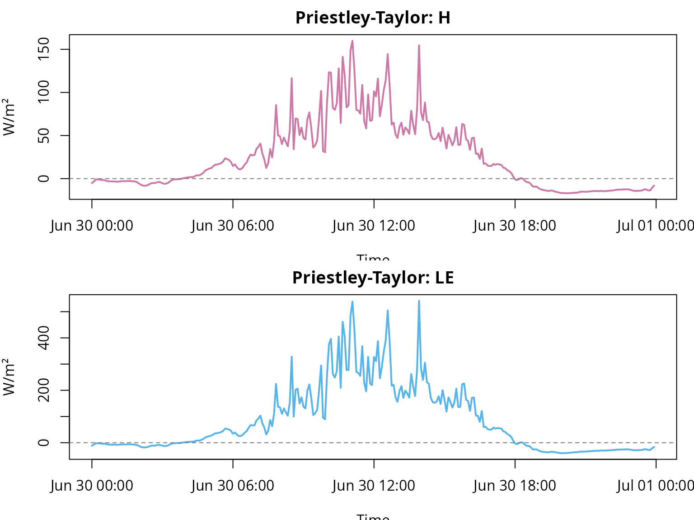
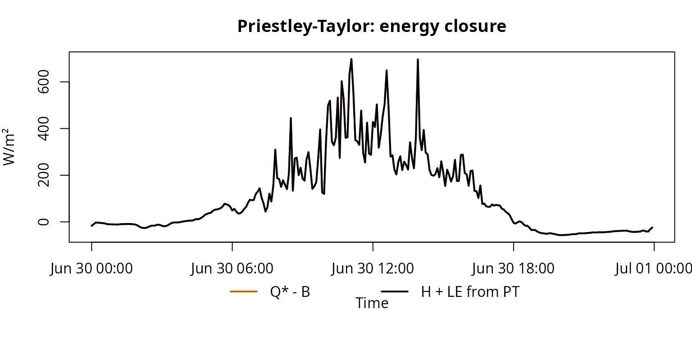
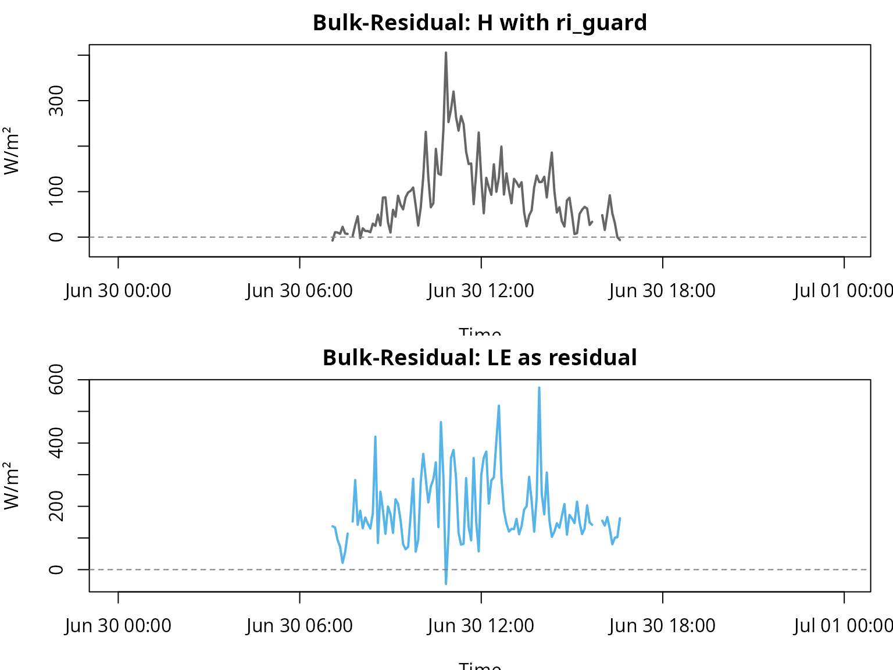
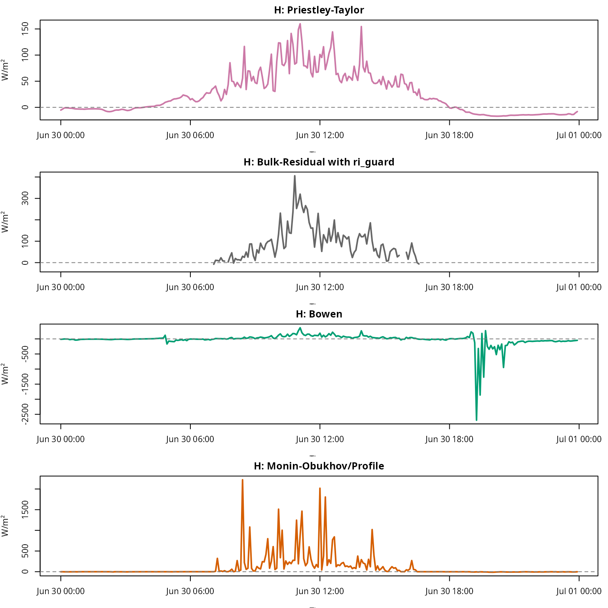
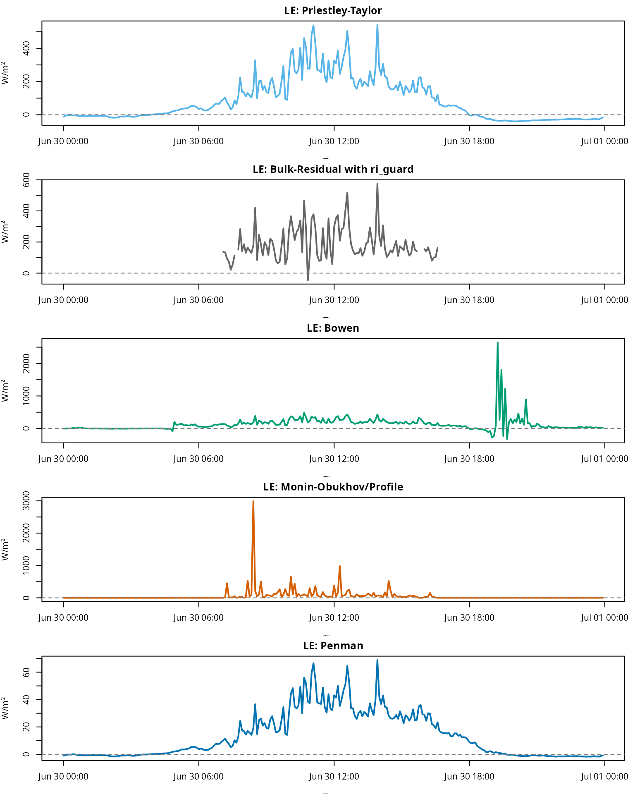
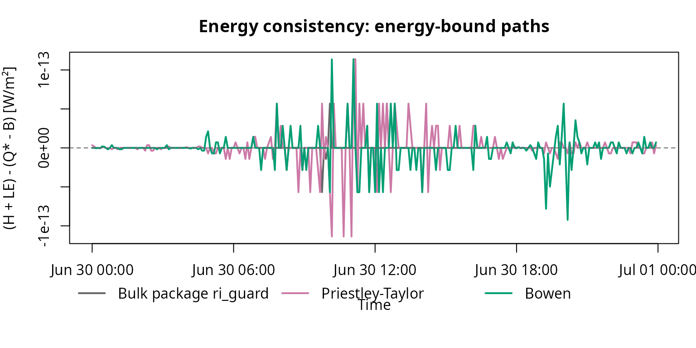
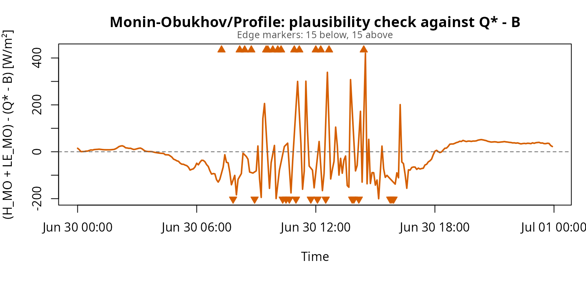

# fieldClim: Heat-flux workflow with package methods

## Purpose of this vignette

This vignette is the package-workflow part of the Caldern example. It
starts after the manual data checks: the relevant columns have already
been identified as net radiation, soil heat flux, temperature, humidity
and wind inputs. They are now passed to a `weather_station` object and
evaluated with `fieldClim` functions.

A systematic decision guide for matching heat-flux methods to
measurement architecture is provided in [Choosing fieldClim Heat-Flux
Methods by Measurement
Design](https://gisma.github.io/migration-fieldclim/articles/fieldclim_m2m_en.md).
This vignette applies that logic to the Caldern example dataset.

The focus is no longer the manual checking of individual measurement
columns. The focus is package logic: how the station data are organized,
how inputs are inspected, which method families are available, and how
their outputs should be compared.

| Step | Question | Package area |
|----|----|----|
| 1 | Which heat-flux method families are distinguished? | method concept, energy closure, profile diagnostics |
| 2 | How is the dataset passed to `fieldClim`? | [`build_weather_station()`](https://gisma.github.io/migration-fieldclim/reference/build_weather_station.md) |
| 3 | Which inputs does the inspection function detect? | [`inspect_weather_station_inputs()`](https://gisma.github.io/migration-fieldclim/reference/inspect_weather_station_inputs.md) |
| 4 | How are Priestley-Taylor, Bulk-Residual, Bowen, Monin-Obukhov/Profile and Penman compared? | [`turb_flux_calc()`](https://gisma.github.io/migration-fieldclim/reference/turb_flux_calc.md), [`turb_flux_bulk_residual()`](https://gisma.github.io/migration-fieldclim/reference/turb_flux_bulk_residual.md) and method-specific outputs as distinct calculation paths |

The data basis is loaded from the packaged Caldern example file. Manual
checks of time structure, radiation components, soil heat flux and
available energy belong to the companion vignette on data checks. Here
we use those checked quantities as inputs for the package workflow.

## Notation

This vignette uses the reference notation from the method-selection
page. `Q*` is net radiation, `B` is soil heat flux, `A = Q* - B` is
available energy, `H` is sensible heat flux, `LE` is latent heat flux,
and `R_E` is the residual or non-closed energy term.

The R code variables used in this tutorial are not renamed. Existing
objects such as `L_pt`, `V_pt`, `L_bulk_pkg`, and `V_bulk_pkg` are kept
because they belong to the current tutorial workflow. In the explanatory
text, however, `L_*` is interpreted as `H`, and `V_*` is interpreted as
`LE`.

For package functions, this notation is mapped to `fieldClim` names:

| Reference quantity | Meaning | `fieldClim` field or output | Tutorial code variable |
|----|----|----|----|
| `Q*` | net radiation | `rad_bal` | `Q_star` |
| `B` | soil heat flux | `soil_flux` | `B` |
| `A = Q* - B` | available energy | `rad_bal - soil_flux` | `available_energy`, `Q_minus_B` |
| `H` | sensible heat flux | `sensible_*` | `L_*` |
| `LE` | latent heat flux | `latent_*` | `V_*` |
| `R_E = Q* - B - H - LE` | residual / non-closed energy term | closure diagnostic output | `diff_*`, `closure_residual` |

The sign convention is:

\\ Q^\* - B = H + LE \\

for energy-closing or residual methods in valid finite cases. This
relation is not imposed on all method families.

## Step 1: Method overview and role of each path

All methods use the same station concept, but they do not answer the
same question. They are distinct calculation paths: some partition
available energy, some estimate one flux and compute the other as a
residual, and some use measured vertical profiles without forcing
closure against available energy. The method choice follows the logic of
[Choosing fieldClim Heat-Flux Methods by Measurement
Design](https://gisma.github.io/migration-fieldclim/articles/fieldclim_m2m_en.md):
the measurement architecture and the target quantity determine what can
be interpreted.


| Method | Main question | Direct inputs | Code output | Reference notation | Role in the workflow |
|----|----|----|----|----|----|
| Priestley-Taylor | How is available energy partitioned through an empirical evaporation parameterization? | `rad_bal`, `soil_flux`, `temp`, `surface_type` | `L_pt`, `V_pt` | `H_PT`, `LE_PT` | available-energy partition |
| Bulk-Residual | How is sensible heat estimated from a two-height temperature gradient and exchange assumption, and how is latent heat derived as the residual? | `t1`, `t2`, `v1`, optional `v2`, `z1`, `z2`, `rad_bal`, `soil_flux` | `L_bulk_pkg`, `V_bulk_pkg` | `H_bulk`, `LE_res` | direct `H` estimate plus residual `LE` |
| Bowen-ratio | How do temperature and humidity gradients partition available energy? | `t1`, `t2`, `hum1`, `hum2`, `z1`, `z2`, `rad_bal`, `soil_flux` | `L_bowen`, `V_bowen` | `H_BR`, `LE_BR` | gradient-based partition |
| Monin-Obukhov/Profile | What do temperature, humidity and wind profiles imply as diagnostic profile fluxes? | `t1`, `t2`, `hum1`, `hum2`, `v1`, `v2`, `z1`, `z2`, roughness context | `L_monin`, `V_monin` | `H_MO`, `LE_MO` | profile/stability diagnostic, not force-closed |
| Penman | How large is latent heat flux from available energy and aerodynamic drying power? | `rad_bal`, `soil_flux`, meteorology, site and surface parameters | `V_penman` | `LE_Penman` | `LE`-only comparison path |

### Priestley-Taylor

Priestley-Taylor is an available-energy partition path in this vignette.
It is directly bound to available energy and does not require a measured
humidity-gradient ratio.

\\ H + LE = Q^\* - B \\

\\ LE\_{PT} = \alpha\_{PT} \frac{sc}{sc + \gamma} (Q^\* - B) \\

\\ H\_{PT} = (Q^\* - B) - LE\_{PT} \\

The defining property of this calculation path is energy bookkeeping. If
`Q_star` and `B` are set correctly, the sum of `H_PT` and `LE_PT`
remains tied to available energy. In the code, these quantities are
stored as `L_pt` and `V_pt`. This is a method-specific partition, not an
independent validation of both component fluxes.

### Bulk-Residual with optional Richardson guard

The calculation path
[`turb_flux_bulk_residual()`](https://gisma.github.io/migration-fieldclim/reference/turb_flux_bulk_residual.md)
first estimates sensible heat flux with a bulk-transfer equation. Latent
heat flux is then computed as the residual of the surface energy
balance:

\\ H\_{bulk} = \rho c_p \frac{t_1 - t_2}{r_a} \\

\\ r_a = \frac{\ln(z_2 / z_1)}{k \bar{u}} \\

\\ LE\_{res} = Q^\* - B - H\_{bulk} \\

In addition,
[`sensible_bulk()`](https://gisma.github.io/migration-fieldclim/reference/sensible_bulk.md)
can compute a gradient Richardson number when
`stability_method = "ri_guard"` is used:

\\ Ri_g = \frac{g}{\bar{\theta}} \frac{\Delta \theta / \Delta z}
{(\Delta u / \Delta z)^2} \\

The guard is not the default. It is activated only by setting
`stability_method = "ri_guard"`. Unstable, neutral and moderately stable
cases keep the neutral bulk value. Very stable, invalid or weak-shear
cases are set to `NA`. If `H_bulk` becomes `NA`, the residual `LE_res`
also becomes `NA`. In the code, these quantities are stored as
`L_bulk_pkg` and `V_bulk_pkg`. This makes visible that the neutral Bulk
estimate was not evaluated for those timesteps.

The Richardson guard is a filter option, not a stability correction. It
does not turn Bulk-Residual into a Monin-Obukhov method.

### Bowen-ratio

The Bowen approach uses a ratio between temperature and humidity
gradients. It partitions the available energy into sensible and latent
heat flux.

\\ \beta \approx \frac{\Delta T}{\Delta e} \\

In `fieldClim`, the implementation is more specific than this simplified
textbook notation. It uses a potential-temperature difference and an
absolute-humidity difference with an empirical `fieldClim` coefficient.
Therefore, Bowen is interpreted here as the implemented calculation
path, not as a claim that the coefficient form has been fully proven
equivalent to every textbook Bowen formulation.

\\ H\_{BR} = \frac{\beta}{1 + \beta} (Q^\* - B) \\

\\ LE\_{BR} = \frac{1}{1 + \beta} (Q^\* - B) \\

For finite, uncapped denominator cases, the Bowen calculation path
closes the available energy. In the code, the outputs are stored as
`L_bowen` and `V_bowen`. It is nevertheless sensitive to gradients. If
humidity gradients become very small, signs change, `beta` is not finite
or `1 + beta` approaches zero, individual timesteps can produce strong
excursions. Capped or non-finite cases should not be read as exact
partitions of \\Q^\* - B\\.

### Monin-Obukhov/Profile as diagnostic path

The Monin-Obukhov/Profile calculation path is interpreted here as a
profile and stability diagnostic. It is not a method that automatically
partitions available energy into `H` and `LE`. It calculates heat fluxes
from measured differences between two heights: temperature, humidity,
wind and measurement height directly determine the profile calculation.
The method is therefore sensitive when gradients are small, noisy or
contradictory.

The current package version catches several problematic cases
explicitly. If the temperature gradient between the two heights is zero,
sensible heat flux is set to zero for that timestep. If the humidity
gradient is zero, latent heat flux is set to zero. Invalid measurement
heights, missing wind values or non-evaluable profile states return `NA`
with a warning.

This numerical guarding makes Monin-Obukhov/Profile neither an
energy-closing method nor an automatically validated full MOST
implementation. Large but finite values are not automatically limited to
\\Q^\* - B\\. The results must therefore be checked against available
energy. Large deviations from available energy are primarily diagnostic
information about profile sensitivity, wind shear and stability
assumptions.

For interpretation, it is not expected that

\\ H\_{MO} + LE\_{MO} = Q^\* - B \\

holds. This relation is used only as a plausibility check. The
diagnostic residual relation is:

\\ R\_{E,MO} = Q^\* - B - H\_{MO} - LE\_{MO} \\

In the code, `H_MO` and `LE_MO` are stored as `L_monin` and `V_monin`.
Large deviations of `H_MO + LE_MO` from available energy point to
critical profile conditions: small temperature or humidity gradients,
weak wind differences, unfavorable stability assumptions or 5-minute
noise.

### Penman

Penman is a combination approach for latent heat flux. It combines an
energy term with an aerodynamic drying term. In the current package
workflow, Penman returns `LE`, but not a paired sensible heat flux `H`.
In the code, `LE_Penman` is stored as `V_penman`.

\\ LE\_{Penman} \approx \frac{\Delta}{\Delta + \gamma}(Q^\* - B) +
\frac{\gamma}{\Delta + \gamma} E_a \\

\\ E_a = f(u, e_s - e_a) \\

Because Penman does not compute a paired sensible heat flux, subtracting
`latent_penman` from available energy leaves only an unresolved
remainder:

\\ U\_{Penman} = Q^\* - B - LE\_{Penman} \\

This remainder is not automatically `H`. It can include sensible heat,
closure error, input-data error and model mismatch.

Penman is therefore a comparison path for `LE`, not a complete `H`/`LE`
partitioning like Priestley-Taylor, Bowen or Bulk-Residual.

## Step 2: Passing the data to a `weather_station` object

The `weather_station` object is the central package structure. It stores
measurement columns, site metadata and method parameters. Different
functions can then operate on the same structured data basis.

``` r

ws <- build_weather_station(
  # Time axis.
  datetime = caldern$datetime,

  # Station location.
  lon = 8.6832,
  lat = 50.8405,
  elev = 261,

  # Standard temperature and relative humidity.
  temp = caldern$Ta_2m,
  rh = caldern$Huma_2m,

  # Profile variables for gradient- and stability-related methods.
  t1 = caldern$Ta_2m,
  t2 = caldern$Ta_10m,
  hum1 = caldern$Huma_2m,
  hum2 = caldern$Huma_10m,

  # Wind profile and measurement heights.
  v1 = caldern$Windspeed_2m,
  v2 = caldern$Windspeed_10m,
  z1 = 2,
  z2 = 10,

  # Package names for reference quantities:
  # rad_bal corresponds to Q*, soil_flux corresponds to B.
  rad_bal = caldern$Q_star,
  soil_flux = caldern$B,

  # Additional surface and soil information.
  moisture = caldern$water_vol_soil,
  surface_temp = caldern$Ts,

  # Surface type as model assumption.
  surface_type = "field",

  # Observation height for methods that need a reference height.
  obs_height = 2
)

class(ws)
#> [1] "weather_station"
names(ws)
#>  [1] "datetime"     "lon"          "lat"          "elev"         "temp"        
#>  [6] "rh"           "t1"           "t2"           "hum1"         "hum2"        
#> [11] "v1"           "v2"           "z1"           "z2"           "rad_bal"     
#> [16] "soil_flux"    "moisture"     "surface_temp" "surface_type" "obs_height"
head(as.data.frame(ws))
#>              datetime    lon     lat elev  temp    rh    t1    t2  hum1 hum2
#> 1 2017-06-30 00:00:00 8.6832 50.8405  261 13.09 100.0 13.09 13.60 100.0 97.6
#> 2 2017-06-30 00:05:00 8.6832 50.8405  261 13.01 100.0 13.01 13.51 100.0 97.7
#> 3 2017-06-30 00:10:00 8.6832 50.8405  261 13.02 100.0 13.02 13.66 100.0 96.5
#> 4 2017-06-30 00:15:00 8.6832 50.8405  261 13.16 100.0 13.16 13.76 100.0 96.1
#> 5 2017-06-30 00:20:00 8.6832 50.8405  261 13.27 100.0 13.27 13.80 100.0 96.4
#> 6 2017-06-30 00:25:00 8.6832 50.8405  261 13.69  98.1 13.69 14.25  98.1 92.4
#>      v1    v2 z1 z2 rad_bal soil_flux moisture surface_temp surface_type
#> 1 0.448 0.529  2 10 -15.200  1.551533    0.344        16.31        field
#> 2 0.380 0.409  2 10  -8.920  1.492695    0.344        16.29        field
#> 3 0.548 0.670  2 10  -1.965  1.448708    0.344        16.25        field
#> 4 0.581 0.658  2 10  -1.790  1.390439    0.344        16.25        field
#> 5 0.764 0.887  2 10  -2.469  1.325316    0.344        16.22        field
#> 6 0.589 0.744  2 10  -3.857  1.268762    0.344        16.19        field
#>   obs_height
#> 1          2
#> 2          2
#> 3          2
#> 4          2
#> 5          2
#> 6          2
```

**Interpretation.** The `weather_station` object is more than a renamed
table. It assigns physical roles to the raw columns: `rad_bal` is the
package input for `Q_star`, `soil_flux` is `B`, `t1/t2`, `hum1/hum2` and
`v1/v2` form the vertical profiles, and `surface_type = "field"` sets
the surface assumption for methods that require it. At this point a
heterogeneous CSV file becomes a consistent package dataset. Mistakes at
this step are consequential because all later methods inherit the same
mapping.

## Step 3: Inspecting the `weather_station` inputs

After the Caldern data have been organized as a `weather_station`
object, the input structure can be checked before any heat-flux
calculation. This inspection does not change values, does not create
replacement columns and does not fill gaps. It reports which inputs for
the main `fieldClim` method families are present, partly missing or
missing.

``` r

# Read-only inspection of the already built weather_station object.
inspection_regular <- inspect_weather_station_inputs(ws)

# Components of the inspection object.
names(inspection_regular)
#> [1] "fields"           "gaps"             "method_readiness" "qc_flags"        
#> [5] "guidance"         "summary"

# Compact summary.
inspection_regular$summary
#> $n_fields
#> [1] 42
#> 
#> $n_missing_fields
#> [1] 22
#> 
#> $n_partial_fields
#> [1] 0
#> 
#> $n_gaps
#> [1] 0
#> 
#> $n_qc_flags
#> [1] 0
#> 
#> $ready_methods
#> [1] "priestley_taylor"       "bulk_residual"          "bulk_residual_ri_guard"
#> [4] "bowen"                  "monin_profile"          "penman"                
#> 
#> $blocked_methods
#> character(0)
#> 
#> $unsafe_missing_fields
#> character(0)

# Fields that are missing or partially missing.
subset(
  inspection_regular$fields,
  source_status != "present"
)
#>                    field present all_missing any_missing n_missing n_total
#> 6                rad_net   FALSE        TRUE        TRUE         0       0
#> 7              rad_sw_in   FALSE        TRUE        TRUE         0       0
#> 8             rad_sw_out   FALSE        TRUE        TRUE         0       0
#> 9              rad_lw_in   FALSE        TRUE        TRUE         0       0
#> 10            rad_lw_out   FALSE        TRUE        TRUE         0       0
#> 11                albedo   FALSE        TRUE        TRUE         0       0
#> 14                 slope   FALSE        TRUE        TRUE         0       0
#> 15            exposition   FALSE        TRUE        TRUE         0       0
#> 16                valley   FALSE        TRUE        TRUE         0       0
#> 18            soil_temp1   FALSE        TRUE        TRUE         0       0
#> 19            soil_temp2   FALSE        TRUE        TRUE         0       0
#> 20           soil_depth1   FALSE        TRUE        TRUE         0       0
#> 21           soil_depth2   FALSE        TRUE        TRUE         0       0
#> 22          thermal_cond   FALSE        TRUE        TRUE         0       0
#> 23               texture   FALSE        TRUE        TRUE         0       0
#> 28       vapour_pressure   FALSE        TRUE        TRUE         0       0
#> 29        vapor_pressure   FALSE        TRUE        TRUE         0       0
#> 30     absolute_humidity   FALSE        TRUE        TRUE         0       0
#> 31     specific_humidity   FALSE        TRUE        TRUE         0       0
#> 32              pressure   FALSE        TRUE        TRUE         0       0
#> 36 potential_temperature   FALSE        TRUE        TRUE         0       0
#> 39              wind_dir   FALSE        TRUE        TRUE         0       0
#>    missing_fraction source_status     group         variable_type
#> 6                NA       missing radiation             radiation
#> 7                NA       missing radiation             radiation
#> 8                NA       missing radiation             radiation
#> 9                NA       missing radiation             radiation
#> 10               NA       missing radiation             radiation
#> 11               NA       missing radiation             radiation
#> 14               NA       missing radiation              metadata
#> 15               NA       missing radiation              metadata
#> 16               NA       missing radiation              metadata
#> 18               NA       missing      soil      soil temperature
#> 19               NA       missing      soil      soil temperature
#> 20               NA       missing      soil              metadata
#> 21               NA       missing      soil              metadata
#> 22               NA       missing      soil soil thermal property
#> 23               NA       missing      soil          soil texture
#> 28               NA       missing  humidity              humidity
#> 29               NA       missing  humidity              humidity
#> 30               NA       missing  humidity              humidity
#> 31               NA       missing  humidity              humidity
#> 32               NA       missing  pressure              pressure
#> 36               NA       missing  profiles           temperature
#> 39               NA       missing  profiles        wind direction

# Readiness of the main heat-flux method families.
inspection_regular$method_readiness[, c(
  "method",
  "missing_fields",
  "partial_fields",
  "ready",
  "notes"
)]
#>                   method missing_fields partial_fields ready
#> 1       priestley_taylor                                TRUE
#> 2          bulk_residual                                TRUE
#> 3 bulk_residual_ri_guard                                TRUE
#> 4                  bowen                                TRUE
#> 5          monin_profile                                TRUE
#> 6                 penman                                TRUE
#>                                                                                                       notes
#> 1 Requires available measured input fields for temperature, net radiation, soil heat flux and surface type.
#> 2                                          Neutral bulk path can use v1 only; v2 is optional for mean wind.
#> 3                         Optional Richardson guard requires v2 and remains unavailable when v2 is missing.
#> 4                                                     Requires two-level temperature and humidity profiles.
#> 5                                           Requires profile inputs plus either surface_type or obs_height.
#> 6                  Uses hum1 when present, otherwise rh; both are interpreted as relative humidity percent.
```

**Interpretation.** This pre-check does not answer whether the physical
methods are meaningful for every timestep. It first checks the input
structure: Are the required fields for Priestley-Taylor, Bulk-Residual,
Bowen, Monin-Obukhov/Profile and Penman present? Are any required inputs
missing or partially missing? Are simple quality-control problems such
as impossible humidity values or negative wind speeds flagged?

This is a preliminary step. The next sections evaluate how the energy
balance, available energy and heat-flux methods behave.

## Step 4: Package methods for heat fluxes

### Priestley-Taylor as available-energy partition path

Priestley-Taylor uses available energy, `Q* - B`, and an empirical
evaporation parameterization. Its role here is not to be universally
more correct, but to provide an energy-bound partition without measured
humidity-gradient quotients.

``` r

flux_pt <- turb_flux_calc(ws, pt_only = TRUE)

caldern$L_pt <- flux_pt$sensible_priestley_taylor
caldern$V_pt <- flux_pt$latent_priestley_taylor
caldern$L_plus_V_pt <- caldern$L_pt + caldern$V_pt
# The tutorial code variables L_* and V_* are kept:
# L_* corresponds to H, V_* corresponds to LE.
```

``` r

op <- par(mfrow = c(2, 1), mar = c(3.5, 4, 2, 1))

plot(caldern$datetime, caldern$L_pt, type = "l", col = "#CC79A7", lwd = 2,
     xlab = "Time", ylab = "W/m²", main = "Priestley-Taylor: H")
abline(h = 0, lty = 2, col = "grey50")

plot(caldern$datetime, caldern$V_pt, type = "l", col = "#56B4E9", lwd = 2,
     xlab = "Time", ylab = "W/m²", main = "Priestley-Taylor: LE")
abline(h = 0, lty = 2, col = "grey50")
```



``` r


par(op)
```

``` r

cols_pt <- c("#D55E00", "#000000")
op <- par(mar = c(6, 4, 3, 1), xpd = NA)

plot(caldern$datetime, caldern$Q_minus_B, type = "l", col = cols_pt[1], lwd = 2,
     ylim = range(caldern$Q_minus_B, caldern$L_plus_V_pt, na.rm = TRUE),
     xlab = "Time", ylab = "W/m²", main = "Priestley-Taylor: energy closure")
lines(caldern$datetime, caldern$L_plus_V_pt, col = cols_pt[2], lwd = 2)
legend("bottom", inset = c(0, -0.35), horiz = TRUE, bty = "n",
       legend = c("Q* - B", "H + LE from PT"), col = cols_pt, lty = 1, lwd = 2)
```



``` r


par(op)
```

**Interpretation.** Priestley-Taylor is the first available-energy
partition path in this comparison. It uses available energy and
partitions it with a compact evaporation parameter. In the code, the
resulting `H` and `LE` values are stored as `L_pt` and `V_pt`. In this
run, the daily mean for `H` is 25.1 W/m² and the daily mean for `LE` is
83.6 W/m². Together, they close the available energy.

That does not make PT automatically better than the other methods. Its
strength here is transparent energy bookkeeping: if `Q_star` and `B` are
coherent, the partition can be checked immediately. The method avoids
measured humidity-gradient ratios, wind shear and stability
classification. It is therefore a useful comparison path before more
sensitive profile or gradient methods are added.

### Bulk-Residual with Richardson guard

The Bulk-Residual calculation path is treated as a package method here.
For this comparison, the optional Richardson guard is enabled because
the Caldern dataset contains two temperature and wind heights.

``` r

flux_bulk_guarded <- turb_flux_bulk_residual(
  ws,
  stability_method = "ri_guard"
)

caldern$L_bulk_pkg <- flux_bulk_guarded$sensible_bulk
caldern$V_bulk_pkg <- flux_bulk_guarded$latent_bulk_residual
caldern$bulk_Ri_g <- attr(flux_bulk_guarded$sensible_bulk, "bulk_Ri_g")
caldern$bulk_stability <- attr(flux_bulk_guarded$sensible_bulk, "bulk_stability")

table(caldern$bulk_stability, useNA = "ifany")
#> 
#>     neutral      stable    unstable very_stable 
#>           1           5         107         175
```

``` r

op <- par(mfrow = c(2, 1), mar = c(3.5, 4, 2, 1))

plot(caldern$datetime, caldern$L_bulk_pkg, type = "l", col = "#666666", lwd = 2,
     xlab = "Time", ylab = "W/m²", main = "Bulk-Residual: H with ri_guard")
abline(h = 0, lty = 2, col = "grey50")

plot(caldern$datetime, caldern$V_bulk_pkg, type = "l", col = "#56B4E9", lwd = 2,
     xlab = "Time", ylab = "W/m²", main = "Bulk-Residual: LE as residual")
abline(h = 0, lty = 2, col = "grey50")
```



``` r


par(op)
```

**Interpretation.** Bulk-Residual works differently from PT. It first
estimates `H` from temperature difference and wind; in the code this is
stored as `L_bulk_pkg`. It then computes `LE` as the energy-balance
residual; in the code this is stored as `V_bulk_pkg`. With the
Richardson guard enabled, only 113 of 288 timesteps remain as valid
Bulk-Residual values. The stability count explains why: 175 timesteps
are classified as very stable and are therefore not evaluated as neutral
Bulk fluxes.

This is not an error. It is the purpose of the guard. The guard does not
turn Bulk-Residual into a full Monin-Obukhov method and it does not
correct valid fluxes. It prevents a neutral bulk approach from returning
apparently plausible values when the two-height profile itself indicates
very stable, weak-shear or numerically non-robust conditions.

### Full method workflow

``` r

flux_all <- turb_flux_calc(ws)

caldern$L_bowen <- flux_all$sensible_bowen
caldern$V_bowen <- flux_all$latent_bowen
caldern$L_monin <- flux_all$sensible_monin
caldern$V_monin <- flux_all$latent_monin
caldern$V_penman <- flux_all$latent_penman
```

The full workflow
[`turb_flux_calc()`](https://gisma.github.io/migration-fieldclim/reference/turb_flux_calc.md)
computes the standard method outputs with their standard options. The
guarded Bulk-Residual calculation path is therefore handled separately
and is listed below as `Bulk-Residual package (ri_guard)`.

``` r

L_summary <- data.frame(
  Method = c(
    "Priestley-Taylor",
    "Bulk-Residual package (ri_guard)",
    "Bowen",
    "Monin-Obukhov/Profile"
  ),
  Mean_L_W_m2 = c(
    mean(caldern$L_pt, na.rm = TRUE),
    mean(caldern$L_bulk_pkg, na.rm = TRUE),
    mean(caldern$L_bowen, na.rm = TRUE),
    mean(caldern$L_monin, na.rm = TRUE)
  )
)

V_summary <- data.frame(
  Method = c(
    "Priestley-Taylor",
    "Bulk-Residual package (ri_guard)",
    "Bowen",
    "Monin-Obukhov/Profile",
    "Penman"
  ),
  Mean_V_W_m2 = c(
    mean(caldern$V_pt, na.rm = TRUE),
    mean(caldern$V_bulk_pkg, na.rm = TRUE),
    mean(caldern$V_bowen, na.rm = TRUE),
    mean(caldern$V_monin, na.rm = TRUE),
    mean(caldern$V_penman, na.rm = TRUE)
  )
)

L_summary[, -1] <- round(L_summary[, -1], 1)
V_summary[, -1] <- round(V_summary[, -1], 1)

names(L_summary)[names(L_summary) == "Mean_L_W_m2"] <- "Mean_H_W_m2"
names(V_summary)[names(V_summary) == "Mean_V_W_m2"] <- "Mean_LE_W_m2"

L_summary
#>                             Method Mean_H_W_m2
#> 1                 Priestley-Taylor        25.1
#> 2 Bulk-Residual package (ri_guard)        90.9
#> 3                            Bowen       -21.1
#> 4            Monin-Obukhov/Profile       104.2
V_summary
#>                             Method Mean_LE_W_m2
#> 1                 Priestley-Taylor         83.6
#> 2 Bulk-Residual package (ri_guard)        188.7
#> 3                            Bowen        129.8
#> 4            Monin-Obukhov/Profile         52.7
#> 5                           Penman         13.2
```

**Interpretation.** These tables are not a ranking. They show different
answers to different method questions.

PT produces an energy-bound comparison course with 25.1 W/m² for `H` and
83.6 W/m² for `LE`.

Bulk-Residual is higher for valid unguarded timesteps (`H`: 90.9 W/m²,
`LE`: 188.7 W/m²), because only part of the day remains after Richardson
screening. These valid timesteps are not the same sample as all 288
measurements.

Bowen produces a negative daily mean for `H` (-21.1 W/m²), but a high
latent component (`LE`: 129.8 W/m²). This shows why simple means can be
misleading for gradient-sensitive methods: strong positive and negative
partitioning events can partly cancel each other.

Penman is separate because it returns only `LE`. Its mean of 13.2 W/m²
is not a complete `H/LE` pair.

Monin-Obukhov/Profile returns a mean `H` of about 104.2 W/m² and a mean
`LE` of about 52.7 W/m². These values come from temperature, humidity
and wind profiles, not from partitioning available energy. They must be
read differently from PT, Bulk-Residual or Bowen.

### Single-method plots

``` r

op <- par(mfrow = c(4, 1), mar = c(3.2, 4, 2, 1))

plot(caldern$datetime, caldern$L_pt, type = "l", col = "#CC79A7", lwd = 2,
     xlab = "Time", ylab = "W/m²", main = "H: Priestley-Taylor")
abline(h = 0, lty = 2, col = "grey50")

plot(caldern$datetime, caldern$L_bulk_pkg, type = "l", col = "#666666", lwd = 2,
     xlab = "Time", ylab = "W/m²", main = "H: Bulk-Residual with ri_guard")
abline(h = 0, lty = 2, col = "grey50")

plot(caldern$datetime, caldern$L_bowen, type = "l", col = "#009E73", lwd = 2,
     xlab = "Time", ylab = "W/m²", main = "H: Bowen")
abline(h = 0, lty = 2, col = "grey50")

plot(caldern$datetime, caldern$L_monin, type = "l", col = "#D55E00", lwd = 2,
     xlab = "Time", ylab = "W/m²", main = "H: Monin-Obukhov/Profile")
abline(h = 0, lty = 2, col = "grey50")
```



``` r


par(op)
```

``` r

op <- par(mfrow = c(5, 1), mar = c(3.2, 4, 2, 1))

plot(caldern$datetime, caldern$V_pt, type = "l", col = "#56B4E9", lwd = 2,
     xlab = "Time", ylab = "W/m²", main = "LE: Priestley-Taylor")
abline(h = 0, lty = 2, col = "grey50")

plot(caldern$datetime, caldern$V_bulk_pkg, type = "l", col = "#666666", lwd = 2,
     xlab = "Time", ylab = "W/m²", main = "LE: Bulk-Residual with ri_guard")
abline(h = 0, lty = 2, col = "grey50")

plot(caldern$datetime, caldern$V_bowen, type = "l", col = "#009E73", lwd = 2,
     xlab = "Time", ylab = "W/m²", main = "LE: Bowen")
abline(h = 0, lty = 2, col = "grey50")

plot(caldern$datetime, caldern$V_monin, type = "l", col = "#D55E00", lwd = 2,
     xlab = "Time", ylab = "W/m²", main = "LE: Monin-Obukhov/Profile")
abline(h = 0, lty = 2, col = "grey50")

plot(caldern$datetime, caldern$V_penman, type = "l", col = "#0072B2", lwd = 2,
     xlab = "Time", ylab = "W/m²", main = "LE: Penman")
abline(h = 0, lty = 2, col = "grey50")
```



``` r


par(op)
```

**Interpretation.** The plots are separated intentionally. In one
combined plot, sensitive calculation paths would dominate the y-axis and
smoother paths would become unreadable. Per-method plots show when sign
changes, `NA` sections or strong excursions occur. Bulk-Residual
interruptions are often not data gaps, but direct consequences of the
Richardson guard. Strong excursions in Bowen and Monin-Obukhov/Profile
are more likely indicators of gradient or stability sensitivity.

### Energy consistency of heat-flux methods

The following output is both a method comparison and an energy-balance
consistency check.

The near-surface energy balance can be written as:

\\ R_E = Q^\* - B - H - LE \\

For energy-partitioning or residual methods, this implies:

\\ H + LE \approx Q^\* - B \\

For Monin-Obukhov/Profile, this relation is not an expected closure
condition, but a plausibility diagnostic. It does not validate the
method-specific split into `H` and `LE`.

``` r

if (!("Q_star" %in% names(caldern))) {
  if ("Q_star_measured" %in% names(caldern)) {
    caldern$Q_star <- caldern$Q_star_measured
  } else {
    caldern$Q_star <- caldern$rad_net
  }
}

if (!("B" %in% names(caldern))) {
  caldern$B <- caldern$heatflux_soil
}

caldern$available_energy <- caldern$Q_star - caldern$B

caldern$LV_bulk_pkg <- caldern$L_bulk_pkg + caldern$V_bulk_pkg
caldern$LV_pt <- caldern$L_pt + caldern$V_pt
caldern$LV_bowen <- caldern$L_bowen + caldern$V_bowen
caldern$LV_monin <- caldern$L_monin + caldern$V_monin

caldern$diff_bulk_pkg <- caldern$LV_bulk_pkg - caldern$available_energy
caldern$diff_pt <- caldern$LV_pt - caldern$available_energy
caldern$diff_bowen <- caldern$LV_bowen - caldern$available_energy
caldern$diff_monin <- caldern$LV_monin - caldern$available_energy

energy_row <- function(method, lv, ref) {
  valid <- is.finite(lv) & is.finite(ref)
  diff <- lv[valid] - ref[valid]

  data.frame(
    Method = method,
    Mean_H_plus_LE = mean(lv[valid], na.rm = TRUE),
    Mean_Q_star_minus_B = mean(ref[valid], na.rm = TRUE),
    Mean_difference = mean(diff, na.rm = TRUE),
    Max_abs_difference = max(abs(diff), na.rm = TRUE),
    Valid_timesteps = sum(valid)
  )
}

energy_consistency <- rbind(
  energy_row(
    "Bulk-Residual package (ri_guard)",
    caldern$LV_bulk_pkg,
    caldern$available_energy
  ),
  energy_row(
    "Priestley-Taylor",
    caldern$LV_pt,
    caldern$available_energy
  ),
  energy_row(
    "Bowen",
    caldern$LV_bowen,
    caldern$available_energy
  ),
  energy_row(
    "Monin-Obukhov/Profile",
    caldern$LV_monin,
    caldern$available_energy
  )
)

energy_consistency[, 2:5] <- round(energy_consistency[, 2:5], 1)
energy_consistency
#>                             Method Mean_H_plus_LE Mean_Q_star_minus_B
#> 1 Bulk-Residual package (ri_guard)          279.6               279.6
#> 2                 Priestley-Taylor          108.7               108.7
#> 3                            Bowen          108.7               108.7
#> 4            Monin-Obukhov/Profile          156.9               108.7
#>   Mean_difference Max_abs_difference Valid_timesteps
#> 1             0.0                0.0             113
#> 2             0.0                0.0             288
#> 3             0.0                0.0             288
#> 4            48.2             5004.3             288
```

**Interpretation.** This table is the central consistency check. The
mean of `Q_star - B` is computed over the same valid timesteps as
`H + LE` for each method. That makes Bulk-Residual readable: it has only
113 valid timesteps because the guard removes very stable or invalid
situations. For exactly these valid timesteps, the residual path closes
by definition: the mean and maximum differences are 0 and 0 W/m².

Priestley-Taylor and Bowen also close because both calculation paths
explicitly partition available energy. This means different things. For
PT, this is a partitioning assumption. For Bowen, exact closure can
still coexist with extreme individual partitions caused by small
humidity gradients or denominator problems. Monin-Obukhov/Profile is not
a closure method. Its mean difference of 48.2 W/m² and maximum
difference of 5004.3 W/m² are therefore not rounding errors. They
indicate that this profile path can produce 5-minute values that should
not be read as an energy-balance partition.

### Diagnosing extreme values and stability cases

The extreme-value diagnostic first summarizes where extreme values occur
and then shows only the strongest cases. It also reports the
Richardson-guard classes from the Bulk-Residual path.

``` r

threshold_flux <- 600

caldern$dT_2_10 <- caldern$Ta_2m - caldern$Ta_10m
caldern$dH_2_10 <- caldern$Huma_2m - caldern$Huma_10m
caldern$dU_2_10 <- caldern$Windspeed_2m - caldern$Windspeed_10m

extreme_all <- rbind(
  data.frame(
    datetime = caldern$datetime,
    Method = "Bulk-Residual package (ri_guard)",
    Flux = "H",
    Value = caldern$L_bulk_pkg,
    dT_2_10 = caldern$dT_2_10,
    dH_2_10 = caldern$dH_2_10,
    dU_2_10 = caldern$dU_2_10,
    Q_star_minus_B = caldern$available_energy,
    bulk_stability = caldern$bulk_stability
  ),
  data.frame(
    datetime = caldern$datetime,
    Method = "Bowen",
    Flux = "H",
    Value = caldern$L_bowen,
    dT_2_10 = caldern$dT_2_10,
    dH_2_10 = caldern$dH_2_10,
    dU_2_10 = caldern$dU_2_10,
    Q_star_minus_B = caldern$available_energy,
    bulk_stability = NA_character_
  ),
  data.frame(
    datetime = caldern$datetime,
    Method = "Bowen",
    Flux = "LE",
    Value = caldern$V_bowen,
    dT_2_10 = caldern$dT_2_10,
    dH_2_10 = caldern$dH_2_10,
    dU_2_10 = caldern$dU_2_10,
    Q_star_minus_B = caldern$available_energy,
    bulk_stability = NA_character_
  ),
  data.frame(
    datetime = caldern$datetime,
    Method = "Monin-Obukhov/Profile",
    Flux = "H",
    Value = caldern$L_monin,
    dT_2_10 = caldern$dT_2_10,
    dH_2_10 = caldern$dH_2_10,
    dU_2_10 = caldern$dU_2_10,
    Q_star_minus_B = caldern$available_energy,
    bulk_stability = NA_character_
  ),
  data.frame(
    datetime = caldern$datetime,
    Method = "Monin-Obukhov/Profile",
    Flux = "LE",
    Value = caldern$V_monin,
    dT_2_10 = caldern$dT_2_10,
    dH_2_10 = caldern$dH_2_10,
    dU_2_10 = caldern$dU_2_10,
    Q_star_minus_B = caldern$available_energy,
    bulk_stability = NA_character_
  )
)

extreme_cases <- extreme_all[abs(extreme_all$Value) > threshold_flux, ]

extreme_count <- as.data.frame(
  table(extreme_cases$Method, extreme_cases$Flux),
  stringsAsFactors = FALSE
)

names(extreme_count) <- c("Method", "Flux", "Count")
extreme_count <- extreme_count[extreme_count$Count > 0, ]

bulk_guard_summary <- as.data.frame(
  table(caldern$bulk_stability, useNA = "ifany"),
  stringsAsFactors = FALSE
)
names(bulk_guard_summary) <- c("bulk_stability", "Count")

extreme_count
#>                  Method Flux Count
#> 1                 Bowen    H     4
#> 2 Monin-Obukhov/Profile    H    15
#> 3                 Bowen   LE     4
#> 4 Monin-Obukhov/Profile   LE     3
bulk_guard_summary
#>   bulk_stability Count
#> 1        neutral     1
#> 2         stable     5
#> 3       unstable   107
#> 4    very_stable   175
```

``` r

if (nrow(extreme_cases) > 0) {
  extreme_cases$abs_Value <- abs(extreme_cases$Value)
  extreme_cases <- extreme_cases[order(-extreme_cases$abs_Value), ]
  extreme_top <- head(extreme_cases, 10)

  extreme_top$Value <- round(extreme_top$Value, 1)
  extreme_top$abs_Value <- round(extreme_top$abs_Value, 1)
  extreme_top$dT_2_10 <- round(extreme_top$dT_2_10, 3)
  extreme_top$dH_2_10 <- round(extreme_top$dH_2_10, 3)
  extreme_top$dU_2_10 <- round(extreme_top$dU_2_10, 3)
  extreme_top$Q_star_minus_B <- round(extreme_top$Q_star_minus_B, 1)

  extreme_top
} else {
  data.frame(Note = "No values above the diagnostic threshold were found.")
}
#>                 datetime                Method Flux   Value dT_2_10 dH_2_10
#> 1254 2017-06-30 08:25:00 Monin-Obukhov/Profile   LE  2988.5    0.08    3.28
#> 520  2017-06-30 19:15:00                 Bowen    H -2695.0   -0.84    7.67
#> 808  2017-06-30 19:15:00                 Bowen   LE  2646.2   -0.84    7.67
#> 966  2017-06-30 08:25:00 Monin-Obukhov/Profile    H  2223.5    0.08    3.28
#> 1009 2017-06-30 12:00:00 Monin-Obukhov/Profile    H  2018.8    0.30    0.52
#> 522  2017-06-30 19:25:00                 Bowen    H -1861.2   -0.90    8.35
#> 810  2017-06-30 19:25:00                 Bowen   LE  1810.2   -0.90    8.35
#> 1012 2017-06-30 12:15:00 Monin-Obukhov/Profile    H  1806.9    0.21    2.47
#> 986  2017-06-30 10:05:00 Monin-Obukhov/Profile    H  1512.6    0.29    2.66
#> 999  2017-06-30 11:10:00 Monin-Obukhov/Profile    H  1464.3    0.42    1.38
#>      dU_2_10 Q_star_minus_B bulk_stability abs_Value
#> 1254   0.003          207.7           <NA>    2988.5
#> 520   -0.137          -48.8           <NA>    2695.0
#> 808   -0.137          -48.8           <NA>    2646.2
#> 966    0.003          207.7           <NA>    2223.5
#> 1009  -0.028          428.4           <NA>    2018.8
#> 522    0.062          -50.9           <NA>    1861.2
#> 810    0.062          -50.9           <NA>    1810.2
#> 1012  -0.022          318.2           <NA>    1806.9
#> 986    0.037          498.7           <NA>    1512.6
#> 999   -0.094          554.5           <NA>    1464.3
```

**Interpretation.** The extreme-value count shows where problematic
5-minute values arise. Bowen produces 8 values above the diagnostic
threshold, Monin-Obukhov/Profile produces 18. The Bulk-Residual
calculation path does not appear as an extreme-value source here because
the Richardson guard does not forward critical profile states as large
finite fluxes; it marks them as `NA`.

The stability count is essential. Out of 288 timesteps, 107 are
classified as unstable, 1 as neutral, 5 as stable and 175 as very
stable. Only the non-guarded cases are used for `L_bulk_pkg` and
`V_bulk_pkg` (the code variables for `H_bulk` and `LE_res`). For Bowen
and Monin-Obukhov/Profile, large finite values can remain visible. Such
values are first diagnostic signs of data and method sensitivity, not
automatically real heat-flux events.

### Energy consistency: energy-bound methods

``` r

cols_closure <- c(
  "#666666",
  "#CC79A7",
  "#009E73"
)

closure_values <- c(
  caldern$diff_bulk_pkg,
  caldern$diff_pt,
  caldern$diff_bowen
)

ylim_closure <- range(closure_values, na.rm = TRUE)

op <- par(mar = c(6, 4, 3, 1))

plot(
  caldern$datetime,
  caldern$diff_bulk_pkg,
  type = "l",
  col = cols_closure[1],
  lwd = 2,
  ylim = ylim_closure,
  xlab = "Time",
  ylab = "(H + LE) - (Q* - B) [W/m²]",
  main = "Energy consistency: energy-bound paths"
)

lines(caldern$datetime, caldern$diff_pt, col = cols_closure[2], lwd = 2)
lines(caldern$datetime, caldern$diff_bowen, col = cols_closure[3], lwd = 2)
abline(h = 0, lty = 2, col = "grey40")

par(xpd = NA)
legend(
  "bottom",
  inset = c(0, -0.35),
  horiz = TRUE,
  bty = "n",
  legend = c(
    "Bulk package ri_guard",
    "Priestley-Taylor",
    "Bowen"
  ),
  col = cols_closure,
  lty = 1,
  lwd = 2
)
```



``` r

par(op)
```

**Interpretation.** This plot separates energy-bound or residual paths
from Monin-Obukhov/Profile. For Bulk-Residual, PT and Bowen, closeness
to the zero line means that `H + LE` matches the available energy used
by the method. For PT this is a partitioning assumption; for
Bulk-Residual it is a residual definition for valid timesteps because
`LE` is the residual. Bowen can also close exactly as long as the
denominator is finite and not capped.

The zero line does not prove that every individual partition is
physically good. It only states that the energy bookkeeping is
consistent. The split into `H` and `LE` still has to be read together
with gradients, extreme values and warnings.

### Monin-Obukhov/Profile: heat fluxes from height differences

``` r

mo_diff <- caldern$diff_monin
mo_finite <- is.finite(mo_diff)
mo_ylim <- quantile(mo_diff[mo_finite], probs = c(0.05, 0.95), na.rm = TRUE)

mo_lower <- mo_finite & mo_diff < mo_ylim[1]
mo_upper <- mo_finite & mo_diff > mo_ylim[2]
mo_inside <- mo_finite & !mo_lower & !mo_upper

op <- par(mar = c(6, 4, 3, 1))

plot(
  caldern$datetime[mo_inside],
  mo_diff[mo_inside],
  type = "l",
  col = "#D55E00",
  lwd = 2,
  ylim = mo_ylim,
  xlab = "Time",
  ylab = "(H_MO + LE_MO) - (Q* - B) [W/m²]",
  main = "Monin-Obukhov/Profile: plausibility check against Q* - B"
)

abline(h = 0, lty = 2, col = "grey40")
points(caldern$datetime[mo_lower], rep(mo_ylim[1], sum(mo_lower)),
       pch = 25, col = "#D55E00", bg = "#D55E00")
points(caldern$datetime[mo_upper], rep(mo_ylim[2], sum(mo_upper)),
       pch = 24, col = "#D55E00", bg = "#D55E00")

mtext(
  paste0(
    "Edge markers: ",
    sum(mo_lower), " below, ", sum(mo_upper), " above"
  ),
  side = 3,
  line = 0.2,
  cex = 0.8,
  col = "grey30"
)
```



``` r


par(op)
```

**Interpretation.** This plot must be read differently from the previous
one. Monin-Obukhov/Profile calculates `H` and `LE` from measured
differences between two heights. In the code, these outputs are stored
as `L_monin` and `V_monin`. Temperature, humidity, wind and measurement
height determine the result. The values are not adjusted afterward so
that their sum equals the available energy.

The package functions catch problematic special cases: zero gradients
return zero for the respective flux, invalid heights or wind values and
non-evaluable profile states return `NA` with a warning. Large but
formally valid values remain visible. The plot therefore does not simply
show an error. It checks whether profile-based values are energetically
plausible relative to available energy.

If the deviation is large, the corresponding timestep should not be
interpreted as a robust heat-flux estimate. More likely, small
temperature or humidity gradients, weak wind differences or stability
assumptions strongly influence the profile method.

The edge markers are important. They indicate that some values lie
outside the robustly displayed y-axis range. The plot therefore shows a
readable center of the distribution plus outlier markers. In plain
terms: the profile path does not say “this much energy was closed”; it
says “this is how a profile- and stability-dependent method reacts to
these measured profiles.” If that reaction strongly deviates from
`Q_star - B`, it is a diagnostic result about gradients, shear and
stability assumptions.

### Additional energy-balance diagnostics

After turbulent fluxes have been calculated, energy-balance closure
diagnostics show whether the result is formally closed, contains an
unresolved complementary term, or should be read as a profile/stability
diagnostic. The diagnostic step does not change any fluxes. It only
shows how the existing output fields relate to `rad_bal - soil_flux`.

``` r

closure_flux <- energy_balance_closure(flux_all)

head(closure_flux)
#>              datetime           method      closure_type rad_bal soil_flux
#> 1 2017-06-30 00:00:00 priestley_taylor partition_closure -15.200  1.551533
#> 2 2017-06-30 00:05:00 priestley_taylor partition_closure  -8.920  1.492695
#> 3 2017-06-30 00:10:00 priestley_taylor partition_closure  -1.965  1.448708
#> 4 2017-06-30 00:15:00 priestley_taylor partition_closure  -1.790  1.390439
#> 5 2017-06-30 00:20:00 priestley_taylor partition_closure  -2.469  1.325316
#> 6 2017-06-30 00:25:00 priestley_taylor partition_closure  -3.857  1.268762
#>   available_energy  sensible     latent turbulent_sum closure_residual
#> 1       -16.751533 -5.301183 -11.450350    -16.751533    -3.552714e-15
#> 2       -10.412695 -3.308925  -7.103770    -10.412695    -1.776357e-15
#> 3        -3.413708 -1.084238  -2.329470     -3.413708     0.000000e+00
#> 4        -3.180439 -1.002820  -2.177619     -3.180439     0.000000e+00
#> 5        -3.794316 -1.189538  -2.604778     -3.794316     4.440892e-16
#> 6        -5.125762 -1.571959  -3.553803     -5.125762    -8.881784e-16
#>   closure_ratio unresolved_complement               status
#> 1            NA                    NA low_available_energy
#> 2            NA                    NA low_available_energy
#> 3            NA                    NA low_available_energy
#> 4            NA                    NA low_available_energy
#> 5            NA                    NA low_available_energy
#> 6            NA                    NA low_available_energy
```

``` r

plot_energy_balance_closure(
  closure_flux,
  type = "open_terms",
  layout = "facets"
)
```


The plot does not show the same residual concept for all methods.
Depending on the calculation path, it shows a residual latent heat term,
an unresolved complement, or a diagnostic energy-balance residual. For
Bulk-Residual, this is `latent_bulk_residual`: latent heat is calculated
as the remaining available energy after estimating `sensible_bulk`. For
Penman, it is the unresolved complement after subtracting
`latent_penman`; this term is not automatically `H`. For
Monin-Obukhov/Profile, it is the diagnostic balance residual
`rad_bal - soil_flux - sensible - latent`. Priestley-Taylor and Bowen
are not shown because they partition available energy and do not return
an explicit open term.

``` r

plot_energy_balance_closure(
  closure_flux,
  type = "closure_check",
  layout = "facets"
)
```


The closure check shows `rad_bal - soil_flux - sensible - latent` for
methods with paired fluxes. For Priestley-Taylor, Bowen and
Bulk-Residual, values close to zero are methodically expected by
partitioning assumption or residual definition. This indicates formal
closure, not physical validation. For Monin-Obukhov/Profile, non-zero
values are diagnostic and show the difference between profile-derived
flux estimates and available energy. Penman is not shown because no
paired sensible heat flux is calculated.

``` r

plot_energy_balance_closure(
  closure_flux,
  type = "ratio",
  layout = "facets",
  ylim = c(0, 2)
)
```


The ratio plot is zoomed to the range 0 to 2 so that deviations around
formal closure at 1 remain readable. Values outside this range are not
better or worse method values; they indicate unstable ratios, often
caused by small available energy or strongly deviating profile-derived
fluxes. The table above contains the untrimmed diagnostic values. Penman
is not shown because this package does not return a paired sensible heat
flux for Penman.

``` r

extreme_ratio <- subset(
  closure_flux,
  is.finite(closure_ratio) &
    (closure_ratio < 0 | closure_ratio > 2)
)

head(extreme_ratio[, c(
  "datetime", "method", "available_energy",
  "turbulent_sum", "closure_ratio", "status"
)])
#>                 datetime method available_energy turbulent_sum closure_ratio
#> 1210 2017-06-30 04:45:00  monin         22.15414    -0.7281989   -0.03286966
#> 1211 2017-06-30 04:50:00  monin         30.15442    -1.3077789   -0.04336939
#> 1212 2017-06-30 04:55:00  monin         33.72670    -0.7619606   -0.02259221
#> 1213 2017-06-30 05:00:00  monin         37.35555    -1.2179595   -0.03260452
#> 1214 2017-06-30 05:05:00  monin         39.10012    -1.6151695   -0.04130856
#> 1215 2017-06-30 05:10:00  monin         46.68153    -1.9150174   -0.04102302
#>                   status
#> 1210 diagnostic_residual
#> 1211 diagnostic_residual
#> 1212 diagnostic_residual
#> 1213 diagnostic_residual
#> 1214 diagnostic_residual
#> 1215 diagnostic_residual
```

This table lists cases outside the plotted ratio range. Such values
usually occur when the denominator `rad_bal - soil_flux` is small or
when profile-derived fluxes deviate strongly from available energy. They
are diagnostic cases, not a ranking of methods.

#### Bulk-Residual: exchange velocity and residual closure

The following block keeps the residual closure logic fixed and varies
only the exchange velocity used in the `sensible_bulk` estimate. The
existing `weather_station` object `ws` contains two wind heights as well
as `surface_type` and `obs_height`, so the roughness-based variant can
be calculated without inventing new inputs.

``` r

bulk_mean <- turb_flux_bulk_residual(
  ws,
  exchange_velocity = "wind_mean"
)

bulk_profile <- turb_flux_bulk_residual(
  ws,
  exchange_velocity = "u_star_profile"
)

bulk_roughness <- turb_flux_bulk_residual(
  ws,
  exchange_velocity = "u_star_roughness"
)

diag_mean <- energy_balance_closure(bulk_mean, methods = "bulk_residual")
diag_mean$exchange_velocity <- "wind_mean"

diag_profile <- energy_balance_closure(bulk_profile, methods = "bulk_residual")
diag_profile$exchange_velocity <- "u_star_profile"

diag_roughness <- energy_balance_closure(bulk_roughness, methods = "bulk_residual")
diag_roughness$exchange_velocity <- "u_star_roughness"

bulk_exchange_diag <- rbind(
  diag_mean,
  diag_profile,
  diag_roughness
)

aggregate(
  cbind(sensible, latent, closure_residual, closure_ratio) ~ exchange_velocity,
  data = bulk_exchange_diag,
  FUN = function(x) round(mean(x, na.rm = TRUE), 2)
)
#>   exchange_velocity sensible latent closure_residual closure_ratio
#> 1    u_star_profile    -1.57 145.08                0             1
#> 2  u_star_roughness    -2.69 142.27                0             1
#> 3         wind_mean   -23.77 163.35                0             1
```

The table shows the key distinction. The closure ratio remains close to
1 for the Bulk-Residual calculation path because `latent_bulk_residual`
is always calculated as the residual of
`rad_bal - soil_flux - sensible_bulk`. The actual methodological
sensitivity occurs one step earlier, in `sensible_bulk`. Depending on
whether the exchange velocity is based on mean wind, `u_star_profile`,
or `u_star_roughness`, the partition between sensible and latent heat
changes. A closed residual therefore does not prove that the selected
exchange-velocity assumption is physically correct.

## Consequence for method comparison

The calculation paths react differently to the same station dataset
because they do not answer the same question. For this Caldern day, the
practical interpretation is:

- Priestley-Taylor is an available-energy partition path. It asks how
  available energy is split into `H` and `LE` using an empirical
  evaporation parameterization.
- Bulk-Residual with `ri_guard` asks which timesteps allow a wind- and
  temperature-gradient-based estimate of `H`, and how large the derived
  residual `LE_res` is.
- Bowen asks how a temperature/humidity gradient partitions available
  energy into `H` and `LE`. It can close energetically and still produce
  extreme component fluxes.
- Penman answers only the question of `LE`. The open remainder
  `U_Penman = Q* - B - LE_Penman` is not a complete `H/LE` pair and must
  not be compared as such with PT, Bulk-Residual or Bowen.
- Monin-Obukhov/Profile answers a profile question: what do temperature,
  humidity and wind differences between two heights imply when
  interpreted as turbulent exchange? This path is diagnostic and not
  energy-closing. Large excursions, `NA` values or deviations from
  \\Q^\* - B\\ show that gradients, wind shear or stability assumptions
  are critical for those timesteps.

The key practical consequence is that the comparison of calculation
paths is not a search for one “best” curve. It shows which assumptions
remain stable for the same station data and which assumptions lead to
diagnostic cases. PT should be read as available-energy partitioning,
Bulk-Residual with guard as an `H` estimate with residual `LE`, Bowen as
gradient-sensitive partitioning, Penman as a separate `LE` comparison
with open remainder, and Monin-Obukhov/Profile as a profile- and
stability-diagnostic path.
