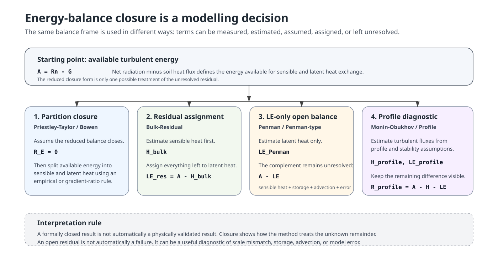

# Scientific background for fieldClim heat-flux methods

## Purpose of this vignette

This vignette explains the scientific and conceptual background of the
heat-flux methods implemented in `fieldClim`. It is not a numerical
benchmark and it is not an empirical validation against independent
turbulent-flux measurements. Its purpose is narrower: it explains what
each method family does with the surface energy balance, which terms are
measured or supplied as station inputs, which terms are estimated, which
terms are assumed through closure, and which terms remain unresolved.

`fieldClim` is designed for weather-station based microclimate and
micrometeorological analysis. Such stations may provide net radiation,
soil heat flux, air temperature, humidity and wind profiles, but they
usually do not provide the high-frequency wind and scalar data required
for full eddy-covariance processing. The package therefore implements
physically interpretable approximation and diagnostic methods rather
than a complete eddy-covariance workflow.

The central question is not which method is “the true” one. The central
question is how each method treats the unknown part of the energy
balance. Some methods force the available energy to be fully divided
between sensible and latent heat. Some estimate one flux first and
assign the remainder to the other flux. Some estimate only latent heat.
Some estimate profile-based turbulent fluxes and leave the remaining
energy-balance difference visible as a diagnostic residual.

## FieldClim scope and evidence boundary

Eddy covariance is often used as the direct field reference for
turbulent sensible and latent heat fluxes because it estimates turbulent
exchange from high-frequency covariance between vertical wind and scalar
fluctuations. However, eddy covariance is not a simple truth source. The
surface energy balance often does not close even at well-instrumented
flux sites. This problem has been documented for individual sites,
synthesis studies and FLUXNET-scale analyses. Reported causes include
storage terms, advection, landscape heterogeneity, footprint mismatch,
instrumental uncertainty, low-frequency turbulent motions and scale
mismatch between radiative, soil and turbulent-flux measurements.

This matters for `fieldClim`: if even direct turbulent-flux systems
frequently show energy-balance non-closure, then station-based
approximation methods must not be presented as if formal closure proves
physical correctness. Formal closure is a property of a method. It is
not, by itself, a validation result.

## Surface energy balance and package sign convention

The common reference point is the surface energy balance.
Microclimatological and micrometeorological texts use partly different
symbols for the same physical quantities. `fieldClim` uses
implementation names such as `rad_bal`, `soil_flux`, `sensible_*` and
`latent_*`. These are package fields and output names, not a separate
theoretical notation.

| Quantity | Common notation | fieldClim field or output | Positive direction or meaning in fieldClim |
|:---|:---|:---|:---|
| Net radiation | Q\* or Rn | rad_bal | net radiative energy input at the surface |
| Soil heat flux | B or G | soil_flux | heat flux into the soil |
| Sensible heat flux | H or L | sensible\_\* | heat flux away from the surface |
| Latent heat flux | LE or V | latent\_\* | heat flux away from the surface |
| Available turbulent energy | Q\* minus B; Rn minus G | rad_bal minus soil_flux | energy available for sensible and latent heat fluxes |

With storage and additional transport terms omitted, the reduced
teaching balance is:

\\ R_n = G + H + LE \\

Therefore the energy available for turbulent heat fluxes is:

\\ A = R_n - G \\

and the reduced closure form becomes:

\\ A = H + LE \\

In the teaching notation used in parts of the original `fieldClim`
material, the same balance is:

\\ Q^\* - B = L + V \\

The package convention is: `soil_flux` is consumed as a positive heat
flux into the soil, while positive sensible and latent heat fluxes are
interpreted as fluxes away from the surface.

## Energy-balance closure as a modelling decision

The reduced balance is easy to write down, but it is not automatically
observed in real field data. Radiation, soil heat flux, sensible heat
and latent heat are not measured at exactly the same place, at the same
effective footprint, with the same time response, or with the same
uncertainty. In addition, energy may be stored in the air column,
vegetation, biomass, water, litter or the upper soil layer. Energy may
also be transported horizontally by advection or by coherent structures
over heterogeneous terrain.

For this reason, the more honest diagnostic form is:

\\ R_E = A - H - LE \\

or equivalently:

\\ R_E = R_n - G - H - LE \\

Here, `R_E` is the unresolved energy-balance residual. It should not be
interpreted as one single physical flux. It is a mixed remainder. It may
include storage, advection, dispersive transport, footprint mismatch,
measurement error, timing mismatch, parameterization error and model
error.

The important point is that different method families treat this
remainder differently. They may use the same balance frame, but they do
not give the same status to all terms. Some terms are measured or
supplied as station inputs. Some are estimated by empirical or profile
equations. Some are assumed by forcing closure. Some are left
unresolved.

A simple non-meteorological way to read the problem is this: the
equation tells us what should add up. The method decides what to do when
not all parts are known.

## Energy-balance closure approaches in fieldClim

The heat-flux methods in `fieldClim` can be understood as four
energy-balance closure approaches.

### 1. Partition closure

Priestley-Taylor and Bowen-ratio methods are partitioning methods. They
assume that the available energy can be fully divided into sensible and
latent heat within the reduced balance:

\\ R_E = 0 \\

The method then decides how available energy is split between `H` and
`LE`. Priestley-Taylor uses an empirical evaporation relation. Bowen
uses a gradient-derived ratio between sensible and latent heat.

This means the balance is closed by construction. It does not mean that
the closure has been independently measured. The hidden uncertainty lies
in the empirical coefficient, the gradient ratio, the omitted storage
and advection terms, and the measurement/model inputs that define
available energy.

### 2. Residual assignment

Bulk-Residual uses a different logic. It first estimates sensible heat
as `H_bulk`. The remaining available energy is then assigned to latent
heat:

\\ LE\_{res} = A - H\_{bulk} \\

or:

\\ LE\_{res} = R_n - G - H\_{bulk} \\

Here latent heat is the residual term. Any error in net radiation, soil
heat flux or the bulk sensible-heat estimate is passed directly into
`LE_res`.

### 3. LE-only open balance

Penman and Penman-type methods estimate latent heat. In `fieldClim`, the
Penman path does not provide a paired package-defined sensible heat
flux. The remaining balance term is:

\\ R\_{Penman} = A - LE\_{Penman} \\

This remainder should not simply be called sensible heat. It may contain
sensible heat, storage, advection, dispersive exchange, footprint
mismatch and error terms.

### 4. Profile-diagnostic open balance

Monin-Obukhov and profile methods estimate turbulent fluxes from
profile, roughness and stability assumptions. They are not forced to
close the available energy balance. Their residual is:

\\ R\_{profile} = A - H\_{profile} - LE\_{profile} \\

This residual is useful. It shows whether the profile-based flux
estimates, the radiation balance and the soil heat flux are mutually
consistent. It should not be removed by forcing the method to close the
balance.

| Method family | What the method primarily does | Closed by construction? | Unknown or residual term | Interpretation rule |
|:---|:---|:---|:---|:---|
| Master balance | defines the accounting frame | no | energy-balance residual | the residual is a composite term, not one physical flux |
| Radiation and soil helpers | provides or models input terms | no | method-dependent downstream residual | input consistency controls all downstream balances |
| Priestley-Taylor | partitions available energy | yes | hidden in closure and empirical coefficient assumptions | formal closure is not physical validation |
| Bowen ratio | partitions available energy by a gradient-derived ratio | yes, only for finite uncapped cases | hidden in ratio, gradient and denominator assumptions | singular and capped cases must not be read as exact closure |
| Bulk-Residual | estimates sensible heat first and assigns the remainder | yes, if the bulk sensible heat estimate is finite | latent heat is the assigned residual | errors in radiation, soil heat flux or sensible heat enter the residual latent heat |
| Penman / Penman-type | estimates latent heat only | no | complement of latent heat remains unresolved | the complement may contain sensible heat, storage, advection and error |
| Monin-Obukhov / Profile | estimates fluxes from profile and stability assumptions | no | remaining energy-balance difference is diagnostic | do not force-close; use the residual as a diagnostic |

## Method families

### Priestley-Taylor path

The Priestley-Taylor path estimates latent heat flux from available
energy and an empirical coefficient. The implemented teaching path
follows the structure:

\\ LE\_{PT} = \alpha \frac{\Delta}{\Delta + \gamma} (R_n - G) \\

The corresponding sensible heat flux is the remaining available energy:

\\ H\_{PT} = (R_n - G) - LE\_{PT} \\

Therefore the closure invariant is:

\\ H\_{PT} + LE\_{PT} = R_n - G \\

This is useful for a beginner-safe workflow because it needs fewer
profile assumptions than Bowen or Monin-Obukhov and avoids the Penman
LE-only ambiguity. The limitation is also clear: Priestley-Taylor hides
much of the surface-atmosphere coupling in the coefficient `alpha` and
in helper terms such as the saturation-curve slope and the psychrometric
constant. It is stable and transparent for teaching, but it is not a
direct measurement of turbulent exchange.

### Bowen-ratio path

The Bowen-ratio method partitions available energy using the ratio of
sensible to latent heat flux:

\\ \beta = \frac{H}{LE} \\

If the ratio is known, the energy balance gives:

\\ H = \frac{\beta}{1 + \beta} (R_n - G) \\

and:

\\ LE = \frac{1}{1 + \beta} (R_n - G) \\

For finite uncapped denominators, the closure invariant is:

\\ H + LE = R_n - G \\

The implemented `fieldClim` Bowen ratio is based on a
potential-temperature gradient and an absolute-humidity gradient:

\\ \beta = \gamma\_{code} \frac{\Delta \theta / \Delta z}{\Delta AH /
\Delta z} \\

where:

\\ \gamma\_{code} = 0.00066 (1 + 0.000946 t_1) \\

The important documentation point is that this is not merely a
symbol-only formula. The implementation converts air temperature to
potential temperature, converts relative humidity to absolute humidity,
and then forms the gradient ratio.

The Bowen path is physically meaningful when gradients are resolved and
representative. It is also fragile: small humidity gradients, sign
changes and near-zero values of the denominator can create very large
fluxes. Numerical caps are safeguards. When a cap is active, exact
closure should not be claimed.

### Bulk-Residual path

The Bulk-Residual path combines a wind- and temperature-gradient
estimate of sensible heat flux with a residual latent heat flux. It is
not a direct flux measurement. It is a station-data approximation in the
aerodynamic-resistance family.

The sensible heat calculation follows the general form:

\\ H\_{bulk} = \rho c_p \frac{\Delta T}{r_a} \\

with:

\\ \Delta T = T_1 - T_2 \\

A simple neutral resistance formulation is:

\\ r_a = \frac{\ln(z_2 / z_1)}{k u\_{scale}} \\

The current package default uses a wind-speed scale based on observed
wind speed. If two wind heights are available, the default uses the
arithmetic mean of `v1` and `v2`; otherwise it uses `v1`.

A two-height station can also support a neutral profile-derived friction
velocity:

\\ u\_\* = k \frac{u_2 - u_1}{\ln(z_2 / z_1)} \\

and then:

\\ r_a = \frac{\ln(z_2 / z_1)}{k u\_\*} \\

This is conceptually stronger when the two-height wind profile is
reliable, but it is not automatically more robust. If the wind-speed
difference is small, noisy or changes sign, the estimated friction
velocity becomes unstable. A roughness-derived friction velocity is also
possible when only one wind speed is available, but it then depends on
roughness length assumptions from surface type or obstacle height.

The residual latent heat flux is:

\\ LE\_{res} = R_n - G - H\_{bulk} \\

Therefore the Bulk-Residual workflow closes available energy by
construction:

\\ H\_{bulk} + LE\_{res} = R_n - G \\

This closure is algebraic. It does not prove that `H_bulk` is a perfect
physical estimate. It means that the residual latent heat flux inherits
all errors in `Rn`, `G` and the bulk sensible heat estimate.

### Penman-type latent heat path

The Penman family combines an energy term and an aerodynamic
vapour-pressure term. In `fieldClim`,
[`latent_penman()`](https://gisma.github.io/migration-fieldclim/reference/latent_penman.md)
is a latent-heat method only. It does not return a paired sensible heat
flux.

The package convention keeps the energy term as:

\\ R_n - G \\

The Penman path uses saturation vapour pressure, actual vapour pressure,
vapour-pressure deficit, slope of the saturation curve, psychrometric
terms and resistance assumptions. Conceptually, it asks how much latent
heat exchange is implied by radiation, atmospheric demand and resistance
terms. It does not answer, inside this package, how the remaining
available energy is divided between sensible heat and unresolved storage
or transport terms.

The relevant package distinction is:

\\ \text{Penman path} = LE \text{ only} \\

There is no package-defined `H_Penman`. The complementary term is:

\\ R\_{Penman} = R_n - G - LE\_{Penman} \\

This should be interpreted as an unresolved complement, not as measured
sensible heat.

### Monin-Obukhov and profile methods

Monin-Obukhov similarity theory and related profile-gradient methods
attempt to represent turbulent transfer through vertical gradients,
roughness, stability and surface-layer scaling. In package
interpretation, the Monin/Profile path is diagnostic-only.

The diagnostic rule is:

\\ H\_{profile} + LE\_{profile} \\

is not required to equal:

\\ R_n - G \\

The residual is:

\\ R\_{profile} = R_n - G - H\_{profile} - LE\_{profile} \\

This is not a defect. It is a consequence of method class. A profile
method estimates turbulent fluxes from profile and stability
assumptions, while Priestley-Taylor, Bowen and Bulk-Residual are
explicit energy-partition or residual workflows.

The practical issue is numerical robustness. Zero gradients, very small
wind shear, invalid height relationships and unstable stability
functions can produce extreme outputs. For this reason, Monin-Obukhov
outputs should be interpreted together with stability classification and
diagnostic warnings. They should not be silently normalized to available
energy.

## Direct flux measurements and closure literature

The closure interpretation above is not a package-specific bookkeeping
trick. It follows the broader micrometeorological literature on surface
energy balance closure.

Foken (2008) gives an overview of the energy-balance closure problem and
argues that non-closure cannot be reduced to simple measurement error or
storage alone. Larger-scale exchange processes over heterogeneous
landscapes are central to the problem. Wilson et al. (2002) evaluated
energy balance closure across 22 FLUXNET sites and 50 site-years,
showing that closure is a network-scale issue rather than a local
anomaly. Leuning et al. (2012) describe the surface energy imbalance
problem as a mismatch between turbulent fluxes and available energy, and
discuss advective flux divergence and related explanations. Mauder et
al. (2024) revisit FLUXNET energy-balance closure and explicitly treat
closure as a continuing uncertainty for heat and water-vapour flux
assessments.

For `fieldClim`, the consequence is direct: closure tests are necessary
implementation contracts, but they are not empirical validation. A
method can close exactly because its equations force closure. Another
method can leave a residual because it is diagnostic. Neither status
alone proves that the flux estimate is physically correct or incorrect.

## Practical interpretation in fieldClim

The methods should be read as complementary diagnostics.

Priestley-Taylor is the most stable teaching path. It partitions
available energy with few profile assumptions and closes exactly by
construction.

Bowen is a gradient-ratio partition method. It is physically meaningful
when gradients are well resolved, but it is highly sensitive to small
humidity gradients and near-singular denominators.

Bulk-Residual is transparent and uses directly available station data:
temperature gradient, wind speed, net radiation and soil heat flux. Its
latent heat flux is residual and therefore closes exactly, but the
sensible heat component is a simplified neutral bulk estimate.

Penman is a latent-heat-only combination method. It should be used as an
`LE` estimate, not as an energy-closing `H` and `LE` pair.

Monin-Obukhov/Profile is a diagnostic profile and stability path. It is
methodologically important, but its output should be checked for
zero-gradient, low-wind and stability singularities. It should not be
forced to close available energy.

A robust package summary is therefore:

> `fieldClim` implements common micrometeorological approximation
> families for heat-flux analysis from weather-station data.
> Priestley-Taylor, Bowen-ratio, Penman-type, bulk-resistance/residual
> and Monin-Obukhov/profile methods differ in data requirements and
> assumptions. Some methods close the available energy by construction;
> others are latent-heat-only or diagnostic profile estimates. Formal
> closure is not physical validation, and open residuals can be
> diagnostically meaningful.

## References

Ala-Konni, J., Mammarella, I., Ojala, A., et al. (2022). Validation of
turbulent heat transfer models against eddy-covariance flux measurements
over a seasonally ice-covered lake. *Geoscientific Model Development*,
15, 4739-4755. <https://doi.org/10.5194/gmd-15-4739-2022>

Allen, R. G., Pereira, L. S., Raes, D., & Smith, M. (1998). *Crop
evapotranspiration: Guidelines for computing crop water requirements*.
FAO Irrigation and Drainage Paper 56. Food and Agriculture Organization
of the United Nations.

Billesbach, D. P., Arkebauer, T. J., Walters, D. T., & Verma, S. B.
(2024). Intercomparison of sensible and latent heat flux measurements
from combined eddy covariance, energy balance, and Bowen ratio methods
above a grassland prairie. *Scientific Reports*, 14, 21486.
<https://doi.org/10.1038/s41598-024-67911-z>

Foken, T. (2006). 50 years of the Monin-Obukhov similarity theory.
*Boundary-Layer Meteorology*, 119, 431-447.
<https://doi.org/10.1007/s10546-006-9048-6>

Foken, T. (2008). The energy balance closure problem: An overview.
*Ecological Applications*, 18(6), 1351-1367.
<https://doi.org/10.1890/06-0922.1>

Leuning, R., van Gorsel, E., Massman, W. J., & Isaac, P. R. (2012).
Reflections on the surface energy imbalance problem. *Agricultural and
Forest Meteorology*, 156, 65-74.
<https://doi.org/10.1016/j.agrformet.2011.12.002>

Mauder, M., Jung, M., Stoy, P., et al. (2024). Energy balance closure at
FLUXNET sites revisited. *Agricultural and Forest Meteorology*, 358,
110235. <https://doi.org/10.1016/j.agrformet.2024.110235>

Penman, H. L. (1948). Natural evaporation from open water, bare soil and
grass. *Proceedings of the Royal Society of London. Series A*, 193,
120-145. <https://doi.org/10.1098/rspa.1948.0037>

Priestley, C. H. B., & Taylor, R. J. (1972). On the assessment of
surface heat flux and evaporation using large-scale parameters. *Monthly
Weather Review*, 100(2), 81-92.
<https://doi.org/10.1175/1520-0493(1972)100%3C0081:OTAOSH%3E2.3.CO;2>

Prueger, J. H., & Kustas, W. P. (2005). Aerodynamic methods for
estimating turbulent fluxes. In J. L. Hatfield & J. M. Baker (Eds.),
*Micrometeorology in agricultural systems*. Agronomy Monograph 47. ASA,
CSSA and SSSA.

Wilson, K., Goldstein, A., Falge, E., et al. (2002). Energy balance
closure at FLUXNET sites. *Agricultural and Forest Meteorology*, 113,
223-243. <https://doi.org/10.1016/S0168-1923(02)00109-0>
