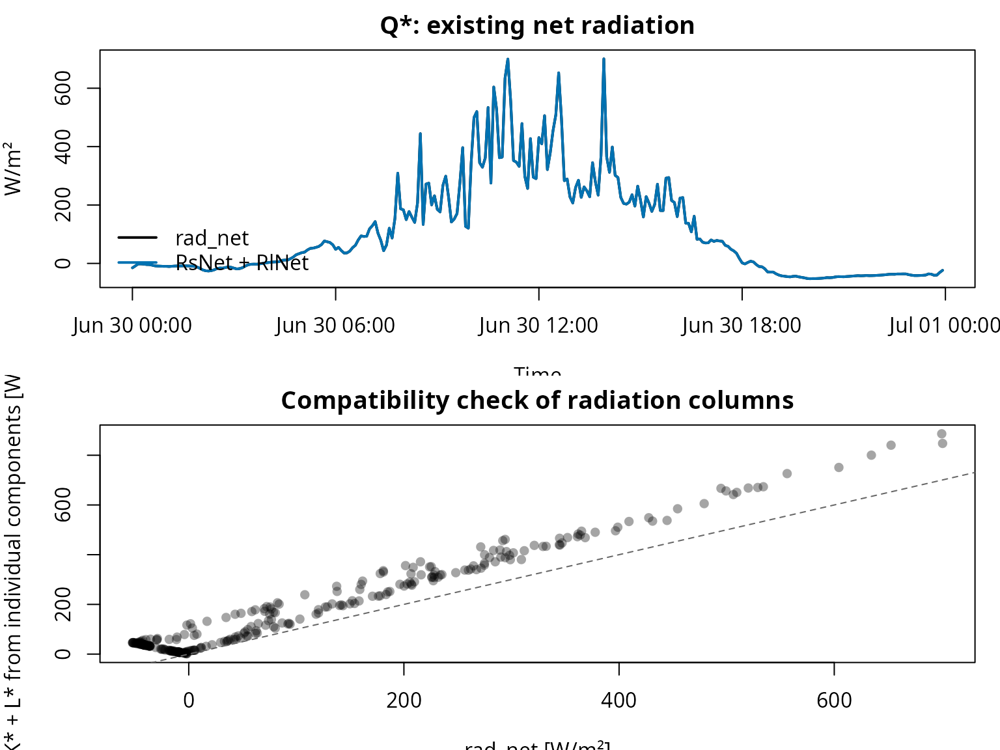
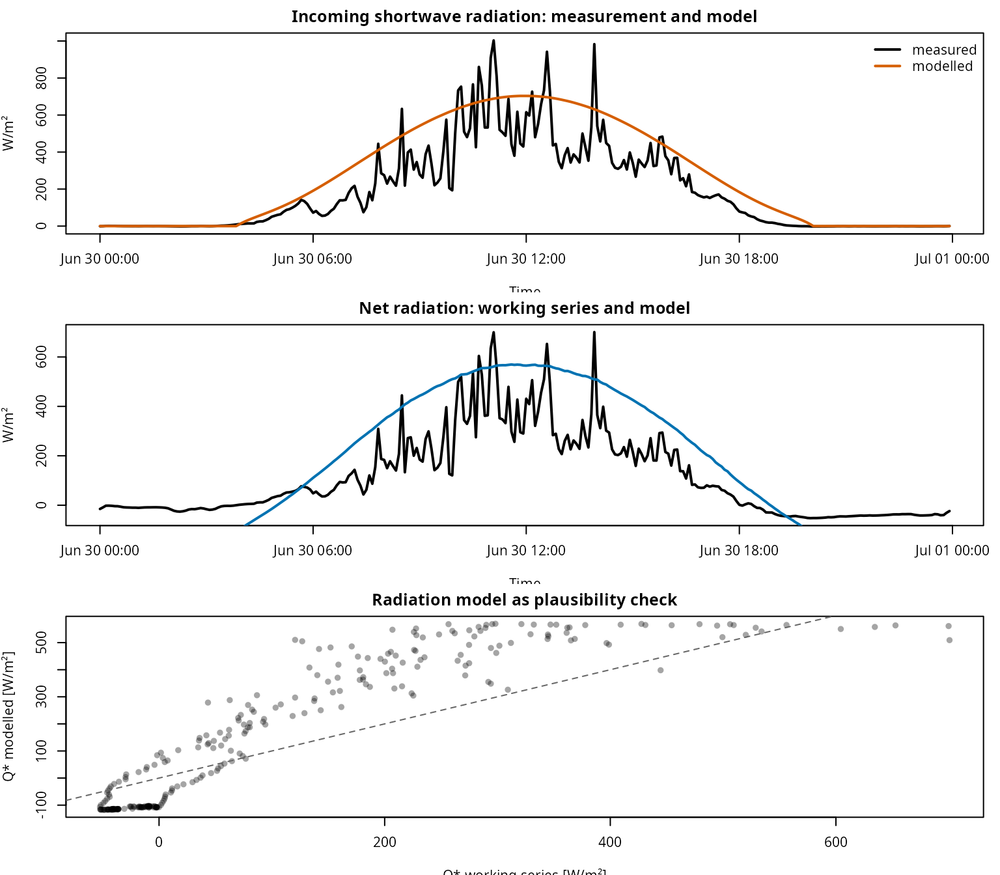
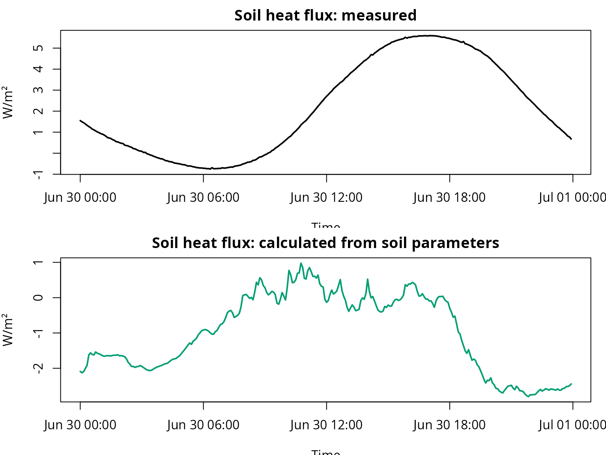
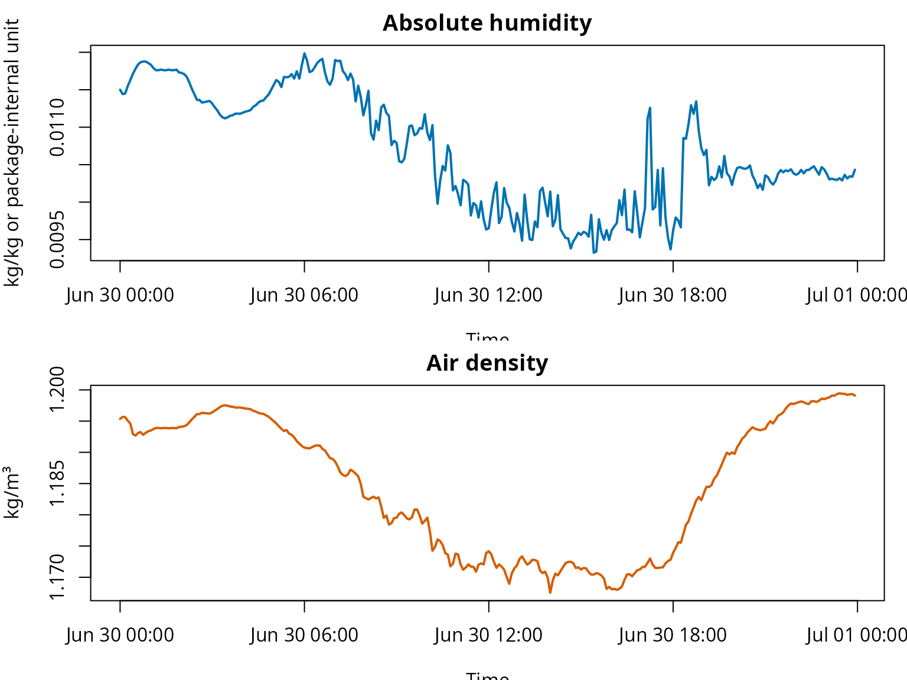
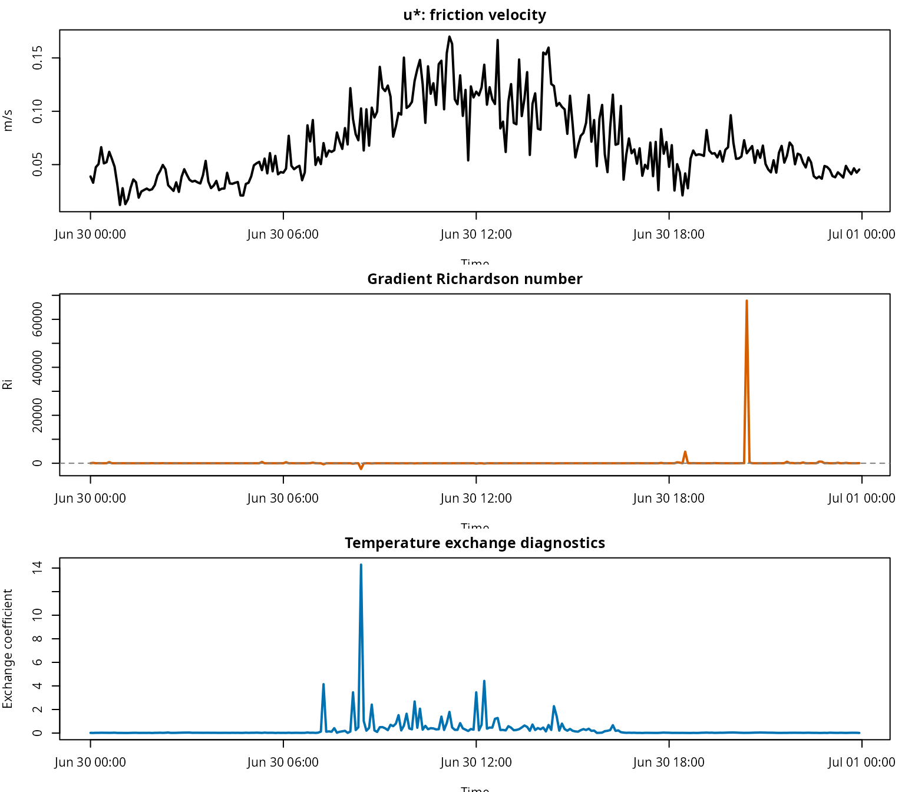
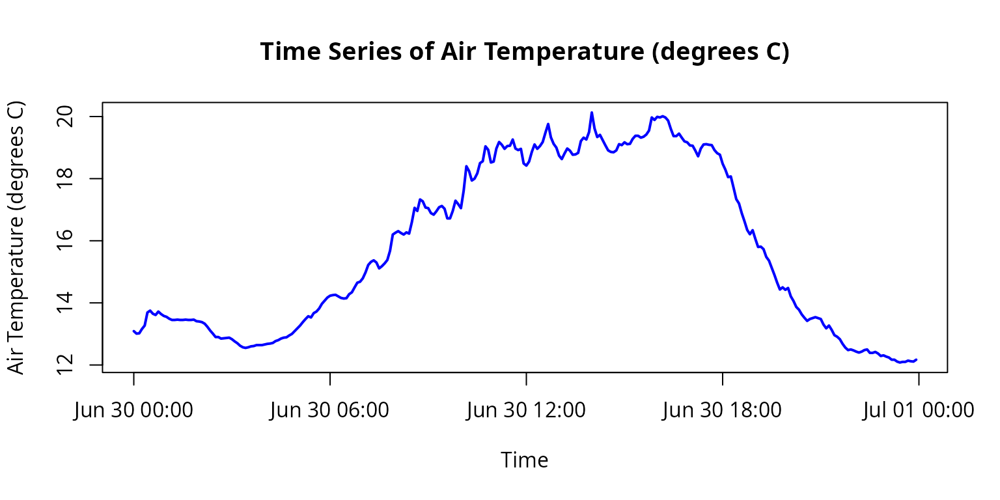

# fieldClim: Follow-up workflows and additional package functions

## Aim of this vignette

This vignette complements the energy-balance workflow vignette. That
vignette focuses on the coherent Caldern workflow with \\Q^{\*}\\,
\\B\\, \\L\\, and \\V\\. This page presents the additional package
functions as **follow-up workflows**: radiation checks, modelled
radiation, soil parameters, meteorological helper variables, stability
variables, and object control.

The text is not a second comparison of methods. The central question
here is: Which groups of functions exist beyond the main workflow, what
are they practically useful for, and which limitations must be
considered when applying them?

| Module | Guiding question | Package area |
|----|----|----|
| 0 | How does the package work in general? | `weather_station`, default methods, S3 methods |
| 1 | How can radiation time series be checked without silently replacing measurements? | `rad_*`, measurement columns, time-series checks |
| 2 | How can radiation be modelled when measurements are missing or when a plausibility benchmark is needed? | `sol_*`, `trans_*`, `terr_*`, `rad_*` |
| 3 | How are soil parameters and soil heat flux handled? | `soil_*` |
| 4 | Which helper variables are needed for humidity, pressure, and temperature? | `hum_*`, `pres_*`, `temp_*` |
| 5 | How are the wind profile, Richardson number, and stability variables checked? | `turb_*`, `bound_*` |
| 6 | How is a `weather_station` object checked, plotted, and exported? | [`build_weather_station()`](https://gisma.github.io/migration-fieldclim/reference/build_weather_station.md), [`plot_weather_station()`](https://gisma.github.io/migration-fieldclim/reference/plot_weather_station.md), [`as.data.frame()`](https://rdrr.io/r/base/as.data.frame.html) |

This vignette is a package map with executable mini examples. It does
not replace a complete physical derivation, nor does it provide
validation against independent flux measurements. Its purpose is to show
which package functions fit which workflow steps.

## Shared data and object setup

All modules use the same small teaching dataset. The dataset is included
in the installed package under `inst/extdata/`.

``` r

# Load fieldClim.
library(fieldClim)

# Path to the included teaching file.
caldern_file <- system.file(
  "extdata",
  "caldern_wiese_2017-06-30.csv",
  package = "fieldClim"
)

# Read the CSV file.
# "NULL", "NA", and empty entries are treated as missing values.
caldern <- read.csv(
  caldern_file,
  na.strings = c("NULL", "NA", "")
)

# Interpret timestamps explicitly as local station time.
caldern$datetime <- as.POSIXct(
  caldern$datetime,
  format = "%Y-%m-%d %H:%M:%S",
  tz = "Europe/Berlin"
)

# The solar and radiation functions can work with POSIXct timestamps.
# The time zone therefore remains explicitly set.
# Basic checks.
nrow(caldern)
#> [1] 288
range(caldern$datetime)
#> [1] "2017-06-30 00:00:00 CEST" "2017-06-30 23:55:00 CEST"
summary(diff(caldern$datetime))
#> Time differences in mins
#>    Min. 1st Qu.  Median    Mean 3rd Qu.    Max. 
#>       5       5       5       5       5       5
names(caldern)
#>  [1] "record"         "datetime"       "Ta_2m"          "Huma_2m"       
#>  [5] "Ta_10m"         "Huma_10m"       "Windspeed_2m"   "Windspeed_10m" 
#>  [9] "rad_sw_in"      "rad_sw_out"     "RsNet"          "RlNet"         
#> [13] "rad_net"        "LUpCo"          "LDnCo"          "water_vol_soil"
#> [17] "Ts"             "heatflux_soil"  "PCP"
```

``` r

# A weather_station object combines measurements, location, and model assumptions.
# This object can be passed to many package functions.
ws <- build_weather_station(
  datetime = caldern$datetime,
  lon = 8.6832,
  lat = 50.8405,
  elev = 261,

  temp = caldern$Ta_2m,
  rh = caldern$Huma_2m,

  t1 = caldern$Ta_2m,
  t2 = caldern$Ta_10m,
  hum1 = caldern$Huma_2m,
  hum2 = caldern$Huma_10m,

  v1 = caldern$Windspeed_2m,
  v2 = caldern$Windspeed_10m,
  z1 = 2,
  z2 = 10,

  slope = 0,
  exposition = 0,
  valley = FALSE,

  surface_type = "field",
  surface_temp = caldern$Ts,

  texture = "peat",
  moisture = caldern$water_vol_soil,

  rad_bal = caldern$rad_net,
  soil_flux = caldern$heatflux_soil,

  soil_temp1 = caldern$Ts,
  soil_temp2 = caldern$Ta_2m,
  soil_depth1 = 0.25,
  soil_depth2 = 0,

  obs_height = 2
)

class(ws)
#> [1] "weather_station"
names(ws)
#>  [1] "datetime"     "lon"          "lat"          "elev"         "temp"        
#>  [6] "rh"           "t1"           "t2"           "hum1"         "hum2"        
#> [11] "v1"           "v2"           "z1"           "z2"           "slope"       
#> [16] "exposition"   "valley"       "surface_type" "surface_temp" "texture"     
#> [21] "moisture"     "rad_bal"      "soil_flux"    "soil_temp1"   "soil_temp2"  
#> [26] "soil_depth1"  "soil_depth2"  "obs_height"
```

**Interpretation.** The `weather_station` object is the central working
container of the package. Many functions have two usage forms: a default
method with individual arguments and a method for `weather_station`. The
object-based route is useful as soon as several functions need the same
measurements, site data, and surface assumptions.

## Workflow module 0: Default method or weather_station method?

Almost every central function can be used directly with individual
arguments or with a `weather_station` object.

``` r

# Default method: all required arguments are provided individually.
pres_p(elev = 261, temp = 20)
#> [1] 982.884

# Object method: the function reads the required variables from the weather_station object.
pres_p(ws)
#>   [1] 982.1623 982.1537 982.1548 982.1697 982.1815 982.2263 982.2327 982.2220
#>   [9] 982.2178 982.2295 982.2210 982.2146 982.2114 982.2050 982.2007 982.2007
#>  [17] 982.2018 982.2007 982.2007 982.2018 982.2007 982.2007 982.2018 982.1964
#>  [25] 982.1954 982.1932 982.1879 982.1772 982.1644 982.1537 982.1419 982.1419
#>  [33] 982.1366 982.1376 982.1387 982.1398 982.1344 982.1269 982.1205 982.1119
#>  [41] 982.1066 982.1044 982.1066 982.1098 982.1109 982.1141 982.1141 982.1141
#>  [49] 982.1162 982.1184 982.1194 982.1216 982.1280 982.1312 982.1366 982.1398
#>  [57] 982.1409 982.1473 982.1526 982.1623 982.1719 982.1815 982.1932 982.2039
#>  [65] 982.2135 982.2092 982.2242 982.2295 982.2401 982.2561 982.2667 982.2773
#>  [73] 982.2837 982.2858 982.2869 982.2816 982.2762 982.2741 982.2752 982.2890
#>  [81] 982.2953 982.3123 982.3282 982.3313 982.3430 982.3630 982.3884 982.3989
#>  [89] 982.4042 982.3968 982.3768 982.3841 982.3936 982.4052 982.4367 982.4913
#>  [97] 982.4976 982.5028 982.4965 982.4913 982.4986 982.4944 982.5331 982.5810
#> [105] 982.5706 982.6091 982.6029 982.5821 982.5800 982.5633 982.5581 982.5696
#> [113] 982.5831 982.5873 982.5779 982.5456 982.5456 982.5706 982.6049 982.5935
#> [121] 982.5800 982.6382 982.7198 982.7033 982.6723 982.6785 982.6961 982.7302
#> [129] 982.7363 982.7857 982.7744 982.7322 982.7353 982.7785 982.8001 982.7908
#> [137] 982.7775 982.7867 982.7878 982.8083 982.7785 982.7734 982.7775 982.7291
#> [145] 982.7219 982.7353 982.7672 982.7919 982.7775 982.7867 982.8001 982.8308
#> [153] 982.8594 982.8154 982.7939 982.7816 982.7549 982.7435 982.7621 982.7785
#> [161] 982.7713 982.7580 982.7590 982.7641 982.8031 982.8144 982.8083 982.8329
#> [169] 982.8972 982.8451 982.8165 982.8236 982.8062 982.7888 982.7723 982.7672
#> [177] 982.7662 982.7723 982.7929 982.7898 982.7990 982.7929 982.7939 982.8103
#> [185] 982.8206 982.8206 982.8144 982.8175 982.8247 982.8380 982.8809 982.8727
#> [193] 982.8829 982.8809 982.8850 982.8809 982.8707 982.8431 982.8195 982.8195
#> [201] 982.8277 982.8144 982.8021 982.7990 982.7888 982.7878 982.7713 982.7528
#> [209] 982.7785 982.7919 982.7929 982.7908 982.7898 982.7734 982.7631 982.7580
#> [217] 982.7281 982.7085 982.6837 982.6858 982.6485 982.6101 982.5956 982.5633
#> [225] 982.5362 982.5070 982.4923 982.5059 982.4766 982.4493 982.4504 982.4420
#> [233] 982.4157 982.4031 982.3789 982.3546 982.3282 982.3049 982.3123 982.3038
#> [241] 982.3102 982.2816 982.2656 982.2454 982.2359 982.2199 982.2082 982.1975
#> [249] 982.2039 982.2071 982.2103 982.2071 982.2039 982.1847 982.1719 982.1815
#> [257] 982.1665 982.1484 982.1430 982.1344 982.1184 982.1055 982.0969 982.0990
#> [265] 982.0958 982.0915 982.0883 982.0915 982.0969 982.0990 982.0872 982.0872
#> [273] 982.0905 982.0851 982.0765 982.0786 982.0743 982.0711 982.0636 982.0636
#> [281] 982.0571 982.0539 982.0560 982.0560 982.0604 982.0582 982.0571 982.0636
```

**Interpretation.** The default method is useful for individual tests
and for tracing formulas. The `weather_station` method is better for
workflows because it carries the same data structure through several
calculation steps.

## Workflow module 1: Check radiation time series and define the working variable

Radiation time series are often the most important input for
energy-balance calculations. Before \\Q^{\*}\\ is used as net radiation,
the components must be checked.

The shortwave balance is:

\\ K^{\*} = K\_{\downarrow} - K\_{\uparrow} \\

with:

- \\K^{\*}\\: shortwave balance \[W/m²\]
- \\K\_{\downarrow}\\: incoming shortwave radiation \[W/m²\]
- \\K\_{\uparrow}\\: reflected shortwave radiation \[W/m²\]

The longwave balance is written here in the same direction:

\\ L^{\*} = L\_{\downarrow} - L\_{\uparrow} \\

with:

- \\L^{\*}\\: longwave balance \[W/m²\]
- \\L\_{\downarrow}\\: incoming longwave radiation \[W/m²\]
- \\L\_{\uparrow}\\: longwave emission from the surface \[W/m²\]

The net radiation is theoretically given by:

\\ Q^{\*} = K^{\*} + L^{\*} \\

with:

- \\Q^{\*}\\: net radiation or radiation balance \[W/m²\]

### 1.1 Calculate components and compare them with stored net columns

``` r

# Shortwave components from measurement columns.
caldern$K_down <- caldern$rad_sw_in
caldern$K_up <- caldern$rad_sw_out
caldern$K_star_from_components <- caldern$K_down - caldern$K_up

# Longwave components from measurement columns.
caldern$L_down <- caldern$LDnCo
caldern$L_up <- caldern$LUpCo
caldern$L_star_down_minus_up <- caldern$L_down - caldern$L_up
caldern$L_star_up_minus_down <- caldern$L_up - caldern$L_down

# Check against existing net columns.
shortwave_check <- summary(caldern$K_star_from_components - caldern$RsNet)
longwave_check_down_up <- summary(caldern$L_star_down_minus_up - caldern$RlNet)
longwave_check_up_down <- summary(caldern$L_star_up_minus_down - caldern$RlNet)

shortwave_check
#>      Min.   1st Qu.    Median      Mean   3rd Qu.      Max. 
#> -0.400000  0.000000  0.000000  0.004208  0.001000  0.500000
longwave_check_down_up
#>    Min. 1st Qu.  Median    Mean 3rd Qu.    Max. 
#>   3.595  32.337  78.015  74.076 100.468 187.400
longwave_check_up_down
#>      Min.   1st Qu.    Median      Mean   3rd Qu.      Max. 
#> -0.090000 -0.030000  0.000000 -0.001698  0.030000  0.100000
```

**Interpretation.** This step checks which column definition is
consistent. If `rad_sw_in - rad_sw_out` matches `RsNet` well, the
shortwave balance is clear. For the longwave balance, the sign direction
must be checked. Depending on whether `LDnCo - LUpCo` or `LUpCo - LDnCo`
matches `RlNet` better, a different convention is present.

### 1.2 Check net radiation from net columns and individual components

``` r

# Variant A: net radiation from stored net columns.
caldern$Q_star_from_net_columns <- caldern$RsNet + caldern$RlNet

# Variant B: net radiation from individual components.
caldern$Q_star_from_components <- caldern$K_star_from_components +
  caldern$L_star_down_minus_up

# Existing net radiation.
caldern$Q_star_measured <- caldern$rad_net

# Check differences.
summary(caldern$Q_star_from_net_columns - caldern$Q_star_measured)
#>      Min.   1st Qu.    Median      Mean   3rd Qu.      Max. 
#> -0.100000 -0.010000  0.000000 -0.002542  0.005000  0.100000
summary(caldern$Q_star_from_components - caldern$Q_star_measured)
#>    Min. 1st Qu.  Median    Mean 3rd Qu.    Max. 
#>   3.595  32.331  78.013  74.078 100.515 187.700
```

``` r

op <- par(mfrow = c(2, 1), mar = c(3.5, 4, 2, 1))

plot(
  caldern$datetime,
  caldern$Q_star_measured,
  type = "l",
  col = "#000000",
  lwd = 2,
  xlab = "Time",
  ylab = "W/m²",
  main = "Q*: existing net radiation"
)

lines(caldern$datetime, caldern$Q_star_from_net_columns, col = "#0072B2", lwd = 2)

legend(
  "bottomleft",
  legend = c("rad_net", "RsNet + RlNet"),
  col = c("#000000", "#0072B2"),
  lty = 1,
  lwd = 2,
  bty = "n"
)

plot(
  caldern$Q_star_measured,
  caldern$Q_star_from_components,
  pch = 16,
  col = rgb(0, 0, 0, 0.35),
  xlab = "rad_net [W/m²]",
  ylab = "K* + L* from individual components [W/m²]",
  main = "Compatibility check of radiation columns"
)

abline(0, 1, lty = 2, col = "grey40")
```



``` r


par(op)
```

**Interpretation.** This module is a data-validation workflow. The
package functions can only be used meaningfully when it is clear which
radiation variable is used as the working variable. If `rad_net`,
`RsNet + RlNet`, and `K* + L*` diverge, a new net radiation series is
not created automatically. Instead, the first step is to document which
column represents which balance level.

### 1.3 Define the radiation time series for further calculations

``` r

# Working decision:
# For energy-balance workflows, the existing rad_net column is used.
# The other variants remain diagnostic variables.
caldern$Q_star <- caldern$Q_star_measured

# Document summary statistics of the differences.
radiation_decision <- data.frame(
  Comparison = c(
    "RsNet + RlNet against rad_net",
    "K* + L* against rad_net"
  ),
  Mean_deviation = c(
    mean(caldern$Q_star_from_net_columns - caldern$Q_star_measured, na.rm = TRUE),
    mean(caldern$Q_star_from_components - caldern$Q_star_measured, na.rm = TRUE)
  ),
  Max_abs_deviation = c(
    max(abs(caldern$Q_star_from_net_columns - caldern$Q_star_measured), na.rm = TRUE),
    max(abs(caldern$Q_star_from_components - caldern$Q_star_measured), na.rm = TRUE)
  )
)

radiation_decision[, -1] <- round(radiation_decision[, -1], 1)
radiation_decision
#>                      Comparison Mean_deviation Max_abs_deviation
#> 1 RsNet + RlNet against rad_net            0.0               0.1
#> 2       K* + L* against rad_net           74.1             187.7
```

**Interpretation.** This is the actual “fix”: do not silently overwrite
values, but define a working series and keep the alternatives as
diagnostic variables. When heat fluxes are calculated later, it remains
transparent which version of \\Q^{\*}\\ was used.

### 1.4 Check time lag

A time lag of one 5-minute step can create large deviations in radiation
data.

``` r

# Mean absolute deviation without lag.
diff_0 <- mean(abs(
  caldern$Q_star_from_components - caldern$Q_star_measured
), na.rm = TRUE)

# Compare the component sum one step later against rad_net.
diff_plus <- mean(abs(
  caldern$Q_star_from_components[-1] -
    caldern$Q_star_measured[-length(caldern$Q_star_measured)]
), na.rm = TRUE)

# Compare the component sum one step earlier against rad_net.
diff_minus <- mean(abs(
  caldern$Q_star_from_components[-length(caldern$Q_star_from_components)] -
    caldern$Q_star_measured[-1]
), na.rm = TRUE)

lag_check <- data.frame(
  Comparison = c(
    "without lag",
    "components +1 step",
    "components -1 step"
  ),
  mean_absolute_deviation = c(diff_0, diff_plus, diff_minus)
)

lag_check$mean_absolute_deviation <- round(
  lag_check$mean_absolute_deviation,
  1
)

lag_check
#>           Comparison mean_absolute_deviation
#> 1        without lag                    74.1
#> 2 components +1 step                    83.4
#> 3 components -1 step                    85.8
```

**Interpretation.** If a shifted comparison becomes clearly better, a
timestamp or aggregation problem is likely. If it does not improve, this
points more toward different column definitions, correction levels, or
sign conventions.

## Workflow module 2: Model radiation instead of only measuring it

The radiation functions can be used to check the plausibility of
measurements or to model missing radiation components. The package
workflow follows a chain:

| Subproblem | Function family | Role |
|----|----|----|
| Solar position | `sol_*` | Day angle, solar elevation, azimuth |
| Atmospheric attenuation | `trans_*` | Air mass, gas, ozone, Rayleigh, water-vapour, and aerosol transmission |
| Terrain | `terr_*` | Terrain and sky-view geometry |
| Radiation | `rad_*` | Shortwave, diffuse, longwave, and net radiation |

``` r

# Example timestamp for an individual test.
# POSIXct is deliberately retained here; the current package version handles
# POSIXct/POSIXlt consistently.
example_time <- as.POSIXct("2017-06-30 12:00:00", tz = "Europe/Berlin")

# Location and assumptions.
lon <- 8.6832
lat <- 50.8405
elev <- 261
temp <- 20
rh <- 60
slope <- 0
exposition <- 0
valley <- FALSE
surface_type <- "field"
surface_temp <- 20

# Solar and topographic partial variables.
sol_elevation(example_time, lon, lat)
#> [1] 62.36272
sol_azimuth(example_time, lon, lat)
#> [1] 181.1272
terr_sky_view(slope, valley)
#> [1] 1

# Modelled shortwave and longwave radiation.
rad_sw_in(example_time, lon, lat, elev, temp, slope, exposition)
#> [1] 704.2516
rad_sw_bal(example_time, lon, lat, elev, temp, slope, exposition, valley, surface_type)
#> [1] 673.2495
rad_lw_bal(temp, rh, slope, valley, surface_type, surface_temp)
#> [1] -105.0535

# Modelled net radiation.
rad_bal(
  example_time, lon, lat, elev, temp, rh,
  slope, exposition, valley, surface_type, surface_temp
)
#> [1] 568.196
```

**Interpretation.** This module is relevant when radiation components
are missing or when measurements need to be checked against a plausible
order of magnitude. Modelled radiation is not an automatic replacement
measurement here. It is a benchmark: if the diurnal cycle and magnitude
roughly agree, this supports a consistent time basis and realistic site
assumptions. If measurement and model diverge strongly, the first checks
should address time zone, surface type, terrain parameters, sensor
processing, or differently defined radiation components. The time basis
is technically important here: the current package version handles
POSIXct and POSIXlt timestamps consistently. The key point remains that
the time zone must be set explicitly because solar position and
radiation depend on local time.

### 2.1 Compare measured and modelled radiation as a diurnal cycle

``` r

# Modelled incoming shortwave radiation for the full teaching day.
# The function is vectorised over the POSIXct time axis.
caldern$K_down_model <- rad_sw_in(
  caldern$datetime,
  lon, lat, elev, caldern$Ta_2m,
  slope, exposition
)

# Modelled shortwave balance.
caldern$K_star_model <- rad_sw_bal(
  caldern$datetime,
  lon, lat, elev, caldern$Ta_2m,
  slope, exposition, valley, surface_type
)

# Modelled longwave balance.
caldern$L_star_model <- rad_lw_bal(
  caldern$Ta_2m,
  caldern$Huma_2m,
  slope,
  valley,
  surface_type,
  caldern$Ts
)

# Modelled net radiation.
caldern$Q_star_model <- rad_bal(
  caldern$datetime,
  lon, lat, elev, caldern$Ta_2m, caldern$Huma_2m,
  slope, exposition, valley, surface_type, caldern$Ts
)
```

``` r

op <- par(mfrow = c(3, 1), mar = c(3.5, 4, 2, 1))

plot(
  caldern$datetime,
  caldern$K_down,
  type = "l",
  col = "#000000",
  lwd = 2,
  xlab = "Time",
  ylab = "W/m²",
  main = "Incoming shortwave radiation: measurement and model"
)
lines(caldern$datetime, caldern$K_down_model, col = "#D55E00", lwd = 2)
legend(
  "topright",
  legend = c("measured", "modelled"),
  col = c("#000000", "#D55E00"),
  lty = 1,
  lwd = 2,
  bty = "n"
)

plot(
  caldern$datetime,
  caldern$Q_star,
  type = "l",
  col = "#000000",
  lwd = 2,
  xlab = "Time",
  ylab = "W/m²",
  main = "Net radiation: working series and model"
)
lines(caldern$datetime, caldern$Q_star_model, col = "#0072B2", lwd = 2)

plot(
  caldern$Q_star,
  caldern$Q_star_model,
  pch = 16,
  col = rgb(0, 0, 0, 0.35),
  xlab = "Q* working series [W/m²]",
  ylab = "Q* modelled [W/m²]",
  main = "Radiation model as plausibility check"
)
abline(0, 1, lty = 2, col = "grey40")
```



``` r


par(op)
```

**Interpretation.** Modelled radiation does not automatically replace
measurement. It helps identify whether measurement series are temporally
plausible and whether terrain, surface, or transmission assumptions
produce realistic orders of magnitude.

## Workflow module 3: Soil parameters and soil heat flux

Soil heat flux can be measured or estimated from the temperature
gradient, depth, moisture, and soil texture. The package workflow is:

\\ B = -\lambda_s \frac{T_1 - T_2}{z_1 - z_2} \\

with:

- \\B\\: soil heat flux \[W/m²\]
- \\\lambda_s\\: soil thermal conductivity \[W/(m K)\]
- \\T_1\\: soil temperature at depth \\z_1\\ \[°C or K\]
- \\T_2\\: temperature at the second depth or at the surface \\z_2\\
  \[°C or K\]
- \\z_1\\: depth of the first sensor \[m\]
- \\z_2\\: depth of the second reference \[m\]

``` r

# Thermal conductivity for the selected soil texture and moisture.
soil_thermal_cond(texture = "peat", moisture = mean(caldern$water_vol_soil, na.rm = TRUE))
#> [1] 0.1634507

# Soil heat flux from the weather_station object.
caldern$B_model <- soil_heat_flux(ws)

# Measured working variable.
caldern$B_measured <- caldern$heatflux_soil

summary(caldern$B_model - caldern$B_measured)
#>    Min. 1st Qu.  Median    Mean 3rd Qu.    Max. 
#> -7.0809 -5.4063 -2.9097 -3.1374 -0.9378  0.7452
```

``` r

op <- par(mfrow = c(2, 1), mar = c(3.5, 4, 2, 1))

plot(
  caldern$datetime,
  caldern$B_measured,
  type = "l",
  col = "#000000",
  lwd = 2,
  xlab = "Time",
  ylab = "W/m²",
  main = "Soil heat flux: measured"
)

plot(
  caldern$datetime,
  caldern$B_model,
  type = "l",
  col = "#009E73",
  lwd = 2,
  xlab = "Time",
  ylab = "W/m²",
  main = "Soil heat flux: calculated from soil parameters"
)
```



``` r


par(op)
```

**Interpretation.** The soil module is mainly useful in two situations:
either directly measured soil heat flux is missing, or soil moisture and
texture are to be varied as scenarios. However, a value calculated from
a temperature gradient and soil parameters is not the same as a
heat-flux plate measurement. Differences are therefore expected. For the
energy balance, it is important to preserve the sign convention: in
`fieldClim`, positive `soil_flux` means that heat enters the soil and is
therefore subtracted from the available turbulent energy.

## Workflow module 4: Humidity, pressure, and temperature as helper variables

Humidity, pressure, and temperature functions are usually not end
products. They provide intermediate variables for radiation, stability,
and heat-flux methods.

``` r

# Absolute humidity from relative humidity and temperature.
caldern$hum_abs <- hum_absolute(caldern$Huma_2m, caldern$Ta_2m)

# Latent heat of vaporisation as a temperature-dependent helper variable.
caldern$evap_heat <- hum_evap_heat(caldern$Ta_2m)

# Humidity gradient between two measurement heights.
caldern$hum_gradient <- hum_moisture_gradient(
  caldern$Huma_2m,
  caldern$Huma_10m,
  caldern$Ta_2m,
  caldern$Ta_10m,
  2,
  10,
  261
)

# Air density from elevation and temperature.
caldern$air_density <- pres_air_density(261, caldern$Ta_2m)

# Potential temperature.
caldern$theta <- temp_pot_temp(caldern$Ta_2m, 261)

summary(caldern[, c("hum_abs", "evap_heat", "hum_gradient", "air_density", "theta")])
#>     hum_abs           evap_heat        hum_gradient         air_density   
#>  Min.   :0.009325   Min.   :2453052   Min.   :-1.384e-04   Min.   :1.168  
#>  1st Qu.:0.010098   1st Qu.:2456082   1st Qu.:-5.213e-05   1st Qu.:1.172  
#>  Median :0.010462   Median :2464544   Median :-3.834e-05   Median :1.187  
#>  Mean   :0.010676   Mean   :2463389   Mean   :-3.671e-05   Mean   :1.185  
#>  3rd Qu.:0.011350   3rd Qu.:2469324   3rd Qu.:-2.394e-05   3rd Qu.:1.195  
#>  Max.   :0.011986   Max.   :2472146   Max.   : 1.735e-05   Max.   :1.199  
#>      theta      
#>  Min.   :13.56  
#>  1st Qu.:14.75  
#>  Median :16.75  
#>  Mean   :17.24  
#>  3rd Qu.:20.31  
#>  Max.   :21.58
```

``` r

op <- par(mfrow = c(2, 1), mar = c(3.5, 4, 2, 1))

plot(
  caldern$datetime,
  caldern$hum_abs,
  type = "l",
  col = "#0072B2",
  lwd = 2,
  xlab = "Time",
  ylab = "kg/kg or package-internal unit",
  main = "Absolute humidity"
)

plot(
  caldern$datetime,
  caldern$air_density,
  type = "l",
  col = "#D55E00",
  lwd = 2,
  xlab = "Time",
  ylab = "kg/m³",
  main = "Air density"
)
```



``` r


par(op)
```

**Interpretation.** These helper variables are intermediate steps, not
independent result fluxes. Absolute humidity, potential temperature, air
density, and latent heat of vaporisation later enter gradient analyses,
Bowen, Penman, and profile methods. This is exactly why they matter: a
small unit or scaling error in a helper variable can later appear as a
large difference in heat flux.

## Workflow module 5: Wind profile, Richardson number, and stability

Before using more complex heat-flux methods, the wind profile,
roughness, and stability should be checked. The package provides several
`turb_*` functions for this purpose.

``` r

# Roughness length from the surface type.
z0 <- turb_roughness_length("field")
z0
#> [1] 0.02

# Friction velocity from wind speed and measurement height.
caldern$u_star <- turb_ustar(caldern$Windspeed_2m, 2, surface_type = "field")

# Gradient Richardson number.
caldern$richardson <- turb_flux_grad_rich_no(
  caldern$Ta_2m,
  caldern$Ta_10m,
  2,
  10,
  caldern$Windspeed_2m,
  caldern$Windspeed_10m,
  261
)

# Exchange and stability variables from the package.
caldern$exchange_temp <- turb_flux_ex_quotient_temp(
  caldern$Ta_2m,
  caldern$Ta_10m,
  2,
  10,
  caldern$Windspeed_2m,
  caldern$Windspeed_10m,
  261,
  "field"
)

summary(caldern[, c("u_star", "richardson", "exchange_temp")])
#>      u_star          richardson        exchange_temp      
#>  Min.   :0.01216   Min.   :-2389.420   Min.   : 0.007292  
#>  1st Qu.:0.04271   1st Qu.:   -0.398   1st Qu.: 0.020282  
#>  Median :0.05959   Median :    1.346   Median : 0.029678  
#>  Mean   :0.06898   Mean   :  265.130   Mean   : 0.301201  
#>  3rd Qu.:0.09205   3rd Qu.:    7.225   3rd Qu.: 0.259571  
#>  Max.   :0.16998   Max.   :67806.240   Max.   :14.292973
```

``` r

op <- par(mfrow = c(3, 1), mar = c(3.5, 4, 2, 1))

plot(
  caldern$datetime,
  caldern$u_star,
  type = "l",
  col = "#000000",
  lwd = 2,
  xlab = "Time",
  ylab = "m/s",
  main = "u*: friction velocity"
)

plot(
  caldern$datetime,
  caldern$richardson,
  type = "l",
  col = "#D55E00",
  lwd = 2,
  xlab = "Time",
  ylab = "Ri",
  main = "Gradient Richardson number"
)
abline(h = 0, lty = 2, col = "grey50")

plot(
  caldern$datetime,
  caldern$exchange_temp,
  type = "l",
  col = "#0072B2",
  lwd = 2,
  xlab = "Time",
  ylab = "Exchange coefficient",
  main = "Temperature exchange diagnostics"
)
```



``` r


par(op)
```

**Interpretation.** This module checks whether the profile information
is usable at all. Richardson number and exchange variables depend on
temperature differences, wind-speed differences, and measurement
heights. If wind shear is very small or signs change, stability
statements become sensitive. These are exactly the situations that later
explain why profile-based heat-flux values can become conspicuous. The
values should therefore first be read as plausibility and screening
variables, not as an energy balance of their own.

### 5.1 Document protection parameters and critical edge cases

Some methods have `cap` arguments or return `NA` in a controlled way for
invalid cases. These protection mechanisms are not a physical solution.
They mark or limit situations in which denominators are close to zero,
intermediate values are non-finite, or profile conditions are extremely
sensitive.

``` r

# Bowen with and without cap.
V_bowen_no_cap <- latent_bowen(ws)
V_bowen_cap <- latent_bowen(ws, cap = 1)

# Monin-Obukhov with and without cap.
L_monin_no_cap <- sensible_monin(ws)
L_monin_cap <- sensible_monin(ws, cap = 20)

summary(V_bowen_no_cap)
#>    Min. 1st Qu.  Median    Mean 3rd Qu.    Max. 
#> -323.45   17.76   95.07  129.82  187.35 2646.18
summary(V_bowen_cap)
#>    Min. 1st Qu.  Median    Mean 3rd Qu.    Max. 
#> -50.662   8.904  55.312  98.534 171.439 479.809
summary(L_monin_no_cap)
#>      Min.   1st Qu.    Median      Mean   3rd Qu.      Max. 
#>  -12.1277   -2.1647   -0.6137  104.1896   77.8327 2223.4756
summary(L_monin_cap)
#>     Min.  1st Qu.   Median     Mean  3rd Qu.     Max. 
#> -12.1277  -2.1647  -0.6137  61.5833  71.8363 881.3943
```

**Interpretation.** Caps and protection rules do not change the
measurements. They prevent individual denominators close to zero or
non-finite intermediate values from producing uncontrolled outliers.
This is neither scientific validation nor a repair of the time step. A
capped value or a value treated as `NA` remains an indication that the
respective profile or gradient situation is critical.

### 5.2 Boundary-layer functions as a follow-up workflow

The update documentation mentions
[`bound_thermal_avg()`](https://gisma.github.io/migration-fieldclim/reference/bound_thermal_avg.md)
in connection with
[`turb_ustar()`](https://gisma.github.io/migration-fieldclim/reference/turb_ustar.md).
This function group is a follow-up workflow of its own for mechanical or
thermal boundary-layer variables. It is not developed fully here, but
can be explored through the help pages.

``` r

# Check formal interfaces without forcing an artificial example value.
if ("bound_thermal_avg" %in% getNamespaceExports("fieldClim")) {
  formals(bound_thermal_avg)
}
#> $v
#> 
#> 
#> $z
#> 
#> 
#> $temp_change_dist
#> 
#> 
#> $t_pot_upwind
#> 
#> 
#> $t_pot
#> 
#> 
#> $lapse_rate
#> 
#> 
#> $surface_type
#> NULL
#> 
#> $obs_height
#> NULL
```

**Interpretation.** This block is deliberately small. Boundary-layer
variables are not a by-product that can be meaningfully evaluated from
every station dataset without a specific question. The helper functions
show the available interface; a robust boundary-layer workflow, however,
requires suitable input data and its own model assumption.

## Workflow module 6: Print, plot, and export the object

After calculations, the `weather_station` object contains additional
fields. These can be printed as a table, plotted, or exported for
further analyses.

``` r

# PT path as an example calculation.
ws_pt <- turb_flux_calc(ws, pt_only = TRUE)

# Convert the result object into a table.
ws_table <- as.data.frame(ws_pt)

# Available fields after calculation.
names(ws_table)
#>  [1] "datetime"                  "lon"                      
#>  [3] "lat"                       "elev"                     
#>  [5] "temp"                      "rh"                       
#>  [7] "t1"                        "t2"                       
#>  [9] "hum1"                      "hum2"                     
#> [11] "v1"                        "v2"                       
#> [13] "z1"                        "z2"                       
#> [15] "slope"                     "exposition"               
#> [17] "valley"                    "surface_type"             
#> [19] "surface_temp"              "texture"                  
#> [21] "moisture"                  "rad_bal"                  
#> [23] "soil_flux"                 "soil_temp1"               
#> [25] "soil_temp2"                "soil_depth1"              
#> [27] "soil_depth2"               "obs_height"               
#> [29] "sensible_priestley_taylor" "latent_priestley_taylor"

# Table excerpt.
head(ws_table)
#>              datetime    lon     lat elev  temp    rh    t1    t2  hum1 hum2
#> 1 2017-06-30 00:00:00 8.6832 50.8405  261 13.09 100.0 13.09 13.60 100.0 97.6
#> 2 2017-06-30 00:05:00 8.6832 50.8405  261 13.01 100.0 13.01 13.51 100.0 97.7
#> 3 2017-06-30 00:10:00 8.6832 50.8405  261 13.02 100.0 13.02 13.66 100.0 96.5
#> 4 2017-06-30 00:15:00 8.6832 50.8405  261 13.16 100.0 13.16 13.76 100.0 96.1
#> 5 2017-06-30 00:20:00 8.6832 50.8405  261 13.27 100.0 13.27 13.80 100.0 96.4
#> 6 2017-06-30 00:25:00 8.6832 50.8405  261 13.69  98.1 13.69 14.25  98.1 92.4
#>      v1    v2 z1 z2 slope exposition valley surface_type surface_temp texture
#> 1 0.448 0.529  2 10     0          0  FALSE        field        16.31    peat
#> 2 0.380 0.409  2 10     0          0  FALSE        field        16.29    peat
#> 3 0.548 0.670  2 10     0          0  FALSE        field        16.25    peat
#> 4 0.581 0.658  2 10     0          0  FALSE        field        16.25    peat
#> 5 0.764 0.887  2 10     0          0  FALSE        field        16.22    peat
#> 6 0.589 0.744  2 10     0          0  FALSE        field        16.19    peat
#>   moisture rad_bal soil_flux soil_temp1 soil_temp2 soil_depth1 soil_depth2
#> 1    0.344 -15.200  1.551533      16.31      13.09        0.25           0
#> 2    0.344  -8.920  1.492695      16.29      13.01        0.25           0
#> 3    0.344  -1.965  1.448708      16.25      13.02        0.25           0
#> 4    0.344  -1.790  1.390439      16.25      13.16        0.25           0
#> 5    0.344  -2.469  1.325316      16.22      13.27        0.25           0
#> 6    0.344  -3.857  1.268762      16.19      13.69        0.25           0
#>   obs_height sensible_priestley_taylor latent_priestley_taylor
#> 1          2                 -5.301183              -11.450350
#> 2          2                 -3.308925               -7.103770
#> 3          2                 -1.084238               -2.329470
#> 4          2                 -1.002820               -2.177619
#> 5          2                 -1.189538               -2.604778
#> 6          2                 -1.571959               -3.553803
```

``` r

# Plot a single variable from the weather_station object
# if the function is available in the package version.
if ("plot_weather_station" %in% getNamespaceExports("fieldClim")) {
  plot_weather_station(ws_pt, variable_name = "temp")
}
```



``` r

# Complete time-series overview.
# For space reasons, this chunk is not run automatically.
plot_weather_station(ws_pt)
```

**Interpretation.**
[`plot_weather_station()`](https://gisma.github.io/migration-fieldclim/reference/plot_weather_station.md)
is a fast control route for object contents. Custom plots remain useful
for scientific figures, but for debugging, teaching, and initial data
checks the function is practical.

## Result

This vignette complements the energy-balance workflow with additional
package follow-up workflows. The central logic is:

1.  `weather_station` is the package working object.
2.  Radiation time series must be checked before \\Q^{\*}\\ is used.
3.  Radiation can be measured, modelled, or calculated as a plausibility
    check.
4.  Soil heat flux can be measured or estimated from soil parameters.
5.  Humidity, pressure, and temperature functions provide important
    intermediate variables.
6.  Turbulence and stability functions are diagnostic tools.
7.  Caps and fallbacks are protection mechanisms, not automatic
    scientific validation.
8.  [`plot_weather_station()`](https://gisma.github.io/migration-fieldclim/reference/plot_weather_station.md)
    and [`as.data.frame()`](https://rdrr.io/r/base/as.data.frame.html)
    make the object accessible for checking and further processing.
