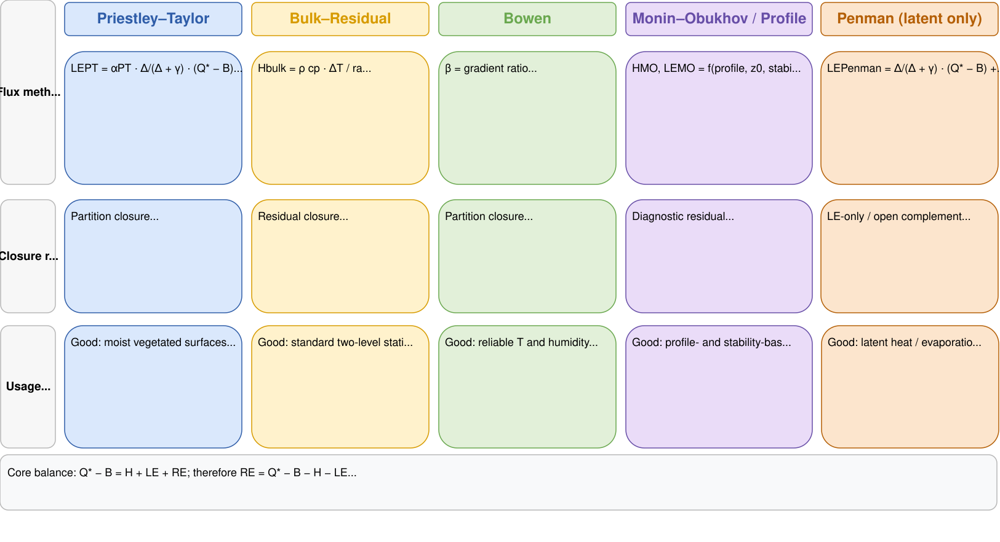
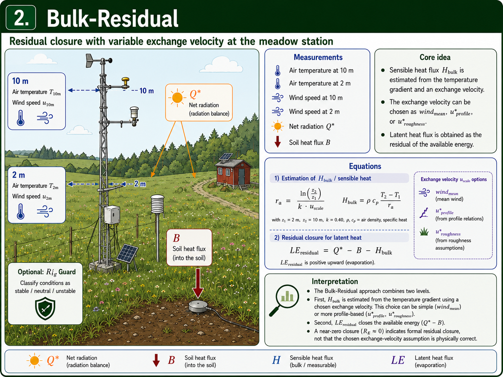

```{r setup, include=FALSE}
knitr::opts_chunk$set(
  collapse = TRUE,
  comment = "#>",
  warning = FALSE,
  message = FALSE
)
```

# Purpose of this vignette

This vignette is the package-workflow part of the Caldern example. It starts after the manual data checks: the relevant columns have already been identified as net radiation, soil heat flux, temperature, humidity and wind inputs. They are now passed to a `weather_station` object and evaluated with `fieldClim` functions.

The focus is no longer the manual checking of individual measurement columns. The focus is package logic: how the station data are organized, how inputs are inspected, which method families are available, and how their outputs should be compared.

| Step | Question | Package area |
|---|---|---|
| 1 | Which heat-flux method families are distinguished? | method concept, energy closure, profile diagnostics |
| 2 | How is the dataset passed to `fieldClim`? | `build_weather_station()` |
| 3 | Which inputs does the inspection function detect? | `inspect_weather_station_inputs()` |
| 4 | How are Priestley-Taylor, Bulk-Residual, Bowen, Monin-Obukhov/Profile and Penman compared? | `turb_flux_calc()`, `turb_flux_bulk_residual()` and method-specific outputs |

The data basis is loaded from the packaged Caldern example file. Manual checks of time structure, radiation components, soil heat flux and available energy belong to the companion vignette on data checks. Here we use those checked quantities as inputs for the package workflow.

```{r load-checked-caldern-data, include=FALSE}
library(fieldClim)

caldern_file <- system.file(
  "extdata",
  "caldern_wiese_2017-06-30.csv",
  package = "fieldClim"
)

caldern <- read.csv(
  caldern_file,
  na.strings = c("NULL", "NA", "")
)

caldern$datetime <- as.POSIXct(
  caldern$datetime,
  tz = "Europe/Berlin"
)

# Working variables from the manual data-check vignette:
# Q_star is the measured net radiation.
# B is the measured soil heat flux.
# Component-level radiation checks belong to the companion vignette.
caldern$Q_star <- caldern$rad_net
caldern$B <- caldern$heatflux_soil
caldern$available_energy <- caldern$Q_star - caldern$B
caldern$Q_minus_B <- caldern$available_energy
```

# Notation

This vignette uses the same notation as the manual data-check vignette. `Q_star` is net radiation, `B` is soil heat flux, `L` is sensible heat flux and `V` is latent heat flux.

For package functions, this notation is mapped to `fieldClim` names:

| Theoretical quantity | Meaning | `fieldClim` field or output |
|---|---|---|
| `Q_star` / `Q*` | net radiation | `rad_bal` |
| `B` | soil heat flux | `soil_flux` |
| `L` | sensible heat flux | `sensible_*` |
| `V` | latent heat flux | `latent_*` |
| `Q_star - B` | available turbulent energy | `rad_bal - soil_flux` |

The sign convention is:

$$
Q^{*} - B = L + V
$$

for energy-closing or residual methods in valid finite cases. This relation is not imposed on all method families.

# Step 1: Method overview and role of each path

All methods use the same station concept, but they do not answer the same question. Some methods partition the available energy, some estimate one flux and compute the other as a residual, and some use measured vertical profiles without forcing closure against available energy.

```{r method-overview-image, echo=FALSE, fig.width=9, fig.height=6, out.width="100%"}
knitr::include_graphics("figures/station.png")
```




| Method | Main question | Direct inputs | Output | Role in the workflow |
|---|---|---|---|---|
| Priestley-Taylor | How can available energy be partitioned in a stable way? | `Q_star`, `B`, parameter | `L_pt`, `V_pt` | first energy-bound package path |
| Bulk-Residual | How does the package estimate `L` from temperature gradient and wind, and compute `V` as residual? | `weather_station`, `sensible_bulk()`, `latent_bulk_residual()` | `L_bulk_pkg`, `V_bulk_pkg` | residual package path, optionally screened by Richardson guard |
| Bowen-ratio | How does a temperature/humidity gradient partition available energy? | temperature gradient, humidity gradient, `Q_star`, `B` | `L_bowen`, `V_bowen` | gradient-sensitive partitioning |
| Monin-Obukhov/Profile | How do profile methods react to gradients and stability? | wind profile, temperature profile, humidity profile, stability diagnostics | `L_monin`, `V_monin` | profile-based, not energy-normalized |
| Penman | How large is latent heat flux from energy and aerodynamic drying power? | `Q_star`, `B`, wind, temperature, humidity, surface | `V_penman` | latent-heat-only comparison path |

## Priestley-Taylor

# ```{r method-pt-image, echo=FALSE, fig.width=9, fig.height=6, out.width="100%"}
# 
# ```

Priestley-Taylor is the stable first package path in this vignette. It is directly bound to available energy and does not require an unstable ratio of small humidity gradients.

$$
L + V = Q^{*} - B
$$

$$
V_{PT} \approx \alpha_{PT} \frac{\Delta}{\Delta + \gamma} (Q^{*} - B)
$$

$$
L_{PT} = (Q^{*} - B) - V_{PT}
$$

The advantage of this path is energy bookkeeping. If `Q_star` and `B` are set correctly, the sum of `L_PT` and `V_PT` remains tied to the available energy. This does not prove that Priestley-Taylor is physically correct for every situation; it makes it a readable first comparison path.

## Bulk-Residual with optional Richardson guard


# ```{r method-bulk-image, echo=FALSE, fig.width=9, fig.height=6, out.width="100%"}
# 
# ```

The package path `turb_flux_bulk_residual()` first estimates sensible heat flux with a simplified bulk-transfer equation. Latent heat flux is then computed as the residual of the surface energy balance:

$$
L_{bulk} = \rho c_p \frac{\Delta T}{r_a}
$$

$$
r_a = \frac{\ln(z_2 / z_1)}{k \bar{u}}
$$

$$
V_{residual} = Q^{*} - B - L_{bulk}
$$

In addition, `sensible_bulk()` can compute a gradient Richardson number when `stability_method = "ri_guard"` is used:

$$
Ri_g =
\frac{g}{\bar{\theta}}
\frac{\Delta \theta / \Delta z}
{(\Delta u / \Delta z)^2}
$$

The guard is not the default. It is activated only by setting `stability_method = "ri_guard"`. Unstable, neutral and moderately stable cases keep the neutral bulk value. Very stable, invalid or weak-shear cases are set to `NA`. If `L_bulk` becomes `NA`, the residual `V_bulk` also becomes `NA`. This prevents an algebraic residual from hiding a non-robust sensible heat estimate.

## Bowen-ratio

# ```{r method-bowen-image, echo=FALSE, fig.width=9, fig.height=6, out.width="100%"}
# 
#```


The Bowen approach uses a ratio between temperature and humidity gradients. It partitions the available energy into sensible and latent heat flux.

$$
\beta \approx \frac{\Delta T}{\Delta e}
$$

In `fieldClim`, the implementation is more specific than this simplified textbook notation. It uses a potential-temperature difference and an absolute-humidity difference with an empirical `fieldClim` coefficient. Therefore, Bowen is interpreted here as the implemented package path, not as a claim that the coefficient form has been fully proven equivalent to every textbook Bowen formulation.

$$
L_{Bowen} = \frac{\beta}{1 + \beta} (Q^{*} - B)
$$

$$
V_{Bowen} = \frac{1}{1 + \beta} (Q^{*} - B)
$$

For finite, uncapped denominator cases, Bowen closes the available energy. It is nevertheless sensitive to gradients. If humidity gradients become very small, signs change, `beta` is not finite or `1 + beta` approaches zero, individual timesteps can produce strong excursions. Capped or non-finite cases should not be read as exact partitions of $$Q^{*} - B$$.

## Monin-Obukhov/Profile

#```{r method-mo-image, echo=FALSE, fig.width=9, fig.height=6, out.width="100%"}
#
#```


The Monin-Obukhov/Profile path in `fieldClim` is not a method that automatically partitions available energy into `L` and `V`. It calculates heat fluxes from measured differences between two heights: temperature, humidity, wind and measurement height directly determine the profile calculation. The method is therefore sensitive when gradients are small, noisy or contradictory.

The current package version catches several problematic cases explicitly. If the temperature gradient between the two heights is zero, sensible heat flux is set to zero for that timestep. If the humidity gradient is zero, latent heat flux is set to zero. Invalid measurement heights, missing wind values or non-evaluable profile states return `NA` with a warning.

This numerical guarding does not make Monin-Obukhov/Profile an energy-closing method. Large but finite values are not automatically limited to $$Q^{*} - B$$. The results must therefore be checked against available energy. Large deviations from available energy are primarily diagnostic information about profile sensitivity, wind shear and stability assumptions.

For interpretation, it is not expected that

$$
L_{MO} + V_{MO} = Q^{*} - B
$$

holds. This relation is used only as a plausibility check. Large deviations point to critical profile conditions: small temperature or humidity gradients, weak wind differences, unfavorable stability assumptions or 5-minute noise.

## Penman

#```{r method-penman-image, echo=FALSE, fig.width=9, fig.height=6, out.width="100%"}
#
#```

Penman is a combination approach for latent heat flux. It combines an energy term with an aerodynamic drying term. In the current package workflow, Penman returns `V`, but not a paired sensible heat flux `L`.

$$
V_{Penman} \approx \frac{\Delta}{\Delta + \gamma}(Q^{*} - B) + \frac{\gamma}{\Delta + \gamma} E_a
$$

$$
E_a = f(u, e_s - e_a)
$$

Penman is therefore a comparison path for `V`, not a complete `L`/`V` partitioning like Priestley-Taylor or Bowen.

# Step 2: Passing the data to a `weather_station` object

The `weather_station` object is the central package structure. It stores measurement columns, site metadata and method parameters. Different functions can then operate on the same structured data basis.

```{r build-weather-station}
ws <- build_weather_station(
  # Time axis.
  datetime = caldern$datetime,

  # Station location.
  lon = 8.6832,
  lat = 50.8405,
  elev = 261,

  # Standard temperature and relative humidity.
  temp = caldern$Ta_2m,
  rh = caldern$Huma_2m,

  # Profile variables for gradient- and stability-related methods.
  t1 = caldern$Ta_2m,
  t2 = caldern$Ta_10m,
  hum1 = caldern$Huma_2m,
  hum2 = caldern$Huma_10m,

  # Wind profile and measurement heights.
  v1 = caldern$Windspeed_2m,
  v2 = caldern$Windspeed_10m,
  z1 = 2,
  z2 = 10,

  # Package names for theoretical quantities:
  # rad_bal corresponds to Q*, soil_flux corresponds to B.
  rad_bal = caldern$Q_star,
  soil_flux = caldern$B,

  # Additional surface and soil information.
  moisture = caldern$water_vol_soil,
  surface_temp = caldern$Ts,

  # Surface type as model assumption.
  surface_type = "field",

  # Observation height for methods that need a reference height.
  obs_height = 2
)

class(ws)
names(ws)
head(as.data.frame(ws))
```

**Interpretation.** The `weather_station` object is more than a renamed table. It assigns physical roles to the raw columns: `rad_bal` is the package input for `Q_star`, `soil_flux` is `B`, `t1/t2`, `hum1/hum2` and `v1/v2` form the vertical profiles, and `surface_type = "field"` sets the surface assumption for methods that require it. At this point a heterogeneous CSV file becomes a consistent package dataset. Mistakes at this step are consequential because all later methods inherit the same mapping.

# Step 3: Inspecting the `weather_station` inputs

After the Caldern data have been organized as a `weather_station` object, the input structure can be checked before any heat-flux calculation. This inspection does not change values, does not create replacement columns and does not fill gaps. It reports which inputs for the main `fieldClim` method families are present, partly missing or missing.

```{r regular-weather-station-input-inspection}
# Read-only inspection of the already built weather_station object.
inspection_regular <- inspect_weather_station_inputs(ws)

# Components of the inspection object.
names(inspection_regular)

# Compact summary.
inspection_regular$summary

# Fields that are missing or partially missing.
subset(
  inspection_regular$fields,
  source_status != "present"
)

# Readiness of the main heat-flux method families.
inspection_regular$method_readiness[, c(
  "method",
  "missing_fields",
  "partial_fields",
  "ready",
  "notes"
)]
```

**Interpretation.** This pre-check does not answer whether the physical methods are meaningful for every timestep. It first checks the input structure: Are the required fields for Priestley-Taylor, Bulk-Residual, Bowen, Monin-Obukhov/Profile and Penman present? Are any required inputs missing or partially missing? Are simple quality-control problems such as impossible humidity values or negative wind speeds flagged?

This is a preliminary step. The next sections evaluate how the energy balance, available energy and heat-flux methods behave.

# Step 4: Package methods for heat fluxes

## Priestley-Taylor as first package path

Priestley-Taylor uses available energy, `Q* - B`, and an empirical evaporation parameterization. Its advantage here is not that it is universally more correct. Its advantage is that it avoids unstable gradient quotients.

```{r priestley-taylor-calc}
flux_pt <- turb_flux_calc(ws, pt_only = TRUE)

caldern$L_pt <- flux_pt$sensible_priestley_taylor
caldern$V_pt <- flux_pt$latent_priestley_taylor
caldern$L_plus_V_pt <- caldern$L_pt + caldern$V_pt
```

```{r priestley-taylor-plots, fig.width=8, fig.height=6}
op <- par(mfrow = c(2, 1), mar = c(3.5, 4, 2, 1))

plot(caldern$datetime, caldern$L_pt, type = "l", col = "#CC79A7", lwd = 2,
     xlab = "Time", ylab = "W/m²", main = "Priestley-Taylor: L")
abline(h = 0, lty = 2, col = "grey50")

plot(caldern$datetime, caldern$V_pt, type = "l", col = "#56B4E9", lwd = 2,
     xlab = "Time", ylab = "W/m²", main = "Priestley-Taylor: V")
abline(h = 0, lty = 2, col = "grey50")

par(op)
```

```{r priestley-closure-plot, fig.width=8, fig.height=4}
cols_pt <- c("#D55E00", "#000000")
op <- par(mar = c(6, 4, 3, 1), xpd = NA)

plot(caldern$datetime, caldern$Q_minus_B, type = "l", col = cols_pt[1], lwd = 2,
     ylim = range(caldern$Q_minus_B, caldern$L_plus_V_pt, na.rm = TRUE),
     xlab = "Time", ylab = "W/m²", main = "Priestley-Taylor: energy closure")
lines(caldern$datetime, caldern$L_plus_V_pt, col = cols_pt[2], lwd = 2)
legend("bottom", inset = c(0, -0.35), horiz = TRUE, bty = "n",
       legend = c("Q* - B", "L + V from PT"), col = cols_pt, lty = 1, lwd = 2)

par(op)
```

**Interpretation.** Priestley-Taylor is the most readable first method in this comparison. It uses available energy and partitions it with a compact evaporation parameter. In this run, the daily mean for `L` is `r round(mean(caldern$L_pt, na.rm = TRUE), 1)` W/m² and the daily mean for `V` is `r round(mean(caldern$V_pt, na.rm = TRUE), 1)` W/m². Together, they close the available energy.

That does not make PT automatically better than the other methods. Its strength here is interpretability: if `Q_star` and `B` are coherent, energy closure is immediately visible. The method avoids humidity-gradient ratios, wind shear and stability classification. It is therefore a useful baseline before more sensitive profile or gradient methods are added.

## Bulk-Residual with Richardson guard

The Bulk-Residual path is treated as a package method here. For this comparison, the optional Richardson guard is enabled because the Caldern dataset contains two temperature and wind heights.

```{r bulk-package-calc}
flux_bulk_guarded <- turb_flux_bulk_residual(
  ws,
  stability_method = "ri_guard"
)

caldern$L_bulk_pkg <- flux_bulk_guarded$sensible_bulk
caldern$V_bulk_pkg <- flux_bulk_guarded$latent_bulk_residual
caldern$bulk_Ri_g <- attr(flux_bulk_guarded$sensible_bulk, "bulk_Ri_g")
caldern$bulk_stability <- attr(flux_bulk_guarded$sensible_bulk, "bulk_stability")

table(caldern$bulk_stability, useNA = "ifany")
```

```{r bulk-package-plots, fig.width=8, fig.height=6}
op <- par(mfrow = c(2, 1), mar = c(3.5, 4, 2, 1))

plot(caldern$datetime, caldern$L_bulk_pkg, type = "l", col = "#666666", lwd = 2,
     xlab = "Time", ylab = "W/m²", main = "Bulk-Residual: L with ri_guard")
abline(h = 0, lty = 2, col = "grey50")

plot(caldern$datetime, caldern$V_bulk_pkg, type = "l", col = "#56B4E9", lwd = 2,
     xlab = "Time", ylab = "W/m²", main = "Bulk-Residual: V as residual")
abline(h = 0, lty = 2, col = "grey50")

par(op)
```

**Interpretation.** Bulk-Residual works differently from PT. It first estimates `L` from temperature difference and wind, and only then computes `V` as the energy-balance residual. With the Richardson guard enabled, only `r sum(is.finite(caldern$L_bulk_pkg))` of `r nrow(caldern)` timesteps remain as valid Bulk-Residual values. The stability count explains why: `r sum(caldern$bulk_stability == "very_stable", na.rm = TRUE)` timesteps are classified as very stable and are therefore not treated as robust neutral bulk fluxes.

This is not an error. It is the purpose of the guard. The guard does not turn Bulk-Residual into a full Monin-Obukhov method and it does not correct valid fluxes. It prevents a neutral bulk approach from returning apparently plausible values when the two-height profile itself indicates very stable, weak-shear or numerically non-robust conditions.

## Full method workflow

```{r all-methods-calc}
flux_all <- turb_flux_calc(ws)

caldern$L_bowen <- flux_all$sensible_bowen
caldern$V_bowen <- flux_all$latent_bowen
caldern$L_monin <- flux_all$sensible_monin
caldern$V_monin <- flux_all$latent_monin
caldern$V_penman <- flux_all$latent_penman
```

```{r method-summary}
L_summary <- data.frame(
  Method = c(
    "Priestley-Taylor",
    "Bulk-Residual package (ri_guard)",
    "Bowen",
    "Monin-Obukhov/Profile"
  ),
  Mean_L_W_m2 = c(
    mean(caldern$L_pt, na.rm = TRUE),
    mean(caldern$L_bulk_pkg, na.rm = TRUE),
    mean(caldern$L_bowen, na.rm = TRUE),
    mean(caldern$L_monin, na.rm = TRUE)
  )
)

V_summary <- data.frame(
  Method = c(
    "Priestley-Taylor",
    "Bulk-Residual package (ri_guard)",
    "Bowen",
    "Monin-Obukhov/Profile",
    "Penman"
  ),
  Mean_V_W_m2 = c(
    mean(caldern$V_pt, na.rm = TRUE),
    mean(caldern$V_bulk_pkg, na.rm = TRUE),
    mean(caldern$V_bowen, na.rm = TRUE),
    mean(caldern$V_monin, na.rm = TRUE),
    mean(caldern$V_penman, na.rm = TRUE)
  )
)

L_summary[, -1] <- round(L_summary[, -1], 1)
V_summary[, -1] <- round(V_summary[, -1], 1)

L_summary
V_summary
```

**Interpretation.** These tables are not a ranking. They show different answers to different method questions.

PT produces a moderate, energy-bound reference course with `r round(mean(caldern$L_pt, na.rm = TRUE), 1)` W/m² for `L` and `r round(mean(caldern$V_pt, na.rm = TRUE), 1)` W/m² for `V`.

Bulk-Residual is higher for valid unguarded timesteps (`L`: `r round(mean(caldern$L_bulk_pkg, na.rm = TRUE), 1)` W/m², `V`: `r round(mean(caldern$V_bulk_pkg, na.rm = TRUE), 1)` W/m²), because only part of the day remains after Richardson screening. These valid timesteps are not the same sample as all 288 measurements.

Bowen produces a negative daily mean for `L` (`r round(mean(caldern$L_bowen, na.rm = TRUE), 1)` W/m²), but a high latent component (`r round(mean(caldern$V_bowen, na.rm = TRUE), 1)` W/m²). This shows why simple means can be misleading for gradient-sensitive methods: strong positive and negative partitioning events can partly cancel each other.

Penman is separate because it returns only `V`. Its mean of `r round(mean(caldern$V_penman, na.rm = TRUE), 1)` W/m² is not a complete `L/V` pair.

Monin-Obukhov/Profile returns a mean sensible heat flux of about `r round(mean(caldern$L_monin, na.rm = TRUE), 1)` W/m² and a mean latent heat flux of about `r round(mean(caldern$V_monin, na.rm = TRUE), 1)` W/m². These values come from temperature, humidity and wind profiles, not from partitioning available energy. They must be read differently from PT, Bulk-Residual or Bowen.

## Single-method plots

```{r methods-single-L-plots, fig.width=8, fig.height=8}
op <- par(mfrow = c(4, 1), mar = c(3.2, 4, 2, 1))

plot(caldern$datetime, caldern$L_pt, type = "l", col = "#CC79A7", lwd = 2,
     xlab = "Time", ylab = "W/m²", main = "L: Priestley-Taylor")
abline(h = 0, lty = 2, col = "grey50")

plot(caldern$datetime, caldern$L_bulk_pkg, type = "l", col = "#666666", lwd = 2,
     xlab = "Time", ylab = "W/m²", main = "L: Bulk-Residual with ri_guard")
abline(h = 0, lty = 2, col = "grey50")

plot(caldern$datetime, caldern$L_bowen, type = "l", col = "#009E73", lwd = 2,
     xlab = "Time", ylab = "W/m²", main = "L: Bowen")
abline(h = 0, lty = 2, col = "grey50")

plot(caldern$datetime, caldern$L_monin, type = "l", col = "#D55E00", lwd = 2,
     xlab = "Time", ylab = "W/m²", main = "L: Monin-Obukhov/Profile")
abline(h = 0, lty = 2, col = "grey50")

par(op)
```

```{r methods-single-V-plots, fig.width=8, fig.height=10}
op <- par(mfrow = c(5, 1), mar = c(3.2, 4, 2, 1))

plot(caldern$datetime, caldern$V_pt, type = "l", col = "#56B4E9", lwd = 2,
     xlab = "Time", ylab = "W/m²", main = "V: Priestley-Taylor")
abline(h = 0, lty = 2, col = "grey50")

plot(caldern$datetime, caldern$V_bulk_pkg, type = "l", col = "#666666", lwd = 2,
     xlab = "Time", ylab = "W/m²", main = "V: Bulk-Residual with ri_guard")
abline(h = 0, lty = 2, col = "grey50")

plot(caldern$datetime, caldern$V_bowen, type = "l", col = "#009E73", lwd = 2,
     xlab = "Time", ylab = "W/m²", main = "V: Bowen")
abline(h = 0, lty = 2, col = "grey50")

plot(caldern$datetime, caldern$V_monin, type = "l", col = "#D55E00", lwd = 2,
     xlab = "Time", ylab = "W/m²", main = "V: Monin-Obukhov/Profile")
abline(h = 0, lty = 2, col = "grey50")

plot(caldern$datetime, caldern$V_penman, type = "l", col = "#0072B2", lwd = 2,
     xlab = "Time", ylab = "W/m²", main = "V: Penman")
abline(h = 0, lty = 2, col = "grey50")

par(op)
```

**Interpretation.** The plots are separated intentionally. In one combined plot, sensitive methods would dominate the y-axis and smoother paths would become unreadable. Per-method plots show when sign changes, `NA` sections or strong excursions occur. Bulk-Residual interruptions are often not data gaps, but direct consequences of the Richardson guard. Strong excursions in Bowen and Monin-Obukhov/Profile are more likely indicators of gradient or stability sensitivity.

## Energy consistency of heat-flux methods

The following output is both a method comparison and an energy-balance consistency check.

The near-surface energy balance can be written as:

$$
0 = Q^{*} - B - L - V
$$

For energy-bound or residual methods, this implies:

$$
L + V \approx Q^{*} - B
$$

For Monin-Obukhov/Profile, this relation is not an expected closure condition, but a plausibility diagnostic.

```{r energy-consistency-table}
if (!("Q_star" %in% names(caldern))) {
  if ("Q_star_measured" %in% names(caldern)) {
    caldern$Q_star <- caldern$Q_star_measured
  } else {
    caldern$Q_star <- caldern$rad_net
  }
}

if (!("B" %in% names(caldern))) {
  caldern$B <- caldern$heatflux_soil
}

caldern$available_energy <- caldern$Q_star - caldern$B

caldern$LV_bulk_pkg <- caldern$L_bulk_pkg + caldern$V_bulk_pkg
caldern$LV_pt <- caldern$L_pt + caldern$V_pt
caldern$LV_bowen <- caldern$L_bowen + caldern$V_bowen
caldern$LV_monin <- caldern$L_monin + caldern$V_monin

caldern$diff_bulk_pkg <- caldern$LV_bulk_pkg - caldern$available_energy
caldern$diff_pt <- caldern$LV_pt - caldern$available_energy
caldern$diff_bowen <- caldern$LV_bowen - caldern$available_energy
caldern$diff_monin <- caldern$LV_monin - caldern$available_energy

energy_row <- function(method, lv, ref) {
  valid <- is.finite(lv) & is.finite(ref)
  diff <- lv[valid] - ref[valid]

  data.frame(
    Method = method,
    Mean_L_plus_V = mean(lv[valid], na.rm = TRUE),
    Mean_Q_star_minus_B = mean(ref[valid], na.rm = TRUE),
    Mean_difference = mean(diff, na.rm = TRUE),
    Max_abs_difference = max(abs(diff), na.rm = TRUE),
    Valid_timesteps = sum(valid)
  )
}

energy_consistency <- rbind(
  energy_row(
    "Bulk-Residual package (ri_guard)",
    caldern$LV_bulk_pkg,
    caldern$available_energy
  ),
  energy_row(
    "Priestley-Taylor",
    caldern$LV_pt,
    caldern$available_energy
  ),
  energy_row(
    "Bowen",
    caldern$LV_bowen,
    caldern$available_energy
  ),
  energy_row(
    "Monin-Obukhov/Profile",
    caldern$LV_monin,
    caldern$available_energy
  )
)

energy_consistency[, 2:5] <- round(energy_consistency[, 2:5], 1)
energy_consistency
```

**Interpretation.** This table is the central consistency check. The mean of `Q_star - B` is computed over the same valid timesteps as `L + V` for each method. That makes Bulk-Residual readable: it has only `r energy_consistency$Valid_timesteps[energy_consistency$Method == "Bulk-Residual package (ri_guard)"]` valid timesteps because the guard removes very stable or invalid situations. For exactly these valid timesteps, the residual path closes as expected: the mean and maximum differences are `r energy_consistency$Mean_difference[energy_consistency$Method == "Bulk-Residual package (ri_guard)"]` and `r energy_consistency$Max_abs_difference[energy_consistency$Method == "Bulk-Residual package (ri_guard)"]` W/m².

Priestley-Taylor and Bowen also close because both explicitly partition available energy. This means different things. For PT, the partitioning is relatively robustly parameterized. For Bowen, exact closure can still coexist with extreme individual partitions caused by small humidity gradients or denominator problems. Monin-Obukhov/Profile is not a closure method. Its mean difference of `r energy_consistency$Mean_difference[energy_consistency$Method == "Monin-Obukhov/Profile"]` W/m² and maximum difference of `r energy_consistency$Max_abs_difference[energy_consistency$Method == "Monin-Obukhov/Profile"]` W/m² are therefore not rounding errors. They indicate that this profile path can produce 5-minute values that should not be read as an energy-balance partition.

## Diagnosing extreme values and stability cases

The extreme-value diagnostic first summarizes where extreme values occur and then shows only the strongest cases. It also reports the Richardson-guard classes from the Bulk-Residual path.

```{r extreme-flux-diagnostics}
threshold_flux <- 600

caldern$dT_2_10 <- caldern$Ta_2m - caldern$Ta_10m
caldern$dH_2_10 <- caldern$Huma_2m - caldern$Huma_10m
caldern$dU_2_10 <- caldern$Windspeed_2m - caldern$Windspeed_10m

extreme_all <- rbind(
  data.frame(
    datetime = caldern$datetime,
    Method = "Bulk-Residual package (ri_guard)",
    Flux = "L",
    Value = caldern$L_bulk_pkg,
    dT_2_10 = caldern$dT_2_10,
    dH_2_10 = caldern$dH_2_10,
    dU_2_10 = caldern$dU_2_10,
    Q_star_minus_B = caldern$available_energy,
    bulk_stability = caldern$bulk_stability
  ),
  data.frame(
    datetime = caldern$datetime,
    Method = "Bowen",
    Flux = "L",
    Value = caldern$L_bowen,
    dT_2_10 = caldern$dT_2_10,
    dH_2_10 = caldern$dH_2_10,
    dU_2_10 = caldern$dU_2_10,
    Q_star_minus_B = caldern$available_energy,
    bulk_stability = NA_character_
  ),
  data.frame(
    datetime = caldern$datetime,
    Method = "Bowen",
    Flux = "V",
    Value = caldern$V_bowen,
    dT_2_10 = caldern$dT_2_10,
    dH_2_10 = caldern$dH_2_10,
    dU_2_10 = caldern$dU_2_10,
    Q_star_minus_B = caldern$available_energy,
    bulk_stability = NA_character_
  ),
  data.frame(
    datetime = caldern$datetime,
    Method = "Monin-Obukhov/Profile",
    Flux = "L",
    Value = caldern$L_monin,
    dT_2_10 = caldern$dT_2_10,
    dH_2_10 = caldern$dH_2_10,
    dU_2_10 = caldern$dU_2_10,
    Q_star_minus_B = caldern$available_energy,
    bulk_stability = NA_character_
  ),
  data.frame(
    datetime = caldern$datetime,
    Method = "Monin-Obukhov/Profile",
    Flux = "V",
    Value = caldern$V_monin,
    dT_2_10 = caldern$dT_2_10,
    dH_2_10 = caldern$dH_2_10,
    dU_2_10 = caldern$dU_2_10,
    Q_star_minus_B = caldern$available_energy,
    bulk_stability = NA_character_
  )
)

extreme_cases <- extreme_all[abs(extreme_all$Value) > threshold_flux, ]

extreme_count <- as.data.frame(
  table(extreme_cases$Method, extreme_cases$Flux),
  stringsAsFactors = FALSE
)

names(extreme_count) <- c("Method", "Flux", "Count")
extreme_count <- extreme_count[extreme_count$Count > 0, ]

bulk_guard_summary <- as.data.frame(
  table(caldern$bulk_stability, useNA = "ifany"),
  stringsAsFactors = FALSE
)
names(bulk_guard_summary) <- c("bulk_stability", "Count")

extreme_count
bulk_guard_summary
```

```{r extreme-flux-top-cases}
if (nrow(extreme_cases) > 0) {
  extreme_cases$abs_Value <- abs(extreme_cases$Value)
  extreme_cases <- extreme_cases[order(-extreme_cases$abs_Value), ]
  extreme_top <- head(extreme_cases, 10)

  extreme_top$Value <- round(extreme_top$Value, 1)
  extreme_top$abs_Value <- round(extreme_top$abs_Value, 1)
  extreme_top$dT_2_10 <- round(extreme_top$dT_2_10, 3)
  extreme_top$dH_2_10 <- round(extreme_top$dH_2_10, 3)
  extreme_top$dU_2_10 <- round(extreme_top$dU_2_10, 3)
  extreme_top$Q_star_minus_B <- round(extreme_top$Q_star_minus_B, 1)

  extreme_top
} else {
  data.frame(Note = "No values above the diagnostic threshold were found.")
}
```

**Interpretation.** The extreme-value count shows where problematic 5-minute values arise. Bowen produces `r sum(extreme_count$Count[extreme_count$Method == "Bowen"])` values above the diagnostic threshold, Monin-Obukhov/Profile produces `r sum(extreme_count$Count[extreme_count$Method == "Monin-Obukhov/Profile"])`. The Bulk-Residual package path does not appear as an extreme-value source here because the Richardson guard does not forward critical profile states as large finite fluxes; it marks them as `NA`.

The stability count is essential. Out of `r nrow(caldern)` timesteps, `r sum(caldern$bulk_stability == "unstable", na.rm = TRUE)` are classified as unstable, `r sum(caldern$bulk_stability == "neutral", na.rm = TRUE)` as neutral, `r sum(caldern$bulk_stability == "stable", na.rm = TRUE)` as stable and `r sum(caldern$bulk_stability == "very_stable", na.rm = TRUE)` as very stable. Only the non-guarded cases are used for `L_bulk_pkg` and `V_bulk_pkg`. For Bowen and Monin-Obukhov/Profile, large finite values can remain visible. Such values are first diagnostic signs of data and method sensitivity, not automatically real heat-flux events.

## Energy consistency: energy-bound methods

```{r energy-consistency-plot, fig.width=8, fig.height=4}
cols_closure <- c(
  "#666666",
  "#CC79A7",
  "#009E73"
)

closure_values <- c(
  caldern$diff_bulk_pkg,
  caldern$diff_pt,
  caldern$diff_bowen
)

ylim_closure <- range(closure_values, na.rm = TRUE)

op <- par(mar = c(6, 4, 3, 1))

plot(
  caldern$datetime,
  caldern$diff_bulk_pkg,
  type = "l",
  col = cols_closure[1],
  lwd = 2,
  ylim = ylim_closure,
  xlab = "Time",
  ylab = "(L + V) - (Q* - B) [W/m²]",
  main = "Energy consistency: energy-bound paths"
)

lines(caldern$datetime, caldern$diff_pt, col = cols_closure[2], lwd = 2)
lines(caldern$datetime, caldern$diff_bowen, col = cols_closure[3], lwd = 2)
abline(h = 0, lty = 2, col = "grey40")

par(xpd = NA)
legend(
  "bottom",
  inset = c(0, -0.35),
  horiz = TRUE,
  bty = "n",
  legend = c(
    "Bulk package ri_guard",
    "Priestley-Taylor",
    "Bowen"
  ),
  col = cols_closure,
  lty = 1,
  lwd = 2
)
par(op)
```

**Interpretation.** This plot separates energy-bound or residual paths from Monin-Obukhov/Profile. For Bulk-Residual, PT and Bowen, closeness to the zero line means that `L + V` matches the available energy used by the method. For PT this is constructive; for Bulk-Residual it is also constructive for valid timesteps because `V` is the residual. Bowen can also close exactly as long as the denominator is finite and not capped.

The zero line does not prove that every individual partition is physically good. It only states that the energy bookkeeping is consistent. The split into `L` and `V` still has to be read together with gradients, extreme values and warnings.

## Monin-Obukhov/Profile: heat fluxes from height differences

```{r monin-diagnostic-plot, fig.width=8, fig.height=4}
mo_diff <- caldern$diff_monin
mo_finite <- is.finite(mo_diff)
mo_ylim <- quantile(mo_diff[mo_finite], probs = c(0.05, 0.95), na.rm = TRUE)

mo_lower <- mo_finite & mo_diff < mo_ylim[1]
mo_upper <- mo_finite & mo_diff > mo_ylim[2]
mo_inside <- mo_finite & !mo_lower & !mo_upper

op <- par(mar = c(6, 4, 3, 1))

plot(
  caldern$datetime[mo_inside],
  mo_diff[mo_inside],
  type = "l",
  col = "#D55E00",
  lwd = 2,
  ylim = mo_ylim,
  xlab = "Time",
  ylab = "(L_MO + V_MO) - (Q* - B) [W/m²]",
  main = "Monin-Obukhov/Profile: plausibility check against Q* - B"
)

abline(h = 0, lty = 2, col = "grey40")
points(caldern$datetime[mo_lower], rep(mo_ylim[1], sum(mo_lower)),
       pch = 25, col = "#D55E00", bg = "#D55E00")
points(caldern$datetime[mo_upper], rep(mo_ylim[2], sum(mo_upper)),
       pch = 24, col = "#D55E00", bg = "#D55E00")

mtext(
  paste0(
    "Edge markers: ",
    sum(mo_lower), " below, ", sum(mo_upper), " above"
  ),
  side = 3,
  line = 0.2,
  cex = 0.8,
  col = "grey30"
)

par(op)
```

**Interpretation.** This plot must be read differently from the previous one. Monin-Obukhov/Profile calculates `L` and `V` from measured differences between two heights. Temperature, humidity, wind and measurement height determine the result. The values are not adjusted afterward so that their sum equals the available energy.

The package functions catch problematic special cases: zero gradients return zero for the respective flux, invalid heights or wind values and non-evaluable profile states return `NA` with a warning. Large but formally valid values remain visible. The plot therefore does not simply show an error. It checks whether profile-based values are energetically plausible relative to available energy.

If the deviation is large, the corresponding timestep should not be interpreted as a robust heat-flux estimate. More likely, small temperature or humidity gradients, weak wind differences or stability assumptions strongly influence the profile method.

The edge markers are important. They indicate that some values lie outside the robustly displayed y-axis range. The plot therefore shows a readable center of the distribution plus outlier markers. In plain terms: the profile path does not say "this much energy was closed"; it says "this is how a profile- and stability-dependent method reacts to these measured profiles." If that reaction strongly deviates from `Q_star - B`, it is a diagnostic result about gradients, shear and stability assumptions.


## Additional energy-balance diagnostics

After turbulent fluxes have been calculated, energy-balance closure diagnostics show whether the result is formally closed, contains an unresolved complementary term, or should be read as a profile/stability diagnostic. The diagnostic step does not change any fluxes. It only shows how the existing output fields relate to `rad_bal - soil_flux`.

```{r closure-flux-table-en}
closure_flux <- energy_balance_closure(flux_all)

head(closure_flux)
```

```{r closure-flux-open-en, fig.width=11, fig.height=7, out.width="100%", fig.align="center"}
plot_energy_balance_closure(
  closure_flux,
  type = "open_terms",
  layout = "facets"
)
```

The plot does not show the same residual concept for all methods. It shows the term that is open or residualized in each method family. For Bulk-Residual, this is `latent_bulk_residual`: latent heat is calculated as the remaining available energy after estimating `sensible_bulk`. For Penman, it is the unresolved complement after subtracting `latent_penman`; this term is not automatically sensible heat. For Monin-Obukhov/Profile, it is the diagnostic balance residual `rad_bal - soil_flux - sensible - latent`. Priestley-Taylor and Bowen are not shown because they partition available energy and do not return an explicit open term.

```{r closure-flux-check-en, fig.width=11, fig.height=7, out.width="100%", fig.align="center"}
plot_energy_balance_closure(
  closure_flux,
  type = "closure_check",
  layout = "facets"
)
```

The closure check shows `rad_bal - soil_flux - sensible - latent` for methods with paired fluxes. For Priestley-Taylor, Bowen and Bulk-Residual, values close to zero are expected by construction. This indicates formal closure, not physical validation. For Monin-Obukhov/Profile, non-zero values are diagnostic and show the difference between profile-derived flux estimates and available energy. Penman is not shown because no paired sensible heat flux is calculated.

```{r closure-flux-ratio-en, fig.width=11, fig.height=7, out.width="100%", fig.align="center"}
plot_energy_balance_closure(
  closure_flux,
  type = "ratio",
  layout = "facets",
  ylim = c(0, 2)
)
```

The ratio plot is zoomed to the range 0 to 2 so that deviations around formal closure at 1 remain readable. Values outside this range are not better or worse method values; they indicate unstable ratios, often caused by small available energy or strongly deviating profile-derived fluxes. The table above contains the untrimmed diagnostic values. Penman is not shown because this package does not return a paired sensible heat flux for Penman.

```{r closure-flux-extreme-ratio-en}
extreme_ratio <- subset(
  closure_flux,
  is.finite(closure_ratio) &
    (closure_ratio < 0 | closure_ratio > 2)
)

head(extreme_ratio[, c(
  "datetime", "method", "available_energy",
  "turbulent_sum", "closure_ratio", "status"
)])
```

This table lists cases outside the plotted ratio range. Such values usually occur when the denominator `rad_bal - soil_flux` is small or when profile-derived fluxes deviate strongly from available energy. They are diagnostic cases, not a ranking of methods.

### Bulk-Residual: exchange velocity and residual closure

The following block keeps the residual closure logic fixed and varies only the exchange velocity used in the `sensible_bulk` estimate. The existing `weather_station` object `ws` contains two wind heights as well as `surface_type` and `obs_height`, so the roughness-based variant can be calculated without inventing new inputs.

```{r bulk-exchange-velocity-en}
bulk_mean <- turb_flux_bulk_residual(
  ws,
  exchange_velocity = "wind_mean"
)

bulk_profile <- turb_flux_bulk_residual(
  ws,
  exchange_velocity = "u_star_profile"
)

bulk_roughness <- turb_flux_bulk_residual(
  ws,
  exchange_velocity = "u_star_roughness"
)

diag_mean <- energy_balance_closure(bulk_mean, methods = "bulk_residual")
diag_mean$exchange_velocity <- "wind_mean"

diag_profile <- energy_balance_closure(bulk_profile, methods = "bulk_residual")
diag_profile$exchange_velocity <- "u_star_profile"

diag_roughness <- energy_balance_closure(bulk_roughness, methods = "bulk_residual")
diag_roughness$exchange_velocity <- "u_star_roughness"

bulk_exchange_diag <- rbind(
  diag_mean,
  diag_profile,
  diag_roughness
)

aggregate(
  cbind(sensible, latent, closure_residual, closure_ratio) ~ exchange_velocity,
  data = bulk_exchange_diag,
  FUN = function(x) round(mean(x, na.rm = TRUE), 2)
)
```

The table shows the key distinction. The closure ratio remains close to 1 for the Bulk-Residual path because `latent_bulk_residual` is always calculated as the residual of `rad_bal - soil_flux - sensible_bulk`. The actual methodological sensitivity occurs one step earlier, in `sensible_bulk`. Depending on whether the exchange velocity is based on mean wind, `u_star_profile`, or `u_star_roughness`, the partition between sensible and latent heat changes. A closed residual therefore does not prove that the selected exchange-velocity assumption is physically correct.

# Consequence for method comparison

The methods react differently to the same station dataset because they do not answer the same question. For this Caldern day, the practical interpretation is:

- Priestley-Taylor is the stable baseline path. It answers how available energy can be partitioned without sensitive profile quotients.
- Bulk-Residual with `ri_guard` answers which timesteps allow a simple wind- and temperature-gradient-based estimate of `L`, and where the stability diagnostic says that the neutral bulk approach is not robust.
- Bowen answers how a temperature/humidity gradient would partition available energy. It can close the energy balance and still produce extreme individual partitions.
- Penman answers only the question of `V`. It is not a complete `L`/`V` pair and must not be compared as if it were PT, Bulk or Bowen.
- Monin-Obukhov/Profile answers a profile question: what do the temperature, humidity and wind differences between two heights imply when interpreted as turbulent exchange? Large excursions, `NA` values or deviations from $$Q^{*} - B$$ are not just noise. They show that gradients, wind shear or stability assumptions are critical for those timesteps.

The key practical consequence is that the method comparison is not a search for one "best" curve. It shows which assumptions remain stable for the same station data and which assumptions lead to diagnostic cases. PT should be read as baseline, Bulk-Residual with guard as a transparent residual comparison, Bowen as gradient-sensitive partitioning, Penman as a separate `V` comparison, and Monin-Obukhov/Profile as a profile-diagnostic path.
