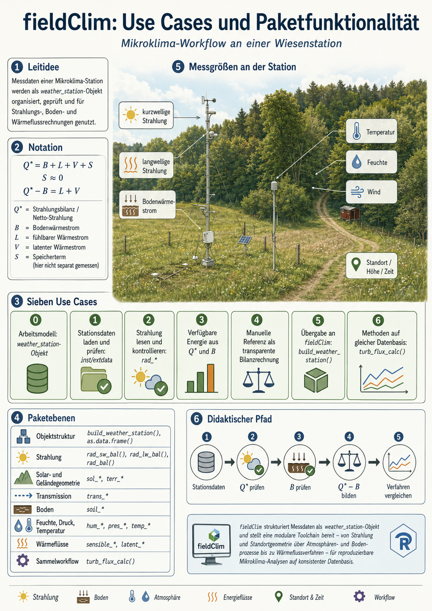

```{r setup, include=FALSE}
knitr::opts_chunk$set(
  collapse = TRUE,
  comment = "#>",
  warning = FALSE,
  message = FALSE
)
```

# Ziel dieser Vignette

Diese Vignette ist der erste Teil des `fieldClim`-Workflows. Sie bleibt bewusst vor der Paketmethodik stehen und prüft den regulären Caldern-Stationsdatensatz manuell: Zeitstruktur, Strahlungskomponenten, Netto-Strahlung, Bodenwärmestrom und verfügbare Energie.

Ziel ist nicht, bereits Wärmeflussmethoden zu vergleichen. Ziel ist, die Messspalten und die Energiebilanz-Terme so zu verstehen, dass der anschließende `fieldClim`-Workflow auf einer geprüften Datenbasis aufsetzt.

Diese Vignette umfasst die manuellen Schritte 0 bis 4:

| Schritt | Leitfrage | Charakter |
|---|---|---|
| 0 | Was ist das Arbeitsmodell von `fieldClim`? | Orientierung |
| 1 | Wie wird der Stationsdatensatz geladen und zeitlich geprüft? | Datenprüfung |
| 2 | Wie werden kurzwellige Strahlung und Albedo gelesen und kontrolliert? | manuelle Strahlungsprüfung |
| 3 | Wie werden langwellige Bilanz und Netto-Strahlung geprüft? | manuelle Bilanzprüfung |
| 4 | Wie entsteht aus Strahlung und Bodenwärmestrom verfügbare Energie? | manuelle Energiebilanzprüfung |

Der eigentliche Paketworkflow mit `build_weather_station()`, `inspect_weather_station_inputs()` und den Wärmeflussmethoden wird in der zweiten Vignette fortgesetzt.


# Notation

Die Vorlesungsfolien verwenden für die bodennahe Energiebilanz die Größen `Q*`, `B`, `L` und `V`. Diese Vignette behält diese Notation im Erklärungsteil bei. Erst an der Schnittstelle zum Datensatz und zu `fieldClim` wird auf die spezifischen Paket- und Spaltennamen des `fieldClim` Pakets gemappt.

```{r theory-energy-figures, echo=FALSE, fig.width=8, fig.height=4.5, out.width="100%"}
knitr::include_graphics(c(
  "figures/anchor_mesoklima_p45.png",
  "figures/anchor_mesoklima_p46.png"
))
```

| Theoriegröße | Bedeutung | Code-Variable in dieser Vignette | Feld im Datensatz oder Paket |
|---|---|---|---|
| `Q*` | Strahlungsbilanz / Netto-Strahlung | `Q_star` | `rad_net`, `rad_bal` |
| `B` | Bodenwärmestrom | `B` | `heatflux_soil`, `soil_flux` |
| `L` | fühlbarer Wärmestrom | `L` | `sensible_*` |
| `V` | latenter Wärmestrom | `V` | `latent_*` |
| `S` | Speicherterm | `S` | hier nicht separat gemessen |

Die Arbeitsbilanz lautet in der Theorie-Notation:

$$
Q^{*} = B + L + V + S
$$

Der Speicherterm `S` wird in diesem Beispieldatensatz nicht separat berechnet. Das bedeutet nicht, dass Speicherung nicht existiert. Es bedeutet nur, dass die Datengrundlage keine vollständige Auflösung von Wärmespeicherung in Luftvolumen, Vegetation, Wasserfilmen, oberflächennahem Boden und Messumgebung erlaubt. Für die transparente Referenzrechnung wird deshalb gesetzt:

$$
S \approx 0
$$

Damit wird:

$$
Q^{*} - B = L + V
$$

und für die Residualrechnung:

$$
V = Q^{*} - B - L
$$

Mit dem Ausdruck **Kontrolle aus Einzelkomponenten** wird eine arithmetische Prüfung bezeichnet: Aus kurzwelliger und langwelliger Bilanz wird eine zweite Zeitreihe für `Q*` berechnet und mit der gemessenen Spalte `rad_net` verglichen.

# Schritt 0: Was soll das Paket leisten?

`fieldClim` ist kein einzelnes Skript, sondern ein R-Paket mit mehreren Ebenen. Für die Arbeit mit mikroklimatischen Stationsdaten ist die zentrale Idee das `weather_station`-Objekt. Dieses Objekt bündelt Zeitachse, Standort, Messgrößen und Modellparameter. Paketfunktionen können damit dieselbe Datenstruktur weiterreichen, ergänzen und als Tabelle ausgeben.

| Paketebene | Zweck | Beispiele |
|---|---|---|
| Objektstruktur | Messdaten und Parameter bündeln | `build_weather_station()`, `as.data.frame()` |
| Strahlung | kurzwellige, langwellige und Netto-Strahlung berechnen oder prüfen | `rad_sw_bal()`, `rad_lw_bal()`, `rad_bal()` |
| Solar- und Geländegeometrie | Sonnenstand, Gelände- und Sichtfaktoren vorbereiten | `sol_*`, `terr_*` |
| Transmission | atmosphärische Dämpfung der Strahlung beschreiben | `trans_*` |
| Boden | Wärmeleitfähigkeit, Dämpfung und Bodenwärmestrom behandeln | `soil_*` |
| Feuchte, Druck, Temperatur | Hilfsgrößen für weitere Berechnungen bereitstellen | `hum_*`, `pres_*`, `temp_*` |
| Wärmeflüsse | fühlbare und latente Wärmeflüsse schätzen | `sensible_*`, `latent_*` |
| Sammelworkflow | mehrere Wärmeflussmethoden in einem Schritt berechnen | `turb_flux_calc()` |

```{r fieldClim-concept-image, echo=FALSE, fig.width=9, fig.height=6, out.width="100%"}
# 
```

Die Workflow-Schritte behandeln nicht jede der verfügbaren Einzelfunktion isoliert. Vielmehr soll die Abfolge die vorhandenen Funktionsgruppen in einen Arbeitsablauf gebracht werden: vom Stationsdatensatz über visuelle Plausibilitätskontrolle,  Strahlung und Bodenwärmestrom bis zum Vergleich mehrerer Wärmeflussmethoden.

# Schritt 1: Stationsdaten laden und Zeitstruktur prüfen

Der Beispieldatensatz enthält einen vollständigen 5-Minuten-Tag der Caldern-Wiese. Ein vollständiger Tag mit 5-Minuten-Zeitschritten hat 288 Messzeitpunkte.

```{r load-data}
# Das Paket laden.
# Die Vignette setzt voraus, dass fieldClim installiert oder im Paketprojekt verfügbar ist.
library(fieldClim)

# Pfad zur Paket-Beispieldatei.
# Für eine Paketvignette ist system.file() der passende Weg, weil die Datei
# nach Installation unter inst/extdata/ ausgeliefert wird.
caldern_file <- system.file(
  "extdata",
  "caldern_wiese_2017-06-30.csv",
  package = "fieldClim"
)

# CSV-Datei einlesen.
# Leere Felder, "NULL" und "NA" werden als fehlende Werte behandelt.
caldern <- read.csv(
  caldern_file,
  na.strings = c("NULL", "NA", "")
)

# Zeitstempel explizit als Datum-Zeit-Werte interpretieren.
# Die Zeitzone ist wichtig, weil Strahlungs- und Tagesganginterpretationen
# zeitabhängig sind.
caldern$datetime <- as.POSIXct(
  caldern$datetime,
  format = "%Y-%m-%d %H:%M:%S",
  tz = "Europe/Berlin"
)

# Anzahl der Zeilen prüfen.
nrow(caldern)

# Zeitbereich prüfen.
range(caldern$datetime)

# Zeitschritt prüfen.
summary(diff(caldern$datetime))

# Spaltennamen anzeigen.
names(caldern)
```

**Interpretation.** Der Datensatz ist für den folgenden Workflow gut geeignet: Er enthält `r nrow(caldern)` Messzeitpunkte und deckt damit genau einen vollständigen 5-Minuten-Tag ab. Das ist wichtig, weil die späteren Wärmeflüsse nicht aus Einzelwerten entstehen, sondern aus einem Tagesverlauf. Erst die gleichmäßige Zeitachse macht sichtbar, wann Strahlung, Bodenwärmestrom, Temperaturgradienten und Wind zusammenwirken. Für Nicht-Meteorolog:innen ist die wichtigste Botschaft: Wenn hier schon Zeitstempel, Zeitschritt oder fehlende Werte nicht stimmen, sieht eine spätere Flusskurve zwar rechnerisch aus, hat aber keine belastbare Bedeutung.

# Schritt 2: Kurzwellige Strahlung und Albedo manuell prüfen

Die Folien zur Strahlung zeigen, dass einfallende kurzwellige Strahlung durch Sonnenstand, optische Weglänge und Transmission bestimmt wird. Die Albedo-Folie definiert den reflektierten Anteil als Verhältnis von ausgehender zu einfallender kurzwelliger Strahlung.

```{r theory-shortwave-figures, echo=FALSE, fig.width=8, fig.height=4.5, out.width="100%"}
knitr::include_graphics(c(
  "figures/anchor_mesoklima_p18.png",
  "figures/anchor_mesoklima_p20.png",
  "figures/anchor_mesoklima_p33.png",
  "figures/anchor_mesoklima_p34.png"
))
```

Die kurzwellige Bilanz lautet:

$$
K^{*} = K_{down} - K_{up}
$$

Die Albedo lautet:

$$
\alpha = \frac{K_{up}}{K_{down}}
$$

```{r shortwave-calc}
# Einfallende kurzwellige Strahlung aus der Messspalte übernehmen.
caldern$K_down <- caldern$rad_sw_in

# Reflektierte kurzwellige Strahlung aus der Messspalte übernehmen.
caldern$K_up <- caldern$rad_sw_out

# Kurzwellige Bilanz berechnen.
# Das ist der kurzwellige Anteil, der nach Reflexion an der Oberfläche bleibt.
caldern$K_star <- caldern$K_down - caldern$K_up

# Albedo berechnen.
# Bei sehr kleiner Einstrahlung ist der Quotient instabil; deshalb wird
# erst ab 50 W/m² gerechnet.
caldern$alpha <- ifelse(
  caldern$K_down > 50,
  caldern$K_up / caldern$K_down,
  NA
)
```

## Einzelplots

```{r shortwave-single-plots, fig.width=8, fig.height=8}
# Drei Einzelplots übereinander: einfallend, reflektiert, kurzwellige Bilanz.
op <- par(mfrow = c(3, 1), mar = c(3.5, 4, 2, 1))

plot(caldern$datetime, caldern$K_down, type = "l", col = "#D55E00", lwd = 2,
     xlab = "Zeit", ylab = "W/m²", main = "K_down: einfallende kurzwellige Strahlung")

plot(caldern$datetime, caldern$K_up, type = "l", col = "#7A7A7A", lwd = 2,
     xlab = "Zeit", ylab = "W/m²", main = "K_up: reflektierte kurzwellige Strahlung")

plot(caldern$datetime, caldern$K_star, type = "l", col = "#000000", lwd = 2,
     xlab = "Zeit", ylab = "W/m²", main = "K*: kurzwellige Bilanz")

par(op)
```

**Interpretation.** Die einfallende kurzwellige Strahlung ist der sichtbare Tagesmotor der Energiebilanz: nachts nahezu null, tagsüber stark ansteigend, bei Bewölkung oder wechselnder Abschattung unruhiger. Die reflektierte kurzwellige Strahlung folgt diesem Verlauf, bleibt aber deutlich kleiner, weil die Wiesenoberfläche nur einen Teil der Sonneneinstrahlung zurückwirft. Die kurzwellige Bilanz `K_star` ist deshalb der Teil der Sonnenenergie, der nach der Reflexion tatsächlich im System Oberfläche-Atmosphäre verbleibt. Dieser Schritt erklärt anschaulich, warum Albedo keine Nebengröße ist: Schon kleine Änderungen der Reflexion verändern die verfügbare Energie für Erwärmung, Bodenwärmestrom und Verdunstung.

```{r albedo-plot, fig.width=8, fig.height=3.8}
plot(caldern$datetime, caldern$alpha, type = "l", col = "#005AB5", lwd = 2,
     xlab = "Zeit", ylab = "Albedo [-]", main = "Effektive Albedo")
abline(h = median(caldern$alpha, na.rm = TRUE), lty = 2, col = "grey50")
```

**Interpretation.** Die Albedo wird hier nicht als Tabellenwert für „Wiese“ eingesetzt, sondern aus den gemessenen Strahlungskomponenten berechnet. Dadurch ist sie ein Diagnosewert der konkreten Messsituation. Sie kann sich ändern, obwohl das Material gleich bleibt: flacher Sonnenstand, diffuse Bewölkung, feuchte Vegetation oder Sensorrauschen verändern das Verhältnis von ausgehender zu einfallender Strahlung. Der Filter bei niedriger Einstrahlung ist deshalb fachlich nötig. Bei sehr kleinen `K_down`-Werten kann ein kleiner Messfehler im Zähler oder Nenner den Quotienten stark verzerren; dann würde die Albedo mehr Rechenartefakt als Oberflächeneigenschaft zeigen.

## Zusammengesetzter Plot

```{r shortwave-combined-plot, fig.width=8, fig.height=4}
cols_sw <- c("#D55E00", "#7A7A7A", "#000000")
op <- par(mar = c(6, 4, 3, 1), xpd = NA)

plot(caldern$datetime, caldern$K_down, type = "l", col = cols_sw[1], lwd = 2,
     ylim = range(caldern$K_down, caldern$K_up, caldern$K_star, na.rm = TRUE),
     xlab = "Zeit", ylab = "W/m²", main = "Kurzwellige Strahlung")
lines(caldern$datetime, caldern$K_up, col = cols_sw[2], lwd = 2)
lines(caldern$datetime, caldern$K_star, col = cols_sw[3], lwd = 2)
legend("bottom", inset = c(0, -0.35), horiz = TRUE, bty = "n",
       legend = c("K_down", "K_up", "K*"), col = cols_sw, lty = 1, lwd = 2)

par(op)
```

**Interpretation.** Der zusammengesetzte Plot zeigt die Bilanzlogik in einer einzigen Grafik: Aus der einfallenden kurzwelligen Strahlung wird die reflektierte kurzwellige Strahlung abgezogen. Die schwarze Linie ist deshalb keine neue Messgröße, sondern die rechnerische Nettowirkung der kurzwelligen Strahlung. Für die spätere Energiebilanz ist genau diese Restgröße relevant: Nicht die gesamte Sonneneinstrahlung steht zur Verfügung, sondern nur der Anteil, der nach Reflexion an der Oberfläche verbleibt.

# Schritt 3: Langwellige Bilanz und Netto-Strahlung Q* manuell prüfen

Die Folien zur langwelligen Aus- und Gegenstrahlung beziehen sich auf Stefan-Boltzmann-Logik, Emissionsvermögen und atmosphärische Gegenstrahlung. Für die Stationsdaten wird daraus die langwellige Bilanz.

```{r theory-longwave-figures, echo=FALSE, fig.width=8, fig.height=4.5, out.width="100%"}
knitr::include_graphics(c(
  "figures/anchor_mesoklima_p39.png",
  "figures/anchor_mesoklima_p41.png"
))
```

$$
L^{*} = L_{down} - L_{up}
$$

$$
Q^{*} = K^{*} + L^{*}
$$

```{r longwave-calc}
# Langwellige Gegenstrahlung aus der Atmosphäre.
caldern$L_down <- caldern$LDnCo

# Langwellige Ausstrahlung der Oberfläche.
caldern$L_up <- caldern$LUpCo

# Langwellige Bilanz.
caldern$L_star <- caldern$L_down - caldern$L_up

# Netto-Strahlung aus Einzelkomponenten.
# Das ist eine Kontrollrechnung, keine neue Messung.
caldern$Q_star_components <- caldern$K_star + caldern$L_star

# Gemessene Netto-Strahlung aus der Datei.
caldern$Q_star_measured <- caldern$rad_net
```

## Einzelplots

```{r longwave-single-plots, fig.width=8, fig.height=8}
op <- par(mfrow = c(3, 1), mar = c(3.5, 4, 2, 1))

plot(caldern$datetime, caldern$L_down, type = "l", col = "#0072B2", lwd = 2,
     xlab = "Zeit", ylab = "W/m²", main = "L_down: langwellige Gegenstrahlung")

plot(caldern$datetime, caldern$L_up, type = "l", col = "#CC79A7", lwd = 2,
     xlab = "Zeit", ylab = "W/m²", main = "L_up: langwellige Ausstrahlung")

plot(caldern$datetime, caldern$L_star, type = "l", col = "#000000", lwd = 2,
     xlab = "Zeit", ylab = "W/m²", main = "L*: langwellige Bilanz")

par(op)
```

**Interpretation.** Die langwellige Strahlung verhält sich anders als die kurzwellige Sonnenstrahlung. Sie verschwindet nachts nicht, weil Atmosphäre und Oberfläche auch ohne Sonne Wärme abstrahlen. `L_down` beschreibt die atmosphärische Gegenstrahlung, `L_up` die Ausstrahlung der Oberfläche. Die Differenz `L_star` zeigt, ob die Oberfläche langwellig Energie gewinnt oder verliert. Für Nicht-Meteorolog:innen ist der zentrale Punkt: Kurzwellige Strahlung erklärt vor allem den Tagesantrieb durch die Sonne; langwellige Strahlung erklärt, warum die Oberfläche auch nachts energetisch aktiv bleibt.

## Kontrolle von Q* aus Einzelkomponenten

Die Netto-Strahlung `Q*` ist der zentrale Eingang in die Energiebilanz. In der Theorie steht `Q*` als Strahlungsbilanz auf der linken Seite der bodennahen Energiebilanz:

$$
0 = Q^{*} - B - L - V
$$

In dieser Vignette entspricht:

| Theorie | Datensatz / Paket | Bedeutung |
|---|---|---|
| `Q*` | `rad_net` bzw. `rad_bal` | Netto-Strahlung |
| `B` | `heatflux_soil` bzw. `soil_flux` | Bodenwärmestrom |
| `L` | `H`, `sensible_*` | fühlbarer Wärmestrom |
| `V` | `LE`, `latent_*` | latenter Wärmestrom |

Theoretisch kann `Q*` aus kurzwelligen und langwelligen Einzelkomponenten gebildet werden:

$$
K^{*} = K_\downarrow - K_\uparrow
$$

$$
L^{*} = L_\downarrow - L_\uparrow
$$

$$
Q^{*} = K^{*} + L^{*}
$$

Im Datensatz liegt aber zusätzlich bereits eine Spalte `rad_net` vor. Deshalb wird hier nicht einfach eine neue Netto-Strahlung "rekonstruiert", sondern geprüft, ob die vorhandene Spalte `rad_net` und die Summe aus Einzelkomponenten dieselbe Bilanzebene beschreiben.

```{r qstar-components}
# Kurzwellige Komponenten:
# K_down ist die einfallende kurzwellige Strahlung.
# K_up ist die reflektierte kurzwellige Strahlung.
caldern$K_down <- caldern$rad_sw_in
caldern$K_up <- caldern$rad_sw_out

# Kurzwellige Bilanz.
caldern$K_star <- caldern$K_down - caldern$K_up

# Langwellige Komponenten:
# L_down ist die atmosphärische Gegenstrahlung.
# L_up ist die langwellige Ausstrahlung der Oberfläche.
caldern$L_down <- caldern$LDnCo
caldern$L_up <- caldern$LUpCo

# Langwellige Bilanz.
caldern$L_star <- caldern$L_down - caldern$L_up

# Vorhandene Netto-Strahlung aus dem Datensatz.
caldern$Q_star_measured <- caldern$rad_net

# Kontrollgröße aus Einzelkomponenten.
# Diese Größe wird hier nur diagnostisch verwendet.
caldern$Q_star_components <- caldern$K_star + caldern$L_star

# Differenz zwischen Komponentensumme und vorhandener Netto-Strahlung.
# Positive Werte bedeuten:
# K* + L* ist größer als rad_net.
caldern$Q_star_difference <- caldern$Q_star_components - caldern$Q_star_measured

summary(caldern$Q_star_difference)
```

```{r qstar-check-plot, fig.width=8, fig.height=4}
cols_q <- c("#000000", "#0072B2")

op <- par(mar = c(6, 4, 3, 1), xpd = NA)

plot(
  caldern$datetime,
  caldern$Q_star_measured,
  type = "l",
  col = cols_q[1],
  lwd = 2,
  ylim = range(caldern$Q_star_measured, caldern$Q_star_components, na.rm = TRUE),
  xlab = "Zeit",
  ylab = "W/m²",
  main = "Q*: vorhandene Netto-Strahlung und Komponentensumme"
)

lines(
  caldern$datetime,
  caldern$Q_star_components,
  col = cols_q[2],
  lwd = 2
)

legend(
  "bottom",
  inset = c(0, -0.35),
  horiz = TRUE,
  bty = "n",
  legend = c("Q* vorhanden: rad_net", "Kontrolle: K* + L*"),
  col = cols_q,
  lty = 1,
  lwd = 2
)

par(op)
```

**Interpretation.** Die beiden Linien sind nicht deckungsgleich. Die Differenz zwischen Komponentensumme und vorhandener Netto-Strahlung ist durchgehend positiv und reicht in diesem Tag von etwa `r round(min(caldern$Q_star_difference, na.rm = TRUE), 1)` bis `r round(max(caldern$Q_star_difference, na.rm = TRUE), 1)` W/m²; im Mittel liegt sie bei `r round(mean(caldern$Q_star_difference, na.rm = TRUE), 1)` W/m². Das ist kein kleiner Rundungsfehler, sondern eine eigene Datendiagnose. Für die weitere Rechnung heißt das: `rad_net` und `K_down - K_up + L_down - L_up` dürfen in diesem Datensatz nicht unbesehen als dieselbe Netto-Strahlung behandelt werden.

Das ist zentral, weil die meisten Wärmeflussmethoden direkt an der verfügbaren Energie hängen. Wenn `Q_star` um mehrere zehn W/m² verschoben ist, verschieben sich auch Priestley-Taylor, Bowen, Bulk-Residual und der Energieanteil von Penman. Monin-Obukhov/Profile nutzt `Q_star` zwar nicht als direkten Energieterm, braucht `Q_star - B` aber als Plausibilitätsmaßstab. Eine unklare Netto-Strahlung macht deshalb nicht nur eine Kurve unsicher, sondern den gesamten Methodenvergleich schwerer interpretierbar.

```{r qstar-scatter, fig.width=5, fig.height=5}
plot(
  caldern$Q_star_measured,
  caldern$Q_star_components,
  pch = 16,
  col = rgb(0, 0, 0, 0.35),
  xlab = "Q* vorhanden: rad_net [W/m²]",
  ylab = "Kontrolle: K* + L* [W/m²]",
  main = "Q*: rad_net gegen Komponentensumme"
)

abline(0, 1, lty = 2, col = "grey40")
```

**Interpretation.** Der Scatterplot macht sichtbar, dass es sich nicht um zufälliges Hin-und-Her-Rauschen handelt. Die Punkte liegen systematisch oberhalb der 1:1-Linie. Die aus Einzelkomponenten berechnete Netto-Strahlung ist also fast durchgehend größer als `rad_net`. Praktisch bedeutet das: Die Komponentensumme kann nicht einfach als Ersatz für `rad_net` verwendet werden, ohne vorher zu klären, ob beide Größen dieselbe Korrektur, dieselbe Mittelung, dieselbe Vorzeichenkonvention und dieselbe Sensorverarbeitung repräsentieren.

```{r qstar-difference-time, fig.width=8, fig.height=3.8}
plot(
  caldern$datetime,
  caldern$Q_star_difference,
  type = "l",
  col = "#D55E00",
  lwd = 2,
  xlab = "Zeit",
  ylab = "K* + L* - rad_net [W/m²]",
  main = "Differenz zwischen Komponentensumme und rad_net"
)

abline(h = 0, lty = 2, col = "grey40")
```

**Interpretation.** Die Zeitreihe zeigt, wann die Abweichung besonders groß wird. Wenn sie im Tagesverlauf mit der Strahlung anwächst, ist sie nicht als zufälliger Messpunktfehler zu lesen. Dann liegt näher, dass die beiden Netto-Strahlungsgrößen auf unterschiedlichen Verarbeitungsschritten beruhen: zum Beispiel anderer Loggerkanal, andere Korrektur der langwelligen Komponenten, unterschiedliche Mittelungsfenster oder nicht identische Vorzeichenlogik. Für den Workflow reicht hier eine klare Entscheidung: Weitergerechnet wird mit der vorhandenen Arbeitsgröße `rad_net`; die Komponentensumme bleibt eine Qualitäts- und Plausibilitätskontrolle.

```{r qstar-difference-solar, fig.width=5.5, fig.height=5}
plot(
  caldern$K_down,
  caldern$Q_star_difference,
  pch = 16,
  col = rgb(0, 0, 0, 0.35),
  xlab = "K_down [W/m²]",
  ylab = "K* + L* - rad_net [W/m²]",
  main = "Abweichung in Abhängigkeit vom solaren Antrieb"
)

abline(h = 0, lty = 2, col = "grey40")
```

**Interpretation.** Die Kopplung an `K_down` zeigt, dass die Abweichung mit dem solaren Tagesgang zusammenhängt. Das spricht gegen eine reine Zufallsstreuung. Für die weitere Auswertung ist die Konsequenz wichtiger als die exakte Ursache: Die Netto-Strahlung muss als bewusste Arbeitsgröße gewählt werden. In dieser Vignette wird `rad_net` als `Q_star` verwendet, während `K_star + L_star` als Kontrollgröße stehen bleibt.

> Diese Prüfung ist der methodische Drehpunkt der Vignette. Ohne eine klare Arbeitsgröße für `Q_star` wäre der spätere Methodenvergleich uneindeutig: Unterschiede zwischen PT, Bulk-Residual, Bowen oder Penman könnten dann teilweise aus einer verschobenen Strahlungsbilanz stammen und nicht aus der eigentlichen Methode. Monin-Obukhov/Profile ist davon weniger direkt betroffen, weil dieser Pfad aus Profilen rechnet; zur Plausibilitätsprüfung gegen die verfügbare Energie braucht man aber auch dort eine verlässliche Vergleichsgröße.

# Schritt 4: Bodenwärmestrom und verfügbare Energie manuell prüfen

Die Bodenwärme-Folien zeigen den Bodenwärmestrom als Wärmeleitungsproblem. In den Caldern-Daten wird `B` direkt als `heatflux_soil` verwendet.

```{r theory-soil-figures, echo=FALSE, fig.width=8, fig.height=4.5, out.width="100%"}
knitr::include_graphics(c(
  "figures/anchor_mesoklima_p47.png",
  "figures/anchor_mesoklima_p50.png"
))
```

Die verfügbare Energie für fühlbaren und latenten Wärmestrom ist:

$$
Q^{*} - B
$$

```{r available-energy-calc}
# Theoriegröße Q*: gemessene Netto-Strahlung.
caldern$Q_star <- caldern$Q_star_measured

# Theoriegröße B: gemessener Bodenwärmestrom.
caldern$B <- caldern$heatflux_soil

# Energie, die für L und V verfügbar bleibt.
caldern$Q_minus_B <- caldern$Q_star - caldern$B
```

## Einzelplots

```{r energy-single-plots, fig.width=8, fig.height=8}
op <- par(mfrow = c(3, 1), mar = c(3.5, 4, 2, 1))

plot(caldern$datetime, caldern$Q_star, type = "l", col = "#000000", lwd = 2,
     xlab = "Zeit", ylab = "W/m²", main = "Q*: Netto-Strahlung")

plot(caldern$datetime, caldern$B, type = "l", col = "#009E73", lwd = 2,
     xlab = "Zeit", ylab = "W/m²", main = "B: Bodenwärmestrom")

plot(caldern$datetime, caldern$Q_minus_B, type = "l", col = "#D55E00", lwd = 2,
     xlab = "Zeit", ylab = "W/m²", main = "Q* - B: verfügbare Energie")

par(op)
```

**Interpretation.** `Q_star` ist der radiative Nettoantrieb des Tages: tagsüber positiv durch die Sonne, nachts häufig negativ oder schwach, weil langwellige Verluste dominieren. `B` beschreibt den Bodenwärmestrom. In der hier verwendeten Vorzeichenkonvention bedeutet ein positiver Bodenwärmestrom, dass Energie in den Boden geht und damit nicht mehr für die turbulenten Flüsse in die Luft zur Verfügung steht. `Q_star - B` ist deshalb die eigentliche Arbeitsgröße für die energiegebundenen Methoden. Sie sagt: So viel Energie bleibt nach Abzug des Bodenanteils für fühlbaren und latenten Wärmestrom übrig.

## Zusammengesetzter Plot

```{r energy-combined-plot, fig.width=8, fig.height=4}
cols_energy <- c("#000000", "#009E73", "#D55E00")
op <- par(mar = c(6, 4, 3, 1), xpd = NA)

plot(caldern$datetime, caldern$Q_star, type = "l", col = cols_energy[1], lwd = 2,
     ylim = range(caldern$Q_star, caldern$B, caldern$Q_minus_B, na.rm = TRUE),
     xlab = "Zeit", ylab = "W/m²", main = "Q*, B und Q* - B")
lines(caldern$datetime, caldern$B, col = cols_energy[2], lwd = 2)
lines(caldern$datetime, caldern$Q_minus_B, col = cols_energy[3], lwd = 2)
legend("bottom", inset = c(0, -0.35), horiz = TRUE, bty = "n",
       legend = c("Q*", "B", "Q* - B"), col = cols_energy, lty = 1, lwd = 2)

par(op)
```


# Übergang zur zweiten Vignette

Bis hierher wurden die Messdaten und die zentralen Energiebilanzgrößen geprüft. Die Größen `Q_star` und `B` sind damit als Arbeitsterme vorbereitet. Die zweite Vignette überführt denselben Datensatz in ein `weather_station`-Objekt und nutzt darauf die Paketmethoden für Wärmeflüsse.
