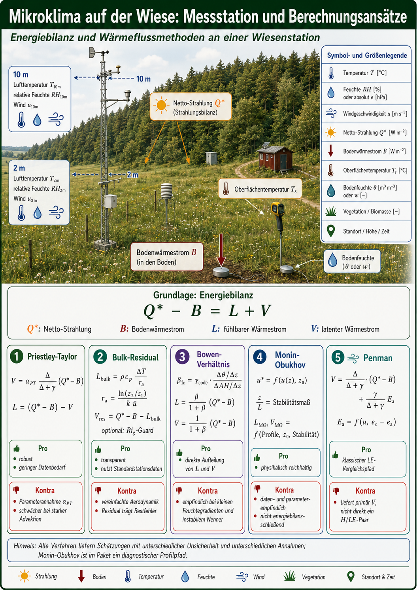
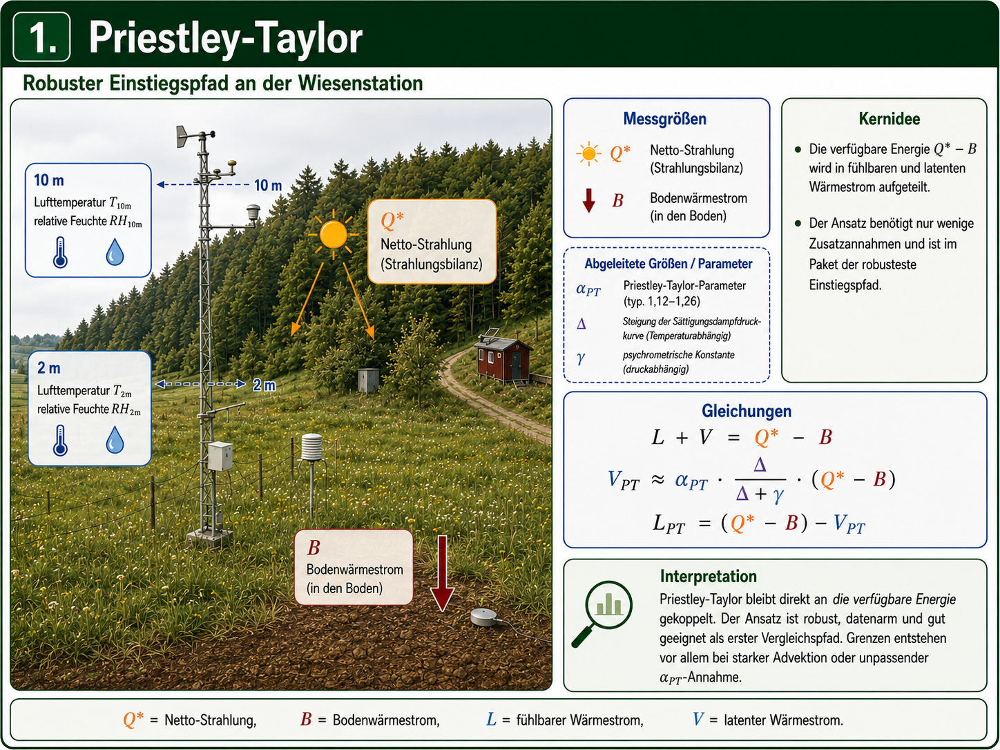
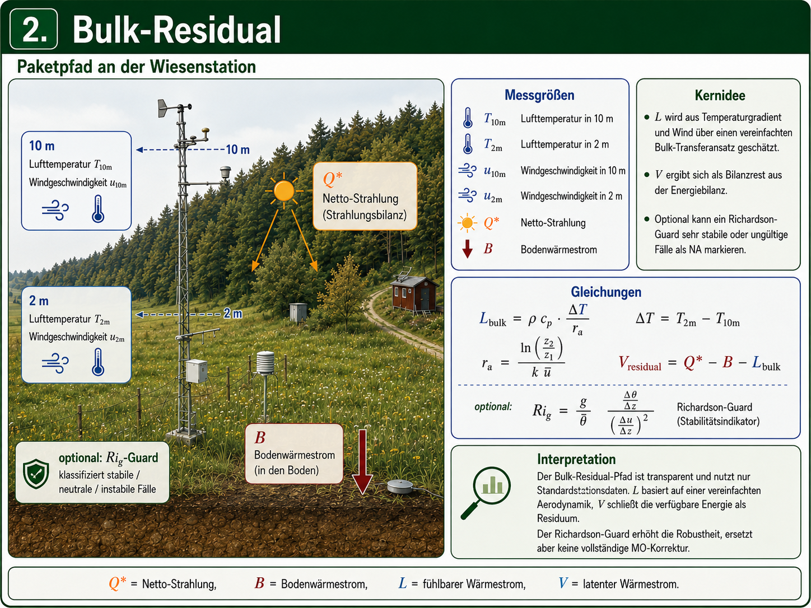
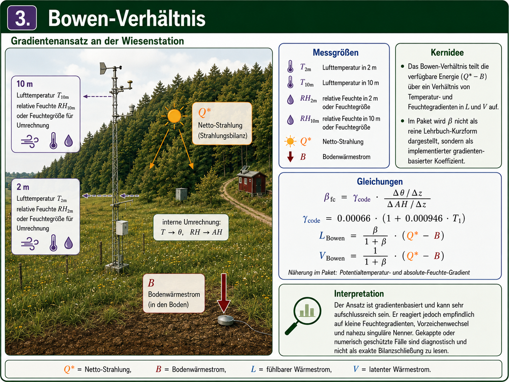
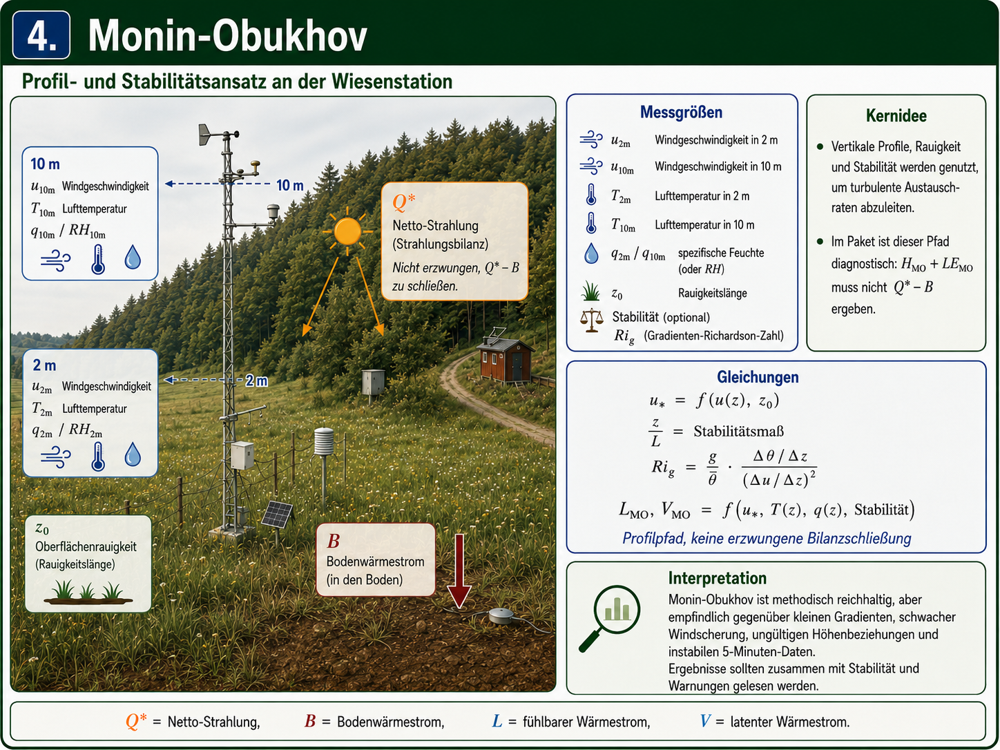
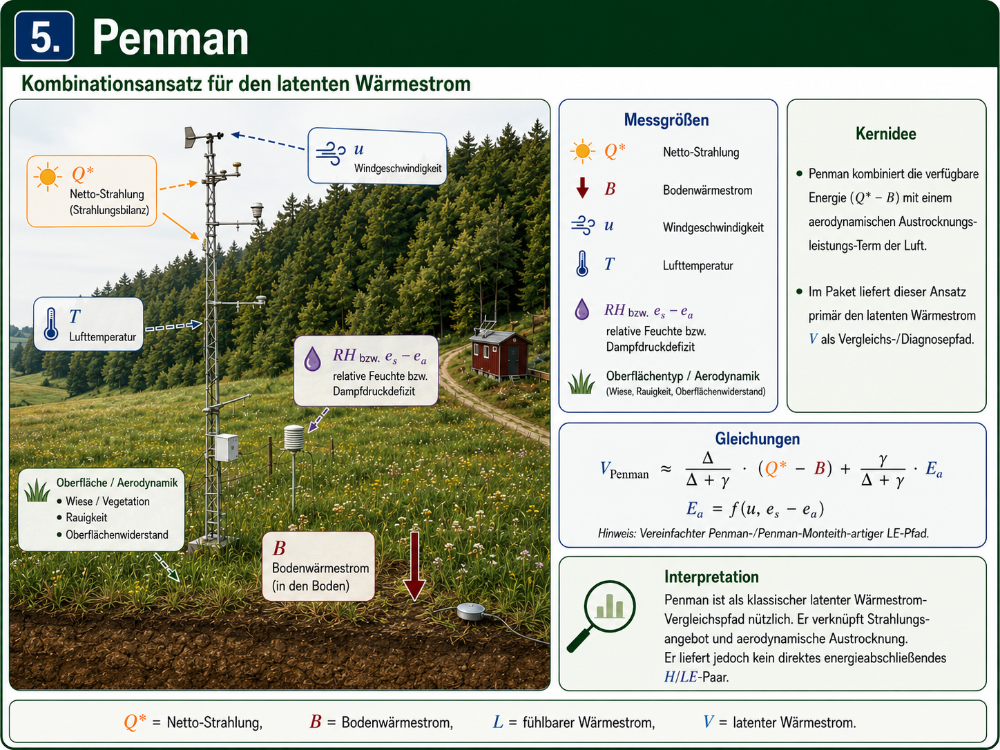

```{r setup, include=FALSE}
knitr::opts_chunk$set(
  collapse = TRUE,
  comment = "#>",
  warning = FALSE,
  message = FALSE
)
```

# Ziel dieser Vignette

Diese Vignette zeigt auf der Grundlage der `fieldClim`-Beispiele einen zusammenhängenden Workflow für die Kern-Funktionalität des Pakets. Sie zeigt eine vollständige Abfolge von Arbeitsschritten: Messdaten einer Mikroklima-Station werden als `weather_station`-Objekt organisiert, Strahlungs- und Bodenwärmegrößen werden geprüft, und Wärmeflussmethoden werden auf derselben Datenbasis nebeneinander berechnet.

Die vorhandene Paketdokumentation deckt im Kern folgende Arbeitsbereiche ab: Wetterstationsobjekte, kurz- und langwellige Strahlung, Solar- und Geländegeometrie, atmosphärische Transmission, Bodenwärme, Feuchte-, Druck- und Temperaturhilfsfunktionen sowie latente und sensible Wärmeflussmethoden. 

Diese Vignette macht daraus acht Workflow-Schritte:

| Schritt | Leitfrage | Paketbereich |
|---|---|---|
| 0 | Was ist das Arbeitsmodell von `fieldClim`? | `weather_station`, Vignetten, Hilfeseiten |
| 1 | Wie wird ein Stationsdatensatz geladen und geprüft? | Beispieldaten in `inst/extdata/` |
| 2 | Wie werden kurzwellige Strahlung und Albedo gelesen und kontrolliert? | `rad_sw_*`, Messkomponenten |
| 3 | Wie werden langwellige Bilanz und Netto-Strahlung geprüft? | `rad_lw_*`, `rad_bal`, Messkomponenten |
| 4 | Wie entsteht aus Strahlung und Bodenwärmestrom verfügbare Energie? | Energie- und Bodenwärmefluss |
| 5 | Welche Wärmeflussmethoden werden unterschieden? | Methodenkonzept, Bilanzbindung, Diagnostik |
| 6 | Wie wird derselbe Datensatz an `fieldClim` übergeben? | `build_weather_station()` |
| 7 | Wie werden PT, Bulk-Residual, Bowen, Monin-Obukhov/Profile und Penman verglichen? | `turb_flux_calc()`, `turb_flux_bulk_residual()` und Einzelmethoden |

# Notation

Die Vorlesungsfolien verwenden für die bodennahe Energiebilanz die Größen `Q*`, `B`, `L` und `V`. Diese Vignette behält diese Notation im Erklärungsteil bei. Erst an der Schnittstelle zum Datensatz und zu `fieldClim` wird auf die spezifischen Paket- und Spaltennamen des `fieldClim` Pakets gemappt.

```{r theory-energy-figures, echo=FALSE, fig.width=8, fig.height=4.5, out.width="100%"}
knitr::include_graphics(c(
  "figures/anchor_mesoklima_p45.png",
  "figures/anchor_mesoklima_p46.png"
))
```

| Theoriegröße | Bedeutung | Code-Variable in dieser Vignette | Feld im Datensatz oder Paket |
|---|---|---|---|
| `Q*` | Strahlungsbilanz / Netto-Strahlung | `Q_star` | `rad_net`, `rad_bal` |
| `B` | Bodenwärmestrom | `B` | `heatflux_soil`, `soil_flux` |
| `L` | fühlbarer Wärmestrom | `L` | `sensible_*` |
| `V` | latenter Wärmestrom | `V` | `latent_*` |
| `S` | Speicherterm | `S` | hier nicht separat gemessen |

Die Arbeitsbilanz lautet in der Theorie-Notation:

$$
Q^{*} = B + L + V + S
$$

Der Speicherterm `S` wird in diesem Beispieldatensatz nicht separat berechnet. Das bedeutet nicht, dass Speicherung nicht existiert. Es bedeutet nur, dass die Datengrundlage keine vollständige Auflösung von Wärmespeicherung in Luftvolumen, Vegetation, Wasserfilmen, oberflächennahem Boden und Messumgebung erlaubt. Für die transparente Referenzrechnung wird deshalb gesetzt:

$$
S \approx 0
$$

Damit wird:

$$
Q^{*} - B = L + V
$$

und für die Residualrechnung:

$$
V = Q^{*} - B - L
$$

Mit dem Ausdruck **Kontrolle aus Einzelkomponenten** wird eine arithmetische Prüfung bezeichnet: Aus kurzwelliger und langwelliger Bilanz wird eine zweite Zeitreihe für `Q*` berechnet und mit der gemessenen Spalte `rad_net` verglichen.

# Workflow-Schritt 0: Was soll das Paket leisten?

`fieldClim` ist kein einzelnes Skript, sondern ein R-Paket mit mehreren Ebenen. Für die Arbeit mit mikroklimatischen Stationsdaten ist die zentrale Idee das `weather_station`-Objekt. Dieses Objekt bündelt Zeitachse, Standort, Messgrößen und Modellparameter. Paketfunktionen können damit dieselbe Datenstruktur weiterreichen, ergänzen und als Tabelle ausgeben.

| Paketebene | Zweck | Beispiele |
|---|---|---|
| Objektstruktur | Messdaten und Parameter bündeln | `build_weather_station()`, `as.data.frame()` |
| Strahlung | kurzwellige, langwellige und Netto-Strahlung berechnen oder prüfen | `rad_sw_bal()`, `rad_lw_bal()`, `rad_bal()` |
| Solar- und Geländegeometrie | Sonnenstand, Gelände- und Sichtfaktoren vorbereiten | `sol_*`, `terr_*` |
| Transmission | atmosphärische Dämpfung der Strahlung beschreiben | `trans_*` |
| Boden | Wärmeleitfähigkeit, Dämpfung und Bodenwärmestrom behandeln | `soil_*` |
| Feuchte, Druck, Temperatur | Hilfsgrößen für weitere Berechnungen bereitstellen | `hum_*`, `pres_*`, `temp_*` |
| Wärmeflüsse | fühlbare und latente Wärmeflüsse schätzen | `sensible_*`, `latent_*` |
| Sammelworkflow | mehrere Wärmeflussmethoden in einem Schritt berechnen | `turb_flux_calc()` |

```{r fieldClim-concept-image, echo=FALSE, fig.width=9, fig.height=6, out.width="100%"}

```

Die Workflow-Schritte behandeln nicht jede der verfügbaren Einzelfunktion isoliert. Vielmehr soll die Abfolge die vorhandenen Funktionsgruppen in einen Arbeitsablauf gebracht werden: vom Stationsdatensatz über visuelle Plausibilitätskontrolle,  Strahlung und Bodenwärmestrom bis zum Vergleich mehrerer Wärmeflussmethoden.

# Workflow-Schritt 1: Stationsdaten laden und prüfen

Der Beispieldatensatz enthält einen vollständigen 5-Minuten-Tag der Caldern-Wiese. Ein vollständiger Tag mit 5-Minuten-Zeitschritten hat 288 Messzeitpunkte.

```{r load-data}
# Das Paket laden.
# Die Vignette setzt voraus, dass fieldClim installiert oder im Paketprojekt verfügbar ist.
library(fieldClim)

# Pfad zur Paket-Beispieldatei.
# Für eine Paketvignette ist system.file() der passende Weg, weil die Datei
# nach Installation unter inst/extdata/ ausgeliefert wird.
caldern_file <- system.file(
  "extdata",
  "caldern_wiese_2017-06-30.csv",
  package = "fieldClim"
)

# CSV-Datei einlesen.
# Leere Felder, "NULL" und "NA" werden als fehlende Werte behandelt.
caldern <- read.csv(
  caldern_file,
  na.strings = c("NULL", "NA", "")
)

# Zeitstempel explizit als Datum-Zeit-Werte interpretieren.
# Die Zeitzone ist wichtig, weil Strahlungs- und Tagesganginterpretationen
# zeitabhängig sind.
caldern$datetime <- as.POSIXct(
  caldern$datetime,
  format = "%Y-%m-%d %H:%M:%S",
  tz = "Europe/Berlin"
)

# Anzahl der Zeilen prüfen.
nrow(caldern)

# Zeitbereich prüfen.
range(caldern$datetime)

# Zeitschritt prüfen.
summary(diff(caldern$datetime))

# Spaltennamen anzeigen.
names(caldern)
```

**Interpretation.** Der Datensatz ist für den folgenden Workflow gut geeignet: Er enthält `r nrow(caldern)` Messzeitpunkte und deckt damit genau einen vollständigen 5-Minuten-Tag ab. Das ist wichtig, weil die späteren Wärmeflüsse nicht aus Einzelwerten entstehen, sondern aus einem Tagesverlauf. Erst die gleichmäßige Zeitachse macht sichtbar, wann Strahlung, Bodenwärmestrom, Temperaturgradienten und Wind zusammenwirken. Für Nicht-Meteorolog:innen ist die wichtigste Botschaft: Wenn hier schon Zeitstempel, Zeitschritt oder fehlende Werte nicht stimmen, sieht eine spätere Flusskurve zwar rechnerisch aus, hat aber keine belastbare Bedeutung.

# Workflow-Schritt 2: Kurzwellige Strahlung und Albedo

Die Folien zur Strahlung zeigen, dass einfallende kurzwellige Strahlung durch Sonnenstand, optische Weglänge und Transmission bestimmt wird. Die Albedo-Folie definiert den reflektierten Anteil als Verhältnis von ausgehender zu einfallender kurzwelliger Strahlung.

```{r theory-shortwave-figures, echo=FALSE, fig.width=8, fig.height=4.5, out.width="100%"}
knitr::include_graphics(c(
  "figures/anchor_mesoklima_p18.png",
  "figures/anchor_mesoklima_p20.png",
  "figures/anchor_mesoklima_p33.png",
  "figures/anchor_mesoklima_p34.png"
))
```

Die kurzwellige Bilanz lautet:

$$
K^{*} = K_{down} - K_{up}
$$

Die Albedo lautet:

$$
\alpha = \frac{K_{up}}{K_{down}}
$$

```{r shortwave-calc}
# Einfallende kurzwellige Strahlung aus der Messspalte übernehmen.
caldern$K_down <- caldern$rad_sw_in

# Reflektierte kurzwellige Strahlung aus der Messspalte übernehmen.
caldern$K_up <- caldern$rad_sw_out

# Kurzwellige Bilanz berechnen.
# Das ist der kurzwellige Anteil, der nach Reflexion an der Oberfläche bleibt.
caldern$K_star <- caldern$K_down - caldern$K_up

# Albedo berechnen.
# Bei sehr kleiner Einstrahlung ist der Quotient instabil; deshalb wird
# erst ab 50 W/m² gerechnet.
caldern$alpha <- ifelse(
  caldern$K_down > 50,
  caldern$K_up / caldern$K_down,
  NA
)
```

## Einzelplots

```{r shortwave-single-plots, fig.width=8, fig.height=8}
# Drei Einzelplots übereinander: einfallend, reflektiert, kurzwellige Bilanz.
op <- par(mfrow = c(3, 1), mar = c(3.5, 4, 2, 1))

plot(caldern$datetime, caldern$K_down, type = "l", col = "#D55E00", lwd = 2,
     xlab = "Zeit", ylab = "W/m²", main = "K_down: einfallende kurzwellige Strahlung")

plot(caldern$datetime, caldern$K_up, type = "l", col = "#7A7A7A", lwd = 2,
     xlab = "Zeit", ylab = "W/m²", main = "K_up: reflektierte kurzwellige Strahlung")

plot(caldern$datetime, caldern$K_star, type = "l", col = "#000000", lwd = 2,
     xlab = "Zeit", ylab = "W/m²", main = "K*: kurzwellige Bilanz")

par(op)
```

**Interpretation.** Die einfallende kurzwellige Strahlung ist der sichtbare Tagesmotor der Energiebilanz: nachts nahezu null, tagsüber stark ansteigend, bei Bewölkung oder wechselnder Abschattung unruhiger. Die reflektierte kurzwellige Strahlung folgt diesem Verlauf, bleibt aber deutlich kleiner, weil die Wiesenoberfläche nur einen Teil der Sonneneinstrahlung zurückwirft. Die kurzwellige Bilanz `K_star` ist deshalb der Teil der Sonnenenergie, der nach der Reflexion tatsächlich im System Oberfläche-Atmosphäre verbleibt. Dieser Schritt erklärt anschaulich, warum Albedo keine Nebengröße ist: Schon kleine Änderungen der Reflexion verändern die verfügbare Energie für Erwärmung, Bodenwärmestrom und Verdunstung.

```{r albedo-plot, fig.width=8, fig.height=3.8}
plot(caldern$datetime, caldern$alpha, type = "l", col = "#005AB5", lwd = 2,
     xlab = "Zeit", ylab = "Albedo [-]", main = "Effektive Albedo")
abline(h = median(caldern$alpha, na.rm = TRUE), lty = 2, col = "grey50")
```

**Interpretation.** Die Albedo wird hier nicht als Tabellenwert für „Wiese“ eingesetzt, sondern aus den gemessenen Strahlungskomponenten berechnet. Dadurch ist sie ein Diagnosewert der konkreten Messsituation. Sie kann sich ändern, obwohl das Material gleich bleibt: flacher Sonnenstand, diffuse Bewölkung, feuchte Vegetation oder Sensorrauschen verändern das Verhältnis von ausgehender zu einfallender Strahlung. Der Filter bei niedriger Einstrahlung ist deshalb fachlich nötig. Bei sehr kleinen `K_down`-Werten kann ein kleiner Messfehler im Zähler oder Nenner den Quotienten stark verzerren; dann würde die Albedo mehr Rechenartefakt als Oberflächeneigenschaft zeigen.

## Zusammengesetzter Plot

```{r shortwave-combined-plot, fig.width=8, fig.height=4}
cols_sw <- c("#D55E00", "#7A7A7A", "#000000")
op <- par(mar = c(6, 4, 3, 1), xpd = NA)

plot(caldern$datetime, caldern$K_down, type = "l", col = cols_sw[1], lwd = 2,
     ylim = range(caldern$K_down, caldern$K_up, caldern$K_star, na.rm = TRUE),
     xlab = "Zeit", ylab = "W/m²", main = "Kurzwellige Strahlung")
lines(caldern$datetime, caldern$K_up, col = cols_sw[2], lwd = 2)
lines(caldern$datetime, caldern$K_star, col = cols_sw[3], lwd = 2)
legend("bottom", inset = c(0, -0.35), horiz = TRUE, bty = "n",
       legend = c("K_down", "K_up", "K*"), col = cols_sw, lty = 1, lwd = 2)

par(op)
```

**Interpretation.** Der zusammengesetzte Plot zeigt die Bilanzlogik in einer einzigen Grafik: Aus der einfallenden kurzwelligen Strahlung wird die reflektierte kurzwellige Strahlung abgezogen. Die schwarze Linie ist deshalb keine neue Messgröße, sondern die rechnerische Nettowirkung der kurzwelligen Strahlung. Für die spätere Energiebilanz ist genau diese Restgröße relevant: Nicht die gesamte Sonneneinstrahlung steht zur Verfügung, sondern nur der Anteil, der nach Reflexion an der Oberfläche verbleibt.

# Workflow-Schritt 3: Langwellige Bilanz und Netto-Strahlung Q*

Die Folien zur langwelligen Aus- und Gegenstrahlung beziehen sich auf Stefan-Boltzmann-Logik, Emissionsvermögen und atmosphärische Gegenstrahlung. Für die Stationsdaten wird daraus die langwellige Bilanz.

```{r theory-longwave-figures, echo=FALSE, fig.width=8, fig.height=4.5, out.width="100%"}
knitr::include_graphics(c(
  "figures/anchor_mesoklima_p39.png",
  "figures/anchor_mesoklima_p41.png"
))
```

$$
L^{*} = L_{down} - L_{up}
$$

$$
Q^{*} = K^{*} + L^{*}
$$

```{r longwave-calc}
# Langwellige Gegenstrahlung aus der Atmosphäre.
caldern$L_down <- caldern$LDnCo

# Langwellige Ausstrahlung der Oberfläche.
caldern$L_up <- caldern$LUpCo

# Langwellige Bilanz.
caldern$L_star <- caldern$L_down - caldern$L_up

# Netto-Strahlung aus Einzelkomponenten.
# Das ist eine Kontrollrechnung, keine neue Messung.
caldern$Q_star_components <- caldern$K_star + caldern$L_star

# Gemessene Netto-Strahlung aus der Datei.
caldern$Q_star_measured <- caldern$rad_net
```

## Einzelplots

```{r longwave-single-plots, fig.width=8, fig.height=8}
op <- par(mfrow = c(3, 1), mar = c(3.5, 4, 2, 1))

plot(caldern$datetime, caldern$L_down, type = "l", col = "#0072B2", lwd = 2,
     xlab = "Zeit", ylab = "W/m²", main = "L_down: langwellige Gegenstrahlung")

plot(caldern$datetime, caldern$L_up, type = "l", col = "#CC79A7", lwd = 2,
     xlab = "Zeit", ylab = "W/m²", main = "L_up: langwellige Ausstrahlung")

plot(caldern$datetime, caldern$L_star, type = "l", col = "#000000", lwd = 2,
     xlab = "Zeit", ylab = "W/m²", main = "L*: langwellige Bilanz")

par(op)
```

**Interpretation.** Die langwellige Strahlung verhält sich anders als die kurzwellige Sonnenstrahlung. Sie verschwindet nachts nicht, weil Atmosphäre und Oberfläche auch ohne Sonne Wärme abstrahlen. `L_down` beschreibt die atmosphärische Gegenstrahlung, `L_up` die Ausstrahlung der Oberfläche. Die Differenz `L_star` zeigt, ob die Oberfläche langwellig Energie gewinnt oder verliert. Für Nicht-Meteorolog:innen ist der zentrale Punkt: Kurzwellige Strahlung erklärt vor allem den Tagesantrieb durch die Sonne; langwellige Strahlung erklärt, warum die Oberfläche auch nachts energetisch aktiv bleibt.

## Kontrolle von Q* aus Einzelkomponenten

Die Netto-Strahlung `Q*` ist der zentrale Eingang in die Energiebilanz. In der Theorie steht `Q*` als Strahlungsbilanz auf der linken Seite der bodennahen Energiebilanz:

$$
0 = Q^{*} - B - L - V
$$

In dieser Vignette entspricht:

| Theorie | Datensatz / Paket | Bedeutung |
|---|---|---|
| `Q*` | `rad_net` bzw. `rad_bal` | Netto-Strahlung |
| `B` | `heatflux_soil` bzw. `soil_flux` | Bodenwärmestrom |
| `L` | `H`, `sensible_*` | fühlbarer Wärmestrom |
| `V` | `LE`, `latent_*` | latenter Wärmestrom |

Theoretisch kann `Q*` aus kurzwelligen und langwelligen Einzelkomponenten gebildet werden:

$$
K^{*} = K_\downarrow - K_\uparrow
$$

$$
L^{*} = L_\downarrow - L_\uparrow
$$

$$
Q^{*} = K^{*} + L^{*}
$$

Im Datensatz liegt aber zusätzlich bereits eine Spalte `rad_net` vor. Deshalb wird hier nicht einfach eine neue Netto-Strahlung "rekonstruiert", sondern geprüft, ob die vorhandene Spalte `rad_net` und die Summe aus Einzelkomponenten dieselbe Bilanzebene beschreiben.

```{r qstar-components}
# Kurzwellige Komponenten:
# K_down ist die einfallende kurzwellige Strahlung.
# K_up ist die reflektierte kurzwellige Strahlung.
caldern$K_down <- caldern$rad_sw_in
caldern$K_up <- caldern$rad_sw_out

# Kurzwellige Bilanz.
caldern$K_star <- caldern$K_down - caldern$K_up

# Langwellige Komponenten:
# L_down ist die atmosphärische Gegenstrahlung.
# L_up ist die langwellige Ausstrahlung der Oberfläche.
caldern$L_down <- caldern$LDnCo
caldern$L_up <- caldern$LUpCo

# Langwellige Bilanz.
caldern$L_star <- caldern$L_down - caldern$L_up

# Vorhandene Netto-Strahlung aus dem Datensatz.
caldern$Q_star_measured <- caldern$rad_net

# Kontrollgröße aus Einzelkomponenten.
# Diese Größe wird hier nur diagnostisch verwendet.
caldern$Q_star_components <- caldern$K_star + caldern$L_star

# Differenz zwischen Komponentensumme und vorhandener Netto-Strahlung.
# Positive Werte bedeuten:
# K* + L* ist größer als rad_net.
caldern$Q_star_difference <- caldern$Q_star_components - caldern$Q_star_measured

summary(caldern$Q_star_difference)
```

```{r qstar-check-plot, fig.width=8, fig.height=4}
cols_q <- c("#000000", "#0072B2")

op <- par(mar = c(6, 4, 3, 1), xpd = NA)

plot(
  caldern$datetime,
  caldern$Q_star_measured,
  type = "l",
  col = cols_q[1],
  lwd = 2,
  ylim = range(caldern$Q_star_measured, caldern$Q_star_components, na.rm = TRUE),
  xlab = "Zeit",
  ylab = "W/m²",
  main = "Q*: vorhandene Netto-Strahlung und Komponentensumme"
)

lines(
  caldern$datetime,
  caldern$Q_star_components,
  col = cols_q[2],
  lwd = 2
)

legend(
  "bottom",
  inset = c(0, -0.35),
  horiz = TRUE,
  bty = "n",
  legend = c("Q* vorhanden: rad_net", "Kontrolle: K* + L*"),
  col = cols_q,
  lty = 1,
  lwd = 2
)

par(op)
```

**Interpretation.** Die beiden Linien sind nicht deckungsgleich. Die Differenz zwischen Komponentensumme und vorhandener Netto-Strahlung ist durchgehend positiv und reicht in diesem Tag von etwa `r round(min(caldern$Q_star_difference, na.rm = TRUE), 1)` bis `r round(max(caldern$Q_star_difference, na.rm = TRUE), 1)` W/m²; im Mittel liegt sie bei `r round(mean(caldern$Q_star_difference, na.rm = TRUE), 1)` W/m². Das ist kein kleiner Rundungsfehler, sondern eine eigene Datendiagnose. Für die weitere Rechnung heißt das: `rad_net` und `K_down - K_up + L_down - L_up` dürfen in diesem Datensatz nicht unbesehen als dieselbe Netto-Strahlung behandelt werden.

Das ist zentral, weil die meisten Wärmeflussmethoden direkt an der verfügbaren Energie hängen. Wenn `Q_star` um mehrere zehn W/m² verschoben ist, verschieben sich auch Priestley-Taylor, Bowen, Bulk-Residual und der Energieanteil von Penman. Monin-Obukhov/Profile nutzt `Q_star` zwar nicht als direkten Energieterm, braucht `Q_star - B` aber als Plausibilitätsmaßstab. Eine unklare Netto-Strahlung macht deshalb nicht nur eine Kurve unsicher, sondern den gesamten Methodenvergleich schwerer interpretierbar.

```{r qstar-scatter, fig.width=5, fig.height=5}
plot(
  caldern$Q_star_measured,
  caldern$Q_star_components,
  pch = 16,
  col = rgb(0, 0, 0, 0.35),
  xlab = "Q* vorhanden: rad_net [W/m²]",
  ylab = "Kontrolle: K* + L* [W/m²]",
  main = "Q*: rad_net gegen Komponentensumme"
)

abline(0, 1, lty = 2, col = "grey40")
```

**Interpretation.** Der Scatterplot macht sichtbar, dass es sich nicht um zufälliges Hin-und-Her-Rauschen handelt. Die Punkte liegen systematisch oberhalb der 1:1-Linie. Die aus Einzelkomponenten berechnete Netto-Strahlung ist also fast durchgehend größer als `rad_net`. Praktisch bedeutet das: Die Komponentensumme kann nicht einfach als Ersatz für `rad_net` verwendet werden, ohne vorher zu klären, ob beide Größen dieselbe Korrektur, dieselbe Mittelung, dieselbe Vorzeichenkonvention und dieselbe Sensorverarbeitung repräsentieren.

```{r qstar-difference-time, fig.width=8, fig.height=3.8}
plot(
  caldern$datetime,
  caldern$Q_star_difference,
  type = "l",
  col = "#D55E00",
  lwd = 2,
  xlab = "Zeit",
  ylab = "K* + L* - rad_net [W/m²]",
  main = "Differenz zwischen Komponentensumme und rad_net"
)

abline(h = 0, lty = 2, col = "grey40")
```

**Interpretation.** Die Zeitreihe zeigt, wann die Abweichung besonders groß wird. Wenn sie im Tagesverlauf mit der Strahlung anwächst, ist sie nicht als zufälliger Messpunktfehler zu lesen. Dann liegt näher, dass die beiden Netto-Strahlungsgrößen auf unterschiedlichen Verarbeitungsschritten beruhen: zum Beispiel anderer Loggerkanal, andere Korrektur der langwelligen Komponenten, unterschiedliche Mittelungsfenster oder nicht identische Vorzeichenlogik. Für den Workflow reicht hier eine klare Entscheidung: Weitergerechnet wird mit der vorhandenen Arbeitsgröße `rad_net`; die Komponentensumme bleibt eine Qualitäts- und Plausibilitätskontrolle.

```{r qstar-difference-solar, fig.width=5.5, fig.height=5}
plot(
  caldern$K_down,
  caldern$Q_star_difference,
  pch = 16,
  col = rgb(0, 0, 0, 0.35),
  xlab = "K_down [W/m²]",
  ylab = "K* + L* - rad_net [W/m²]",
  main = "Abweichung in Abhängigkeit vom solaren Antrieb"
)

abline(h = 0, lty = 2, col = "grey40")
```

**Interpretation.** Die Kopplung an `K_down` zeigt, dass die Abweichung mit dem solaren Tagesgang zusammenhängt. Das spricht gegen eine reine Zufallsstreuung. Für die weitere Auswertung ist die Konsequenz wichtiger als die exakte Ursache: Die Netto-Strahlung muss als bewusste Arbeitsgröße gewählt werden. In dieser Vignette wird `rad_net` als `Q_star` verwendet, während `K_star + L_star` als Kontrollgröße stehen bleibt.

> Diese Prüfung ist der methodische Drehpunkt der Vignette. Ohne eine klare Arbeitsgröße für `Q_star` wäre der spätere Methodenvergleich uneindeutig: Unterschiede zwischen PT, Bulk-Residual, Bowen oder Penman könnten dann teilweise aus einer verschobenen Strahlungsbilanz stammen und nicht aus der eigentlichen Methode. Monin-Obukhov/Profile ist davon weniger direkt betroffen, weil dieser Pfad aus Profilen rechnet; zur Plausibilitätsprüfung gegen die verfügbare Energie braucht man aber auch dort eine verlässliche Vergleichsgröße.

# Workflow-Schritt 4: Bodenwärmestrom und verfügbare Energie

Die Bodenwärme-Folien zeigen den Bodenwärmestrom als Wärmeleitungsproblem. In den Caldern-Daten wird `B` direkt als `heatflux_soil` verwendet.

```{r theory-soil-figures, echo=FALSE, fig.width=8, fig.height=4.5, out.width="100%"}
knitr::include_graphics(c(
  "figures/anchor_mesoklima_p47.png",
  "figures/anchor_mesoklima_p50.png"
))
```

Die verfügbare Energie für fühlbaren und latenten Wärmestrom ist:

$$
Q^{*} - B
$$

```{r available-energy-calc}
# Theoriegröße Q*: gemessene Netto-Strahlung.
caldern$Q_star <- caldern$Q_star_measured

# Theoriegröße B: gemessener Bodenwärmestrom.
caldern$B <- caldern$heatflux_soil

# Energie, die für L und V verfügbar bleibt.
caldern$Q_minus_B <- caldern$Q_star - caldern$B
```

## Einzelplots

```{r energy-single-plots, fig.width=8, fig.height=8}
op <- par(mfrow = c(3, 1), mar = c(3.5, 4, 2, 1))

plot(caldern$datetime, caldern$Q_star, type = "l", col = "#000000", lwd = 2,
     xlab = "Zeit", ylab = "W/m²", main = "Q*: Netto-Strahlung")

plot(caldern$datetime, caldern$B, type = "l", col = "#009E73", lwd = 2,
     xlab = "Zeit", ylab = "W/m²", main = "B: Bodenwärmestrom")

plot(caldern$datetime, caldern$Q_minus_B, type = "l", col = "#D55E00", lwd = 2,
     xlab = "Zeit", ylab = "W/m²", main = "Q* - B: verfügbare Energie")

par(op)
```

**Interpretation.** `Q_star` ist der radiative Nettoantrieb des Tages: tagsüber positiv durch die Sonne, nachts häufig negativ oder schwach, weil langwellige Verluste dominieren. `B` beschreibt den Bodenwärmestrom. In der hier verwendeten Vorzeichenkonvention bedeutet ein positiver Bodenwärmestrom, dass Energie in den Boden geht und damit nicht mehr für die turbulenten Flüsse in die Luft zur Verfügung steht. `Q_star - B` ist deshalb die eigentliche Arbeitsgröße für die energiegebundenen Methoden. Sie sagt: So viel Energie bleibt nach Abzug des Bodenanteils für fühlbaren und latenten Wärmestrom übrig.

## Zusammengesetzter Plot

```{r energy-combined-plot, fig.width=8, fig.height=4}
cols_energy <- c("#000000", "#009E73", "#D55E00")
op <- par(mar = c(6, 4, 3, 1), xpd = NA)

plot(caldern$datetime, caldern$Q_star, type = "l", col = cols_energy[1], lwd = 2,
     ylim = range(caldern$Q_star, caldern$B, caldern$Q_minus_B, na.rm = TRUE),
     xlab = "Zeit", ylab = "W/m²", main = "Q*, B und Q* - B")
lines(caldern$datetime, caldern$B, col = cols_energy[2], lwd = 2)
lines(caldern$datetime, caldern$Q_minus_B, col = cols_energy[3], lwd = 2)
legend("bottom", inset = c(0, -0.35), horiz = TRUE, bty = "n",
       legend = c("Q*", "B", "Q* - B"), col = cols_energy, lty = 1, lwd = 2)

par(op)
```

# Workflow-Schritt 5: Methodenüberblick und Rollen der Verfahren

## Methodenüberblick

Die folgende Übersichtsgrafik zeigt die gemeinsame Messsituation: eine Wiesenstation mit Strahlungsbilanz, Bodenwärmestrom, Temperatur-, Feuchte- und Windmessungen in mehreren Höhen. Alle folgenden Verfahren greifen auf dieselbe Stationslogik zurück, verwenden daraus aber unterschiedliche Teilinformationen.

```{r method-overview-image, echo=FALSE, fig.width=9, fig.height=6, out.width="100%"}

```

Die Verfahren sind nicht als gleichartige Messverfahren zu lesen. Sie sind unterschiedliche Rechenpfade mit unterschiedlicher Nähe zur Energiebilanz, zu Gradienten und zu Profilannahmen. Für die eigentliche Auswertung wird der Paketpfad `turb_flux_bulk_residual()` verwendet.

| Methode | Hauptfrage | Direkte Eingänge | Ergebnis | Rolle im Workflow |
|---|---|---|---|---|
| Priestley-Taylor | Wie wird die verfügbare Energie stabil partitioniert? | `Q_star`, `B`, Parameter | `L_pt`, `V_pt` | erster, energiegebundener Paketpfad |
| Bulk-Residual | Wie schätzt das Paket `L` aus Temperaturgradient und Wind und berechnet `V` als Residuum? | `weather_station`, `sensible_bulk()`, `latent_bulk_residual()` | `L_bulk_pkg`, `V_bulk_pkg` | residualer Paketpfad, optional mit Richardson-Guard |
| Bowen-Verhältnis | Wie teilt ein Temperatur-/Feuchtegradient die verfügbare Energie auf? | Temperaturgradient, Feuchtegradient, `Q_star`, `B` | `L_bowen`, `V_bowen` | gradientenempfindliche Partitionierung |
| Monin-Obukhov/Profile | Wie reagieren Profilmethoden auf Gradienten und Stabilität? | Windprofil, Temperaturprofil, Feuchteprofil, Stabilitätsdiagnostik | `L_monin`, `V_monin` | profilbasiert, nicht bilanznormiert/energie-schließend |
| Penman | Wie groß ist der latente Wärmestrom aus Energie- und Verdunstungsantrieb? | `Q_star`, `B`, Wind, Temperatur, Feuchte, Oberfläche | `V_penman` | LE-only Vergleichspfad |

### 1. Priestley-Taylor

```{r method-pt-image, echo=FALSE, fig.width=9, fig.height=6, out.width="100%"}

```

Priestley-Taylor ist in dieser Vignette der stabile erste Paketpfad. Der Ansatz bleibt direkt an die verfügbare Energie gebunden und benötigt keine empfindliche Aufteilung über kleine Feuchtegradienten.

$$
L + V = Q^{*} - B
$$

$$
V_{PT} \approx \alpha_{PT} \frac{\Delta}{\Delta + \gamma} (Q^{*} - B)
$$

$$
L_{PT} = (Q^{*} - B) - V_{PT}
$$

Der Vorteil dieses Pfads ist die Bilanzbindung: Wenn `Q_star` und `B` korrekt gesetzt sind, bleibt die Summe aus `L_PT` und `V_PT` auf der verfügbaren Energie.

### 2. Bulk-Residual mit optionalem Richardson-Guard

```{r method-bulk-image, echo=FALSE, fig.width=9, fig.height=6, out.width="100%"}

```

Der Paketpfad `turb_flux_bulk_residual()` nutzt eine einfache Bulk-Transfer-Schätzung für den fühlbaren Wärmestrom und berechnet den latenten Wärmestrom anschließend als Residuum. Die Grundlogik ist:

$$
L_{bulk} = \rho c_p \frac{\Delta T}{r_a}
$$

$$
r_a = \frac{\ln(z_2 / z_1)}{k \bar{u}}
$$

$$
V_{residual} = Q^{*} - B - L_{bulk}
$$

Zusätzlich kann `sensible_bulk()` mit `stability_method = "ri_guard"` eine Gradient-Richardson-Zahl berechnen:

$$
Ri_g =
\frac{g}{\bar{\theta}}
\frac{\Delta \theta / \Delta z}
{(\Delta u / \Delta z)^2}
$$

Der Guard ist nicht der Default. Er wird nur aktiviert, wenn `stability_method = "ri_guard"` gesetzt wird. Instabile, neutrale und moderat stabile Fälle behalten den neutralen Bulk-Wert. Sehr stabile, ungültige oder schwach geschwerte Fälle werden auf `NA` gesetzt. Wenn `L_bulk` dadurch `NA` wird, wird auch das Residuum `V_bulk` `NA`. Das verhindert, dass eine algebraische Residualschließung einen nicht belastbaren fühlbaren Wärmestrom verdeckt.

Die aktuell eingebundene Bulk-Grafik zeigt noch die Grundlogik der früheren manuellen Referenz. Sie wird im nächsten Abbildungsschritt auf den Paketpfad mit optionalem Richardson-Guard umgestellt.

### 3. Bowen-Verhältnis

```{r method-bowen-image, echo=FALSE, fig.width=9, fig.height=6, out.width="100%"}

```

Der Bowen-Ansatz nutzt ein Verhältnis aus Temperatur- und Feuchtegradient. Er verteilt die verfügbare Energie auf fühlbaren und latenten Wärmestrom.

$$
\beta \approx \frac{\Delta T}{\Delta e}
$$

Didaktisch entscheidend ist hier das Gradientenverhältnis. Die Paketimplementierung ist spezifischer: Sie verwendet eine Potentialtemperaturdifferenz und eine absolute Feuchtedifferenz mit einem empirischen `fieldClim`-Koeffizienten. Deshalb wird Bowen in dieser Vignette als Paketpfad interpretiert, nicht als allgemeine textbook-Formel.

$$
L_{Bowen} = \frac{\beta}{1 + \beta} (Q^{*} - B)
$$

$$
V_{Bowen} = \frac{1}{1 + \beta} (Q^{*} - B)
$$

Der Ansatz ist für finite, nicht gekappte Fälle bilanzgebunden, aber stark gradientenempfindlich. Wenn Feuchtegradienten sehr klein werden, Vorzeichen wechseln, `beta` nicht endlich ist oder `1 + beta` nahe null liegt, können einzelne Zeitschritte stark ausschlagen. Gekappte oder nicht-endliche Fälle werden deshalb als nicht belastbare Bowen-Zeitschritte behandelt und nicht als exakte Aufteilung von \(Q^* - B\) interpretiert.

### 4. Monin-Obukhov/Profile

```{r method-mo-image, echo=FALSE, fig.width=9, fig.height=6, out.width="100%"}

```

Der Monin-Obukhov/Profile-Pfad ist in `fieldClim` kein Verfahren, das die verfügbare Energie automatisch auf \(L\) und \(V\) verteilt. Er berechnet Wärmeflüsse aus den gemessenen Unterschieden zwischen zwei Höhen: Temperatur, Feuchte, Wind und Messhöhe gehen direkt in die Profilrechnung ein. Deshalb reagiert der Ansatz besonders empfindlich, wenn diese Unterschiede sehr klein, verrauscht oder widersprüchlich sind.

Die aktuelle Paketfassung fängt solche problematischen Fälle kontrolliert ab. Wenn zwischen den beiden Höhen kein Temperaturgradient vorliegt, wird der fühlbare Wärmestrom für diesen Zeitschritt auf 0 gesetzt. Wenn kein Feuchtegradient vorliegt, wird der latente Wärmestrom auf 0 gesetzt. Wenn Messhöhen ungültig sind, Windwerte fehlen oder rechnerisch nicht auswertbare Profilzustände entstehen, gibt die Funktion für diese Zeitschritte `NA` zurück und erzeugt eine Warnung.

Wichtig ist: Diese Absicherung macht den Monin-Obukhov/Profile-Pfad nicht zu einem bilanzschließenden Verfahren. Große, aber rechnerisch endliche Werte werden nicht automatisch auf \(Q^* - B\) begrenzt. Deshalb müssen die Ergebnisse anschließend gegen die verfügbare Energie geprüft werden. Wenn \(L + V\) deutlich größer oder kleiner als \(Q^* - B\) ist, spricht das nicht sofort für ein reales Wärmeflussereignis, sondern für eine kritische Profil- oder Stabilitätssituation im Datensatz.


Für die Interpretation gilt deshalb: Monin-Obukhov/Profile-Werte werden nicht auf die verfügbare Energie \(Q^* - B\) normiert. Es wird also nicht erwartet, dass

$$
L_{MO} + V_{MO} = Q^* - B
$$

gilt. Die Gleichung dient hier nur als Plausibilitätsprüfung. Wenn \(L_{MO} + V_{MO}\) deutlich von \(Q^* - B\) abweicht, spricht das für empfindliche oder problematische Profilbedingungen: kleine Temperatur- oder Feuchtegradienten, schwache Windunterschiede, ungünstige Stabilitätsannahmen oder 5-Minuten-Rauschen.

Große Abweichungen sind deshalb nicht automatisch ein Rechenfehler. Sie zeigen, dass der Profilpfad unter den vorliegenden Daten- und Stabilitätsbedingungen nicht wie ein energiegebundener Partitionierungsansatz gelesen werden darf.

### 5. Penman

```{r method-penman-image, echo=FALSE, fig.width=9, fig.height=6, out.width="100%"}

```

Penman ist ein Kombinationsansatz für den latenten Wärmestrom. Er verbindet einen Energieterm mit einem aerodynamischen Verdunstungsterm. Im aktuellen Paketpfad liefert Penman `V`, aber keinen eigenen fühlbaren Wärmestrom `L`.

$$
V_{Penman} \approx \frac{\Delta}{\Delta + \gamma}(Q^{*} - B) + \frac{\gamma}{\Delta + \gamma} E_a
$$

$$
E_a = f(u, e_s - e_a)
$$

Penman ist deshalb ein Vergleichs- und Prüfpfad für `V`, aber keine vollständige `L`/`V`-Partitionierung wie Priestley-Taylor oder Bowen.

# Workflow-Schritt 6: Übergabe an das fieldClim-Objekt

Das `weather_station`-Objekt ist die zentrale Paketstruktur. Es speichert nicht nur Messspalten, sondern auch Standort und Modellparameter. Dadurch können verschiedene Funktionen auf dieselbe strukturierte Datenbasis zugreifen.

```{r build-weather-station}
ws <- build_weather_station(
  # Zeitachse.
  datetime = caldern$datetime,

  # Standort der Station.
  lon = 8.6832,
  lat = 50.8405,
  elev = 261,

  # Standardtemperatur und Standardfeuchte.
  temp = caldern$Ta_2m,
  rh = caldern$Huma_2m,

  # Profilgrößen für gradienten- und stabilitätsbezogene Methoden.
  t1 = caldern$Ta_2m,
  t2 = caldern$Ta_10m,
  hum1 = caldern$Huma_2m,
  hum2 = caldern$Huma_10m,

  # Windprofil und Messhöhen.
  v1 = caldern$Windspeed_2m,
  v2 = caldern$Windspeed_10m,
  z1 = 2,
  z2 = 10,

  # Paketnamen für Theoriegrößen:
  # rad_bal entspricht Q*, soil_flux entspricht B.
  rad_bal = caldern$Q_star,
  soil_flux = caldern$B,

  # Weitere Oberflächen- und Bodeninformationen.
  moisture = caldern$water_vol_soil,
  surface_temp = caldern$Ts,

  # Oberflächentyp als Modellannahme.
  surface_type = "field",

  # Beobachtungshöhe für Verfahren, die eine Referenzhöhe brauchen.
  obs_height = 2
)

# Klasse und enthaltene Felder prüfen.
class(ws)
names(ws)

# Als Tabelle ausgeben.
head(as.data.frame(ws))
```

**Interpretation.** Das `weather_station`-Objekt ist mehr als eine schön benannte Tabelle. Es legt fest, welche Spalte welche physikalische Rolle übernimmt: `rad_bal` ist die Arbeitsgröße für `Q_star`, `soil_flux` ist `B`, `t1/t2`, `hum1/hum2` und `v1/v2` bilden die Vertikalprofile, und `surface_type = "field"` setzt die Oberflächenannahme für Methoden, die sie benötigen. Genau hier wird aus einem heterogenen CSV-Datensatz ein konsistenter Paketdatensatz. Fehler an dieser Stelle sind besonders folgenreich, weil sie anschließend von allen Methoden übernommen werden.

# Workflow-Schritt 7: Paketmethoden für Wärmeflüsse

## Priestley-Taylor als erster Paketpfad

Priestley-Taylor nutzt die verfügbare Energie `Q* - B` und eine empirische Verdunstungsparametrisierung. Der Vorteil im Einstieg ist nicht, dass die Methode „wahrer“ wäre, sondern dass sie keine instabilen Gradientenquotienten benötigt.

```{r priestley-taylor-calc}
# Nur den Priestley-Taylor-Pfad berechnen.
# Dieser Pfad ist als erster Paketvergleich stabiler als der volle Methodenworkflow.
flux_pt <- turb_flux_calc(ws, pt_only = TRUE)

# Ergebnisse zurück in den Auswertungsdatensatz schreiben.
caldern$L_pt <- flux_pt$sensible_priestley_taylor
caldern$V_pt <- flux_pt$latent_priestley_taylor
caldern$L_plus_V_pt <- caldern$L_pt + caldern$V_pt
```

```{r priestley-taylor-plots, fig.width=8, fig.height=6}
op <- par(mfrow = c(2, 1), mar = c(3.5, 4, 2, 1))

plot(caldern$datetime, caldern$L_pt, type = "l", col = "#CC79A7", lwd = 2,
     xlab = "Zeit", ylab = "W/m²", main = "Priestley-Taylor: L")
abline(h = 0, lty = 2, col = "grey50")

plot(caldern$datetime, caldern$V_pt, type = "l", col = "#56B4E9", lwd = 2,
     xlab = "Zeit", ylab = "W/m²", main = "Priestley-Taylor: V")
abline(h = 0, lty = 2, col = "grey50")

par(op)
```

```{r priestley-closure-plot, fig.width=8, fig.height=4}
cols_pt <- c("#D55E00", "#000000")
op <- par(mar = c(6, 4, 3, 1), xpd = NA)

plot(caldern$datetime, caldern$Q_minus_B, type = "l", col = cols_pt[1], lwd = 2,
     ylim = range(caldern$Q_minus_B, caldern$L_plus_V_pt, na.rm = TRUE),
     xlab = "Zeit", ylab = "W/m²", main = "Priestley-Taylor: Energieabschluss")
lines(caldern$datetime, caldern$L_plus_V_pt, col = cols_pt[2], lwd = 2)
legend("bottom", inset = c(0, -0.35), horiz = TRUE, bty = "n",
       legend = c("Q* - B", "L + V nach PT"), col = cols_pt, lty = 1, lwd = 2)

par(op)
```

**Interpretation.** Priestley-Taylor ist hier der sauberste Einstieg in den Methodenvergleich. Die Methode nimmt die verfügbare Energie und teilt sie mit einem kompakten Verdunstungsparameter auf `L` und `V` auf. Im Ergebnis liegt der Tagesmittelwert für `L` bei `r round(mean(caldern$L_pt, na.rm = TRUE), 1)` W/m² und für `V` bei `r round(mean(caldern$V_pt, na.rm = TRUE), 1)` W/m². Zusammen ergibt das im Mittel genau die verfügbare Energie.

Das macht PT nicht automatisch „richtiger“ als die anderen Methoden. Der Vorteil liegt in der Lesbarkeit: Wenn `Q_star` und `B` stimmen, ist der Energieabschluss sofort nachvollziehbar. Die Methode vermeidet kleine Feuchtegradienten, Windschere und Stabilitätsklassifikation. Deshalb eignet sie sich in dieser Vignette als erster Vergleichspfad: Sie zeigt, wie die Energiebilanz aussieht, bevor empfindlichere Profil- oder Gradientenmethoden hinzukommen.

## Bulk-Residual im Paket mit Richardson-Guard

Der Bulk-Residual-Pfad wird jetzt als Paketmethode behandelt, nicht mehr als separater manueller Workflow-Schritt. Für den Vergleich wird der optionale Richardson-Guard aktiviert, weil der Caldern-Datensatz zwei Temperatur- und Windhöhen enthält.

```{r bulk-package-calc}
flux_bulk_guarded <- turb_flux_bulk_residual(
  ws,
  stability_method = "ri_guard"
)

caldern$L_bulk_pkg <- flux_bulk_guarded$sensible_bulk
caldern$V_bulk_pkg <- flux_bulk_guarded$latent_bulk_residual
caldern$bulk_Ri_g <- attr(flux_bulk_guarded$sensible_bulk, "bulk_Ri_g")
caldern$bulk_stability <- attr(flux_bulk_guarded$sensible_bulk, "bulk_stability")

table(caldern$bulk_stability, useNA = "ifany")
```

```{r bulk-package-plots, fig.width=8, fig.height=6}
op <- par(mfrow = c(2, 1), mar = c(3.5, 4, 2, 1))

plot(caldern$datetime, caldern$L_bulk_pkg, type = "l", col = "#666666", lwd = 2,
     xlab = "Zeit", ylab = "W/m²", main = "Bulk-Residual im Paket: L mit ri_guard")
abline(h = 0, lty = 2, col = "grey50")

plot(caldern$datetime, caldern$V_bulk_pkg, type = "l", col = "#56B4E9", lwd = 2,
     xlab = "Zeit", ylab = "W/m²", main = "Bulk-Residual im Paket: V als Residuum")
abline(h = 0, lty = 2, col = "grey50")

par(op)
```

**Interpretation.** Der Bulk-Residual-Pfad arbeitet anders als PT. Zuerst wird `L` aus Temperaturunterschied und Wind abgeschätzt; erst danach wird `V` als Rest der Energiebilanz berechnet. Mit aktiviertem Richardson-Guard bleiben in diesem Datensatz nur `r sum(is.finite(caldern$L_bulk_pkg))` von `r nrow(caldern)` Zeitschritten als gültige Bulk-Residual-Werte übrig. Die Stabilitätszählung zeigt warum: `r sum(caldern$bulk_stability == "very_stable", na.rm = TRUE)` Zeitschritte werden als sehr stabil klassifiziert und deshalb nicht als robuste neutrale Bulk-Flüsse weitergeführt.

Das ist kein Fehler, sondern genau die Funktion des Guards. Der Guard macht aus Bulk-Residual kein vollständiges Monin-Obukhov-Verfahren und korrigiert die gültigen Flüsse nicht. Er verhindert nur, dass ein neutraler Bulk-Ansatz dort scheinbar plausible Zahlen liefert, wo das Zwei-Höhen-Profil selbst sagt: Diese Situation ist sehr stabil, schwach geschert oder numerisch nicht belastbar. Für die gültigen Zeitschritte bleibt die Residualrechnung transparent: `V` ist der Energierest nach `Q_star`, `B` und `L_bulk`.

## Voller Methodenworkflow

```{r all-methods-calc}
# Alle im Sammelworkflow verfügbaren Methoden berechnen.
# Bulk-Residual wurde oben separat berechnet, weil hier der Richardson-Guard
# explizit verwendet wird.
flux_all <- turb_flux_calc(ws)

caldern$L_bowen <- flux_all$sensible_bowen
caldern$V_bowen <- flux_all$latent_bowen
caldern$L_monin <- flux_all$sensible_monin
caldern$V_monin <- flux_all$latent_monin
caldern$V_penman <- flux_all$latent_penman
```

```{r method-summary}
L_summary <- data.frame(
  Methode = c(
    "Priestley-Taylor",
    "Bulk-Residual Paket (ri_guard)",
    "Bowen",
    "Monin-Obukhov/Profile"
  ),
  L_Mittel_W_m2 = c(
    mean(caldern$L_pt, na.rm = TRUE),
    mean(caldern$L_bulk_pkg, na.rm = TRUE),
    mean(caldern$L_bowen, na.rm = TRUE),
    mean(caldern$L_monin, na.rm = TRUE)
  )
)

V_summary <- data.frame(
  Methode = c(
    "Priestley-Taylor",
    "Bulk-Residual Paket (ri_guard)",
    "Bowen",
    "Monin-Obukhov/Profile",
    "Penman"
  ),
  V_Mittel_W_m2 = c(
    mean(caldern$V_pt, na.rm = TRUE),
    mean(caldern$V_bulk_pkg, na.rm = TRUE),
    mean(caldern$V_bowen, na.rm = TRUE),
    mean(caldern$V_monin, na.rm = TRUE),
    mean(caldern$V_penman, na.rm = TRUE)
  )
)

L_summary[, -1] <- round(L_summary[, -1], 1)
V_summary[, -1] <- round(V_summary[, -1], 1)

L_summary
V_summary
```

**Interpretation.** Die Tabellen zeigen keine Rangfolge, sondern verschiedene Antworten auf verschiedene methodische Fragen. 

PT liefert mit `r round(mean(caldern$L_pt, na.rm = TRUE), 1)` W/m² für `L` und `r round(mean(caldern$V_pt, na.rm = TRUE), 1)` W/m² für `V` einen moderaten, energiegebundenen Referenzverlauf. 

Bulk-Residual liegt für die gültigen, nicht geguardeten Zeitschritte deutlich höher (`L`: `r round(mean(caldern$L_bulk_pkg, na.rm = TRUE), 1)` W/m², `V`: `r round(mean(caldern$V_bulk_pkg, na.rm = TRUE), 1)` W/m²), weil nur ein Teil des Tages nach dem Richardson-Screening übrig bleibt und diese gültigen Zeitpunkte nicht denselben Tagesmittelwert wie alle 288 Messzeitpunkte repräsentieren.

Bowen zeigt einen negativen Tagesmittelwert für `L` (`r round(mean(caldern$L_bowen, na.rm = TRUE), 1)` W/m²), aber einen hohen latenten Anteil (`r round(mean(caldern$V_bowen, na.rm = TRUE), 1)` W/m²). Das ist ein Hinweis darauf, dass Mittelwerte bei gradientenempfindlichen Methoden trügerisch sein können: Einzelne starke positive und negative Partitionierungen können sich im Mittel teilweise aufheben.

Penman steht separat, weil es nur `V` liefert; der Mittelwert von `r round(mean(caldern$V_penman, na.rm = TRUE), 1)` W/m² ist daher kein vollständiges `L/V`-Paar.

Monin-Obukhov/Profile liefert im Mittel etwa 104 W/m² fühlbaren und 53 W/m² latenten Wärmestrom. Diese Werte entstehen aus Temperatur-, Feuchte- und Windprofilen, nicht aus einer Aufteilung der verfügbaren Energie. Sie müssen deshalb anders gelesen werden als Priestley-Taylor, Bulk-Residual oder Bowen: Entscheidend ist nicht nur der Mittelwert, sondern ob \(L + V\) zur verfügbaren Energie \(Q^* - B\) passt. Wenn große Abweichungen auftreten, spricht das für empfindliche Gradienten, schwache Windunterschiede oder Stabilitätsprobleme im Profilansatz.

## Einzelplots der Paketmethoden

```{r methods-single-L-plots, fig.width=8, fig.height=8}
op <- par(mfrow = c(4, 1), mar = c(3.2, 4, 2, 1))

plot(caldern$datetime, caldern$L_pt, type = "l", col = "#CC79A7", lwd = 2,
     xlab = "Zeit", ylab = "W/m²", main = "L: Priestley-Taylor")
abline(h = 0, lty = 2, col = "grey50")

plot(caldern$datetime, caldern$L_bulk_pkg, type = "l", col = "#666666", lwd = 2,
     xlab = "Zeit", ylab = "W/m²", main = "L: Bulk-Residual Paket mit ri_guard")
abline(h = 0, lty = 2, col = "grey50")

plot(caldern$datetime, caldern$L_bowen, type = "l", col = "#009E73", lwd = 2,
     xlab = "Zeit", ylab = "W/m²", main = "L: Bowen")
abline(h = 0, lty = 2, col = "grey50")

plot(caldern$datetime, caldern$L_monin, type = "l", col = "#D55E00", lwd = 2,
     xlab = "Zeit", ylab = "W/m²", main = "L: Monin-Obukhov/Profile")
abline(h = 0, lty = 2, col = "grey50")

par(op)
```

```{r methods-single-V-plots, fig.width=8, fig.height=10}
op <- par(mfrow = c(5, 1), mar = c(3.2, 4, 2, 1))

plot(caldern$datetime, caldern$V_pt, type = "l", col = "#56B4E9", lwd = 2,
     xlab = "Zeit", ylab = "W/m²", main = "V: Priestley-Taylor")
abline(h = 0, lty = 2, col = "grey50")

plot(caldern$datetime, caldern$V_bulk_pkg, type = "l", col = "#666666", lwd = 2,
     xlab = "Zeit", ylab = "W/m²", main = "V: Bulk-Residual Paket mit ri_guard")
abline(h = 0, lty = 2, col = "grey50")

plot(caldern$datetime, caldern$V_bowen, type = "l", col = "#009E73", lwd = 2,
     xlab = "Zeit", ylab = "W/m²", main = "V: Bowen")
abline(h = 0, lty = 2, col = "grey50")

plot(caldern$datetime, caldern$V_monin, type = "l", col = "#D55E00", lwd = 2,
     xlab = "Zeit", ylab = "W/m²", main = "V: Monin-Obukhov/Profile")
abline(h = 0, lty = 2, col = "grey50")

plot(caldern$datetime, caldern$V_penman, type = "l", col = "#0072B2", lwd = 2,
     xlab = "Zeit", ylab = "W/m²", main = "V: Penman")
abline(h = 0, lty = 2, col = "grey50")

par(op)
```

**Interpretation.** Die Einzelplots sind bewusst getrennt. In einer gemeinsamen Grafik würden die empfindlichen Methoden die Achsen dominieren und ruhigere Verläufe unsichtbar machen. Hier sieht man stattdessen pro Methode, wann Vorzeichenwechsel, `NA`-Abschnitte oder starke Ausschläge auftreten. Besonders wichtig ist der Bulk-Residual-Plot: Unterbrechungen sind dort nicht automatisch Datenlücken, sondern häufig die direkte Folge des Richardson-Guards. Bei Bowen und Monin-Obukhov/Profile sind starke Ausschläge dagegen eher Hinweise auf empfindliche Gradienten- oder Stabilitätsbedingungen.

## Konsistenzprüfung der Wärmeflussmethoden

Die folgenden Ergebnisse sind nicht nur ein Methodenvergleich. Sie sind auch eine Konsistenzprüfung der Energiebilanz.

Die Theorie schreibt die bodennahe Energiebilanz als:

$$
0 = Q^{*} - B - L - V
$$

Für energiegebundene oder residuale Methoden gilt näherungsweise beziehungsweise konstruktiv:

$$
L + V \approx Q^{*} - B
$$

Diese Beziehung prüft, ob die berechneten turbulenten Wärmeflüsse energetisch zur verfügbaren Energie passen. Für Monin-Obukhov/Profile ist sie keine Closure-Erwartung, sondern nur eine Plausibilitätsdiagnose.

```{r energy-consistency-table}
if (!("Q_star" %in% names(caldern))) {
  if ("Q_star_measured" %in% names(caldern)) {
    caldern$Q_star <- caldern$Q_star_measured
  } else {
    caldern$Q_star <- caldern$rad_net
  }
}

if (!("B" %in% names(caldern))) {
  caldern$B <- caldern$heatflux_soil
}

caldern$available_energy <- caldern$Q_star - caldern$B

caldern$LV_bulk_pkg <- caldern$L_bulk_pkg + caldern$V_bulk_pkg
caldern$LV_pt <- caldern$L_pt + caldern$V_pt
caldern$LV_bowen <- caldern$L_bowen + caldern$V_bowen
caldern$LV_monin <- caldern$L_monin + caldern$V_monin

caldern$diff_bulk_pkg <- caldern$LV_bulk_pkg - caldern$available_energy
caldern$diff_pt <- caldern$LV_pt - caldern$available_energy
caldern$diff_bowen <- caldern$LV_bowen - caldern$available_energy
caldern$diff_monin <- caldern$LV_monin - caldern$available_energy

energy_row <- function(method, lv, ref) {
  valid <- is.finite(lv) & is.finite(ref)
  diff <- lv[valid] - ref[valid]

  data.frame(
    Methode = method,
    Mittel_L_plus_V = mean(lv[valid], na.rm = TRUE),
    Mittel_Q_star_minus_B = mean(ref[valid], na.rm = TRUE),
    Mittlere_Abweichung = mean(diff, na.rm = TRUE),
    Max_abs_Abweichung = max(abs(diff), na.rm = TRUE),
    Gueltige_Zeitpunkte = sum(valid)
  )
}

energy_consistency <- rbind(
  energy_row(
    "Bulk-Residual Paket (ri_guard)",
    caldern$LV_bulk_pkg,
    caldern$available_energy
  ),
  energy_row(
    "Priestley-Taylor",
    caldern$LV_pt,
    caldern$available_energy
  ),
  energy_row(
    "Bowen",
    caldern$LV_bowen,
    caldern$available_energy
  ),
  energy_row(
    "Monin-Obukhov/Profile",
    caldern$LV_monin,
    caldern$available_energy
  )
)

energy_consistency[, 2:5] <- round(energy_consistency[, 2:5], 1)
energy_consistency
```

**Interpretation.** Diese Tabelle ist die zentrale Konsistenzprüfung. Wichtig ist, dass der Mittelwert von `Q_star - B` jetzt methodenspezifisch über dieselben gültigen Zeitschritte berechnet wird wie `L + V`. Dadurch ist der Bulk-Residual-Pfad fair lesbar: Er hat nur `r energy_consistency$Gueltige_Zeitpunkte[energy_consistency$Methode == "Bulk-Residual Paket (ri_guard)"]` gültige Zeitpunkte, weil der Guard sehr stabile oder ungültige Situationen entfernt. Für genau diese gültigen Zeitpunkte schließt der residuale Pfad jedoch erwartungsgemäß: mittlere und maximale Abweichung liegen bei `r energy_consistency$Mittlere_Abweichung[energy_consistency$Methode == "Bulk-Residual Paket (ri_guard)"]` beziehungsweise `r energy_consistency$Max_abs_Abweichung[energy_consistency$Methode == "Bulk-Residual Paket (ri_guard)"]` W/m².

Priestley-Taylor und Bowen schließen ebenfalls, weil beide Pfade die verfügbare Energie explizit aufteilen. Das bedeutet aber Unterschiedliches: Bei PT ist die Partitionierung relativ robust parametrisiert; bei Bowen kann sie trotz perfektem Energieabschluss durch kleine Feuchtegradienten oder Nennerprobleme einzelne extreme Anteile erzeugen. Monin-Obukhov/Profile ist dagegen kein Closure-Verfahren. Die mittlere Abweichung von `r energy_consistency$Mittlere_Abweichung[energy_consistency$Methode == "Monin-Obukhov/Profile"]` W/m² und die maximale Abweichung von `r energy_consistency$Max_abs_Abweichung[energy_consistency$Methode == "Monin-Obukhov/Profile"]` W/m² sind deshalb keine Rundungsfehler, sondern ein Hinweis: Dieser Profilpfad liefert in einzelnen 5-Minuten-Situationen Werte, die energetisch nicht wie eine Bilanzpartition gelesen werden dürfen.

## Diagnose auffälliger Werte und Stabilitätsfälle

Die Extremwertdiagnose soll nicht alle auffälligen Zeitschritte ausgeben. Sie fasst zuerst zusammen, wo Extremwerte auftreten, und zeigt danach nur die stärksten Fälle. Zusätzlich wird der Richardson-Guard des Bulk-Paketpfads ausgewiesen.

```{r extreme-flux-diagnostics}
threshold_flux <- 600

caldern$dT_2_10 <- caldern$Ta_2m - caldern$Ta_10m
caldern$dH_2_10 <- caldern$Huma_2m - caldern$Huma_10m
caldern$dU_2_10 <- caldern$Windspeed_2m - caldern$Windspeed_10m

extreme_all <- rbind(
  data.frame(
    datetime = caldern$datetime,
    Methode = "Bulk-Residual Paket (ri_guard)",
    Fluss = "L",
    Wert = caldern$L_bulk_pkg,
    dT_2_10 = caldern$dT_2_10,
    dH_2_10 = caldern$dH_2_10,
    dU_2_10 = caldern$dU_2_10,
    Q_star_minus_B = caldern$available_energy,
    bulk_stability = caldern$bulk_stability
  ),
  data.frame(
    datetime = caldern$datetime,
    Methode = "Bowen",
    Fluss = "L",
    Wert = caldern$L_bowen,
    dT_2_10 = caldern$dT_2_10,
    dH_2_10 = caldern$dH_2_10,
    dU_2_10 = caldern$dU_2_10,
    Q_star_minus_B = caldern$available_energy,
    bulk_stability = NA_character_
  ),
  data.frame(
    datetime = caldern$datetime,
    Methode = "Bowen",
    Fluss = "V",
    Wert = caldern$V_bowen,
    dT_2_10 = caldern$dT_2_10,
    dH_2_10 = caldern$dH_2_10,
    dU_2_10 = caldern$dU_2_10,
    Q_star_minus_B = caldern$available_energy,
    bulk_stability = NA_character_
  ),
  data.frame(
    datetime = caldern$datetime,
    Methode = "Monin-Obukhov/Profile",
    Fluss = "L",
    Wert = caldern$L_monin,
    dT_2_10 = caldern$dT_2_10,
    dH_2_10 = caldern$dH_2_10,
    dU_2_10 = caldern$dU_2_10,
    Q_star_minus_B = caldern$available_energy,
    bulk_stability = NA_character_
  ),
  data.frame(
    datetime = caldern$datetime,
    Methode = "Monin-Obukhov/Profile",
    Fluss = "V",
    Wert = caldern$V_monin,
    dT_2_10 = caldern$dT_2_10,
    dH_2_10 = caldern$dH_2_10,
    dU_2_10 = caldern$dU_2_10,
    Q_star_minus_B = caldern$available_energy,
    bulk_stability = NA_character_
  )
)

extreme_cases <- extreme_all[abs(extreme_all$Wert) > threshold_flux, ]

extreme_count <- as.data.frame(
  table(extreme_cases$Methode, extreme_cases$Fluss),
  stringsAsFactors = FALSE
)

names(extreme_count) <- c("Methode", "Fluss", "Anzahl")
extreme_count <- extreme_count[extreme_count$Anzahl > 0, ]

bulk_guard_summary <- as.data.frame(
  table(caldern$bulk_stability, useNA = "ifany"),
  stringsAsFactors = FALSE
)
names(bulk_guard_summary) <- c("bulk_stability", "Anzahl")

extreme_count
bulk_guard_summary
```

```{r extreme-flux-top-cases}
if (nrow(extreme_cases) > 0) {
  extreme_cases$abs_Wert <- abs(extreme_cases$Wert)
  extreme_cases <- extreme_cases[order(-extreme_cases$abs_Wert), ]
  extreme_top <- head(extreme_cases, 10)

  extreme_top$Wert <- round(extreme_top$Wert, 1)
  extreme_top$abs_Wert <- round(extreme_top$abs_Wert, 1)
  extreme_top$dT_2_10 <- round(extreme_top$dT_2_10, 3)
  extreme_top$dH_2_10 <- round(extreme_top$dH_2_10, 3)
  extreme_top$dU_2_10 <- round(extreme_top$dU_2_10, 3)
  extreme_top$Q_star_minus_B <- round(extreme_top$Q_star_minus_B, 1)

  extreme_top
} else {
  data.frame(Hinweis = "Keine Werte oberhalb der Diagnosegrenze gefunden.")
}
```

**Interpretation.** Die Extremwertzählung zeigt, wo die problematischen 5-Minuten-Werte entstehen. Bowen erzeugt in diesem Lauf `r sum(extreme_count$Anzahl[extreme_count$Methode == "Bowen"])` auffällige Werte oberhalb der Diagnosegrenze, Monin-Obukhov/Profile `r sum(extreme_count$Anzahl[extreme_count$Methode == "Monin-Obukhov/Profile"])`. Der Bulk-Residual-Paketpfad erscheint hier nicht als Extremwertlieferant, weil der Richardson-Guard kritische Profilzustände nicht als große Flüsse weiterrechnet, sondern als `NA` ausweist.

Die Stabilitätszählung ist dafür entscheidend: Von `r nrow(caldern)` Zeitschritten werden `r sum(caldern$bulk_stability == "unstable", na.rm = TRUE)` als instabil, `r sum(caldern$bulk_stability == "neutral", na.rm = TRUE)` als neutral, `r sum(caldern$bulk_stability == "stable", na.rm = TRUE)` als stabil und `r sum(caldern$bulk_stability == "very_stable", na.rm = TRUE)` als sehr stabil klassifiziert. Nur die nicht geguardeten Fälle gehen in `L_bulk_pkg` und `V_bulk_pkg` ein. Bei Bowen und Monin-Obukhov/Profile ist die Lage anders: Dort können große finite Werte sichtbar bleiben. Die Top-Fälle zeigen genau solche Situationen, häufig bei kleinen Temperatur- oder Winddifferenzen. Für die Interpretation heißt das: Ein Extremwert ist hier zuerst ein Diagnosehinweis auf Daten- und Methodenempfindlichkeit, nicht automatisch ein reales Wärmeflussereignis.

## Energetische Konsistenz: energiegebundene Methoden

```{r energy-consistency-plot, fig.width=8, fig.height=4}
cols_closure <- c(
  "#666666",
  "#CC79A7",
  "#009E73"
)

closure_values <- c(
  caldern$diff_bulk_pkg,
  caldern$diff_pt,
  caldern$diff_bowen
)

ylim_closure <- range(closure_values, na.rm = TRUE)

op <- par(mar = c(6, 4, 3, 1))

plot(
  caldern$datetime,
  caldern$diff_bulk_pkg,
  type = "l",
  col = cols_closure[1],
  lwd = 2,
  ylim = ylim_closure,
  xlab = "Zeit",
  ylab = "(L + V) - (Q* - B) [W/m²]",
  main = "Energetische Konsistenz: bilanzgebundene Pfade"
)

lines(caldern$datetime, caldern$diff_pt, col = cols_closure[2], lwd = 2)
lines(caldern$datetime, caldern$diff_bowen, col = cols_closure[3], lwd = 2)
abline(h = 0, lty = 2, col = "grey40")

par(xpd = NA)
legend(
  "bottom",
  inset = c(0, -0.35),
  horiz = TRUE,
  bty = "n",
  legend = c(
    "Bulk Paket ri_guard",
    "Priestley-Taylor",
    "Bowen"
  ),
  col = cols_closure,
  lty = 1,
  lwd = 2
)
par(op)
```

**Interpretation.** Diese Grafik trennt bewusst die energiegebundenen beziehungsweise residualen Pfade von Monin-Obukhov/Profile. Bei Bulk-Residual, PT und Bowen bedeutet Nähe zur Nulllinie: Die Summe aus `L` und `V` passt zur verwendeten verfügbaren Energie. Bei PT ist das konstruktiv, bei Bulk-Residual für gültige Zeitschritte ebenfalls, weil `V` als Rest berechnet wird. Bowen kann ebenfalls exakt schließen, solange der Nenner nicht geguardet oder nicht endlich ist.

Diese Nulllinie beweist aber nicht, dass jede einzelne Partitionierung physikalisch gut ist. Sie sagt nur: Die Energiebuchhaltung ist konsistent. Ob die Aufteilung in `L` und `V` plausibel ist, muss zusätzlich über Gradienten, Extremwerte und Warnungen gelesen werden.

## Monin-Obukhov/Profile: Wärmeflüsse aus Höhenunterschieden

```{r monin-diagnostic-plot, fig.width=8, fig.height=4}
mo_diff <- caldern$diff_monin
mo_finite <- is.finite(mo_diff)
mo_ylim <- quantile(mo_diff[mo_finite], probs = c(0.05, 0.95), na.rm = TRUE)

mo_lower <- mo_finite & mo_diff < mo_ylim[1]
mo_upper <- mo_finite & mo_diff > mo_ylim[2]
mo_inside <- mo_finite & !mo_lower & !mo_upper

op <- par(mar = c(6, 4, 3, 1))

plot(
  caldern$datetime[mo_inside],
  mo_diff[mo_inside],
  type = "l",
  col = "#D55E00",
  lwd = 2,
  ylim = mo_ylim,
  xlab = "Zeit",
  ylab = "(L_MO + V_MO) - (Q* - B) [W/m²]",
  main = "Monin-Obukhov/Profile: Plausibilitätsprüfung gegen Q* - B"
)

abline(h = 0, lty = 2, col = "grey40")
points(caldern$datetime[mo_lower], rep(mo_ylim[1], sum(mo_lower)),
       pch = 25, col = "#D55E00", bg = "#D55E00")
points(caldern$datetime[mo_upper], rep(mo_ylim[2], sum(mo_upper)),
       pch = 24, col = "#D55E00", bg = "#D55E00")

mtext(
  paste0(
    "Randmarker: ",
    sum(mo_lower), " unten, ", sum(mo_upper), " oben"
  ),
  side = 3,
  line = 0.2,
  cex = 0.8,
  col = "grey30"
)

par(op)
```

**Interpretation.** Diese Grafik muss anders gelesen werden als die vorige. Monin-Obukhov/Profile berechnet \(L\) und \(V\) aus den gemessenen Unterschieden zwischen zwei Höhen: Temperatur, Feuchte, Wind und Messhöhe bestimmen das Ergebnis. Die Werte werden nicht nachträglich so angepasst, dass ihre Summe genau der verfügbaren Energie \(Q^* - B\) entspricht.

Die Paketfunktionen fangen inzwischen problematische Sonderfälle ab: Nullgradienten führen für den jeweiligen Fluss zu 0, ungültige Höhen oder Windwerte sowie nicht auswertbare Profilzustände führen zu `NA` mit Warnung. Große, aber rechnerisch gültige Werte bleiben jedoch sichtbar. Deshalb zeigt die Grafik nicht einfach einen Fehler, sondern prüft, ob die profilbasierten Werte energetisch zur verfügbaren Energie passen.

Wenn die Abweichung groß ist, sollte der entsprechende Zeitschritt nicht als belastbarer Wärmefluss interpretiert werden. Wahrscheinlicher ist dann, dass kleine Temperatur- oder Feuchtegradienten, schwache Windunterschiede oder Stabilitätsannahmen den Profilansatz stark beeinflussen.

Die Randmarker sind hier wichtig. Sie bedeuten: Einige Werte liegen außerhalb der robust dargestellten Achse. Die Grafik zeigt also nicht „kleine Abweichungen“, sondern eine lesbare Mitte der Verteilung plus Hinweise auf Ausreißer. Das lässt sich so übersetzen: Der Profilpfad sagt nicht „_so viel Energie wurde bilanziert_“, sondern „_so reagiert eine profil- und stabilitätsabhängige Methode auf diese Messprofile_“. Wenn diese Reaktion stark von `Q_star - B` abweicht, ist das eine Diagnose über Gradienten, Windschere und Stabilitätsannahmen.

## Konsequenz für den Methodenvergleich

Die Methoden reagieren auf denselben Stationsdatensatz unterschiedlich, weil sie nicht dieselbe Frage beantworten. Für diesen Caldern-Tag ergibt sich daraus eine klare Lesart:

- Priestley-Taylor ist der stabile Einstiegspfad. Er beantwortet: Wie lässt sich die verfügbare Energie ohne empfindliche Profilquotienten in `L` und `V` aufteilen?
- Bulk-Residual mit `ri_guard` beantwortet: Welche Zeitschritte erlauben eine einfache wind- und temperaturgradientenbasierte Schätzung von `L`, und wo sagt die Stabilitätsdiagnose, dass der neutrale Bulk-Ansatz nicht belastbar ist?
- Bowen beantwortet: Wie würde ein Temperatur-/Feuchtegradient die verfügbare Energie partitionieren? Die Methode kann energetisch schließen und trotzdem einzelne extreme Anteile erzeugen.
- Penman beantwortet nur die Frage nach `V`. Es ist kein vollständiges `L/V`-Paar und darf deshalb nicht wie PT, Bulk oder Bowen bilanziell verglichen werden.
- Monin-Obukhov/Profile beantwortet eine Profilfrage: Was ergeben Temperatur-, Feuchte- und Windunterschiede zwischen zwei Höhen, wenn sie als turbulenter Austausch interpretiert werden? Große Ausschläge, `NA`-Werte oder Abweichungen von \(Q^* - B\) sind deshalb keine bloßen Störungen. Sie zeigen, dass Gradienten, Windschere oder Stabilitätsannahmen für diese Zeitschritte kritisch sind.

Die wichtigste praktische Konsequenz lautet: Der Methodenvergleich ist keine Suche nach der einen „besten“ Kurve. Er zeigt, welche Annahmen bei denselben Stationsdaten stabil sind und welche Annahmen zu Diagnosefällen führen. Für eine robuste Auswertung sollte PT als Baseline gelesen werden, Bulk-Residual mit Guard als transparenter residualer Vergleich, Bowen als gradientenempfindliche Partitionierung, Penman als separater `V`-Vergleich und Monin-Obukhov/Profile als Diagnosepfad.
